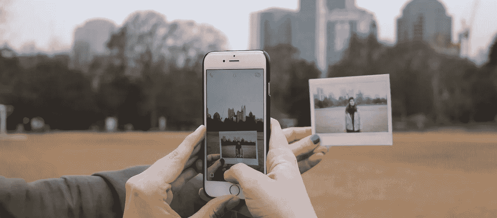
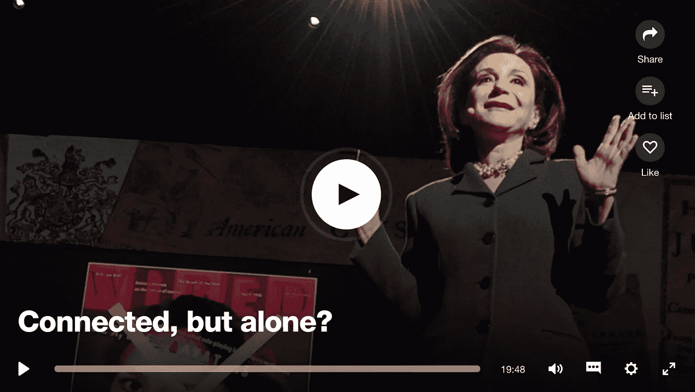

# 自诱导飞机模型实验的结果

> 原文：<https://medium.com/hackernoon/results-from-a-self-induced-airplane-mode-experiment-b1f30845b43e>

# 你收到通知了！

## 让你看起来。

通知一弹出就查看我们的手机越来越难了。无论是在车里，在工作中还是在健身房，为了把我们的手机变成另一个附属品，唯一缺少的就是像肉一样的身体胶水。

Photo by [Rachael Crowe](https://unsplash.com/photos/p31C6Lmf9zU?utm_source=unsplash&utm_medium=referral&utm_content=creditCopyText) on [Unsplash](https://unsplash.com/?utm_source=unsplash&utm_medium=referral&utm_content=creditCopyText)

你拍过照片吗？

或者倒在床上，在睡觉前快速检查面部参数图，然后意识到 3 个小时后你还在滚动？

很多次，我都在反思，当我知道我的手机通知如此控制我的拇指，滑动我的锁屏来查看最新消息时，我感到多么恶心。

这实际上影响了我的睡眠，不仅仅是因为看电视的时间，还因为我觉得有义务去参加我被邀请参加的每一场[脸书](https://hackernoon.com/tagged/facebook)活动。然而，每一个新的事件都充满了无声的对话和呆滞的目光，只有一个例外，那就是完美的团体自拍中的微笑。

# 当前状态

Sherry Turkle (2012 年)特别指出，我们正在“为了单纯的联系而牺牲对话”，这将我们引向一种新的“我分享，所以我是”的存在方式，这实际上使我们更加脱离我们的社交圈。Oulasvirta (2011)在一份新闻稿中进一步阐述了这种观点，他说，与最相关的[是，如果我们“对无聊的习惯性反应是拿起电话寻找有趣的刺激，你就会系统性地从你周围发生的更重要的事情上分心”(](https://hackernoon.com/tagged/concerning)[阿尔托大学，2011](https://www.sciencedaily.com/releases/2011/07/110725101222.htm) )。

Video thumbnail: [https://www.ted.com/talks/sherry_turkle_alone_together](https://www.ted.com/talks/sherry_turkle_alone_together)

特克尔(2014)坚定地继续发表关于不断检查我们的手机的“令人疲惫的表现”的谈话，声称它们“几乎没有留给创造力和反思的空间”，倡导有意识地考虑我们住在哪里以及我们为什么而活的正念([特克尔，2014](https://books.google.ca/books?id=klMkALqSrU0C&pg=PA276&lpg=PA276&dq=turkle+eave+little+space+for+creativity+and+reflection&source=bl&ots=PoirzrXExF&sig=dRQlaydlEXNiWsjZcJ5JPEglFV4&hl=en&sa=X&ved=0ahUKEwj7v5r8tMnVAhVNymMKHZBSBSYQ6AEIKDAA#v=onepage&q=turkle%20eave%20little%20space%20for%20creativity%20and%20reflection&f=false) )。超过 60%的人承认，他们因不断与社交媒体联系而感到倦怠([澳大利亚心理学会，2015](http://www.psychology.org.au/news/media_releases/8Nov2015-fomo/) )。在一份来自爱尔兰媒体公司的报告中， [Thinkhouse (2014)](http://www.thinkhouse.ie/downloads/mobilereport/Full-Report-Thinkhouse-Mobile-Youth-Survey.pdf) 发现，90%的人在起床、乘坐公共交通工具和看电视时都会查看手机。

# 选择慢而不是低

自从从 Qwerty 键盘切换到触摸屏以来，我所做的最好的决定之一是每天晚上将我的手机设置为飞行模式，在另一个房间充电，不起床很难到达。我不得不 12 步一步地进入这种有意识的努力，从身体上加入一个龙舟队，否则电话会在练习中被鱼腥味的盐水毁坏。

接下来是翻盖手机法——每当我和家人朋友一起吃饭时，把我的手机倒过来放在桌子上。最终，这变成了我一直把手机放在包里，试图听我的同志说些什么。

在我意识到之前，我甚至在白天连续几个小时把手机设置为飞行模式，这样我就可以专注于我正在做的任何事情。奇迹般但合乎逻辑的是，我能够在一天中完成更多的事情。我看完了堆了四年的书。我开始每天多锻炼一个小时，这让我对自己的外表感觉更好。沉默是陶醉于近距离和个人的植物和动物的气味，而不是被视为自动触发我的手解锁我的手机，以便通过朋友的旅行照片来替代生活。

碰巧的是，我生命中的这段时间也是我完成硕士论文的时候，也是我在会议和研讨会上谈论我的设计研究的时候。

在这些研讨会的问答环节中，听到大学毕业生提出他们认为不可能关闭通知的疑虑，我感到很难过。我努力寻找答案。

你会如何回应？

为了让他们放心，我唯一的回答是:

## 花时间把我的手机调成飞行模式帮助了我。

有意识地努力戒掉眼前的满足感，就像是重新训练我体内想要立刻吃掉棉花糖的孩子。

Source: CBC Radio (2015)

# 我发现了什么

1.  在回复信息之前花点时间拖延，实际上会让对话更有意义，让友谊更牢固
2.  时间管理和目标设定让我感觉更好
3.  通过训练自己减少对通知的分心，更好地专注于手头的任务，使得在工作和家庭中解决问题更有效，实际上更有创造性

如果这还不能激励你尝试这个漂亮的飞行模式功能，还有什么能呢？我其实对这个永无止境的实验很好奇。让我知道 priscillaho.com 的[@ phohop](http://twitter.com/phohop)——很想听听你的想法。