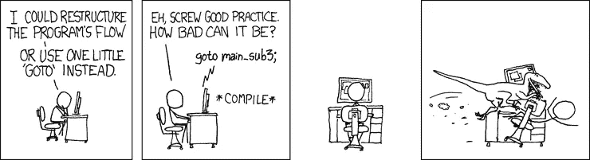

# 重新思考 JavaScript:用函数化取代 break

> 原文：<https://medium.com/hackernoon/rethinking-javascript-break-is-the-goto-of-loops-51b27b1c85f8>


在我的上一篇文章[for 循环之死](https://hackernoon.com/rethinking-javascript-death-of-the-for-loop-c431564c84a8)中，我试图说服您放弃`for`循环，寻求一个更实用的解决方案。作为回报，你提出了一个很棒的问题，“那`break`呢？”

> 中断是循环的 T2，应该避免。

`break`应该和`GOTO`一样放入垃圾桶。

你可能会想，“得了吧，乔尔，你肯定只是在哗众取宠。怎么破像`GOTO`？”

```
// bad code. no copy paste.outer:
  for (var i in outerList) {
inner:
    for (var j in innerList) {
      break outer;
    }
  }
```

我提供标签作为证据。在其他语言中，标签是`GOTO`的对应物。在 JavaScript 中，label 是`break`和`continue`的对应物。因为`break`和`continue`来自同一个标签家族，这也让他们成为了`GOTO`的非常近的亲戚。

> JavaScript 的标签、中断和继续是 GOTO 和非结构化编程时代遗留下来的。



[xkcd](http://xkcd.com/292)

“但这不会伤害任何人，所以为什么不把它留在语言中，以便我们有*选项*？”

# 为什么我们要限制我们如何编写软件？

这听起来违背直觉，但限制是一件好事。移除`GOTO`就是一个很好的例子。我们也张开双臂欢迎这个限制`“use strict”`,甚至教训那些不使用它的人！

> “限制可以让事情变得更好。好多了。”—查尔斯·斯卡法尼

极限让我们写出更好的软件。

[](/@cscalfani/why-programmers-need-limits-3d96e1a0a6db) [## 为什么程序员需要限制

### 极限造就更好的艺术、设计和生活。

medium.com](/@cscalfani/why-programmers-need-limits-3d96e1a0a6db) 

# 我们有什么其他的选择？

我不会粉饰这一点，没有一个放之四海而皆准的快速简便的替代方法。这是一种完全不同的编程方式。完全不同的思维方式。功能性思维方式。

好消息是,*有很多*库和工具可以帮助我们，比如 [Lodash](https://lodash.com/) 、 [Ramda](http://ramdajs.com/) 、 [lazy.js](http://danieltao.com/lazy.js/) 、recursion 等等。

我们将从一个简单的猫集合和一个名为`isKitten`的函数开始。这些将在下面的所有例子中使用。

```
const cats = [
  { name: 'Mojo',    months: 84 },
  { name: 'Mao-Mao', months: 34 },
  { name: 'Waffles', months: 4 },
  { name: 'Pickles', months: 6 }
]const isKitten = cat => cat.months < 7
```

让我们从一个熟悉的老式循环例子开始。这将通过我们的猫循环，并在找到第一只小猫时中断。

```
var firstKittenfor (var i = 0; i < cats.length; i++) {
  if (isKitten(cats[i])) {
    firstKitten = cats[i]
    break
  }
}
```

现在让我们将其与 lodash 等效物进行比较。

```
const firstKitten = _.find(cats, isKitten)
```

好，这个例子很简单。让我们把它提高一个档次，尝试一些更加边缘的情况。我们来列举一下我们的猫，找到 5 只小猫后休息。

```
var first5Kittens = []// old-school edge case kitty loop
for (var i = 0; i < cats.length; i++) {
  if (isKitten(cats[i])) {
    first5Kittens.push(cats[i]) if (first5Kittens.length >= 5) {
      break
    }
  }
}
```

# 简单的方法

lodash 很棒，做了很多伟大的事情，但是有时候你需要一些更专业的东西。**这就是我们带来的新朋友，**[**lazy . js**](http://danieltao.com/lazy.js/)**。它“像下划线，但更懒”。而懒惰正是我们想要的。**

```
const result = Lazy(cats)
  .filter(isKitten)
  .take(5)
```

# 通过痛苦的经历

库都是有趣的游戏，但是有时候真正有趣的是从头开始创造东西！

那么，我们创建一个类似于`filter`的通用函数，并添加限制功能，如何？

第一步是将我们的老派 edge case kitty 循环封装在一个函数中。

接下来，让我们概括这个函数，提取出所有猫特有的东西。将`5`替换为`limit`，将`isKitten`替换为`predicate`，将`cats`替换为`list`。然后将它们作为参数添加到函数中。

现在我们有了一个可工作且可重复使用的`takeFirst`功能，它已经完全从我们的卡特彼勒业务逻辑中分离出来！

我们的函数现在也是一个**纯函数**。这意味着输出仅来自输入。给定相同的输入，它将在 100%的时间里产生相同的输出。

我们仍然有那个讨厌的`for`循环，所以让我们继续重构。下一步是将`i`和`newList`移动到参数列表中。

当`limit`到达`0` ( `limit`将在递归过程中递减计数)或者当我们到达列表的末尾时，我们希望中断递归(`isDone`)。

如果我们没有完成，那么我们检查我们的过滤器`predicate`是否匹配。如果我们得到一个匹配，那么我们将调用`takeFirst`，递减`limit`并追加到我们的`newList`。否则，移动到列表中的下一项。

如果你还没有读过[重新思考 JavaScript:if 语句](/@joelthoms/rethinking-javascript-the-if-statement-b158a61cd6cb)，它将解释用三元运算符替换`if`的最后一步。

[](/@joelthoms/rethinking-javascript-the-if-statement-b158a61cd6cb) [## 重新思考 JavaScript:if 语句

### 功能性思维打开了我对编程的思维。

medium.com](/@joelthoms/rethinking-javascript-the-if-statement-b158a61cd6cb) 

现在我们可以这样称呼我们的新方法:

```
const first5Kittens = takeFirst(5, isKitten, cats)
```

对于额外的学分，我们可以 curry `takeFirst`并使用它来创建其他功能。(另一篇文章中有更多关于奉承的内容)

```
const first5 = takeFirst(5)
const getFirst5Kittens = first5(isKitten)const first5Kittens = getFirst5Kittens(cats)
```

# 摘要

我们可以使用许多很棒的库，比如 lodash、ramda 或 lazy.js。如果我们足够大胆，我们甚至可以使用递归创建自己的方法！

我必须警告，虽然`takeFirst`超级棒，**递归来自猴爪愿望**。JavaScript-land 中的递归非常危险，很容易得到臭名昭著的`Maximum call stack size exceeded`错误消息。

我将在下一篇文章中讨论 JavaScript 中的递归。敬请关注。

我知道这是一件小事，但当我在媒体和 Twitter ( [@joelnet](https://twitter.com/joelnet) )上收到这些后续通知时，我感到非常高兴。或者你觉得我满嘴屁话，在下面的评论里告诉我。

干杯！

# 相关文章

[](https://hackernoon.com/javascript-functional-composition-for-every-day-use-22421ef65a10) [## 函数 JavaScript:日常使用的函数组合。

### 函数组合是函数式编程中我最喜欢的部分。我希望给你提供一个好的真实的…

hackernoon.com](https://hackernoon.com/javascript-functional-composition-for-every-day-use-22421ef65a10) [](https://hackernoon.com/rethinking-javascript-death-of-the-for-loop-c431564c84a8) [## 重新思考 JavaScript:For 循环的死亡

### JavaScript 的 for 循环为我们提供了很好的服务，但是它现在已经过时了，应该被更新的函数所取代…

hackernoon.com](https://hackernoon.com/rethinking-javascript-death-of-the-for-loop-c431564c84a8) [](/@joelthoms/rethinking-javascript-eliminate-the-switch-statement-for-better-code-5c81c044716d) [## 重新思考 JavaScript:删除 switch 语句以获得更好的代码

### 在我的前 3 篇文章中，我说服你删除 if 语句，取消 for 循环，并且不要使用 break。

medium.com](/@joelthoms/rethinking-javascript-eliminate-the-switch-statement-for-better-code-5c81c044716d) [](/@joelthoms/functional-javascript-resolving-promises-sequentially-7aac18c4431e) [## 函数式 JavaScript:顺序解析承诺

### 我喜欢 ES6 附带的新的 Promise 库，尽管有一点被遗漏了，那就是一个按顺序…

medium.com](/@joelthoms/functional-javascript-resolving-promises-sequentially-7aac18c4431e) [](http://bit.ly/HackernoonFB)[](https://goo.gl/k7XYbx)[](https://goo.gl/4ofytp)

> [黑客中午](http://bit.ly/Hackernoon)是黑客如何开始他们的下午。我们是阿妹家庭的一员。我们现在[接受投稿](http://bit.ly/hackernoonsubmission)并乐意[讨论广告&赞助](mailto:partners@amipublications.com)机会。
> 
> 如果你喜欢这个故事，我们推荐你阅读我们的[最新科技故事](http://bit.ly/hackernoonlatestt)和[趋势科技故事](https://hackernoon.com/trending)。直到下一次，不要把世界的现实想当然！

