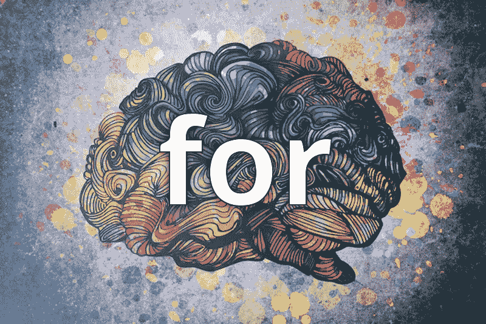

# 重新思考 JavaScript:For 循环的死亡

> 原文：<https://medium.com/hackernoon/rethinking-javascript-death-of-the-for-loop-c431564c84a8>



JavaScript 的`for loop`为我们提供了很好的服务，但是它现在已经过时了，应该被更新的函数式编程技术所取代。

幸运的是，这是一个不需要你成为函数式编程大师的改变。更好的是，**这是你今天可以在现有项目中做的事情！**

JavaScript 的 for 循环到底有什么问题？

`for loop`的设计鼓励状态的**突变和**副作用**的使用，这两者都是错误和不可预测代码的潜在来源。**

我们都听说过全球状态不好，应该避免。虽然**地方政府与全球政府**有着相同的弊端，但我们只是不经常注意到它，因为它的规模较小。所以我们从来没有真正解决问题，我们只是把它最小化了。

对于可变状态，在某个未知的时间点，变量会因为未知的原因而改变，您将花费数小时来调试和搜索值改变的原因。光是想到这一点，我就已经拔了十几根头发。

接下来我想快速说一下**副作用**。那些话听起来很可怕，副作用。呸。你希望你的程序有副作用吗？不，我不希望我的程序有副作用！

但是什么是副作用呢？

**当一个函数修改了该函数作用域之外的东西时，它被认为有副作用**。它可以是改变变量值、读取键盘输入、进行 api 调用、将数据写入磁盘、登录控制台等。

副作用是强大的，但是伴随着强大的力量而来的是巨大的责任。

在可能的情况下，应该消除副作用，或者对副作用进行封装和管理。**有副作用的函数更难测试，也更难推理**，所以只要有可能就把它们弄出来。幸运的是，我们在这里不用担心副作用。

好吧，少说话多代码。让我们来看看一个典型的`for loop`，你可能已经看过一千遍了。

```
const cats = [
  { name: 'Mojo',    months: 84 },
  { name: 'Mao-Mao', months: 34 },
  { name: 'Waffles', months: 4 },
  { name: 'Pickles', months: 6 }
]var kittens = []// typical poorly written `for loop`
for (var i = 0; i < cats.length; i++) {
  if (cats[i].months < 7) {
    kittens.push(cats[i].name)
  }
}console.log(kittens)
```

我的计划是一步一步地重构这段代码，这样您就可以看到将您自己的代码转换成更漂亮的东西是多么容易。

我想做的第一个改变是将`if`语句提取到它自己的函数中。

```
**const isKitten = cat => cat.months < 7**var kittens = []for (var i = 0; i < cats.length; i++) {
  if (**isKitten(cats[i])**) {
    kittens.push(cats[i].name)
  }
}
```

一般来说，摘录你的`if`陈述是一个好的做法。**过滤从“7 个月以下”到“是只小猫”的变化是件大事。现在当你阅读代码时，意图就变得很清楚了。为什么我们有 7 个月以下的猫？这个一点都不清楚。我们的目的是找到小猫，所以让代码这么说吧！**

另一个好处是`isKitten`现在可以重复使用，我们都知道，

> 让我们的代码可重用应该是我们的目标之一。

下一个变化是提取从 cat 类型的对象到名称的转换(或映射)。这个改变以后会更有意义，所以现在你只需要相信我。

```
const isKitten = cat => cat.months < 7
**const getName = cat => cat.name**var kittens = []for (var i = 0; i < cats.length; i++) {
  if (isKitten(cats[i])) {
    kittens.push(**getName(cats[i])**)
  }
}
```

我打算写几段描述一下`filter`和`map`的机制。但是我认为不描述它们，而是向你展示即使没有被介绍过`map`或`filter`，你也可以很容易地阅读和理解这些代码，这将最好地展示你的代码的可读性。

```
const isKitten = cat => cat.months < 7
const getName = cat => cat.nameconst kittens =
  **cats.filter(isKitten)
      .map(getName)**
```

还要注意，我们已经取消了`kittens.push(...)`。不再有状态突变，不再有`var`！

> 使用 const(超过 var 和 let)的代码非常性感

在这里完全公开，我们可以一直使用 const，因为 const 并不使对象本身不可变(下一次会详细介绍)。但是，嘿，这是一个人为的例子，所以放过我吧！

我建议的最后一个重构是将过滤和映射提取到它自己的函数中(你知道，为了整个重用)。

现在大家一起:

```
const isKitten = cat => cat.months < 7
const getName = cat => cat.name
**const getKittenNames = cats =>
  cats.filter(isKitten)
      .map(getName)**const cats = [
  { name: 'Mojo',    months: 84 },
  { name: 'Mao-Mao', months: 34 },
  { name: 'Waffles', months: 4 },
  { name: 'Pickles', months: 6 }
]const kittens = getKittenNames(cats)console.log(kittens)
```

# 额外学分

作为额外的奖励，进一步将`filter`和`map`方法从它们的对象中分离出来。还有双倍的额外学分，你可以研究函数合成。

[](https://hackernoon.com/functional-javascript-decoupling-methods-from-their-objects-aa3ca13d7ae8) [## 函数式 JavaScript:从对象中分离方法

### 在我的项目中，我最后总是做的一件事是将方法从它们的对象中分离出来。映射、过滤和减少不是…

hackernoon.com](https://hackernoon.com/functional-javascript-decoupling-methods-from-their-objects-aa3ca13d7ae8) [](https://hackernoon.com/javascript-functional-composition-for-every-day-use-22421ef65a10) [## 函数 JavaScript:日常使用的函数组合。

### 函数组合是函数式编程中我最喜欢的部分。我希望给你提供一个好的真实的…

hackernoon.com](https://hackernoon.com/javascript-functional-composition-for-every-day-use-22421ef65a10) 

# 休息呢？

你们中的许多人问，“休息呢？”**看看第 2 部分:Break 是循环的 GOTO。**(提示:递归)

[](/@joelthoms/rethinking-javascript-break-is-the-goto-of-loops-51b27b1c85f8) [## 重新思考 JavaScript: Break 是循环的归宿

### 在我的上一篇文章《for 循环之死》中，我试图说服您放弃 for 循环，转而使用一个更具功能性的…

medium.com](/@joelthoms/rethinking-javascript-break-is-the-goto-of-loops-51b27b1c85f8) 

# 结束

请在下面的评论中让我知道你对此的感受。难道`for loop`现在对你也死了？

我知道这是一件小事，但当我在媒体和 Twitter 上收到这些后续通知时，我感到非常高兴。或者你觉得我满嘴屁话，在下面的评论里告诉我。

干杯！

# 相关文章

[](/@joelthoms/rethinking-javascript-the-if-statement-b158a61cd6cb) [## 重新思考 JavaScript:if 语句

### 功能性思维打开了我对编程的思维。

medium.com](/@joelthoms/rethinking-javascript-the-if-statement-b158a61cd6cb) [](/@joelthoms/rethinking-javascript-eliminate-the-switch-statement-for-better-code-5c81c044716d) [## 重新思考 JavaScript:删除 switch 语句以获得更好的代码

### 在我的前 3 篇文章中，我说服你删除 if 语句，取消 for 循环，并且不要使用 break。

medium.com](/@joelthoms/rethinking-javascript-eliminate-the-switch-statement-for-better-code-5c81c044716d) [](/@joelthoms/functional-javascript-resolving-promises-sequentially-7aac18c4431e) [## 函数式 JavaScript:顺序解析承诺

### 我喜欢 ES6 附带的新的 Promise 库，尽管有一点被遗漏了，那就是一个按顺序…

medium.com](/@joelthoms/functional-javascript-resolving-promises-sequentially-7aac18c4431e) 

这篇文章已经为我的俄罗斯朋友翻译成了俄语。

[](http://bit.ly/HackernoonFB)[](https://goo.gl/k7XYbx)[](https://goo.gl/4ofytp)

> [黑客中午](http://bit.ly/Hackernoon)是黑客如何开始他们的下午。我们是 [@AMI](http://bit.ly/atAMIatAMI) 家庭的一员。我们现在[接受投稿](http://bit.ly/hackernoonsubmission)并乐意[讨论广告&赞助](mailto:partners@amipublications.com)机会。
> 
> 如果你喜欢这个故事，我们推荐你阅读我们的[最新科技故事](http://bit.ly/hackernoonlatestt)和[趋势科技故事](https://hackernoon.com/trending)。直到下一次，不要把世界的现实想当然！

