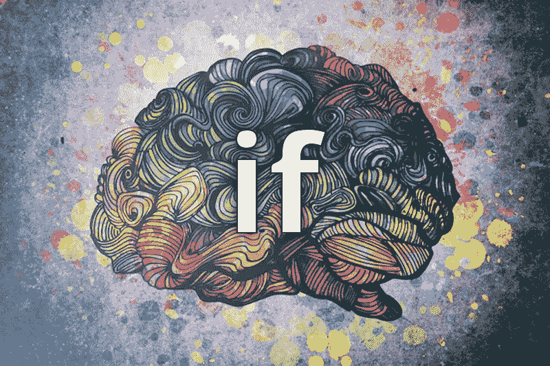

# 反思 JavaScript:if 语句

> 原文：<https://medium.com/hackernoon/rethinking-javascript-the-if-statement-b158a61cd6cb>



功能性思维打开了我对编程的眼界。它让我对代码有了更深的理解。这也让我开始了一项探索，我发现自己在质疑这种语言的许多核心特征。

我最近一直在质疑`if`陈述本身。

写了一份完全没有一句`if`声明的完整申请书后，我发现`if`是可选的。

如果你不熟悉函数式编程，这可能听起来像一个疯子的咆哮，但请听我解释一下。

> 学习多种方法来解决同一个问题会极大地扩展你的思维工具箱。

首先，满足`if`语句替换，将[三元运算符](https://developer.mozilla.org/en-US/docs/Web/JavaScript/Reference/Operators/Conditional_Operator):

```
condition ? expr1 : expr2
```

函数式编程教会了我写这样的小函数:(不要因为我不讨好而对我大喊大叫，那是为了另一篇文章)

```
const add = (x, y) => x + y
```

`if`语句不适合这种类型的函数，但三元运算符适合！

```
const isGreaterThan5 = x => x > 5 ? 'Yep' : 'Nope'
```

很快，我开始发现几乎每一个`if`语句的实例都可以用一个等价的三元运算来代替。

```
// typical code you might stumble upon
function saveCustomer(customer) {
  if (isCustomerValid(customer)) {
    database.save(customer)
  } else {
    alert('customer is invalid')
  }
}// ternary equivalent
function saveCustomer(customer) {
  return isCustomerValid(customer)
    ? database.save(customer)
    : alert('customer is invalid')
}// ES6 style
const saveCustomer = customer =>
  isCustomerValid(customer)
    ? database.save(customer)
    : alert('customer is invalid')
```

然后我开始思考三元运算符如何适合一个`else if`语句。我可以用嵌套的三元组来做这个，但是它非常混乱，不容易理解。

直到我开始对我的格式有创意。

```
// old school else-if
function customerValidation(customer) {
  if (!customer.email) {
    return error('email is require')
  } else if (!customer.login) {
    return error('login is required')
  } else if (!customer.name) {
    return error('name is required')
  } else {
    return customer
  }
}// ES6 style custom formatted ternary magic
const customerValidation = customer =>
  !customer.email   ? error('email is required')
  : !customer.login ? error('login is required')
  : !customer.name  ? error('name is required')
                    : customer
```

现在，您可以清楚地看到左侧定义的所有条件以及右侧返回的值。

尽管可以用三元运算符替换每个`if`语句，但我并不是说您应该这样做。这只是您需要使用和考虑的另一个工具。

这篇反思 JavaScript 的文章只是系列文章中的一篇。在不远的将来会有更多！

我很想听听您对如何重新思考`if`声明的反馈和想法。您是否有不确定该如何操作的场景？告诉我，让我知道！

继续第 2 部分[重新思考 JavaScript:For 循环的死亡](/@joelthoms/rethinking-javascript-death-of-the-for-loop-c431564c84a8)。

[](https://hackernoon.com/rethinking-javascript-death-of-the-for-loop-c431564c84a8) [## 反思 JavaScript:For 循环的死亡

### JavaScript 的 for loop 很好地为我们服务，但是它现在已经过时了，应该被淘汰，取而代之的是更新的函数…

hackernoon.com](https://hackernoon.com/rethinking-javascript-death-of-the-for-loop-c431564c84a8) 

我知道这是一件小事，但当我在媒体和 Twitter ( [@joelnet](https://twitter.com/joelnet) )上收到这些后续通知时，我感到非常高兴。或者你觉得我满嘴屁话，在下面的评论里告诉我。

干杯！

# 相关文章

[](https://hackernoon.com/javascript-functional-composition-for-every-day-use-22421ef65a10) [## 函数 JavaScript:日常使用的函数组合。

### 函数组合是函数式编程中我最喜欢的部分。我希望给你提供一个好的真实的…

hackernoon.com](https://hackernoon.com/javascript-functional-composition-for-every-day-use-22421ef65a10) [](/@joelthoms/rethinking-javascript-break-is-the-goto-of-loops-51b27b1c85f8) [## 重新思考 JavaScript: Break 是循环的归宿

### 在我的上一篇文章《for 循环之死》中，我试图说服您放弃 for 循环，转而使用一个更具功能性的…

medium.com](/@joelthoms/rethinking-javascript-break-is-the-goto-of-loops-51b27b1c85f8) [](/@joelthoms/rethinking-javascript-eliminate-the-switch-statement-for-better-code-5c81c044716d) [## 重新思考 JavaScript:删除 switch 语句以获得更好的代码

### 在我的前 3 篇文章中，我说服你删除 if 语句，取消 for 循环，并且不要使用 break。

medium.com](/@joelthoms/rethinking-javascript-eliminate-the-switch-statement-for-better-code-5c81c044716d) [](/@joelthoms/functional-javascript-resolving-promises-sequentially-7aac18c4431e) [## 函数式 JavaScript:顺序解析承诺

### 我喜欢 ES6 附带的新的 Promise 库，尽管有一点被遗漏了，那就是一个按顺序…

medium.com](/@joelthoms/functional-javascript-resolving-promises-sequentially-7aac18c4431e) [](http://bit.ly/HackernoonFB)[](https://goo.gl/k7XYbx)[](https://goo.gl/4ofytp)

> [黑客中午](http://bit.ly/Hackernoon)是黑客如何开始他们的下午。我们是 [@AMI](http://bit.ly/atAMIatAMI) 家庭的一员。我们现在[接受投稿](http://bit.ly/hackernoonsubmission)并乐意[讨论广告&赞助](mailto:partners@amipublications.com)机会。
> 
> 如果你喜欢这个故事，我们推荐你阅读我们的[最新科技故事](http://bit.ly/hackernoonlatestt)和[趋势科技故事](https://hackernoon.com/trending)。直到下一次，不要把世界的现实想当然！

