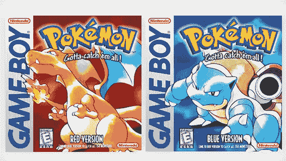
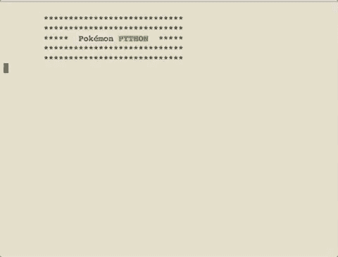
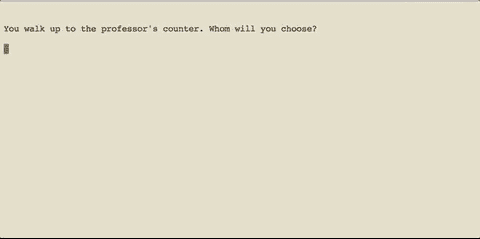

# 游戏机的回归:用 Python 再现神奇宝贝

> 原文：<https://medium.com/hackernoon/return-of-the-consoles-recreating-pok%C3%A9mon-in-python-94e0d7d860de>

在我的童年时代，有一些事例比其他事例更突出。其中很多都和某种电子游戏有关，我的脸粘在屏幕上。我能记得的最早的游戏之一是《国王的任务六》(King's Quest VI ),这是一款选择你自己的冒险游戏，运行在我接触过的第一台电脑上。几年后，我记得我去了位于羊头湾的玩具反斗城，在那里，我做了一个可能是布鲁克林的孩子在 20 世纪 90 年代中期做出的最大的决定之一——[红色版本还是蓝色版本](https://en.wikipedia.org/wiki/Pok%C3%A9mon_Red_and_Blue)。

decisions… decisions…

快进到 2017 年。

在我的大部分编码旅程中，我主要是修补与 JavaScript 相关的东西。Node 是我的后端选择，React 是我最喜欢的库。但是当一个叫做 Python 的小东西如此令人兴奋时，这是我不能忽视的知识。

# Python 实验

It’s not all bad, Dr. Jones

说实话，我对 Python 的兴趣更多来自于机器学习和数据抓取。Beautiful Soup 棒极了，语言的易用性使得它在后端使用更有吸引力，尽管我在 Node 方面有更多的经验。

但是，尽管 Python 拥有所有这些更实用的特性，但总会有空间让一个短项目勾起我的怀旧之情。所以我花了几天时间尝试制作一个控制台应用程序。

[为什么是控制台应用](http://introtopython.org/terminal_apps.html#Why-write-terminal-apps?)？终端是一个经常被忽视的程序，它的用途要么是与 Git 一起工作(对于开发人员)，要么是在你导致你的计算机爆炸的情况下完全忽略(对于非技术人员)。熟悉控制台是所有程序员努力的目标，缺乏真正的 GUI 使得创建者只关注他或她的代码在做什么，而不是它在特定的浏览器上看起来如何。

当我在互联网上搜索其他开发者在游戏机上所做的更多例子时，我看到了大量幻想驱动的故事情节，其中主人公在某个时候抓起一把剑，与一条龙搏斗。这一切都很好。我最初的想法是做一些与《塞尔达传说》相关的事情。这种冒险似乎符合选择你自己的冒险游戏的要求。然而，97 年玩具反斗城之旅的记忆不断浮现在我的脑海中。

such top-notch graphics right there

做决定是神奇宝贝公式的核心。虽然林克处理增加库存和打击敌人，但神奇宝贝的基础在于你将从哪种生物开始，以及这个决定将如何影响你作为训练者的未来。

整个代码运行起来非常简单。main()函数运行在代码的底部，然后调用它上面的函数。每个决策都是一个函数，其底部有一个未来的函数。目前，它还不是最复杂的决策树，但是根据你的选择，它目前可以处理超过半打的结果。代码在使用虚拟环境的终端中运行，这是我不熟悉的，来自 JavaScript 世界。

my start screen

我花了很大力气创建了这个迷你应用程序，但总的来说，它是一个简单的游戏。没有职业——这会使一个有生命值之类的更复杂的战斗系统。我也没有用[泡菜](https://pythontips.com/2013/08/02/what-is-pickle-in-python/)来保存进度。游戏目前足够短，可以在一个场景中结束。虽然我可以继续故事情节，去健身房，并获得徽章，但这最好是在未来的应用程序中提供，在那里我将创建自己的角色，实现一个真正的战斗系统，并利用我在大学期间获得的创造性写作辅修课程。

作为一个终身学习者和经常的教师，我会说，创建一个像这样有趣的应用程序服务于教学的目的，而不需要奋斗。更具挑战性的概念来得更自然，因为我从中获得了乐趣。更重要的是——看到 Python 所创造的美好事物让我对 JavaScript 有了更大的欣赏，这是一种我已经玩得很好的语言，但从未理解与其他语言相比它有多奇怪。我甚至高兴地添加了一个复活节彩蛋，允许用户获得皮卡丘作为他的起始神奇宝贝。对于一个愚蠢的控制台应用程序来说还不错，是吧？

to be honest, I was more of a Charmander-guy growing up

**感谢阅读。随意** [**跟着**](/@jc.haines19/) **，为这个故事鼓掌，或者看** [**更多关于我的**](http://jonathanhaines.me) **。口袋妖怪 Python 源代码第一章** [**这里**](https://github.com/joncancode/console-adventure) **。**

