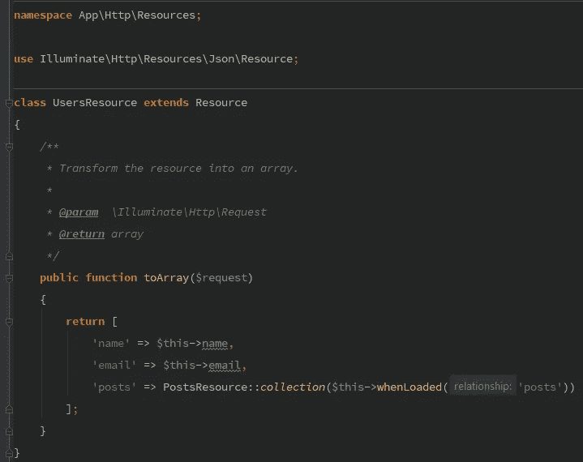

# 具有嵌套关系的可重用 API 资源— Laravel 5.5

> 原文：<https://medium.com/hackernoon/reusable-api-resource-with-nested-relationship-laravel-5-5-c654c7243869>

两天前，我发表了我对 Laravel 最新 API 资源特性的第一印象。本文将更进一步，在转换层中使用一种更加 Laravel 友好的方法。

*注意:本文将从第 4 步开始。步骤 1~3 与上一篇文章中的相同(模型、迁移、数据库、环境设置)。点击这里* *可以查看* [*。*](https://hackernoon.com/first-impressions-on-laravel-api-resources-4869b73b7847)

## 4-重命名资源(修复遗留问题)

前一篇文章创建了一个名为`UsersWithPostsResource`的资源。让我们将其重命名为`UsersResource`，并了解如何在下面的步骤中重用它。

## 5-使用控制器内部的 API 资源

静态的`collection`方法将接受一组要转换的记录，并确保为每条记录实例化一个新的`UsersResource`。

## 6-用户资源类

这里有两个关键部分:属性访问器和可选的嵌套转换

*   在一个`Resource`类中，可以通过`$this`直接访问模型属性。这个*魔法*是在基础`Resource`类中包含的`DelegatesToResource`特征中完成的。
*   如果数据可用(立即加载)，可以转换关系；如果数据尚未加载，可以忽略关系。这将防止 N+1 问题，同时仍然能够用单个资源类处理不同的场景。如果关系不可用，它将被忽略，否则包括在内。

## 7-员额资源

## 8-结论

保持简单，一次一个步骤，本文的重点是通过学习使用`Resource::collection`而不是手动实例化类来改进从上一篇文章中收集的知识，并且将给出(或不给出)关系数据的责任委托给控制器。通过简单地从控制器中移除`with('posts')`，API 将不再在响应中包含每个用户的帖子。

虽然 Fractal 会在 Transformer 层中提供`default`和`available` includes，但是 Laravel 上的原生 API 资源更倾向于让控制器处理该逻辑。毕竟，理解请求是管制员的工作。

在下一篇文章中，我打算为 API 的用户实现一种请求包含关系的方法。考虑在 Medium 上关注我，获取更多类似的文章。