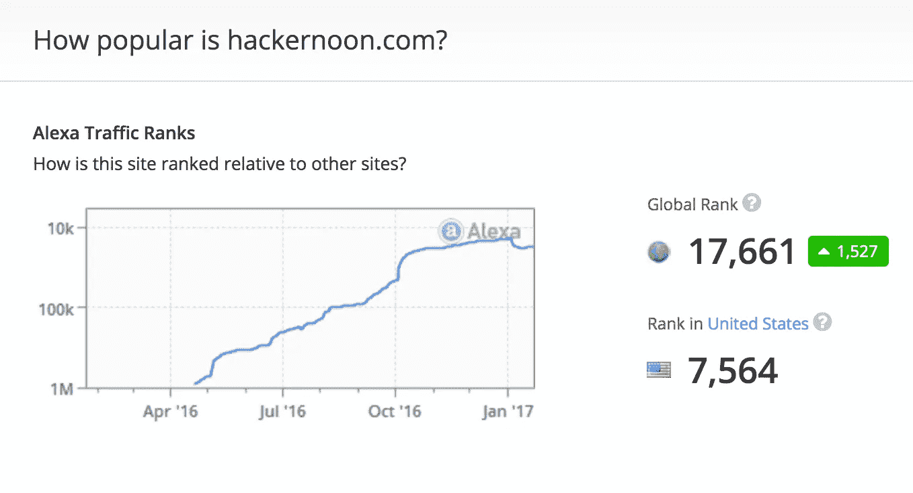

# 逆向工程你的技术阶梯

> 原文：<https://medium.com/hackernoon/reverse-engineer-your-way-up-the-tech-ladder-9a2e9bad707c>

科技行业不适合胆小的人、缺乏想象力的人，或者——不用说——机器盲。那些在科技领域成功的人被描绘成自己愿景的无情追随者，而这一切都是由代码驱动的。我不会告诉你在现有的系统中工作，创建一个新的系统，或者忘记一个系统的存在。我会告诉你，这些超链接的锚文本导致了 2017 年混乱的前几周的[顶级黑客午间故事](http://hackernoon.com/trending)(……[网络开发者可以对抗川普议程的 10 种方式](https://hackernoon.com/10-ways-web-developers-can-stand-up-to-the-trump-agenda-dff0ef12eaf2#.kuv9don02)，re: [新政府可以推动美国创业的一种方式](https://medium.com/u/50fd4edebfa1#.v60do0ukm)，re: [媒体和白宫数字化转型](https://medium.com/u/6d3266d9a2d7#.1mzwj31qn)，re: [最低可购买产品](https://medium.com/u/82dc761889d9#.fnsd6wf11)；反过来，[会教你 85 件关于当 CEO 的事情，而这些事情](https://hackernoon.com/85-things-i-learned-being-a-ceo-4c25fc1c7b99#.vbrmnaswp)萨钦·古普塔已经知道了，如果你的企业存活下来，可能是因为你把它分成了[三台机器](https://medium.com/u/65d8116a012c#.niq1edqet)、( 2) [为一家初创公司](https://goo.gl/Zk9UXN)、(3) [像](https://hackernoon.com/using-server-less-architecture-to-massively-parallelize-dna-sequence-alignment-via-stdlib-and-343dd2d5aebf#.mskgzwjuh)[发起一个副业项目](https://medium.com/u/29963203626#.e6ob00suo)，像[在一家非软件公司的技术部门工作](https://medium.com/u/827da1b55d18#.btbi8ac2z)像[新](https://medium.com/u/c84dfc3a2036#.ye5j2l78n) [思考更聪明的时间跟踪](https://medium.com/u/bf3c50aa5720#.z84j95pci)，像 [25 个 chome 扩展、应用程序和黑客程序，让你的生产力翻倍](https://medium.com/u/b48eea273877#.4qo6tlxyi)。你有没有想过，在你死之前，你能在你的大脑里安装一个程序，就像在你的电脑里一样简单？这就像[人工智能是否能在扑克游戏中击败人类](https://medium.com/u/5ad679c18236#.ir0gent97)……像[这些频道到底有多快？](https://medium.com/u/7bbc67ec370d#.p38z0n5ik)无论你选择哪种渠道或阶梯，都要知道你的发展会带来技术和专业方面的后果。你将如何适应科技行业的发展？正如[基于角色的授权(……在 React](https://medium.com/u/ec0b3a253e09#.c2ehlansk)……和 [React 以 60fps](https://hackernoon.com/react-at-60fps-4e36b8189a4c#.j3unxzrky) 中，正如[成本和限制，你可能迟早会遇到](https://medium.com/u/5829a67c85f9#.j3unxzrky)))有时代码是二进制的，但有时不是。[你可能不需要 if 语句](https://hackernoon.com/you-might-not-need-if-statements-a-better-approach-to-branching-logic-59b4f877697f#.zbq0xyz8p)，就像[分支逻辑](https://hackernoon.com/you-might-not-need-if-statements-a-better-approach-to-branching-logic-59b4f877697f#.zbq0xyz8p)中的[创业真他妈的难](https://medium.com/u/f735d3b0f2f3#.pb29tkw5s)。

当你想到你的事业或者你的生意的时候，反动一点好吗？如果史蒂夫·乔布斯没有进入施乐实验室，苹果就不会开创图形用户界面[，但是话又说回来，如果脸书没有发明](https://www.youtube.com/watch?v=J33pVRdxWbw)[的 like 按钮](http://facebook.com/hackernoon)，谷歌就可以避免许多“无意义的”+1。无论哪种方式，保持了解你将如何[反应工作室公开测试版 1 现在出来了！](https://medium.com/u/41ab1780629c#.1idp7p6s9)

旅程是目的地，你的发展将向世界展示你。但由于你的家不是你的客户，你的发展不会给你的家庭定义你。你会的。如果你正在阅读这篇文章，你一定与[认为这对初学者来说越来越可怕](https://medium.com/u/c8d353884a03#.k1sjfeesr) ) &哲学只能被定义为[for 循环的死亡](https://hackernoon.com/rethinking-javascript-death-of-the-for-loop-c431564c84a8#.7fiaywfbt)，或者[通过运行函数来代替 break](https://hackernoon.com/rethinking-javascript-break-is-the-goto-of-loops-51b27b1c85f8)。要将[“有效”](https://hackernoon.com/effective-functional-javascript-first-class-and-higher-order-functions-713fde8df50a#.o76ua31bg)置于功能状态，请阅读[一级和高阶功能](https://medium.com/u/8d547401ba90#.o76ua31bg)。啊！代码是一种生活方式还是晚上睡觉的手段？最终，每个人——包括 Muh Hon Cheng 想要的是[一个智能家居(……SG next bus 使用 Google home & Amazon echo)](https://hackernoon.com/a-smart-home-with-sg-nextbus-using-google-home-amazon-echo-704342089727#.j0djhj1sa) 。当然，除非你想去看看我们的姐妹出版物之一，了解在美国农村无家可归的科迪·韦伯是什么感觉。

互联网首先是由社区驱动的。 [Last pass 并不会加密你金库里的所有东西](https://hackernoon.com/psa-lastpass-does-not-encrypt-everything-in-your-vault-8722d69b2032#.2lo2wl5cw)，这一点[五年前互联网几乎停滞不前。](https://medium.com/u/84fb63d66455#.n62h0ninn)

当你今天浏览并思考你的方向时，像[为什么我们需要一个新的职业关系网(而不是人脉)](https://medium.com/u/7ff8b7d388c1#.blwvvwfxt)。你的每一个分叉，每一个赞，每一个帖子，每一个部署都不是关于你的。是关于屏幕另一边的人。另一个写真相的[黑客(&猫)](https://hackernoon.com/hackers-write-about-truth-cats-65c1887a3aca)。在你的战壕中，当 scrum 在午夜结束，但你的时钟指向凌晨 3:16 时，想想另一个黑客正在[将 140，000 个提交从 mercurial 迁移到 git](https://hackernoon.com/migrating-140-000-commits-from-mercurial-to-git-5cf46f134261#.qn06nwpo8) ，想想[解析真实世界 JavaScript regexps](https://medium.com/u/9fa86af2470a#.18ns1ogk0) 的疯狂，想想[与 marko、preact、rax、react 和 vue](https://medium.com/u/f6e0ba2a2f56#.iyerj2125) 的服务器端渲染大战，想想[针对微服务架构中的进程间通信对亚马逊 SNS & SQS 进行基准测试](https://medium.com/u/919896feef7d#.b2u9g2kgf)，想想[用一条 SQL select 语句抓取任何网站、服务或 API](https://medium.com/u/a5748ebcd35f#.9rwdcvuw3)——并且知道自己不是

无论你选择发展什么，记住它的潜在目的对你意味着什么。正如阿卜杜勒·尼迈里(Abdul Nimeri)所宣扬的那样，[“如何”比“为什么”老得更快](https://hackernoon.com/how-ages-faster-than-why-712e25c9eb3b#.g0221rqxd)该社区将帮助您逆向设计它是如何构建的，但只有您可以回答，您为什么要构建您所构建的东西？

“一个好的工程师会逆向思考，并问自己他所提议的组件和系统的风格后果，”—建筑师赫尔穆特·约翰。

我有什么资格来说该爬什么梯子，如何到达下一个台阶，是否有可能到达科技行业的顶端，或者你是否可以逆向工程一个更好的比喻来说，*科技将由你决定，因为——从字面上来说——我只是新闻，当这个故事被读到时，它已经发生了——所以——你最好给我造点东西来写，或者——不会有更多的科技*

直到下一次，[不要把世界的现实想当然](https://hackernoon.com/how-hackers-start-their-afternoons-7d97a0478c74#.62csd9ipc)。

亲切的问候，

大卫·斯穆克

**附言** *在* [*黑客正午*](http://hackernoon.com) *这里，我们在寻找有助于创造一个更好的互联网的人和故事(* [*今日投稿*](http://www.amipublications.com/hacker-noon) *)，这让我们成为了“Alexa relevant”(*[*如下图*](http://www.alexa.com/siteinfo/hackernoon.com) *)，就像我们和一个 7 岁的流行女孩只是朋友一样我们想普及是什么让技术在日常生活中发挥作用，以及明天可能会改变的想法。*今天结束的时候，我们(与* [*的一部分，让编码成为流行文化*](https://medium.com/u/2053aaf853f5#.ogrse1llz) *的一大部分。**

