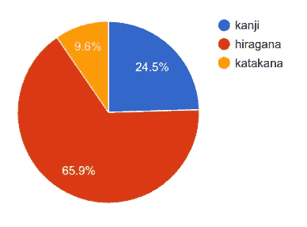
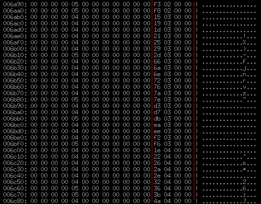
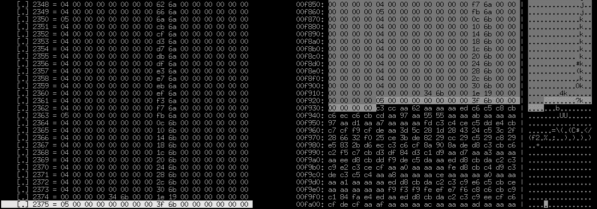
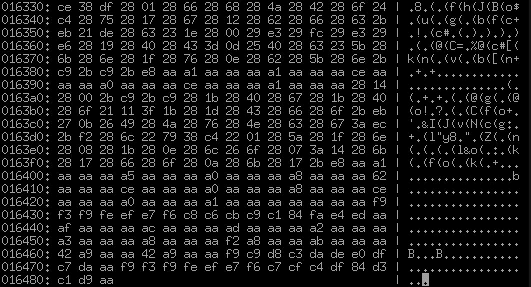

# 逆向工程视觉小说 101，第 2 部分

> 原文：<https://medium.com/hackernoon/reverse-engineering-visual-novels-101-part-2-9258f547262a>


嘿，距离我的上一篇帖子已经有一段时间了[，所以我想快速提醒一下这里发生了什么会有所帮助。我们在涉足逆向工程，视觉小说是我们的目标。在本文的第一部分中，我们已经学会了使用神奇的](/@mnakamura1337/reverse-engineering-visual-novels-101-d0bc3bf7ab8)[开泰结构工具](http://kaitai.io/)来分析容器格式，这使得对计算机略知一二的每个人都可以很容易地尝试适当的“干净的房间”逆向工程，而无需深入了解 CPU、寄存器、反汇编等。

我们的主要目标仍然是 [Koisuru Shimai no Rokujuso](https://vndb.org/v13353) ，一部不太出名，但仍然制作精良的皮斯软件视觉小说。上次我们发现它使用了一个可能叫做“优香”的引擎。我们已成功从提取游戏文件。ykc 容器，我们得到了视觉、声音和音乐，但是最后的挑战还在等待着我们:*剧本*。

# 关于小说内部的思考

在深入二进制转储之前，让我们花点时间来思考一下大多数视觉小说引擎是如何工作的。视觉小说由文本(对话、叙述)、视觉和声音组成。为了让这一切走到一起，需要某种控制程序。从技术上来说，把它作为机器码塞进。但是在 99%的情况下(好吧，我在撒谎——在我亲眼所见的 100%的情况下)引擎作者不会这样做。相反，这些控制指令作为一个单独的文件保存在某种特定于领域的脚本语言中。这就是他们普遍所说的**【剧本】**。让我们来看看它可能是什么样子:

```
$ tarot = 0
$ memory = 0scene bg01_1 with dissolveplay music "bgm/8.mp3" fadein (2.0)
play ambience "amb/forest.mp3" fadein (3.0)
"Morning."
"Not my favourite time of the day."
"The morning is when you’re not awake enough to do anything…"
```

这是一个使用 [Ren'Py](https://www.renpy.org/) 的 VNs 的一小段脚本源代码——这是最著名的免费啤酒&免费语音引擎之一。抛开使用《任的 Py》本身是好是坏的问题不谈，让我们只调查一下《视觉小说》剧本的典型特征(这正是我们要寻找的):

*   **文本** —它可能是叙述(即不是由角色讲述，而是由讲述者讲述的故事的一部分)或一些对白(属于某个角色)
*   处理**视觉效果**的命令——背景/精灵(` scene bg01_1`) /角色图形/事件图形，有时用一些视觉效果(` with dissolve `)增强它们
*   播放**音乐或声音效果**的命令(“播放音乐”、“播放氛围”)，有时还会出现一些额外的参数，最常见的是淡入和淡出的持续时间(即缓慢逐渐增加或降低音量)
*   处理**变量**:设置(` $ tarot = 0 `)、获取、检查条件和分支
*   一些额外的东西，比如回放由某些字符发音的**语音文件**、**流量控制**和各种服务功能，比如**评论、标签、宏**等

当然，在现实世界中，大多数时候我们无法访问脚本的源代码——那太容易了。自从人们学会创建编译器(而不是解释器)以来，可能已经有半个世纪了，所以现在源代码很可能被编译成可执行字节码，然后由 VN 引擎使用某种简单(或不那么简单)的虚拟机来执行。有时候你会很幸运——对于一些流行的引擎，你可以得到一个现成的工具集——编译器、反编译器、调试器、脚本验证器等等。—但大多数时候生活并不那么方便。

让我们回到我们在上一篇文章中开始剖析的视觉小说上来。在打开它的档案后，我们在里面发现了图像、声音、音乐文件和迄今为止最神秘的艺术品——一些带有。yks 扩展。据推测，这是小说的脚本所在(记住，引擎可能被称为优香，所以它是 YKS =**Y**u**K**a**S**script)。准确地说，不仅仅是一个剧本，而是有好几个:

```
YKS/ScriptStart.yks
YKS/trial/Yoyaku.yks
YKS/trial/trial_00100.yks
YKS/trial/trial_00200.yks
YKS/all/all_00010.yks
…
YKS/all/all_02320.yks
```

这使得我们在 YKS/all/中总共有 103 个文件。让我提醒你，我们已经下载了试用版——但是，看起来开发者有点懒，没有适当地抓取完整的游戏内容，我们已经有了试用版的试用脚本和完整的游戏脚本。

从我的经验来看，视觉小说作者倾向于走两种方式之一:要么将每个脚本打包成一个大文件，要么为游戏中的每个场景/事件制作大量文件。看来我们面对的是后者。顺便说一句，请注意还有一个独特的“ScriptStart.yks”，但它可能不会像其他文件那样让我们感兴趣。你看，引擎开发人员经常希望他们的引擎尽可能通用，并选择使用引擎本身来实现 UI、保存/加载、CG 图库、菜单、选项屏幕等元素。当然也有可能拆开所有这些东西，但是(1)这肯定不是最好的开始，因为它缺少任何文本或其他视觉提示，(2)它对我们的目的来说没那么有趣。因此，我建议先从更合理的脚本开始。

# 我的马提尼呢，摇过的，没搅拌过的？

就像我们之前的文章一样，我们先从基本智力开始。所以，准备好你的阿斯顿马丁，让我们侦察一下周围的环境。

首先，这是一个 Windows 游戏，所以这是一个非常可行的想法，只要找到一些 Windows 盒子，运行它，看看会发生什么。这是我们点击主菜单中的“开始新游戏”按钮后得到的结果:


The very first text that one encounters in the visual novel.

故事的开头迎接了我们。我们在这里得到了一个背景(半分钟的搜索显示它是来自 BG/ directory 的“bg01_01.png”)，并且我们得到了一些文本。开始搜索文本通常是一个非常好的主意，所以让我们从屏幕上重新键入文本:

```
恋する姉妹の六重奏「セクステット」体験版 Ver2をダウンロード頂きありがとうございます。
```

如果你打日语有任何问题(我敢打赌，至少你们中的一些人完全不知道从哪里开始)，这里有一个快速入门，告诉你如何通过几个简单的步骤努力做到这一点。

# 在一无所知的情况下在你的电脑上输入日语

如您所见，日语文本由单个字符组成(通常适合一个正方形)，因此我们一个接一个地处理它们:

*   首先使用下面一行检查它是否是标点符号:

```
「…」、（）。
```

如果你运气好，就复制粘贴它。注意，日语的“逗号”、“句号”和“括号”都是特殊的。

*   如果这不是标点符号，请在这行中查找字符:

```
あいうえおかきくけこさしすせそたちつてとなにぬねのはひふへほまみむめもやゆよらりるれろわを
```

*   然后这一行:

```
アイウエオカキクケコサシスセソタチツテトナニヌネノハヒフヘホマミムメモヤユヨラリルレロワ
```

*   still no luck? for example, you’ve got 恋 — then we’re doomed, it’s kanji; zoom your font up to 300–500% to make the details clearer and got to [jisho.org, “search by radical” section](http://jisho.org/#radical); once there, look closely at the table of the elements that form kanji characters (these are called “radicals”) and look for the parts that look like parts of the kanji; taking 恋 as an example — a quick mediation reveals that bottom part of this character is 心 — pressing down this radical shortens a list of possible kanji to browse dramatically — it’s no longer multiple thousands, but a few dozen; browsing through them, we’re bound to find fifth character in “10” section — that would be the 恋 we’re looking for;

当然，这可能很费时间，但总比什么都没有强。另一种半作弊的方法是去 [Google Translate](http://translate.google.com/) ，在那里转日文输入，切换到“绘图”模式，试着把看到的东西画出来。在 80%的情况下，你会很幸运地马上得到你的汉字。在另外的 20%中，像 jisho.org 那样在字典中查找汉字是一个非常简单的方法。

我想指出的另一点是，我不确定这是“Ver2”还是“Ver2”，请注意，我在这里使用的不是不同的字体，而是所谓的“全角字符”，这是完全不同的字符，在 U+FF01 附近的 Unicode 中可以找到..U+FF5E —显然，如果我们在比较二进制表示，我们需要精确。

我们复制的文本将在两个方面帮助我们。首先我们可以翻译一下，了解一下是怎么回事。即使你不懂日语，你也可以把它插入谷歌翻译或其他自动翻译软件，得到一个粗略的想法。所以，实际上，这并不是故事的开头。作者感谢我们下载试用版，所以它不是“第一章”，而是某种序言，一些作者的话。第二，我们可以使用这一行，将其编码为 ShiftJIS(正如我们在上一篇文章中指出的，这个引擎内部很有可能都使用 ShiftJIS ),并为其寻找文件。让我们取其中的一部分进行编码:

```
$ echo ‘ダウンロード頂きありがとうございます’ | iconv -t sjis | hd
00000000 83 5f 83 45 83 93 83 8d 81 5b 83 68 92 b8 82 ab
00000010 82 a0 82 e8 82 aa 82 c6 82 a4 82 b2 82 b4 82 a2
00000020 82 dc 82 b7
```

这是我们需要在所有文件中寻找的十六进制字符串。唉，我们失败了。生活不会那么容易。

# 它是如何工作的

是时候对日本的 PC 文化进行一次新的探索了，让我们熟悉一下 ShiftJIS 编码。他们说日本的汉字和天上的星星一样多。我不知道是不是这样，但很难说至少日语中的字符比英语中的字符多得多。因此，用 1 个字节来编码它们(有 256 个可能的值)几乎是不可行的。因此，ShiftJIS 至少使用 1 个字节，最多使用 2 个字节。从这个表中可以看到[，字节值为 00..7F 等于 ASCII(从而使 ShiftJIS 与 ASCII 兼容)，字节值为 81..9F 和 E0..EA 意味着它是一个 2 字节组合。注意，再次为了 ASCII 兼容性，第二个字节](http://www.kreativekorp.com/charset/encoding.php?name=Shift-JIS)[不是任意的](http://www.kreativekorp.com/charset/encoding.php?name=Shift-JIS&char=82)，而是可以在 40 和 FF 之间。

## 最短的日语速成班

看来我们逃不掉又一次对日语基础知识的钻研了。所以，说白了，日语使用三组符号:

*   **平假名** —看起来有点像ありがとうございます——即简单的圆形草书形状；~50 字形，但有少数类似“大 i = い，小 i = ぃ”的变体；1 个音节= 1 个字形。
*   片假名——看起来像ダウンロード——也就是像正方形一样的直线，对排版非常有用；它与平假名对应相同的声音，但主要用于记下外来词(ダウンロード = da-u-n-lo:-do =下载)。
*   **kanji** — look something like 体験版 — i.e. complex drawings with lots of elements, fit into square shape; most of the time it’s kanji that give the most pain for Japanese language learners, and it’s many thousands of them.

此外，还有一些其他符号，如标点符号。为了我们的目的(尽管适当的日本学者会因为这样的虚伪而杀了我)，让我们说它们大部分等同于欧洲语言。有:

*   一个“句号”——句号.
*   一个“时期”，
*   省略号— …
*   报价—とと
*   全角问号—？
*   全角感叹号——！
*   和一些其他不常用的符号

But there’s a catch, as you might have seen: there are no spaces in Japanese. The trick is simple: in Japanese text you have “significant” words (which are written with a mix of kanji and hiragana) and participles, which are always written in hiragana. This way, one can detect start of the words by changing of script. Let’s take the name of our game as an example: 恋する姉妹の六重奏

*   恋 — kanji
*   する —平假名
*   姉妹 — kanji
*   の —平假名
*   六重奏 — kanji

好吧，那我们要怎么处理这些东西？知道这一点对发现混淆的日语很有帮助。首先，让我们做一件非常简单的事情:频率统计。以任何一部日本小说的完整的现成脚本(例如，在 [tlwiki](https://tlwiki.org/) 有几个可以下载)，我们快速查找我们感兴趣的所有 3 个脚本的 Unicode 码点范围，并在其上运行以下脚本(双关语):

```
stats = {}
$stdin.each_char { |c|
  t = case c.ord
      when 0x3041..0x309F then :hiragana
      when 0x30A0..0x30FF then :katakana
      when 0x4E00..0x9FCC then :kanji
      end
  stats[t] ||= 0
  stats[t] += 1
}
p stats
```

瞧，我们得到了这样的东西:

```
{nil=>72384, :kanji=>5731, :hiragana=>15377, :katakana=>2241}
```

这意味着一个典型的日语文本包含大约 25%的汉字、65%的平假名和 10%的片假名:



Knowing distribution of different classes of characters in Japanese aids statistical analysis methods

# 理论讲够了，给我点实际操作！

好了，是时候准备好我们的工具，开始工作了。作为对那些已经忘记我们第一篇文章的人的一个快速提醒，我们正在使用一个名为[开泰结构](http://kaitai.io)的新工具来逆向工程未知结构的二进制文件。

开泰结构允许一个人在。ksy 标记语言，它可以应用于文件(或者，更好的是，文件)以一个漂亮的树形视图快速可视化它们的内部结构。一旦你写完了一个. ksy，你也获得了一个巨大的奖励:你可以编译。ksy 转换成任何支持的目标语言的模块。

顺便说一下，自从上一篇文章以来，Kaitai Struct 受到了很多人的喜爱，现在，除了 Java、JavaScript、Python 和 Ruby 之外，它还支持 C++、C#、Perl 和 PHP。如果我们看一下[一些顶级编程语言列表](http://www.tiobe.com/tiobe-index/)，这意味着前 10 名都被涵盖了，而且，在前 20 名中，如果我们不考虑特定领域的东西，只有 Delphi、Visual Basic、Swift 和 Go 不见了。也就是说，我从未见过有人像十年前那样使用 Delphi，我很难想象有人会使用古代的 Visual Basic(*不是*现代的。NET one)进行逆向工程。

在第一篇文章中，我们复习了开泰结构模板的基本语法，所以，如果你还没有阅读它或者只是想温习一下的话，那就是最好的时机了。

好了，让我们快速地看一下几个文件的十六进制转储，然后开始创建下面的快速模板:

```
meta:
  id: yks
  application: Yuka Engine
  endian: le
seq:
  - id: magic
    contents: ["YKS001", 1, 0]
  - id: magic2
    contents: [0x30, 0, 0, 0, 0, 0, 0, 0, 0x30, 0, 0, 0]
  - id: unknown1
    type: u4
  - id: unknown2
    type: u4
  - id: unknown3
    type: u4
  - id: unknown4
    type: u4
  - id: unknown5
    type: u4
  - id: unknown6
    type: u4
  - id: unknown7
    type: u4
```

人们可能会马上看到与 YKC 格式的相似之处。鉴于 YKC 格式从一开始就有自己长度的报头开始，我可以说“magic2”字段中固定的 0x30 实际上是第一个报头的大小，所以我直接解析了 0x30 之前的所有内容。这给了我们 7 个整数，我们要猜猜是什么。

所以，对于 Yoyaku.yks(文件大小为 27741 字节):

```
 [.] [@unknown1](http://twitter.com/unknown1) = 1845
  [.] [@unknown2](http://twitter.com/unknown2) = 7428
  [.] [@unknown3](http://twitter.com/unknown3) = 795
  [.] [@unknown4](http://twitter.com/unknown4) = 20148
  [.] [@unknown5](http://twitter.com/unknown5) = 7593
  [.] [@unknown6](http://twitter.com/unknown6) = 25
  [.] [@unknown7](http://twitter.com/unknown7) = 0
```

对于 trial_00100.yks(文件长度为 91267 字节):

```
 [.] [@unknown1](http://twitter.com/unknown1) = 6433
  [.] [@unknown2](http://twitter.com/unknown2) = 25780
  [.] [@unknown3](http://twitter.com/unknown3) = 2376
  [.] [@unknown4](http://twitter.com/unknown4) = 63796
  [.] [@unknown5](http://twitter.com/unknown5) = 27471
  [.] [@unknown6](http://twitter.com/unknown6) = 5
  [.] [@unknown7](http://twitter.com/unknown7) = 0
```

并且，为了便于比较，从“all”中取出一些东西，例如，“all _ 00010 . yks”(12968 字节长):

```
 [.] [@unknown1](http://twitter.com/unknown1) = 933
  [.] [@unknown2](http://twitter.com/unknown2) = 3780
  [.] [@unknown3](http://twitter.com/unknown3) = 353
  [.] [@unknown4](http://twitter.com/unknown4) = 9428
  [.] [@unknown5](http://twitter.com/unknown5) = 3540
  [.] [@unknown6](http://twitter.com/unknown6) = 1
  [.] [@unknown7](http://twitter.com/unknown7) = 0
```

我们在这里看到了什么？首先，我敢打赌，我们看到的是给定文件中的偏移量或某些大小的部分，对于 91K 的文件，这些数字在 25 之间..63K，而对于 12K 文件，它们保持在 3..9K。仔细观察会发现，可能只有“unknown2”、“unknown4”和“unknown5”是偏移量或大小——它们都可以被 4 整除，并且足够大。“未知 7”似乎总是为零。“unknown6”似乎足够小，所以它可能是某些实体的计数器。它可能是场景/精灵/背景的数量，为我们的虚拟机中的变量保留的内存池的大小，或者类似的东西。

在 0x30 之后，即使用肉眼(我的意思是仅仅用一个十六进制编辑器)，也能看到一个稳定增加的数字范围(好，*几乎*稳定增加)。很可能是*而不是*字节码:这是你期望看到许多重复模式的字节码。很可能还有一些类型的偏移量——例如，可能是字节码中语句开头的偏移量，或者是其他部分中可变长度字符串的偏移量，或者类似的情况。假设我们已经确定了第一个可能的部分，并且假设我们在头中有 7 个未知值，那么很自然地尝试一下，并检查是否有任何类似的内容:

*   这部分的大小
*   本节结束的绝对偏移量=下一节的开始
*   本节中 4 字节整数的个数

也就是说，我们在第一次或第二次射击中击中了靶心。“unknown1”证明与我们第一部分中的实体数量相匹配，而“unknown2”似乎是指向下一部分开始的指针。实际上，这意味着以下情况总是正确的:

> 未知 2 = 0x30 +未知 1 * 4

让我们把它记下来，当我们这样做时，我们将把我们的标题描述移到不同的类型“header”中，我们将使用类似 sect1 的名称..sectX，我们将了解以下部分:

```
seq:
  - id: header
    type: header
  - id: sect1
    size: header.sect2_ofs - 0x30
    type: sect1
types:
  header:
    seq:
      - id: magic
        contents: ["YKS001", 1, 0]
      - id: magic2
        contents: [0x30, 0, 0, 0, 0, 0, 0, 0, 0x30, 0, 0, 0]
      - id: sect1_qty
        type: u4
      - id: sect2_ofs
        type: u4
      - id: unknown3
        type: u4
      - id: unknown4
        type: u4
      - id: unknown5
        type: u4
      - id: unknown6
        type: u4
      - id: unknown7
        type: u4
  sect1:
    seq:
      - id: entries
        type: u4
        repeat: expr
        repeat-expr: _root.header.sect1_qty
```

“trial_00100”在我们的新中看起来就是这样。ksy:

```
 [-] [@header](http://twitter.com/header)
    [.] [@magic](http://twitter.com/magic) = 59 4b 53 30 30 31 01 00
    [.] [@magic2](http://twitter.com/magic2) = 30 00 00 00 00 00 00 00 30 00 00 00
    [.] [@sect1_qty](http://twitter.com/sect1_qty) = 6433
    [.] [@sect2_ofs](http://twitter.com/sect2_ofs) = 25780
    [.] [@unknown3](http://twitter.com/unknown3) = 2376
    [.] [@unknown4](http://twitter.com/unknown4) = 63796
    [.] [@unknown5](http://twitter.com/unknown5) = 27471
    [.] [@unknown6](http://twitter.com/unknown6) = 5
    [.] [@unknown7](http://twitter.com/unknown7) = 0
  [-] [@sect1](http://twitter.com/sect1)
    [-] [@entries](http://twitter.com/entries) (6433 = 0x1921 entries)
      [.]    0 = 6
      [.]    1 = 7
      [.]    2 = 3
      [.]    3 = 3
      [.]    4 = 4
      ...
      [.] 6425 = 2371
      [.] 6426 = 2372
      [.] 6427 = 34
      [.] 6428 = 1
      [.] 6429 = 2373
      [.] 6430 = 2374
      [.] 6431 = 1
      [.] 6432 = 2375
```

现在很明显，我们关于“section 1”条目增加偏移量或其他什么的假设并不完全正确。没有*只有*递增的数字，有相当多的重复，因此这些实际上*可能是*字节码。越来越多的数字似乎遵循这样的模式:从 0 或 1 开始，稳步增加 1，直到 2375。可能有人会注意到，“unknown 3”= 2376，它看起来就像这些值的总数。这可能意味着我们在 sect1 中提出的“字节码”引用了其他一些有 2376 个不同值的表(索引可能从 0 到 2375，包括 0 和 2375)。会是什么呢？



Increasing numbers in 16-byte records neatly lined up

我想很明显，这些是 16 字节长的记录(这里正好是 1 行)，在它们内部，有一些看起来非常像稳定增加的索引或偏移量的东西。一个愚蠢的猜测，可能有 2376 个？让我们检查一下，将“unknown3”重命名为“sect2 _ qty ”,并添加这个小片段来收集 16 字节记录的“section 2 ”:

```
 - id: sect2
    size: 16
    repeat: expr
    repeat-expr: header.sect2_qty
```

看来我们中大奖了。确切地说:



End of “sect2”, in assumption that there are exactly “sect2_qty” 16-byte records in it

即使用肉眼也可以看到，这些严格的 16 字节记录正好在我们假设的“section 2”的末端结束，这意味着它们正好有“sect2 _ qty”。在他们之外有着完全不同的东西。看起来怎么样？那绝对不是 4 字节的整数，几乎所有东西看起来都是非零的。看了几分钟后，我想我猜不出这是什么。没有周期模式，什么都没有。唯一值得注意的是大量的 0xaa 字节。还有大量的 0x28，每隔一个字节就会遇到这些——没有两个 0x28 是连续出现的。让我们检查一下文件的结尾——它在那里看起来是一样的吗，还是我们有了其他东西，即更多的部分？不，同样的模式似乎也发生在那里:



End of file. Abudance of **0xaa** and **0x28**. End of “sect3”?

因此，这是一个安全的赌注，我们正在观察这个文件的第三和最后一部分。除此之外没有别的了。让我们跳回到最开始，回忆一下我们在这里会发现什么。表头？检查。字节码？检查。文字？没有。可能它们在这里，但以某种方式编码，使它不那么明显。它们被压缩了吗？大概不会，如果是，就不会有这么多 **0xaa** 和 **0x82** 的重复了。实际上，类似于

```
28 08 28 1b 28 0e 28 6c 26 6f 28 07 3a 14 28 6b
```

看起来非常非常可疑。回顾一下我们对日本 ShiftJIS 编码的简短了解，并获得一个 ShiftJIS 中正常日语文本的样本:

```
82 a0 82 e8 82 aa 82 c6 82 a4 82 b2 82 b4 82 a2
```

是只有我，还是一个简单的替换密码，用一些映射表将每个字节替换为其他的单个字节。好了，我们怎么把 **0x82** 编码成 **0x28** ？当然，这可能是任何任意的表，但是大多数时候所有人都很懒，因此选择现成的函数。又不是有很多。实际上，我只能想到三个:

*   **加法/减法** —可以只对每个字节添加(或减去，从 CPU 的角度来看，这是相同的操作)一些常数，在溢出的情况下将结果打包
*   **ROL/误差**—[循环移位](https://en.wikipedia.org/wiki/Circular_shift)一定的位数；注意，循环左移或右移 4 位只会交换每个字节中的 2 个十六进制数字
*   **异或(XOR)** —可以进行 XOR 运算，将每个字节与某个其他固定字节组合起来；这种方法肯定被过度使用了，但是仍然有效，因此仍然受欢迎

有很多像 [XORSearch](https://blog.didierstevens.com/programs/xorsearch/) 这样的重型工具，可以帮助你暴力破解这样简单的算法，但在这种情况下，它甚至更简单，所以我在第二次尝试中找到了一个匹配。大量的 **0xaa** 字节允许我们猜测流中有许多零，这些零与 **0xaa** 进行 XOR 运算，得到大量的 **0xaa** ，此外， **0x82** ^ **0xaa** 神秘地**0x 28**(xor 运算是如此通用，以至于你可以通过做 **0x82 ^ 0x28 = 0xaa** 来推导出它)。

坦率地说， **0xaa** 是最常被滥用的 XOR 模式之一，人们几乎必须立即尝试(类似于密码“123456”、“qwerty”或[列表中的前 10 名，就像这些](https://github.com/danielmiessler/SecLists/blob/master/Passwords/10k_most_common.txt)在暴力破解密码时一样)。 **0xaa** 为 **0b10101010** ，即将一个值与 **0xaa** 进行异或运算，每隔一个第二位进行切换。是啊，很多人仍然认为这是一个很酷的想法。

幸运的是，Kaitai Struct 用一个**流程:**子句支持这种情况。补充以下内容就足够了:

```
 - id: sect3
    size-eos: true
    process: xor(0xaa)
```

现在，我们终于观察到了脚本中字符串常量丰富的内部世界:

```
000000: 69 66 00 c8 00 00 00 47 6c 6f 62 61 6c 46 6c 61
000010: 67 00 3d 00 ff ff 00 00 01 00 00 00 3d 00 7b 00
000020: 0d 00 00 00 57 69 6e 64 6f 77 4e 61 6d 65 53 65
000030: 74 00 97 f6 82 b7 82 e9 8e 6f 96 85 82 cc 98 5a
000040: 8f 64 91 74 28 83 66 83 6f 83 62 83 4f 29 81 7c
000050: 46 69 6c 65 20 3a 20 74 72 69 61 6c 68 5f 6d 61
000060: 79 75 2e 79 6b 73 00 7d 00 09 00 00 00 44 72 61
000070: 77 53 74 6f 70 00 47 72 61 70 68 69 63 48 69 64
000080: 65 00 0a 00 00 00 54 72 61 6e 73 69 74 69 6f 6e
000090: 00 02 00 00 00 64 00 00 00 0a 00 00 00 0b 00 00
0000a0: 00 47 72 61 70 68 69 63 4c 6f 61 64 00 00 00 00
```

或者，在 ASCII 中:

```
000000: if.....GlobalFla
000010: g.=.........=.{.
000020: ....WindowNameSe
000030: t........o.....Z
000040: .d.t(.f.o.b.O).|
000050: File : trialh_ma
000060: yu.yks.}.....Dra
000070: wStop.GraphicHid
000080: e.....Transition
000090: .....d..........
0000a0: .....d..........
```

老实说，我们真的很幸运:有很多 ASCII 字符串，这让我们的生活更容易。乍一看，有人可能会说只是一堆 C 风格的以零结尾的字符串混杂在一起，但仔细观察就会发现事实并非如此。当然，字符串是存在的，但是除此之外，我们在它之间也有更多的二进制，比如

```
ff ff 00 00 01 00 00 00
```

或者

```
02 00 00 00 64 00 00 00 0a 00 00 00 0b 00 00 00
```

其中有一个可打印的 ASCII 符号(` d` = 0x64)，但可能这些是*而不是*字符串。最后，我们有日文的原版小说文本，在 ShiftJIS 中，有所有这些 0x82s。

# 万岁，我们结束了？

好了，让我们总结一下我们所得到的:

1.  **section 1**，由 4 字节整数组成(推测起来，*就是*字节码)；这些 4 字节整数中至少有一些是对 sect2 中 16 字节记录的引用
2.  **section 2**，由 16 个字节的记录组成，其中包含一些递增的数字(可能是引用了其他部分的偏移量，可能是**section 3**？)
3.  section 3，主要由空终止的 ShiftJIS 编码的字符串和一些更复杂的数据组成(大概是字节码引用的字符串资源和其他常量)

当我们还在享受这个小小的胜利时，我想我们今天就到此为止了。这篇文章变得比最初预期的要长得多(而且肯定比 Medium.com 的平均文章长得多)。事实上，如果我们正在翻译这部小说，我们今天所取得的成就足以将火炬传递给译者。为此，我们需要做的就是从 sect3 中取出所有的日文文本，然后交给他们进行翻译。仅仅迭代第 3 节的内容，忽略所有不可打印的内容，我们会得到这样的结果(当然，如果您不是在 ShiftJIS 系统上，您需要将其转换为您系统的编码，可能是 UTF-8)，结果如下:

```
恋する姉妹の六重奏(デバッグ)－File : trialh_mayu.yks
まゆ
「きゃっ……！！」
教育的指導を兼ねて、お望み通りメチャクチャにしてやろうじゃないか！！
「あっ……お、おにぃっ……」
自分から誘っておきながら、不安そうな表情を浮かべるまゆ。
そんなまゆを、ソファーに押しつけて……胸を露出させ、股間が丸見えになる体勢を強いる。
「んぁっ……」
```

# 下一步是什么？

我感谢每一个有耐心跟进这个地方的人。请继续关注下一篇文章，我们将深入研究字节码本身，并试图理解所有发现的部分是如何相互联系的。一定要订阅，如果不想错过的话。

有用链接的摘要:

*   开泰结构—【http://kaitai.io/ 
*   http://peassoft.com/(警告，NSFW！)
*   人们可以找到一些视觉新颖引擎的规范和工具(在。ksy 格式也是)在[我的 GitHub 项目](https://github.com/mnakamura1337/)。
*   你也可以用俄语阅读这篇文章[。](https://habrahabr.ru/post/309414/)

如果你想把这篇教程翻译成你的语言来帮助更多的人学习逆向工程——它是 CC-BY-SA-licensed 的，所以完全欢迎你！

如果你喜欢这篇文章，并认为它很有帮助，请点击下面的❤推荐给其他人，或在社交网络中与你的朋友分享。这对我意义重大，激励我写更多:)

[](http://bit.ly/HackernoonFB)[](https://goo.gl/k7XYbx)[](https://goo.gl/4ofytp)

> [黑客中午](http://bit.ly/Hackernoon)是黑客如何开始他们的下午。我们是阿妹家庭的一员。我们现在[接受投稿](http://bit.ly/hackernoonsubmission)并乐意[讨论广告&赞助](mailto:partners@amipublications.com)机会。
> 
> 如果你喜欢这个故事，我们推荐你阅读我们的[最新科技故事](http://bit.ly/hackernoonlatestt)和[趋势科技故事](https://hackernoon.com/trending)。直到下一次，不要把世界的现实想当然！

[](https://goo.gl/Ahtev1)