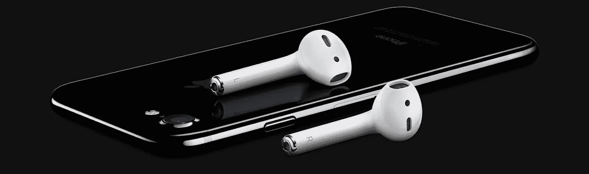
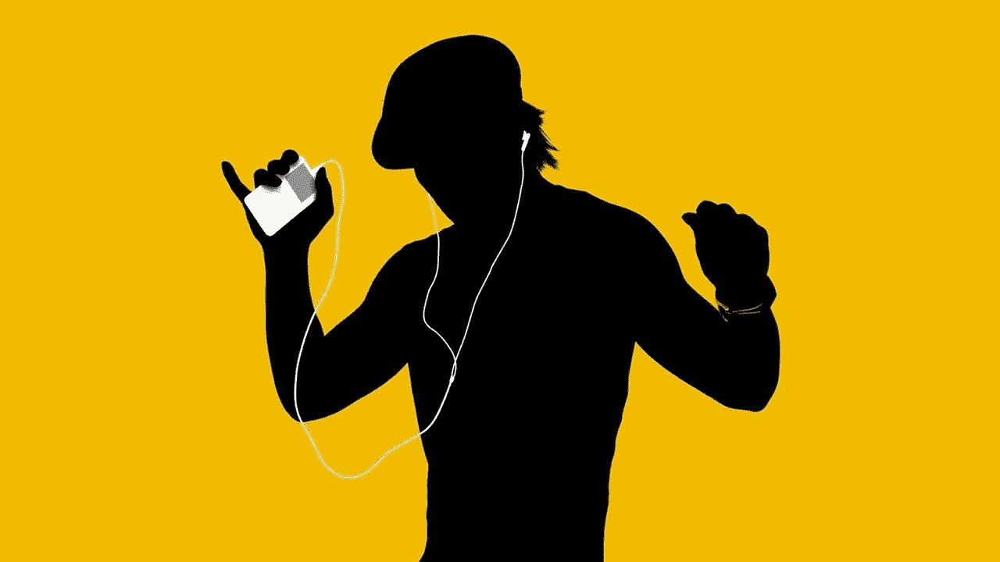
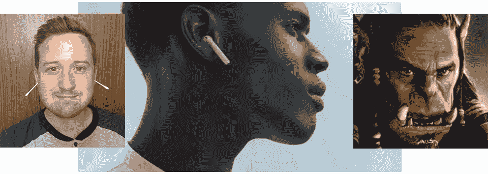
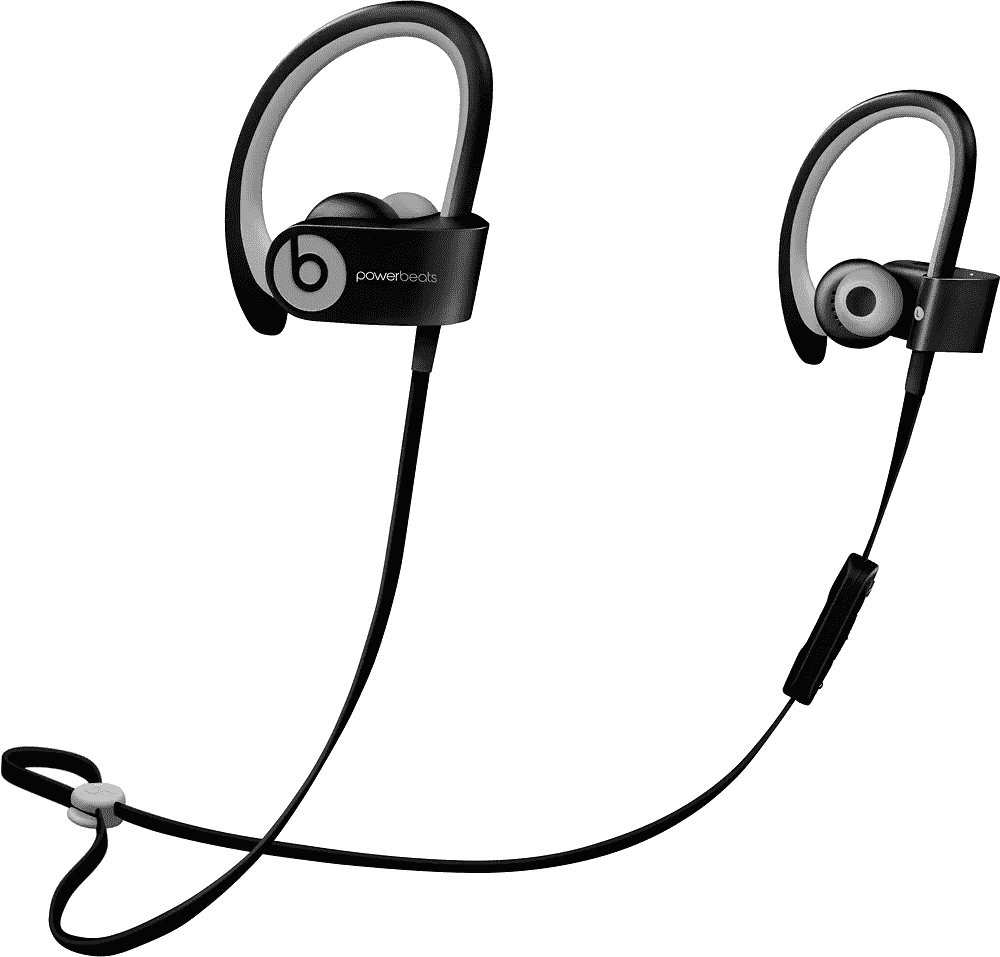
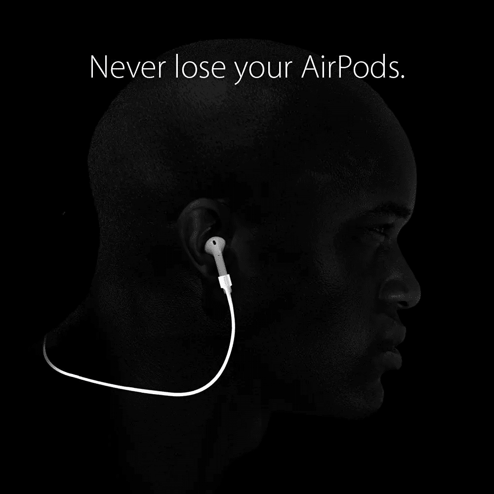
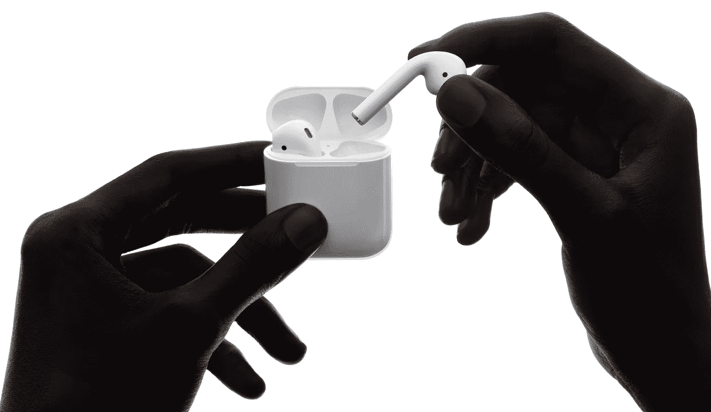

# 【点评】:AirPods

> 原文：<https://medium.com/hackernoon/review-airpods-c89e2a8aa949>

## 有“太简单”这种事吗？

阿尔伯特·爱因斯坦最令人难忘的名言之一是“让一切尽可能简单……但不要再简单了。”当苹果新款 [AirPods](https://hackernoon.com/tagged/airpods) 发布时，我起初认为我们找到了他所说的“不简单”的一个很好的例子

我不是一家主要出版物的技术编辑或博客作者，所以我没有收到苹果新的无线蓝牙驱动 AirPods 的预览集(由于苹果无耳机插孔的 iPhone 7，现在变得更有必要)。我在这里的“评论”将基于我对该产品推出的第一印象，我对不连接、分离耳塞格式的感受；以及我愿意花 159 美元购买它们的欲望。

在做一些研究时，我偶然发现了柯南·奥布莱恩的广告恶搞视频，我相信这将为我节省许多按键和文字来描述我第一次看到苹果 keynote 介绍时脑海中的“第一印象”。这很有趣，而且非常准确…

现在， [*实际*评论](https://www.wired.com/2016/09/review-apple-airpods/)已经注意到 AirPods 和之前的耳塞盒版本一样合适，所以广告的喜剧主题有点偏离主题。我发现这个恶搞的有趣之处在于，没有脐带的花蕾看起来是多么奇怪和愚蠢。标志性的原始广告使摇摆、下垂的绳索成为动态图像和镜头中有趣的一部分。

没有电线，白色的无线耳塞被比作…嗯，任何从你的耳朵或脸上伸出来的白色东西…

这是我第一次想到过度简化的地方。他们拿走太多了吗？他们应该留着铁丝，直接把两个芽连在一起就行了。我喜欢我的 PowerBeats 贴合和工作的方式，电线挂在我的脖子后面，耳朵“夹子”将耳机牢牢固定在适当的位置。我在电线上有音量和静音控制。蓝牙配对相对简单。偶尔充电过程没问题。声音不错。系绳和耳夹使他们很容易找到和挖掘出一个运动包。

“连接”的 AirPods 最终看起来会像 Spigen creates 的这款产品一样……除了你可能仍然会在电线上提供播放/暂停和音量控制。

Look familiar?

看着这个宣传片，我想象着苹果公司的新广告，采用标志性的“舞蹈剪影”风格，带子在舞者的脖子后面拍打，但允许他们翻转和扭动，并表演其他 [*突破 2:电动布加洛*](http://www.imdb.com/title/tt0086999/?ref_=nv_sr_1) 动作，而不用担心被他们的耳朵和 iPod 之间的绳子缠住。

# **然后……电线和插孔发生了**

当我开始写这篇文章的时候，我打算就此结束……得出结论，苹果已经超越了它自己，并且过度简化了一个产品。它们看起来很傻，很容易丢失，而且很难控制，例如，当有人靠近你，你想暂停或控制音量时。

但正如我经常做的那样，我保存了一份草稿，直到我有时间包装它。在那段时间里，我使用了我的 PowerBeats …我的 iPhone 6 …我的传统的当代耳机。现在知道 AirPods“就在那里”，突然…

*   每个带耳机插孔的设备似乎都过时了。即使…只是说说而已。
*   跑步时，我的 PowerBeats 上的系绳开始摩擦我的脖子。
*   我的 PowerBeats 耳夹开始有点夹痛了。
*   把我的 PowerBeats 插在电动剃须刀旁边充电看起来很奇怪。
*   令人沮丧的解开耳塞式耳机电线的过程变得更容易引起血压升高。
*   我记得有多少次我争先恐后地寻找一副耳机，即使是有“可找到”的线。
*   牙线充电盒似乎是我可以放在我的钥匙和钱包(当然还有我的 iPhone)旁边的东西，以便每天早上出门前拿着。而不是把一团耳机线塞进我的口袋。

Elegant, but eminently lose-able?

也许一个没有任何电线的世界不会那么糟糕。也许是为了创造一个尽可能简单的设计，苹果已经找到了一个“再简单不过”的安全门槛。

# 159 美元的判决

好吧……我可能会买一副这样的耳机，和我的(199 美元)PowerBeats 一起，作为我可能需要更好的声音和/或更好的入耳式安全的情况下的备用耳机。或者有一天我会有一双这样的鞋在易贝卖给你。这是 350 多美元的无线自由，所以我最好充分利用它。是时候加强日常锻炼了，加载播客和有声读物，成为 Siri 驱动的机器人(抱歉引用了),加入戴白耳朵东西的人群。

我仍然担心音质、失去能力(或者最好是遗忘能力)以及拥有备用耳机的费用，以及缺乏控制。我敢肯定，一旦我有了这些东西，一些担心就会消失。

苹果保持简单的做法值得称赞。我想我这次抓到你了，证明也许这次你超越了爱因斯坦的“再简单不过了”

> [黑客中午](http://bit.ly/Hackernoon)是黑客如何开始他们的下午。我们是 [@AMI](http://bit.ly/atAMIatAMI) 家庭的一员。我们现在[接受投稿](http://bit.ly/hackernoonsubmission)，并乐意[讨论广告&赞助](mailto:partners@amipublications.com)机会。
> 
> 如果你喜欢这个故事，我们推荐你阅读我们的[最新科技故事](http://bit.ly/hackernoonlatestt)和[趋势科技故事](https://hackernoon.com/trending)。直到下一次，不要把世界的现实想当然！

