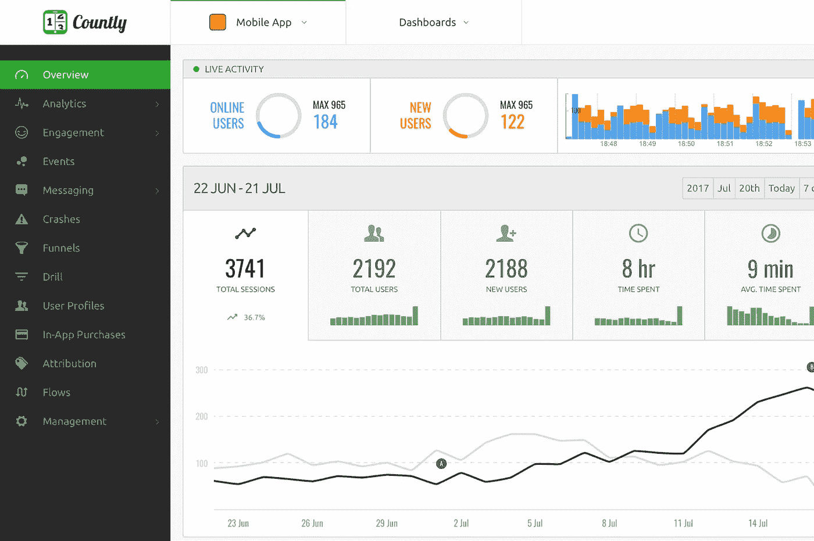
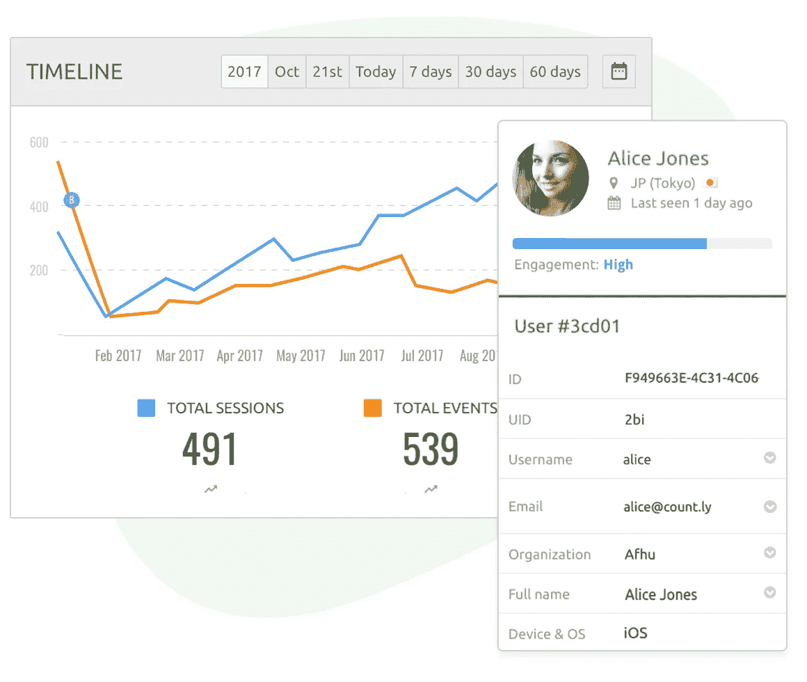
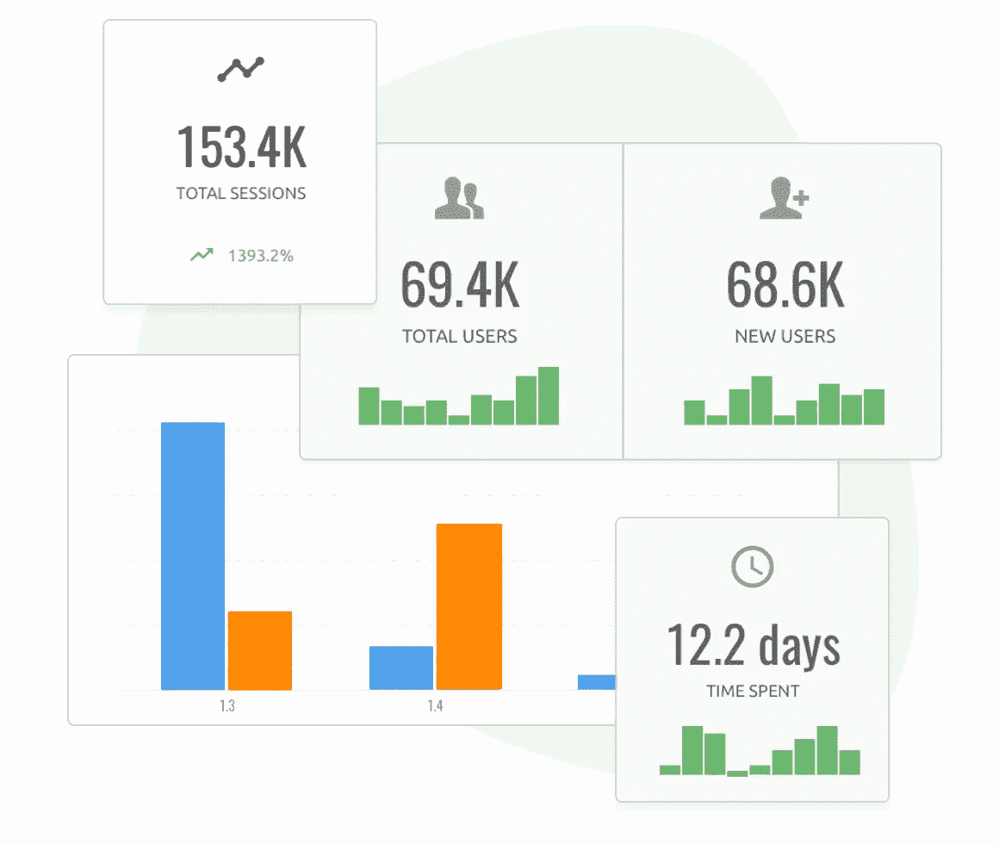
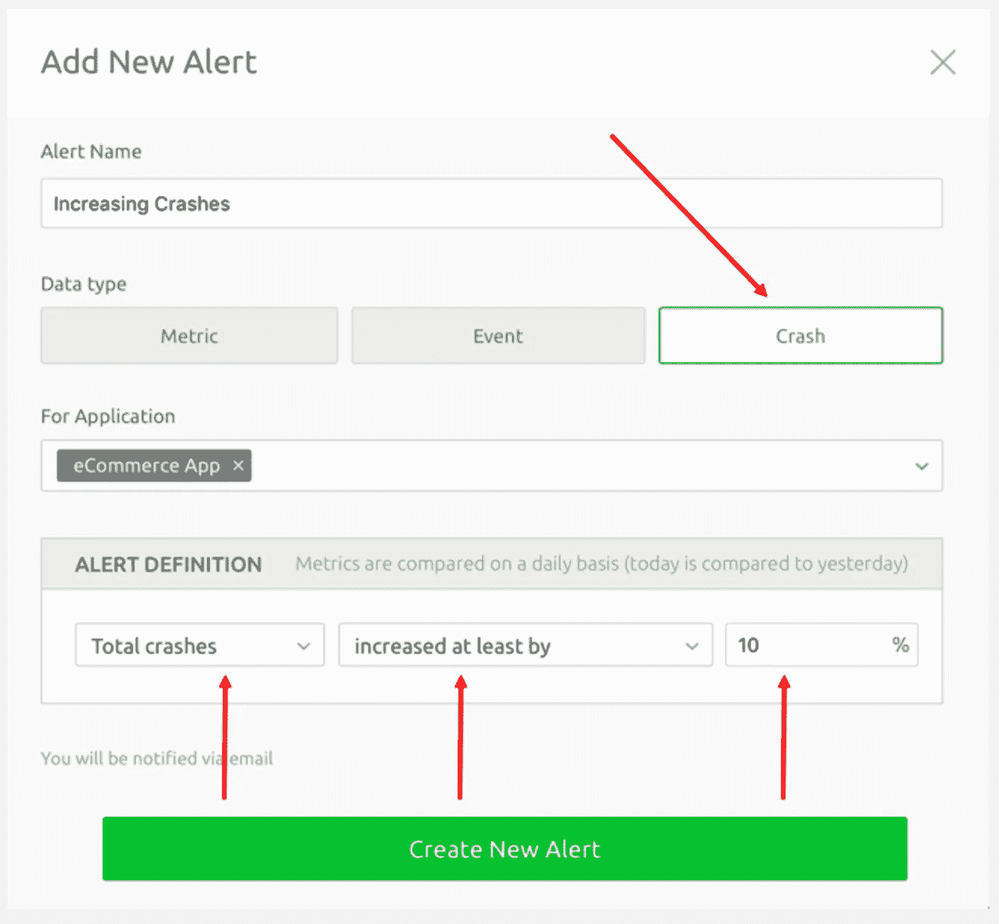
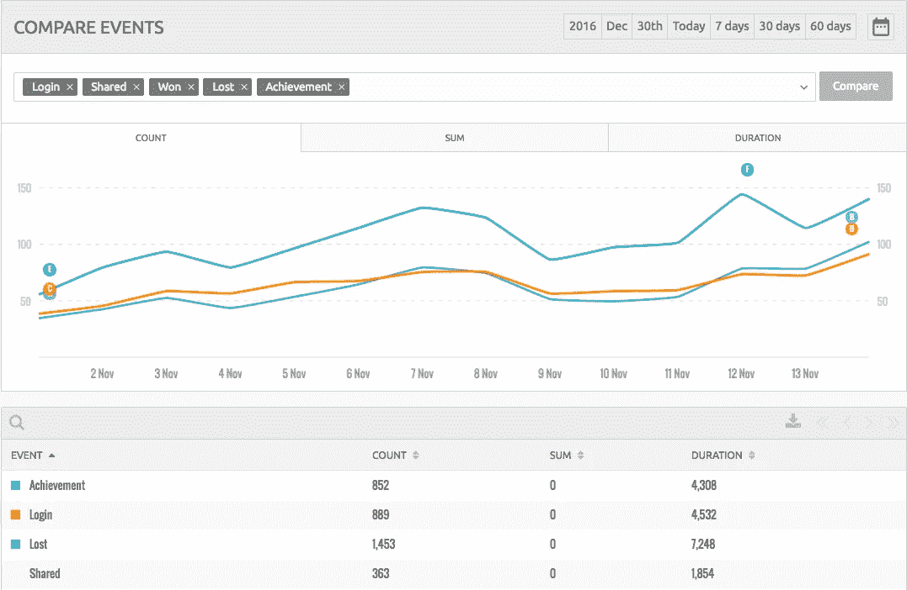

# Countly 开源分析平台综述

> 原文：<https://medium.com/hackernoon/review-of-countly-open-source-analytics-platform-76b7d3c5730e>

# 开源回顾系列#2 — Countly

[开源](https://hackernoon.com/tagged/open-source)回顾系列旨在让你深入了解各种开源[平台](https://hackernoon.com/tagged/platforms)。回顾它们可以做什么，以及为什么你可能想使用它们。

**往期点评:** [**书库**](https://hackernoon.com/open-source-exploration-bookstack-4d242c0ccbb2) —文档管理平台

# [county](http://count.ly)—产品分析平台

作为一个应用程序分析平台， [Countly](http://count.ly) 提供了广泛的功能，让您可以跟踪自定义事件、内部错误和用户操作等。我认为这就像服务器端的谷歌分析。位于服务器上而不是客户端上也意味着 ad-block 或 ghostery 等扩展将无法有效阻止用户数据，从而让您对应用程序的用户有一个更完整的了解。

# 项目概述—截至 2017 年 12 月 6 日

## Github 描述

> 这是 Countly 移动和网络分析和营销平台的主页。Countly 帮助您收集数据并了解您的应用的见解。可自托管或在私有云上使用。 [https://count.ly](https://count.ly/)

创建者— [县级团队](https://github.com/Countly)

首次提交—2012 年 5 月 28 日

最新提交—2017 年 12 月 4 日

星数—2501[(点击和⭐️这个！)](https://github.com/Countly/countly-server)

提交数量— 3，557

# 开源安装

## 方法 1 —手动安装:[遵循这些说明](https://resources.count.ly/docs/installing-countly-server)

## 方法 2 —自动安装:[在没有信用卡的情况下在 ServiceShop 上连续部署](https://serviceshop.io/service-catalog/5/request)

# 主要特征

## 用户分析

\From Countly Website

Countly 让你可以跟踪你的用户的一切。基于浏览器的分析系统通常会在这方面遇到困难，因为有些数据是您不希望向客户端公开的，而您可能希望在您的分析平台中显示这些数据，如财务数据或私有内部标志。

From Countly Website

Countly 提供了全面跟踪谁在何时做什么的可能性，并让您描绘出更加准确的画面，特别是如果与传统的基于浏览器的分析(如谷歌)结合使用。

## 警报

当你的应用崩溃时会发生什么？你收到电子邮件了吗？使用 Countly，您可以设置详细的警报定义，这些定义可以由自定义事件、用户活动或系统错误等事件触发。当这些警报被触发时，会有各种各样的操作，如向您的手机推送通知或发送电子邮件。您还可以访问详细的仪表盘，了解警报何时发生以及哪些应用程序触发了警报。

Define alerts that should happen when specific things happen in your app

## 事件分析

创建自定义事件，当用户在您的应用程序中执行操作时，应跟踪这些事件。Countly 为您提供了所有必要的图表和分析，帮助您了解用户在何时做了什么，以及他们到达目的地的流量，从而为您提供可操作的见解，帮助您改善用户体验。

## 插件

Countly 拥有一个全面的[插件架构](https://count.ly/plugins)，允许开发者扩展。Countly 提供了丰富多样的不同[插件](https://count.ly/plugins#filter?editions=CE&show-all=true)，可以增强 Countly 基础产品的功能。

## Countly 的理想用户

Countly 最适合那些能够在应用程序中添加代码的人。这将让您通过将不同的事件、用户数据和警报挂钩到您的应用程序中来最大限度地利用 Countly。

如果你这样做，你就可以获得一个广泛的分析平台，它可以让你深入了解你的用户和你的应用程序的健康状况。

# 结论

Countly 是解锁服务器端事件数据的平台。您可以轻松地放入事件挂钩，并将用户数据发送到 Countly 进行深入分析。如果你有兴趣更多地了解你的用户和你的系统是如何运行的，我会试一试。

# [点击此处，无需信用卡立即在 ServiceShop 上部署 county](https://serviceshop.io/service-catalog/5/request)