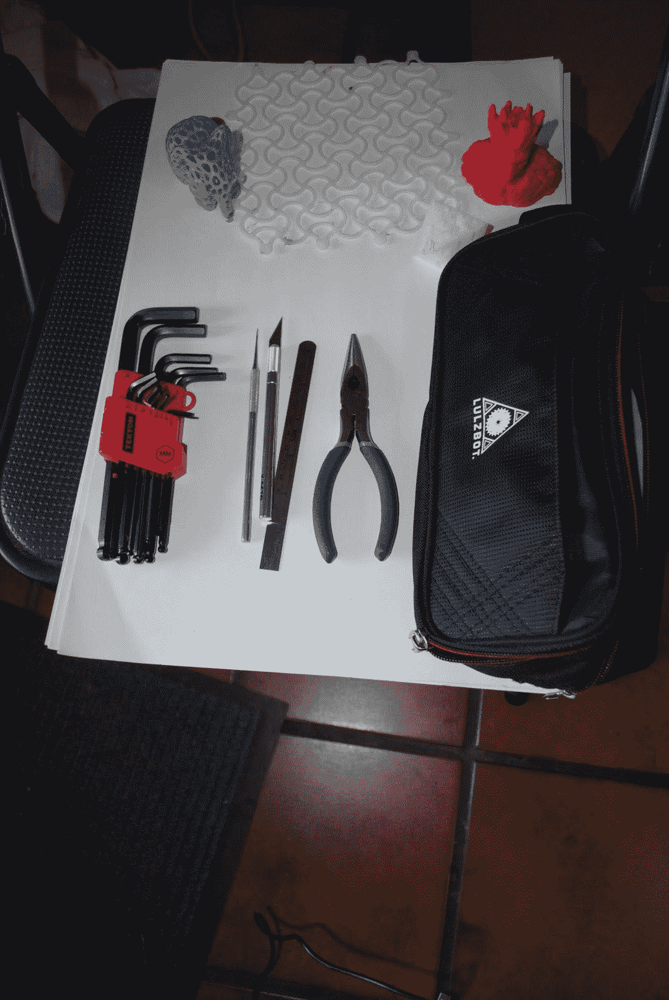
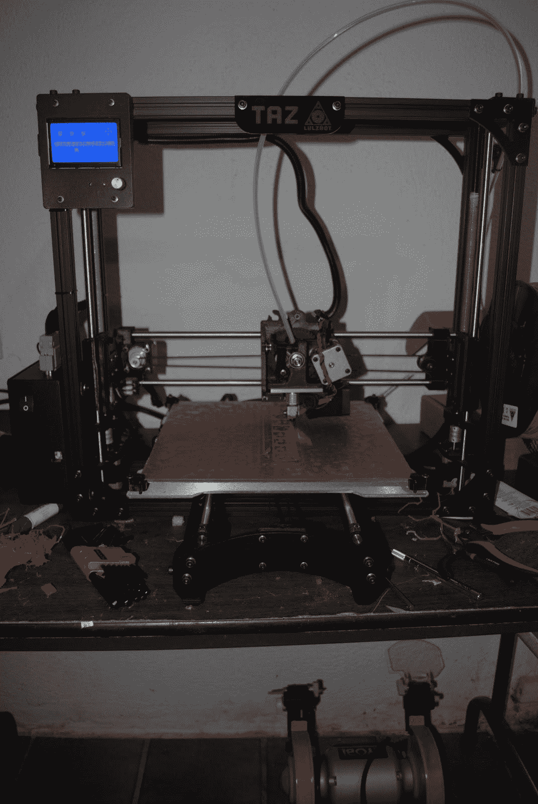
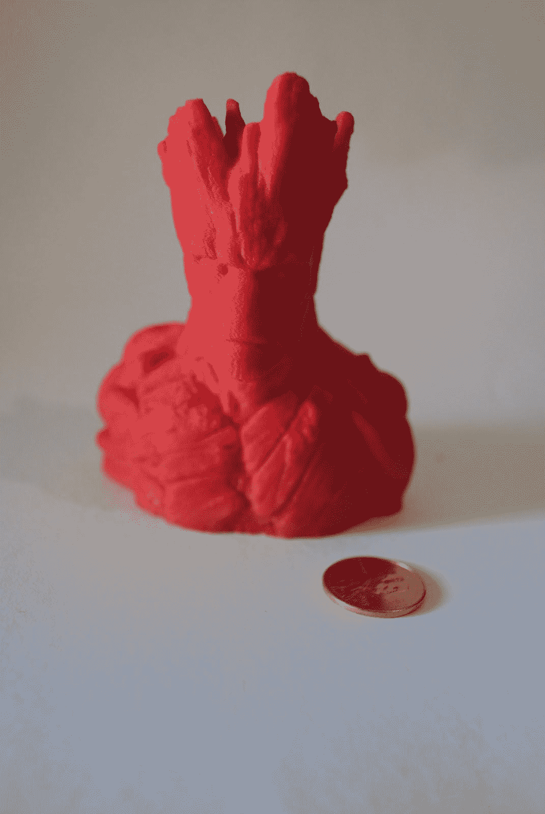
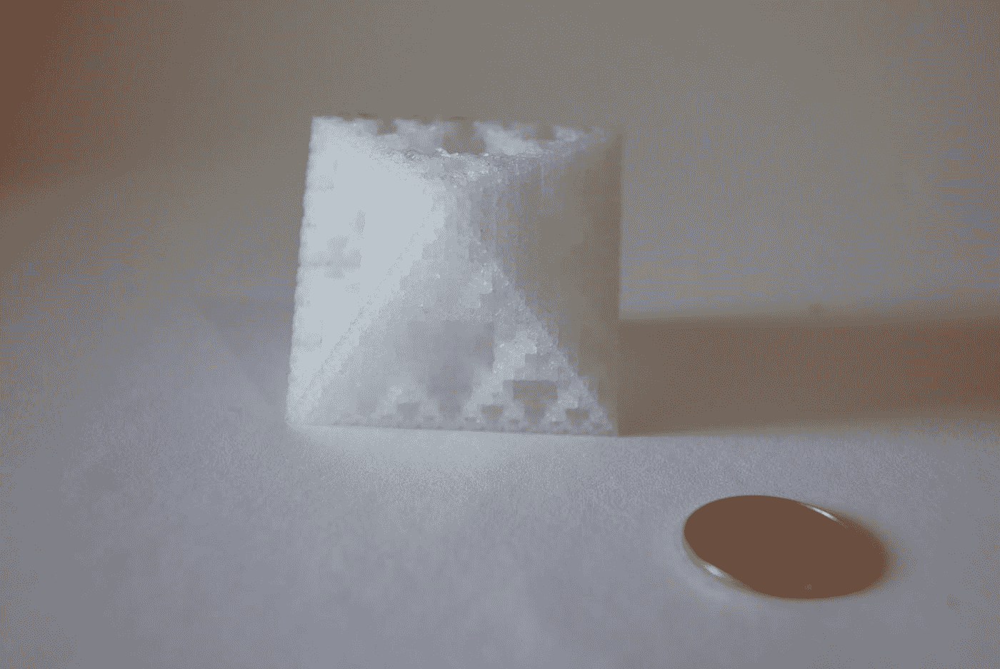
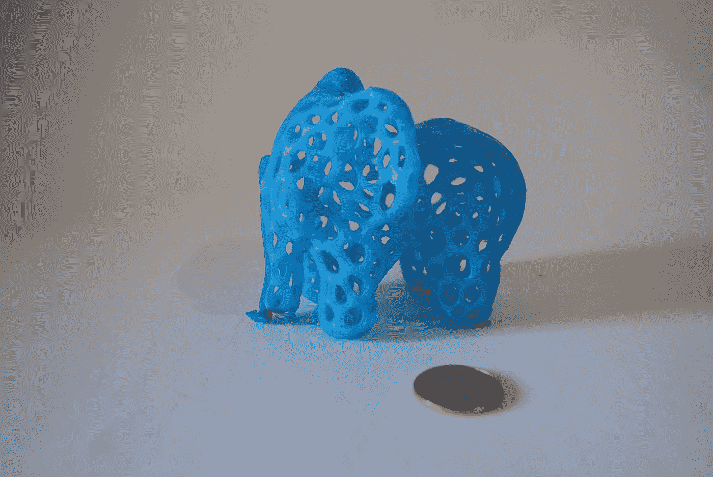
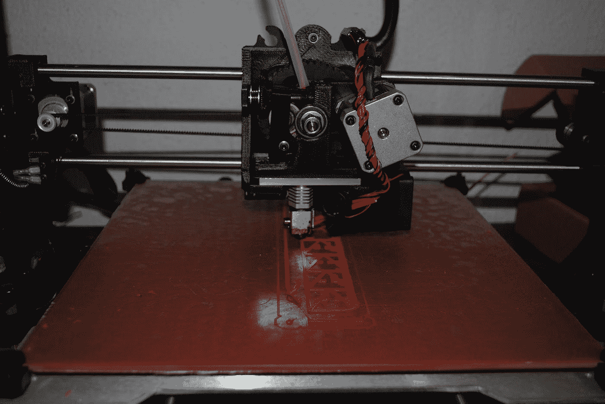
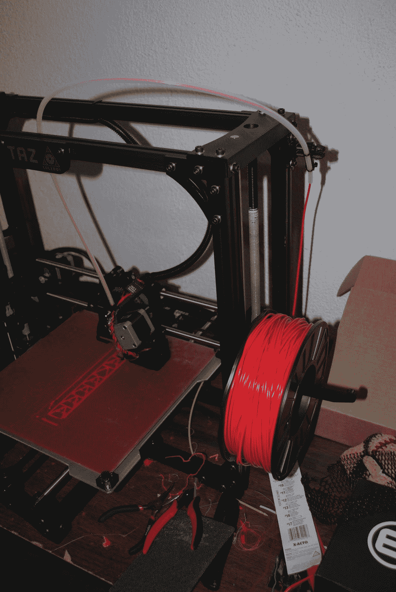
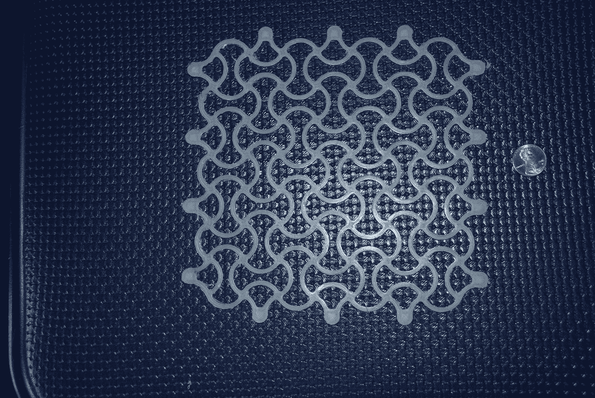

# LulzBot Taz 5 综述

> 原文：<https://medium.com/hackernoon/review-of-the-lulzbot-taz-5-7e5f5a7ba648>

最重要的是:这是一台很棒的 3D 打印机。

我是 3D 打印的狂热粉丝，不是专家。我用过 PrintrBot Metal、MakerBot Replicator 2 和 Replicator 1。

拆开 LulzBot Taz 5 的包装是一种乐趣。说明很清楚。我在 ABS 上第一次打印时没有遇到太大的困难。漂亮的是，LulzBot 配有一个工具包，其中包括大多数配件(x-acto、牙剔、油灰刀、尖嘴钳、内六角扳手)，不仅需要组装 LulzBot，还需要移除您的指纹。

我购买 LulzBot Taz 5 有三个原因:该公司作为支持全开源设计并提供良好支持的美国公司的声誉，他们的挤出机支持[多种](https://www.lulzbot.com/store/filament)材料的能力，以及他们提供[双挤出机头](https://www.lulzbot.com/store/tool-heads)的事实。我还没有购买双挤出机头，但计划得到一个让我在柔性材料上打印的，因为它与我正在做的机器人工作非常相关。

在我的灯丝到达之前，我尝试使用剩余的 1.75 毫米灯丝。我在这方面没有取得多大成功，尽管显然其他人取得了成功。我的喷嘴会挤出，但在打印过程中会堵塞。

我在 ABS 的第一个主要打印出来完美。这是 http://www.thingiverse.com/thing:478806 的头像，印得非常详细。花了 6 个小时。我使用 Simplify3D 作为我的切片器，它似乎可以与 LulzBot 完美配合。Cura 也可以。我不喜欢 Cura，因为与 Simplify3D 相比，它设计的支撑结构似乎总是很难完全拆除。

我喜欢的事实是，LulzBot Taz 5 与“六边形”挤出机可以打印尼龙，一个非常强大和坚韧的塑料，如在“分形八面体”以上，这至少支持 170 磅。我一直用尼龙 645。我按照说明，打印前在床上放下 PVA 胶，每次打印都已经不错了。有时会有几串，有时会有一些“烧焦”状的斑点，一般靠近床。然而，3D 打印总是有点像艺术品，我预计会有类似的问题。

尼龙的一个可爱之处在于，你真的可以很容易地用食用色素给它染色。在我用蓝色食用色素、热水和醋为我的女儿做“塔夫斯蓝”大约 1 分钟之前，上面的“沃罗诺依大象”是“尼龙白”。

一旦你习惯了，更换 LulzBot Taz 5 中的灯丝是很容易的。推动细丝的驱动齿轮完全打开，使得很容易看到线和移除细丝。“惰轮”张紧螺栓非常容易使用。

有一个非常好的细丝导向器，它似乎可以确保你可以可靠地从细丝卷轴固定器到挤出机头，没有缠结的危险。

加热床似乎工作得很好。到目前为止，我对这种(PEI)表面的附着力没有任何问题。

LulzBot Taz 5 有一张大床--它很容易地用尼龙打印出这种“增长织物”。

我确实有一些小毛病要挑，这些应该被认为是需要改进的地方，而不是主要问题:

*   SD 卡的打印效果非常好。这一点非常重要，因为在我的实验室里，我不想一直把我的 mac 连接到打印机上，然后把它带回到我的大显示器上。但是，我还没有从机载控制中弄清楚如何升高挤出机机头。我可以在 x 和 y 方向上移动它，但不能在 z 方向上移动。也许我只是不知道怎么做。
*   打印机比较吵。我觉得它的声音很好听，但是我需要在打电话的时候关掉它。幸运的是，到目前为止,“暂停”和“恢复”机载功能运行得非常好。

我认为这是一款出色的中档打印机。一台更小、更便宜的打印机(LulzBot 生产了一台)对孩子或初学者来说更有意义。但我对目前购买的产品非常满意。

感谢 [Thingiverse](http://www.thingiverse.com/) 制作了我在这里打印的美丽设计，以及数以千计免费提供的设计。感谢:

*   嘟嘟 _ 猴子(【http://www.thingiverse.com/Doodle_Monkey/about】)为“格鲁特半身像”。
*   罗曼·赫格林(【http://www.thingiverse.com/roman_hegglin/about】)为“大象沃罗诺伊式”([http://www.thingiverse.com/thing:287891](http://www.thingiverse.com/thing:287891))。
*   佐佐木太郎[(http://www.thingiverse.com/taroh/about](http://www.thingiverse.com/taroh/about))为“分形八面体”([http://www.thingiverse.com/thing:1123004](http://www.thingiverse.com/thing:1123004))
*   亨特弗雷希([http://www.thingiverse.com/hunterfrerich/about](http://www.thingiverse.com/hunterfrerich/about))为“圆形拉胀面”([http://www.thingiverse.com/thing:881094](http://www.thingiverse.com/thing:881094))

> [黑客中午](http://bit.ly/Hackernoon)是黑客如何开始他们的下午。我们是 [@AMI](http://bit.ly/atAMIatAMI) 家庭的一员。我们现在[接受投稿](http://bit.ly/hackernoonsubmission)，并乐意[讨论广告&赞助](mailto:partners@amipublications.com)机会。
> 
> 如果你喜欢这个故事，我们推荐你阅读我们的[最新科技故事](http://bit.ly/hackernoonlatestt)和[趋势科技故事](https://hackernoon.com/trending)。直到下一次，不要把世界的现实想当然！

