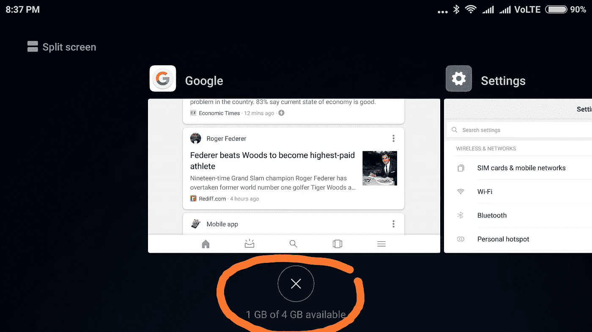

# 重温苹果的“计划淘汰”

> 原文：<https://medium.com/hackernoon/revisiting-apples-planned-obsolescence-46d3b4c48359>

iOS updates may not be deliberately slowing down on older devices

*更新:在我写这篇文章的几个月后，苹果终于* [*承认*](https://www.theguardian.com/technology/2017/dec/21/apple-admits-slowing-older-iphones-because-of-flagging-batteries) *它确实通过新的 iOS 更新来降低旧设备的速度，据说是为了防止它们因电池故障而崩溃。我确实在想我是否应该拿下这个帖子。但重新审视一下，我发现尽管苹果承认了，我的大部分论点仍然有效。所以我就顺其自然了。*

几个月前，我曾写过关于苹果[计划淘汰](https://hackernoon.com/planned-obsolescence-isn-t-going-as-planned-f24733f7a119)的文章。它对苹果有一些苛刻的想法，这可能是我的 iPad 3 在安装了 iOS 9 后变得迟缓的结果。真正让我感到不安的是，没有简单的方法来卸载 iOS 9，并回到 iOS 8。

然而，几个 iOS 升级后，我倾向于给苹果公司的好处怀疑。我必须承认，这种想法的改变在一定程度上受到了这样一个事实的影响，即我探索了 Android 的一面，并意识到那边的草并不是特别绿。

一个简单的事实是，一个新的操作系统是为运行在新的硬件上而设计的，它不可能在旧的硬件上无缝运行。这不仅适用于苹果，也适用于任何手机。让我解释一下新硬件的一个方面，它的 RAM。

我之前的安卓手机，小米的 Mi4i 有 2GB 内存。而我目前的安卓系统红米 Note 4 有 4GB 内存。

当我加载 MiUI 9 的测试版(Android 牛轧糖叉或小米手机的定制版)时，旧手机的速度变慢了。但 Android 的一个好处是它更令人讨厌，我很快发现了一个有启发性的统计数据。Mi4i 只有 500MB 的空闲内存，没有运行任何应用程序。而同一操作系统上的 Redmi Note 4 有大约 1.6 GB 的空闲内存，没有运行任何应用程序。

Newer phones have more free RAM which allows apps to load faster and perform better

基本上，一个新的操作系统使用更多的内存来运行它的新功能，而留给旧手机上运行应用程序的内存将会减少。因此，我的 Mi4i 在 Note 4 平稳运行时表现不佳。我感觉连更擅长管理 RAM 的 iOS 都受到了这个问题的影响。

这里重要的一点是，RAM 只是让新手机的硬件比旧手机更好的众多硬件之一。像新的处理器、图形处理器、改进的传感器，以及许多像我这样的外行人甚至不知道的其他组件。

毫无疑问，苹果有“计划淘汰”的成分。他们可以找到方法，使旧手机的性能不会受到新操作系统的严重影响。也许可以制作使用更少系统资源的新操作系统的替代版本。但我认为，将太多资源转移到为旧手机开发新版本的操作系统上，在商业上是没有意义的。

话虽如此，我认为苹果确实在印度对这个问题采取了略有不同的方法。他们可能受到印度是一个成本敏感型市场的影响，似乎正在开发在新 iOS 上运行良好的旧款手机的廉价型号。这个系列的第一款是 iPhone SE。它的大小和外观与 iPhone 5S 一样，但大部分内部部件都是 iPhone 6S 的，价格仅为₹19000(290 美元)。我妻子有这部手机，我可以保证 iOS 11 在上面运行流畅。这一策略似乎对苹果公司有效。尽管它只占印度手机市场的 3%,但 iPhone 较高的价格意味着，就销售额而言，苹果在印度排名第三，预计今年在该国的销售额为 30 亿美元！

回顾我在 iOS 9 上的 iPad 厄运，如果我能再做一次，我会以不同的方式处理它。在决定是否安装操作系统之前，我会在手机上运行新操作系统的测试版。原因很简单，如果你发现你的设备有问题，你可以卸载测试版 iOS。此外，如今安装 iOS 的公共测试版相当简单，因为苹果希望在地图崩溃后有尽可能多的免费测试者。

其实我在 iPhone 6S+上也正是这么做的。(我的 beta 冒险记录在[以前的一个帖子](https://hackernoon.com/to-be-or-not-to-beta-610d443da698)。)这款手机没有显示出任何崩溃、变慢或过度使用电池的迹象，而这些都是新操作系统用户最常见的抱怨。基于此，我决定继续前进，获得 iOS 11。

这个故事有一个小小的转折。要安装 iOS 11，需要先卸载测试版的 iOS 11，然后再下载正式版的 iOS 11。然而，我一直在拖延这件事，直到有一天我收到一条消息，说 iOS 11.1 测试版可供下载。似乎因为我没有卸载测试版，苹果认为我不介意继续做测试版测试者。哦，好吧，我总是那个冲进天使害怕涉足的地方的人，所以我继续愉快地进行测试。

然而，要注意的是，测试版可能会有问题，不适合不喜欢惊喜的人。有一段时间，我的锁屏通知只能看到一半。积极的一面是，你可以在大多数厌恶风险的人之前看到有趣的新功能。虽然我必须说，有时很难说这是一个新功能，还是一个我没有意识到的旧功能，还是一个小故障。就像现在，我的 iPhone 通过蓝牙连接到我的汽车音乐系统时，它就开始自动播放音乐，即使手机上的音乐应用程序已经关闭。我不知道它为什么这样做，但它很酷！

我觉得风险因素有点夸大了，因为苹果向公众发布了相对稳定的测试版，而且只有在通过向开发者发布测试版解决了严重问题后才会这么做。不过，我还是采取了一项预防措施。我避免在测试版到来的那天安装它。就像 iOS beta 11.2 公布后，我等了一天才安装。如果我在互联网上看到关于测试版手机崩溃的恐慌尖叫，我会推迟安装。

至于我对安卓世界的探索，也有好的一面。与价格更高的 iphones 不同，我的 Mi4i 只花了₹10000(150 美元)。所以当它变慢的时候，我就用₹8500(130 美元)的净价把它换成了我现在的手机(红米 Note 4)。这是可以接受的，不像 iPhone，即使是 iPhone 7S+这样的老款手机在印度的零售价也超过 1000 美元。价格差异确实表现在质量上。例如，我的安卓相机无法与 iPhone 相比。但我的 Android 有一些附加功能，比如通过 SD 卡提供额外的存储空间，能够从 USB pendrive 读取文件，更不用说 MiUI 9 的分屏应用程序、两个应用程序之间的快速切换等软件了。如果我还是更喜欢 iOS 而不是 Android，那大概是因为我一直在苹果上。

总而言之，只要技术以今天的速度进步，过时，不管是计划内的还是计划外的，都将不可避免地发生。我们可能无法阻止它，但有办法与之共存。我们要做的就是决定哪种方式最适合我们。