# 有奖调查——应用发行商收入祈祷的答案？

> 原文：<https://medium.com/hackernoon/rewarded-surveys-the-answer-to-an-app-publishers-revenue-prayers-d0e3018ac406>

寻找移动应用的盈利方式是应用发行商的圣杯。广告网络和移动出版商不断定义新的和创造性的方式，以最大限度地实现货币化。奖励视频处于最新创意转变的前沿，围绕应用内经济而设计。但调查显示，新加入的公司可能会缩短他们在应用货币化王国的统治时间。

奖励视频是一种激励用户参与应用程序的好方法，同时出版商也获得了更多的广告收入。奖励通常以游戏内货币(黄金、硬币、电源)或任何形式的优质内容的形式出现，并在成功完成视频后分发给用户。最近[的一项研究](http://blogs.unity3d.com/2016/04/06/new-study-reveals-the-future-of-mobile-game-monetization/)显示，付费视频是目前应用发行商选择的最热门的收入来源，也是应用用户最广泛接受的格式之一。

但是简单地展示一个视频，导致一个应用程序安装活动可以变得相当可预测。 ***重点是找到一种方式向用户呈现更具互动性的东西，完全控制选择加入，从而在期望的广告参与和用户体验之间保持平衡*** 。这就是奖励调查发挥作用的地方，缩短了奖励视频在应用货币化王国的统治。

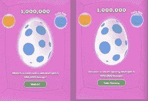

**奖励调查**是为移动设备设计的经过修改的简短市场调查，用户可以选择参与，以便获得奖励内容，如硬币或积分。用户在成功完成调查后，会以各种方式获得奖励，类似于奖励视频。市场调查是收集各种市场信息的常用手段。目的是从一个市场的小样本中收集信息，以预测整个市场的需求。有奖调查对各种企业来说都是一个很好的工具，帮助他们了解客户的习惯和喜好，获得产品反馈，衡量品牌知名度，收集消费者洞察。任何企业，无论是大公司还是中小企业，都需要关于其目标客户的数据，因此他们不必依赖猜测和直觉。

# 有奖调查和有奖视频

对于出版商来说，奖励视频可能是一个高转化率的解决方案，奖励调查与它们一起工作，为移动应用程序增加额外的收入流。这两种形式可以同步使用，携手实现最终目标，即增加收入。应用程序开发人员不需要选择使用哪一个，为一个问题提供两种解决方案。最终结果是最大限度地覆盖可能存在的填充率缺口。

对完成任务的用户进行奖励对应用发行商来说是非常有益的，原因有很多:这是一种从非付费用户——移动应用中的绝大多数用户——身上赚钱的好方法；它还鼓励用户继续使用父应用程序。

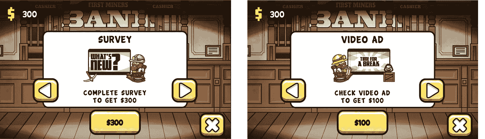

FusePowered 最近的一项研究在超过 600 万玩家的网络中进行，旨在得出参与奖励广告对转化率和收入有正面还是负面影响的结论。这项研究表明，任何关于用户通过付费视频购买高价商品会损失 IAP 收入的先入之见都是没有根据的。事实上，在观看奖励视频后做出 IAP 的玩家比没有观看的玩家多六倍。

# 听起来很完美，对吧？但是谁说你不能追求完美呢？

受奖励的调查正在用户首选广告形式的名单上攀升。最近由 [Pollfish](http://www.pollfish.com/) 在美国对大约 1200 名移动应用用户进行了一项[调查](https://www.pollfish.com/dashboard/results/9576/1829202153)，询问他们对 ***为什么他们更喜欢调查而不是传统广告的看法，*** 给出了几个有趣的答案:

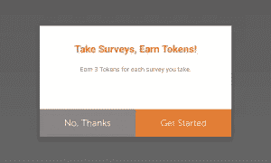

## 你应该立即转向有奖调查的 7 个理由

**1。互动/趣味:**

*   *“调查很有趣！”*
*   “我倾向于忽略广告，但调查更具互动性，所以我喜欢它们。”
*   “因为它让我有事可做，而不是等着广告结束。”
*   “我喜欢阅读和回答调查。”
*   *“这就像一场游戏，我在参与过程。”*
*   “比看广告无聊多了。”

调查是一种交互式的货币化形式，需要用户的参与。这个过程带来的是参与感，毕竟是乐趣！所有用户可以做的奖励视频，是观看，或“假装观看”，直到结束。

**2。以用户为中心/个人:**

*   “调查更关注个人。”
*   *“我可以通过回答调查来表达我的观点”*
*   *“调查可能与我的生活相关”*
*   “我觉得我的意见受到了重视。”
*   “这牵涉到我。”
*   *“问我喜欢什么，而不是告诉我喜欢什么。”*

调查需要每个用户对许多主题的个人和独特的意见，使他们以用户为中心。调查结果在收集后会转发给希望收集消费者见解并改进或形成未来或现有产品和服务的营销人员和公司。用户喜欢贡献并让别人听到他们的声音。如其中一个答案所述:

> “一个调查想知道我的想法，但广告认为他们知道我想要什么。”

**3。不重复/不可预测**

*   *“调查很有趣，更有价值，而且不会重复，你不必看一百万遍同样的广告..*
*   *“他们日复一日，一遍又一遍地重复同样的广告。过一会儿就没意思了"*
*   **“广告变老了，回答调查每次都给我们不同的事情做。”**

*有时候随性是值得的。用户事先并不知道调查的主题，同样的调查一旦完成也不会出现两次。这种做法具有很高的吸引力，因为用户不会被迫漫无目的地观看无休止的视频，从而导致应用程序安装提示。对下一步会发生什么以及其他人的回答的好奇心会带来兴奋感，并推动转化和应用内参与。*

***4。高回报***

*   **“调查让我获得更多积分。”**
*   **“因为回答一个调查对于免费获得 pro 升级来说并没有那么糟糕。”**
*   **“更多储蓄。”**
*   *“因为调查提供了更多的奖励。”*
*   *“它的互动性更强，我一次可以赚更多的积分。”*
*   *“回答调查报酬很高。”*
*   *“这让我节省了更多的钱。”*

*虽然奖励视频比传统广告形式的支出更高，但奖励调查的支出甚至更高，这使它们成为用户和发布者支出的首选。*

*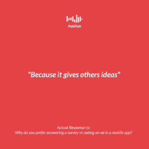*

***5。更快更简单***

*   *“因为这样更容易、更快。”*
*   *“我讨厌等待广告结束。”*
*   **“更方便。”**
*   *这是一种有趣又放松的度过一天的方式*
*   *“广告花费的时间太长，而完成调查花费的时间更少。”*
*   **“广告是烦人的视频，看起来好像永远都在播放。”**

*用户发现完成调查并获得奖励比等待视频完成更方便快捷。*

***6。完全选择加入控制***

*   *“我更喜欢掌控一切，以自己的速度填写调查。”*
*   *“感觉像是一个选择。”*
*   *“我可以利用我的时间做一个调查，更有选择性。”*
*   **“回答的选择。”**
*   *“我觉得我能更好地控制我看到的东西。”*

*用户的同意和控制是非常重要的，奖励调查通过提供非侵入性的选择控制为用户铺平了道路。为用户提供了一个清晰的退出按钮，他们可以选择何时开始或停止他们的调查，使这种体验不那么侵扰。期望参与和用户体验之间的重要平衡因此得到了很好的保护。*

*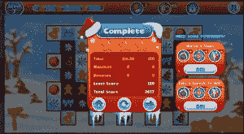*

***7。不是广告多！***

*   **“我讨厌广告！”**
*   *“因为我不管这些广告。”*
*   **“广告真的很讨厌，比较常见。”**
*   *“广告让我非常生气。”*
*   **“广告是愚蠢的。”**
*   *“广告让我疯狂。”*

*用户群体普遍认为，市场需要一种不同的广告形式，不那么烦人，更具互动性，为用户量身定制。这就是调查发挥作用的地方。*

# *把握好时机:找出展示你的调查的最佳时间*

*有奖励的调查随着诱人的体验和不断增加的投资回报率越来越受欢迎。决定加入一个有奖励的调查是不需要动脑筋的，但是这里有几点可以保证你有一个成功的赚钱策略。*

*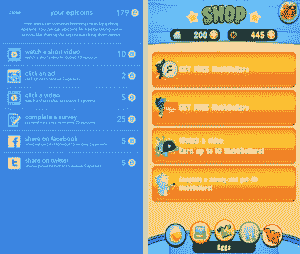*

# *现在完成时:地点、时间和事物*

*你应该多久向你的用户展示一次有奖调查？您应该将奖励调查放在哪里？[设计](https://hackernoon.com/tagged/designing)奖励调查的位置和时间，既能吸引用户与调查互动，又能确保用户对应用程序感兴趣并保持参与，这是奖励调查成功的基石。以下是一些需要记住的事情:*

# *在哪里？*

*   ***店面/优惠墙***

*这是市场上最常见的方法。用户决定访问店面来购买电源、硬币等。那就是当你给他们提供完成调查的选择来换取奖励的时候！*

*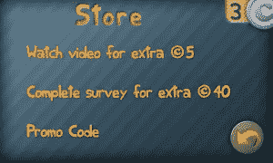*

*   ***游戏开始前的菜单***

*不是让用户导航到店面部分，而是给他们显示一个提示，让他们选择在使用游戏或应用程序之前完成一项调查并接收初始升压或加电。*

*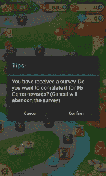*

# *什么时候？*

*   ***游戏进展***

*游戏过程中的事件，如在终点线前耗尽生命可以货币化。失败等级的奖励调查可以帮助用户在游戏中前进，并让他们玩得更久。完成奖励调查后的个性化奖励，基于用户的级别，将保持他们的参与，并在奖励用完时将他们推向 IAP。*

*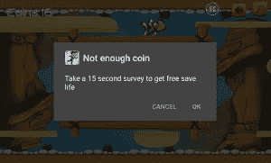*

# *什么？*

*   ***解锁功能或追加销售***

*在您决定了奖励调查的位置后，您还需要决定奖励用户什么。请记住，这并不总是钱的问题！*

*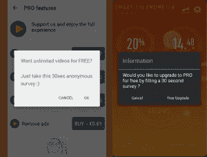*

*   ***移除广告***

*在线广告是广告业的一个主要部分，它们每天都在变得越来越具有侵入性。发布的广告，扰乱游戏/应用程序体验，每年都在以惊人的速度增长。通常，广告导致的唯一结果是恼怒。为了避免这种情况，出版商们试图通过 IAP 或奖励的方式将这种挫败感货币化。考虑选择完成一个简短的调查，并获得一个无广告的应用程序环境；谁会不喜欢呢？*

*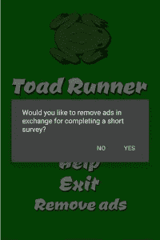*

# *结论*

*奖励调查可以很好地与您现有的货币化系统相结合，为免费增值用户打破坚冰，支付更多费用，并在使用得当的情况下提高留存率和转化率。请记住，用户将永远在你的应用中寻找更简单、更具互动性和更高回报的解决方案，以保持下去。这个选项是奖励调查！*

******

> *[黑客中午](http://bit.ly/Hackernoon)是黑客如何开始他们的下午。我们是 [@AMI](http://bit.ly/atAMIatAMI) 家庭的一员。我们现在[接受投稿](http://bit.ly/hackernoonsubmission)并乐意[讨论广告&赞助](mailto:partners@amipublications.com)机会。*
> 
> *如果你喜欢这个故事，我们推荐你阅读我们的[最新科技故事](http://bit.ly/hackernoonlatestt)和[趋势科技故事](https://hackernoon.com/trending)。直到下一次，不要把世界的现实想当然！*

**