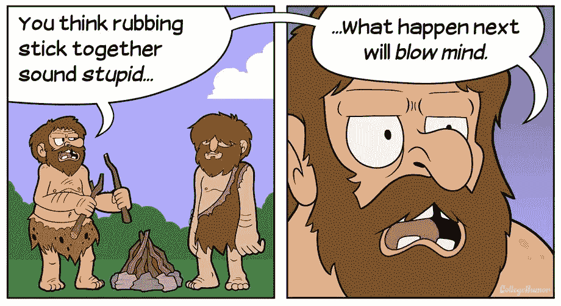

# 在点击诱饵的世界里奖励高质量的新闻报道

> 原文：<https://medium.com/hackernoon/rewarding-quality-journalism-in-the-world-of-clickbait-10daa533e412>

众所周知，新闻行业已经经历了一段时间的自我反思阶段。随着互联网普及率的飙升，传统印刷媒体的销售额达到历史最低点，许多媒体不得不努力应对数字时代带来的独特挑战。

十多年前，当新闻媒体仍试图在互联网上找到立足之地时，就货币化而言，关于最佳策略可能是什么，有过许多辩论和实验。大型组织尝试了付费防火墙、免费增值订阅和显然不错的广告。

但部分原因是互联网用户普遍缺乏为新闻付费的意愿，部分原因是缺乏技术来创造可能吸引更多用户的复杂产品，互联网上的新闻最终变成了一种基于广告的免费工具，并一直保持至今。

然而，经过近十年的尝试和测试，这种模式出现了一些明显的缺陷。首先，把新闻和其他“内容”放在同一个桶里，并照此对待，会适得其反。如果我们奖励高质量新闻的唯一方式是在上面打更多的广告，那么记者们将别无选择，只能转向点击诱饵和哗众取宠来吸引更多的“眼球”。这正是滋生所谓假新闻的那种不良激励。

第二，即使广告到位，许多地方和区域报纸也很难做到收支平衡，这导致报道质量低劣，如果不是彻底倒闭的话。一天结束时，我们只剩下少数几家“主要”报纸来承担派遣记者和收集新闻的大部分繁重和基础工作。然后，这些新闻被专家们传播到互联网的其他地方，提供他们的观点和见解，最终通过我们的社交媒体传播，被我们其他人消费。

但在付费新闻的问题上，我并不完全是妄想。我理解在互联网上，信息*希望*免费。在广泛使用互联网的诸多好处中，更方便地获取信息无疑是我最感激的一个。此外，人们来到*似乎是希望互联网上的*新闻是免费的。一种权利，而不是商品。

尽管如此，**总要有所付出。**

新闻业面临的斗争与 21 世纪初音乐制作人的斗争没有什么不同，当时音乐盗版是互联网上的常态。那时，人们也集体假设并期望互联网上的一切都应该是免费的。

直到苹果公司介入，以 iTunes 和 iPod 的形式提供了一个更好的解决方案，为音乐付费才正常化。事实证明，人们并不是天生反对付费音乐的想法，而是缺乏一种方便的方式来这样做。或许这也是这个行业所需要的。一些会引发集体思维转变的事情。

归根结底，一个健康和正常运作的媒体对任何民主的正常运作都至关重要。独立媒体教育公民、向当选官员施加压力并让他们承担责任的能力是一个好政府的众多标志之一。

整个行业不能依赖一小撮出于道德义务或公民责任而选择投资付费订阅的个人。需要持续努力奖励好的新闻报道，同时确保更多的消费者能够以负担得起的价格获得新闻报道。我们越早找到提升信息质量的方法，对每个人都越好。

> [黑客中午](http://bit.ly/Hackernoon)是黑客如何开始他们的下午。我们是 [@AMI](http://bit.ly/atAMIatAMI) 家庭的一员。我们现在[接受投稿](http://bit.ly/hackernoonsubmission)并乐意[讨论广告&赞助](mailto:partners@amipublications.com)机会。
> 
> 如果你喜欢这个故事，我们推荐你阅读我们的[最新科技故事](http://bit.ly/hackernoonlatestt)和[趋势科技故事](https://hackernoon.com/trending)。直到下一次，不要把世界的现实想当然！

