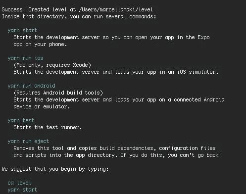
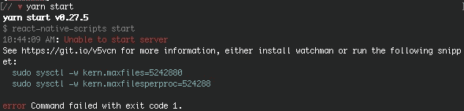
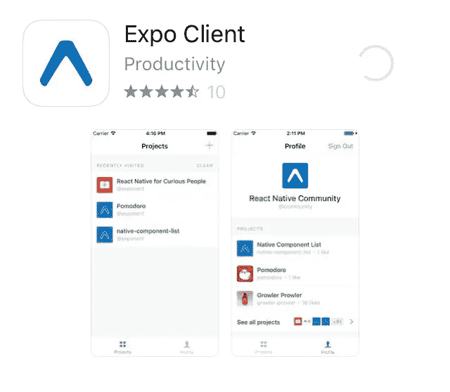
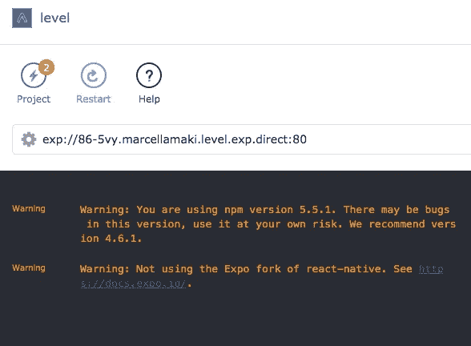
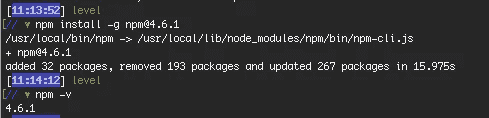
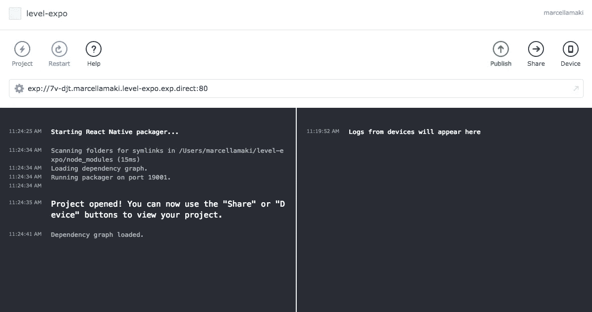

# 使用 React Native 重做 web 应用程序，第 1 部分:故障排除设置

> 原文：<https://medium.com/hackernoon/reworking-a-web-app-with-react-native-part-1-troubleshooting-set-up-cff77274a6fa>

在我开发的一款 [React](https://hackernoon.com/tagged/react) 网络应用取得良好进展后，我决定让它成为一款原生应用。该应用程序已经集成了短信提醒(使用 Twilio API)，我认为构建一个移动[应用程序](https://hackernoon.com/tagged/app)是有意义的，这样用户就不必使用台式机或笔记本电脑。

此外，在我的社会服务工作背景之后，我对构建可访问的应用程序特别感兴趣。我以前工作中的许多同事没有电脑，如果有问题，智能手机是他们联系、发送电子邮件、查找和申请他们有兴趣获得帮助的项目的唯一方式。这还没有考虑到和我一起工作的没有智能手机的人的数量。构建 React 原生应用是我提高可访问性的第一步。在此之后，我的下一步是为那些不能可靠上网的用户提供一个完全基于短信的选择。

React Native 的入门文档非常好，尽管安装所有东西比我最初预计的要多花一点时间。我决定将所有的终端命令和信息汇编到一个地方，以便于参考。

以下是我用来安装所有东西的步骤，这样我就可以开始构建一个应用程序了！

## 第一步

我遵循了[快速启动文档](http://www.reactnativeexpress.com/quick_start)，这是一个很好的起点。


我从跑步开始

```
npm install -g create-react-native-appcreate-react-native-app level   //level is the name of my app
```



这花了相当长的时间，但总的来说工作顺利，但当我真正开始运行纱线时，我遇到了一些问题。

## 安装 Watchman

终端输出引导我查看 react native app issues 页面上的讨论，或者建议安装 watchman 或运行一些 sudo 命令。



我阅读了问题页面，并决定调查我以前从未听说过的守望者。

> “Watchman 的存在是为了监视文件并在文件发生变化时进行记录。它还可以在匹配文件发生变化时触发操作(如重建资产)。”
> 
> —[https://facebook.github.io/watchman](https://facebook.github.io/watchman/)

好吧，在这种情况下似乎会有帮助。要在 OS X 上安装 watchman，首先更新你的自制软件，然后安装。

```
brew update
brew install watchman
```

## 下载博览会

当我的自制软件在更新，watchman 在安装的时候，我在我的手机上下载了 Expo 应用，这是一个用于构建 React 原生应用的应用。



我还把 Expo 下载到了我的 MacBook 上。当我打开应用程序时，我可以看到它已经创建了初始项目，但是我有两个警告需要解决。



## 检查 npm 版本

第一个是非常简单地恢复到我的 npm 包的旧版本，您可以使用

```
npm install -g npm@4.6.1
```

我检查以确保版本恢复正确



太好了！

## 世博会快速启动

之后，我查阅了[的文件，以便快速启动](https://docs.expo.io/versions/latest/index.html)世博会。它有一个非常不同的启动过程，就是通过应用程序创建一个新项目。我成功地做到了这一点，能够从我的终端 cd 到项目，并使用我的 phone Expo 应用程序上的 QR 扫描仪打开在移动设备上运行的项目。



以下是连接到您的项目后，默认设置在移动屏幕上的样子


## 结论

总的来说，这是相当成功的，虽然我希望文档能更容易理解我是否以及如何在不使用 Expo 的情况下从终端构建 React Native。在我看来，React 原生文档的快速入门指导我在手机上使用 Expo 应用程序似乎没有什么意义，但我肯定会调查这是不是真的，或者我只是对文档理解得不够好。

请继续关注第 2 部分，我将为我的应用程序构建一些静态页面，然后是第 3 部分，我将处理表单！

## 资源

[](http://www.reactnativeexpress.com/quick_start) [## React 本机 Express

### 通过互动的例子学习母语反应。

www.reactnativeexpress.com](http://www.reactnativeexpress.com/quick_start) [](https://expo.io/) [## 世博会

### 轻松构建 React 本机应用程序。

世博会](https://expo.io/)  [## 快速入门|博览会最新文档

### 这些是世博会的文件。Expo 是一套工具、库和服务，可以让你构建本地 iOS 和 Android…

docs.expo.io](https://docs.expo.io/versions/latest/index.html)