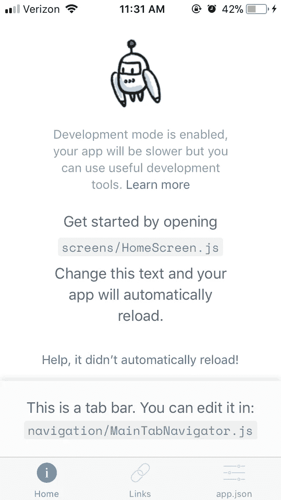
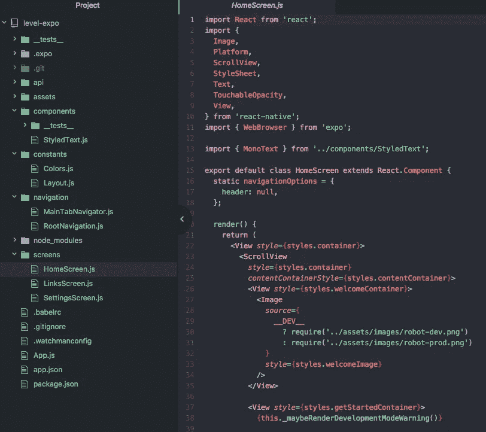
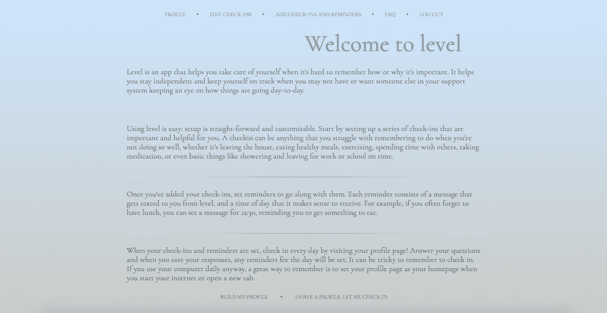
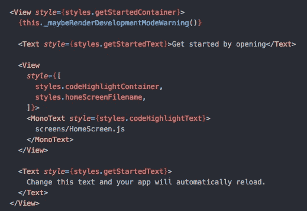
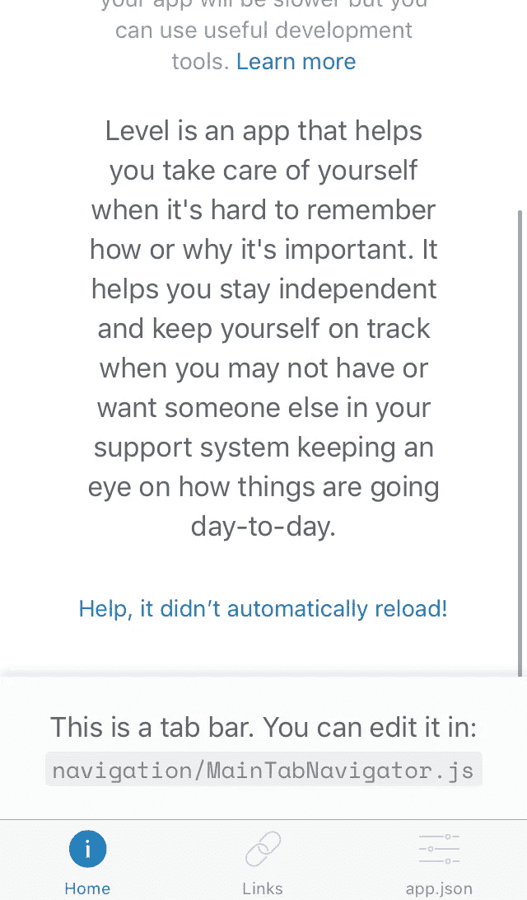
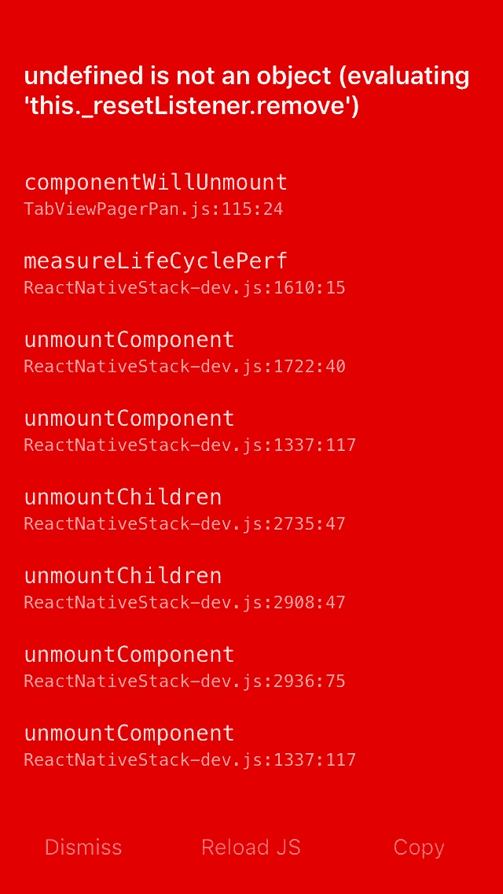
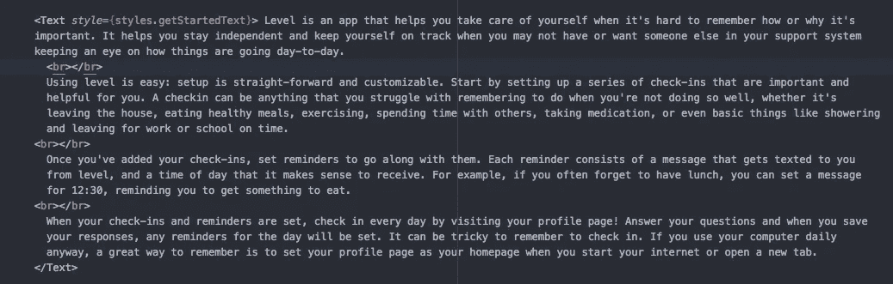
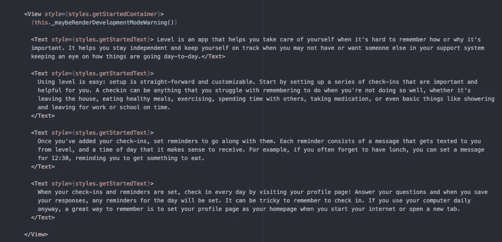
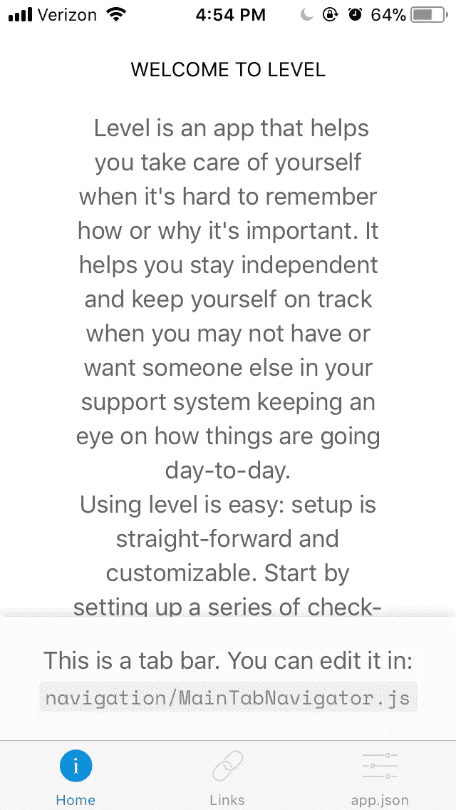

# 用 React Native 改造 web 应用程序，第 2 部分:表示组件和静态页面

> 原文：<https://medium.com/hackernoon/reworking-a-web-app-with-react-native-part-2-presentational-components-and-static-pages-d517884f53e5>

我已经花了近两个月的时间来开发一个 React web 应用程序，虽然它仍在开发中，但我想开始自学 React Native，并在开发过程中开发一个应用程序版本。你可以在第 1 部分中阅读更多关于开始安装 [React Native 的信息。](https://hackernoon.com/reworking-a-web-app-with-react-native-part-1-troubleshooting-set-up-cff77274a6fa)

在这篇文章中，我将以主页为例，重点介绍如何对我的应用程序进行基本更新。在我的 web 应用程序中，主页是几个表示组件，包括关于应用程序和导航栏的一些信息。

首先，我将处理主屏幕上的信息。我正在从事这个项目，已经熟悉了 React 的核心概念，并且已经构建了一个基本的 web 应用程序，所以对我来说，跟随搭建的 React 原生[代码](https://hackernoon.com/tagged/code)非常简单。在接下来的帖子中，我将更仔细地研究 React 和 React Native 之间的主要区别，以及如何战略性地创建组件，但就这篇帖子的目的而言，我真的只是要更新信息。

## 到目前为止有什么

现在，提醒一下，我用的是 Expo。这让我可以在手机上查看变化，而不是在电脑上使用 iOS 或 Android 模拟器，尽管这两种选项都可以。

这是创建新项目时的默认屏幕。



然后，我打开代码来看一看，开始研究哪些组件与哪些功能相关联，并开始计算接下来的步骤。



就像这样，组件和屏幕是有区别的。稍后我可能会重新构建我的文件，但是现在，我将继续使用这里的模式，只更新主屏幕文件。

最后，这是我的应用程序的网页版在欢迎页面上的样子。



我希望传达相同的信息(所有的文本都是相同的)，然后以一种有意义且易于阅读的方式设计它，我将在接下来的帖子中介绍这一点。

## 更新文本

首先，我只关注更新页面上的一些文本，在现有组件的结构内工作。

这部分文字对应以下手机截图。



我删除了那里的一些文本，并简单地将文本从我的 web 应用程序复制并粘贴到该位置。

我的屏幕没有自动重新加载。如果没有出现这种情况，您可以单击链接寻求帮助。链接建议下载 Watchman ( [，我已经安装了](https://hackernoon.com/reworking-a-web-app-with-react-native-part-1-troubleshooting-set-up-cff77274a6fa))或者直接关闭并重新打开应用程序。

这是第一次更新的诀窍。然后我摇了摇手机，打开了开发者菜单，禁用然后重新启用了实时重载。这解决了前进中的问题。



## 格式化注释

这里有一些关于如何用 React Native [格式化你的文本的很棒的文档。](https://facebook.github.io/react-native/docs/text.html)

我遇到的第一个问题是，当我试图在屏幕主体中添加更多文本时，这个非常红但不是特别有用的错误屏幕。



我意识到问题在于我使用了

标签来分割组件中的文本部分，如下所示:



其实我应该继续使用标签。稍后可以在下面添加格式和填充。



本质上，主屏幕(或任何静态屏幕)上的文本应该遵循类似这样的模式。

```
<View style={styles.container}>
        <ScrollView
          style={styles.container}
          contentContainerStyle={styles.contentContainer}>

   <View style={styles.welcomeContainer}>
       <Text> WELCOME TO LEVEL </Text>
   </View> <View style={styles.getStartedContainer}>
            {/* {this._maybeRenderDevelopmentModeWarning()} */} <Text style={styles.getStartedText}>Lorem ipsum dolor sit amet,    consectetur adipiscing elit, sed do eiusmod tempor incididunt ut labore et dolore magna aliqua. Ut enim ad minim veniam, quis nostrud exercitation ullamco laboris nisi ut aliquip ex ea commodo consequat. Duis aute irure dolor in reprehenderit in voluptate velit esse cillum dolore eu fugiat nulla pariatur. Excepteur sint occaecat cupidatat non proident, sunt in culpa qui officia deserunt mollit anim id est laborum.</Text> <Text style={styles.getStartedText}>Lorem ipsum dolor sit amet, consectetur adipiscing elit, sed do eiusmod tempor incididunt ut labore et dolore magna aliqua. Ut enim ad minim veniam, quis nostrud exercitation ullamco laboris nisi ut aliquip ex ea commodo consequat. Duis aute irure dolor in reprehenderit in voluptate velit esse cillum dolore eu fugiat nulla pariatur. Excepteur sint occaecat cupidatat non proident, sunt in culpa qui officia deserunt mollit anim id est laborum.</Text></View>
```

主屏幕组件中没有太多的函数，但是有一个我觉得没必要的是 _ maybeRenderDevelopmentModeWarning()。该函数负责检查 Expo 中是否启用了开发模式，并链接到有关它如何影响您开发应用程序的速度的信息。

为了编写高效的代码并立即删除不必要的代码行，我删除了它并注释掉了它在组件中的调用位置。我发现在使用搭建的应用程序时，一遇到多余的代码就删除是很有帮助的，尽管确保不在不明显的地方删除可能在程序中其他地方使用的函数是很重要的。

我还添加了一个快速标题(同样，没有任何真正的格式)并去掉了图像图标。我计划创建我自己的设计，以后再添加进去，但是现在，我主要关心的是在页面上获取信息。

## 最后，我所有的文本都显示在屏幕上！



差不多就是这样了！在屏幕上更新最简单的演示信息并不太困难，这是一个很好的起点。

## 在以后的文章中

1.  对使用 React 与 React Native 构建组件和结构化文件之间的差异进行了更深入的研究
2.  导航栏
3.  形式
4.  式样

## 资源

[](http://www.reactnativeexpress.com/quick_start) [## React 本机 Express

### 通过互动的例子学习母语反应。

www.reactnativeexpress.com](http://www.reactnativeexpress.com/quick_start)  [## 快速入门|博览会最新文档

### 这些是世博会的文件。Expo 是一套工具、库和服务，可以让你构建本地 iOS 和 Android…

docs.expo.io](https://docs.expo.io/versions/latest/index.html) [](https://facebook.github.io/react-native/docs/text.html) [## 文本反应原生

### 使用 React 构建原生应用的框架

facebook.github.io](https://facebook.github.io/react-native/docs/text.html)