# 在 Elm 重写 ThoughtWorks 技术雷达

> 原文：<https://medium.com/hackernoon/rewriting-the-thoughtworks-tech-radar-in-elm-41a4e8244a13>

不久前, [ThoughtWorks](https://www.thoughtworks.com/radar) 发布了一个[开源库](https://github.com/thoughtworks/build-your-own-radar),任何人都可以拥有自己的[技术](https://hackernoon.com/tagged/technology)雷达。

我很好奇这家著名的公司是如何实现它的，奇怪的是，我注意到了很多让我想起 Java 的概念，比如**有状态对象**和使用 **try/catch/exception** 的错误处理。

应用程序真正做的只是接受一个输入并产生一个技术雷达。Java 风格的方法似乎不适合那个用例，所以我决定在 [Elm](https://hackernoon.com/tagged/elm) 中重写一些！

# 步骤 1:建立雷达模型

让我们从思考如何对雷达本身建模开始。如果我们仔细地为我们的问题建模，它可以简化我们面前的工作。

首先让我们考虑一下我们对数据的了解。雷达分为*四个象限*和*四个圆环*。这些象限和圆环代表几个*光点*可以被放入的不同类别。

因为我们知道只有四个象限和环，所以让我们将它们表示为**联合类型**。

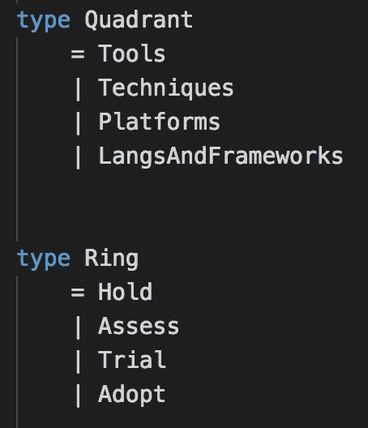

到目前为止一切顺利。接下来是光点。

对信号建模需要一些额外的思考，因为信号有两种表现形式。

第一个表示是来自 Google Sheet 的 blip 数据([示例](https://docs.google.com/spreadsheets/d/1waDG0_W3-yNiAaUfxcZhTKvl7AUCgXwQw8mdPjCz86U))。包含的信息有**名称**、**环**、**象限**、一个**新**标志和一个**描述**。

雷达上显示的光点需要同样的 5 个属性，但是为了在雷达上显示，它们还需要一个 **x-y 位置**。

模拟这些信号的几种方法包括:

*   **将所有属性放入一条记录中，并将位置字段的类型设为 *Maybe* 。**该选项使用较少的类型，但将不可避免地导致更多的*可能处理*。
*   **将谷歌地图上的光点作为一种独特的类型，并记录雷达上显示的光点。**该选项删除了*可能的冗长性*，但代价是*在两个单独的记录字段中复制数据*。
*   由于雷达信号的属性是来自 Google 工作表的信号的超集，我们可以用成分来表示数据。一个定位在雷达上的光点除了有一个确定的位置外，还会有 Google Sheet 的光点数据。

还有其他值得考虑的选项，尤其是利用联合类型的选项，但是第三个选项现在已经足够了，如果需要，我们可以在以后进行重构。

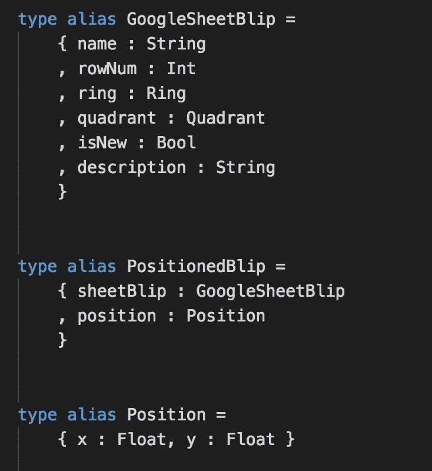

接下来是可视化雷达。

*如果你想知道与 ThoughtWorks 的开源例子相比，我们做得怎么样，那就转到他们的* [*OO 等效建模*](https://github.com/thoughtworks/build-your-own-radar/tree/master/src/models) *。*

# 第二步:想象雷达

现在我们已经有了构建视图的基本构件，让我们开始构建雷达可视化。

我想做的第一件事是让象限和环可视化。我们将大量使用 SVG，并借鉴 ThoughtWorks 开源项目中的许多样式。我相信他们不会介意的。

**创建圆弧**

雷达不是一个圆。严格来说是四个四分之一圆加在一起，也就是弧线。

SVG 中的圆并没有那么难。另一方面，弧线相当复杂。这里有一个演示来说明我的意思。

随着上述代码的运行，它将被转移到一个实用模块中，这样我们就不必考虑在 SVG 中创建 arc 的实现细节。

**可视化象限**

可视化一个象限只需要我们可视化 4 个弧(环)，每个弧有不同的半径。

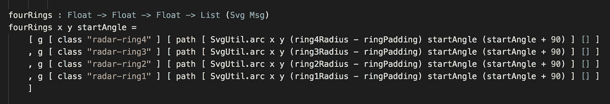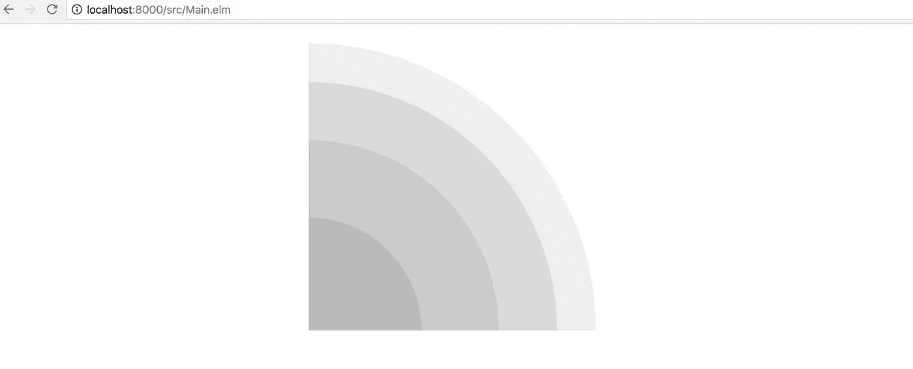

还不错。如果我们这样做三次以上，并提供不同的数字，我们得到整个雷达背景。

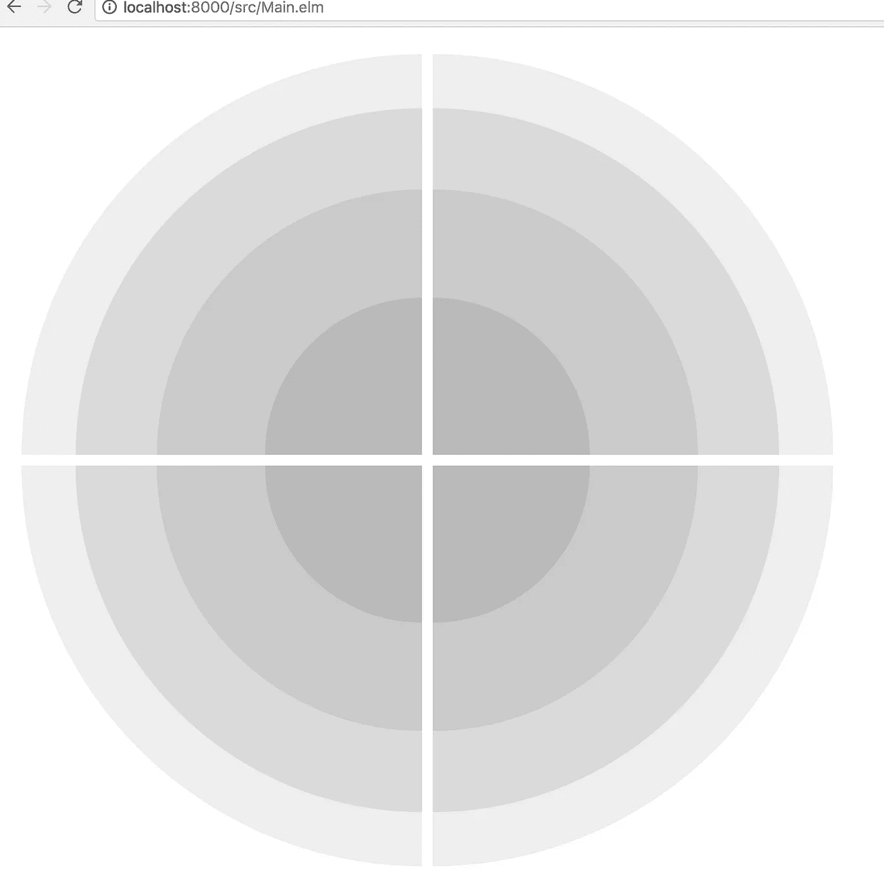

**可视化光点**

由 **isNew** 标志决定，有两种类型的光点可以被可视化。一个是圆角三角形，另一个类似于模糊的圆形。


我将简单地将 ThoughtWorks 的[代码](https://github.com/thoughtworks/build-your-own-radar/blob/master/src/graphing/radar.js#L105-L109)转录到 Elm 中，用于这些图像可视化。

..更多的 SVG 实现细节，我们不会再看到了。

接下来，可视化雷达上的模拟光点。

# 步骤 3:用模拟数据连接视图

在我们使用来自 Google 表单的实际数据之前，我们将模拟一些数据，以确保我们的信号在雷达上正确显示。

上述功能是暂时的，但它将在雷达上产生 16 个光点，每个象限的每个环一个。然而，这带来了一个问题，即究竟在哪里定位这些光点。

我继续往前走，偷看了一下 [ThoughtWorks 是怎么做的](https://github.com/thoughtworks/build-your-own-radar/blob/master/src/graphing/radar.js#L135-L154)。简而言之，它们产生一条正弦曲线，一个光点将被定位在该曲线上，如果它与另一个光点碰撞，它将尝试这条曲线上的另一个随机位置。

我们可以在 Elm 中做同样的事情，但这带来了一个有趣的话题..**如何用纯函数式语言做随机性？**

*<快速迂回>*

**带有发生器的纯随机性**

在 Elm 中，每个函数都是纯函数。为了产生随机性，我们可以让 Elm 为给定的种子生成一个随机值。一个随机值和另一个种子被返回，这样我们可以使用那个种子来请求更多的随机值。

然而，如果我们产生许多随机值，那么管理这些种子就变得非常乏味，并且容易出错。

幸运的是，Elm 给了我们一个**生成器**的概念。根据它的文档，*生成器就像一个生成某些随机值的配方。*

这里有一个示例生成器，可以用来生成从 3 到 7 的随机整数。

```
Random.int 3 7
```

这是另一个生成器，用于生成 100 以下的偶数值的随机列表。

简单地创建一个生成器实际上不会产生一个随机值。还是要传给`Random.step`。

```
(randomEvens, nextSeed) =
    Random.step (generateEvenValues 10) (Random.initialSeed 123)
```

有了这些知识，我们可以组成几个生成器，沿着正弦曲线随机定位光点，并在发生碰撞时继续产生值。这将与 ThoughtWorks 算法的行为相同，并且它也是我们将`List GoogleSheetBlip`转换为`List PositionedBlip`的地方。

[带有发电机的随机定位信号](https://github.com/ckoster22/techRadar/blob/blogpost/src/Page/Radar.elm#L367-L467)

我意识到我们用发电机在大约 90 秒内从 0 加速到 60。如果上面的代码不能立即理解，不要担心。像 Elm 一样，它最初是陌生的，但是很快就变成了阅读代码的第二天性。

*</快速迂回>*

**随机显现的光点**

当我们将本节开头的模拟数据运行到我们的视图函数中时，我们会得到一个雷达图。

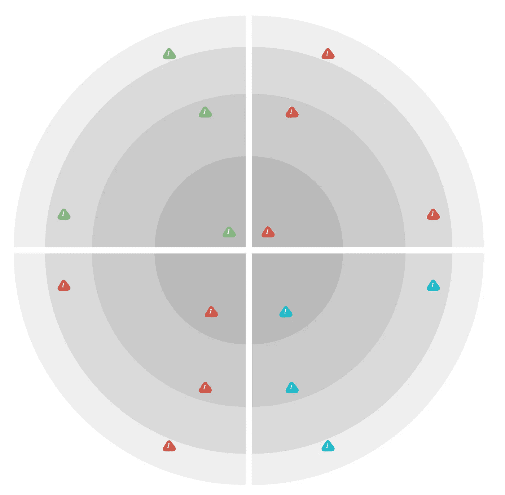

此时，我们可以继续向雷达发送数据，并验证用于确定光点位置的算法正在工作。

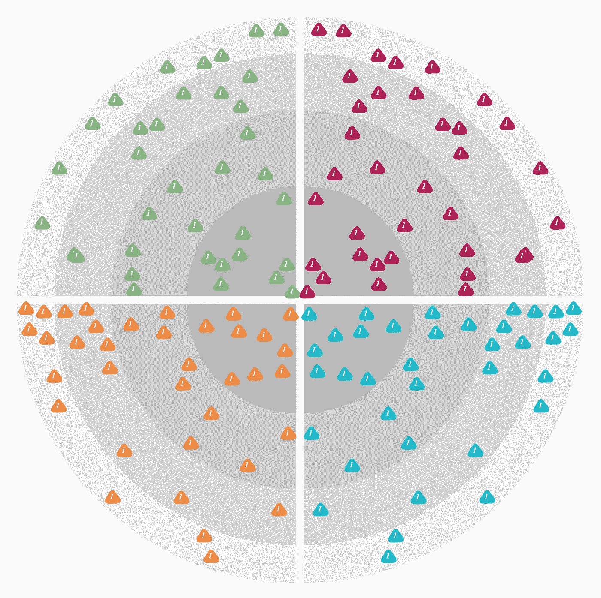

这里的定位似乎很合理。继续前进。

*如果你正在跟踪进度* [*这里是 ThoughtWorks 如何做同样的事情*](https://github.com/thoughtworks/build-your-own-radar/blob/master/src/graphing/radar.js) *。同样值得注意的是，雷达是沿 y 轴镜像的，因为我们对随机种子进行了硬编码。那很好。*

# 步骤 4:对应用程序状态建模

和以前一样，对应用程序状态建模非常重要。在编写自己的 Elm 应用程序时，值得停下来，讨论和考虑如何对数据建模的权衡。

对于这个应用程序，我们已经有一个雷达，但我们缺少一个页面来输入谷歌表的网址。

我选择这样对页面状态建模:

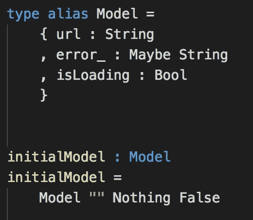

它将有一个初始 url 为空的表单。该表单可能有一个错误，我们想知道我们是否正在积极检索谷歌表。这种方法有[种替代方案](http://package.elm-lang.org/packages/krisajenkins/remotedata/4.3.0/RemoteData#RemoteData)，但是我们现在将坚持使用这三种属性。

这涵盖了我所谓的*登陆页面*。最后，还有需要提供给 Elm 架构的**模型**。

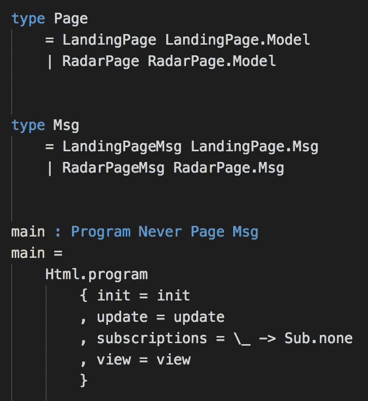

这大致基于 Richard Feldman 的 SPA 示例，除了为了简单起见删除了一些内容，比如不处理这样一个小应用程序的路由。

需要指出的是，在较高层次上，该应用程序处于两种状态之一:

1.  我们在登录页面上，正在与 url 输入表单进行交互
2.  我们在雷达页面上与科技雷达互动

# 步骤 5:用户输入、正则表达式、数据检索和错误处理

登陆页面包括**接收来自用户的输入**，**解析出一个 Google Sheet ID** ，**执行一个 HTTP 请求**，**解析响应**，以及**处理所有这些情况下的错误**。我将跳过用户输入部分，因为如果您已经做到这一步，您已经知道如何做了。

*如果我错了，并且在 Elm 中处理用户输入对你来说是新的，我建议暂停并检查* [*这个例子*](http://elm-lang.org/examples/websockets) *。*

**Elm 中的正则表达式**

我们又要从 0 加速到 60 了。坚持住。

用户将向我们提供他们发布的 Google Sheet 的链接，如"[https://docs . Google . com/spreadsheets/d/11fd 0 wnie us 2 ymxneitfpm 5 coqhqbmuoid 8 tjrqhdn 0/edit？usp =共享](https://docs.google.com/spreadsheets/d/11Fd0lwNIEUs2ymxNEiTfpM5CoQHQbMuOId8TjrQHDn0/edit?usp=sharing)"。

隐藏在这个 URL 中的是一个 ID，我们需要它来执行 HTTP 请求。就是“/d/”和“/edit”之间那个不可读的字符串？。

首先，我们将声明一个查找 ID 的正则表达式。不言而喻，这个正则表达式的功劳又归于 ThoughtWorks。

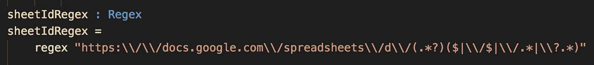

正则表达式中有组，我们特别关心第一个组。

为了对字符串应用正则表达式，我们使用了`find`函数。

```
matches =
    find All sheetIdRegex url
```

它返回一个匹配列表，其形状如下。

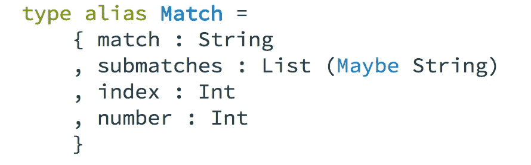

我们的 Google Sheet ID 隐藏在`submatches`列表中。所以我们要做的是从`find`返回的匹配列表中获取第一个匹配，并在第一个匹配中找到它的`submatches`中的第一个条目。

如果你以前和 Elm lists 和`List.head`合作过，你可能已经意识到我们将首先进入*梅伯兰*。多亏了[elm-community/maybe-extra](http://package.elm-lang.org/packages/elm-community/maybe-extra/latest)，提取 ID 并生成结果的代码并不太糟糕。

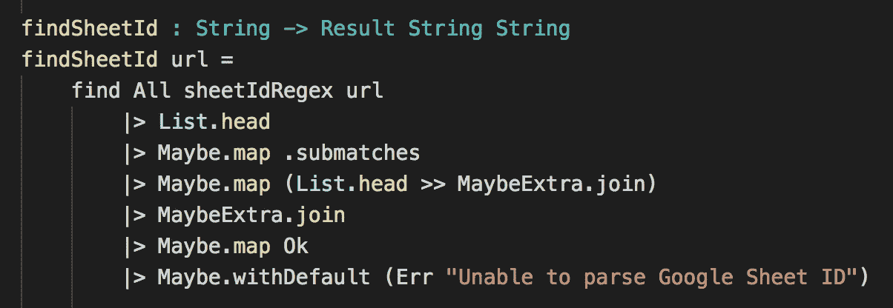

第一个`MaybeExtra.join`折叠了当你在一个可能列表上做`List.head`时出现的双重可能。然而，它仍然是从`Maybe.map`返回的一个 Maybe，所以第二个`MaybeExtra.join`在把它转换成结果之前再折叠一次。

**检索谷歌表单数据**

一旦我们有了 ID，我们就可以请求以 CSV 格式检索 Google 工作表数据。

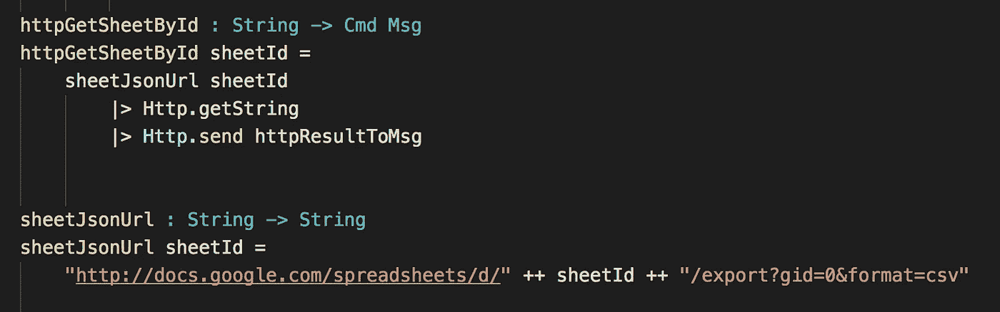

当执行这个命令时，它将调用`httpResultToMsg`并给出结果。

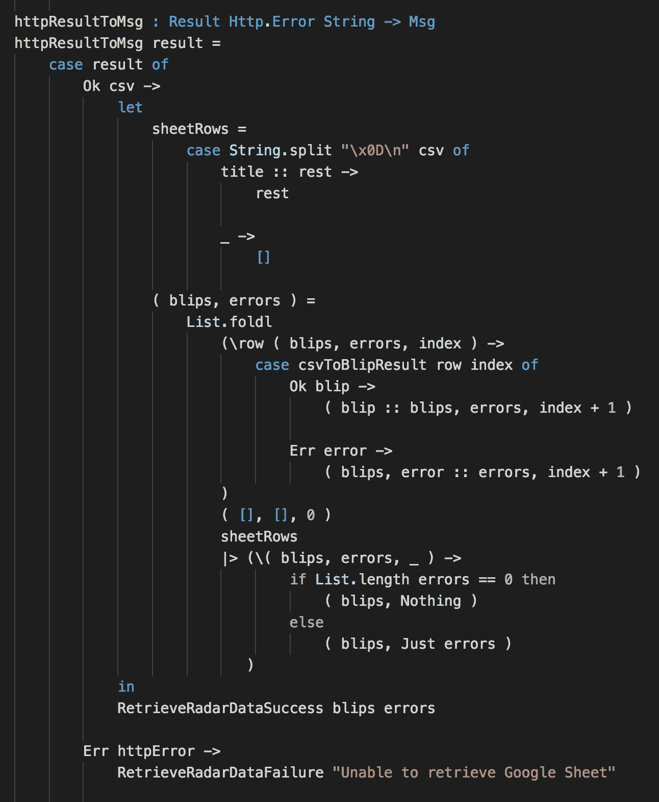

上述函数执行以下操作

1.  成功时，用新的行分割字符串
2.  遍历每一行，尝试将 CSV 解析为一个信号
3.  成功解析数据会将其放入`blips`列表，而解析错误会添加到`errors`列表。
4.  发送一条包含信号和任何错误的消息

解析每个 CSV 行就像尝试将数据映射到我们之前定义的数据模型一样简单。

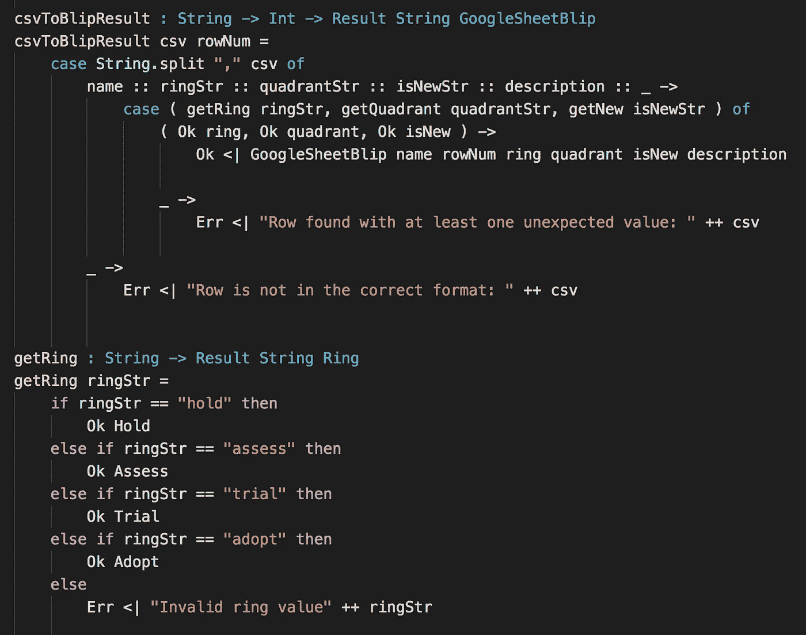

# 结论

这篇文章越来越长，所以我将通过重写 ThoughtWorks Tech Radar 中的一些观察来结束这篇文章。

BYO 雷达项目使用[机会](https://www.npmjs.com/package/chance)用于[随机性](https://github.com/thoughtworks/build-your-own-radar/blob/0935381d4ea82f69b098afe65e93d248bd69d60d/src/graphing/radar.js#L135-L148)， [d3](https://www.npmjs.com/package/d3) 用于图形和 HTML 模板化，[桌面](https://www.npmjs.com/package/tabletop)用于[解析](https://github.com/thoughtworks/build-your-own-radar/blob/e95bf099d3d1534224de91971b6def5cc315a6bd/src/util/factory.js#L63-L114) Google Sheets。它使用[有状态对象实例](https://github.com/thoughtworks/build-your-own-radar/tree/0935381d4ea82f69b098afe65e93d248bd69d60d/src/models)来建模其数据，并结合了[异常处理](https://github.com/thoughtworks/build-your-own-radar/tree/e95bf099d3d1534224de91971b6def5cc315a6bd/src/exceptions)而不是优雅地处理错误。

**最重要的是，在花了这么多时间编写代码之后，我仍然不明白大部分代码是做什么的。**代码相当复杂，即使理解了期望的行为，也很难跟踪实现细节。

另一方面，使用 Elm 的函数式方法产生了具有相似功能的更容易理解的代码。事实上，一旦你掌握了 Elm 处理随机性和正则表达式的方式，你就会意识到代码也简单多了。

要查看实际的部分重写，请查看以下两个链接:

[http://ckoster22.github.io/elmradar/](http://ckoster22.github.io/elmradar/)

[https://github.com/ckoster22/techRadar/tree/blogpost](https://github.com/ckoster22/techRadar/tree/blogpost)

[](http://bit.ly/HackernoonFB)[](https://goo.gl/k7XYbx)[](https://goo.gl/4ofytp)

> 黑客中午是黑客如何开始他们的下午。我们是这个家庭的一员。我们现在[接受投稿](http://bit.ly/hackernoonsubmission)并乐意[讨论广告&赞助](mailto:partners@amipublications.com)机会。
> 
> 如果你喜欢这个故事，我们推荐你阅读我们的[最新科技故事](http://bit.ly/hackernoonlatestt)和[趋势科技故事](https://hackernoon.com/trending)。直到下一次，不要把世界的现实想当然！

