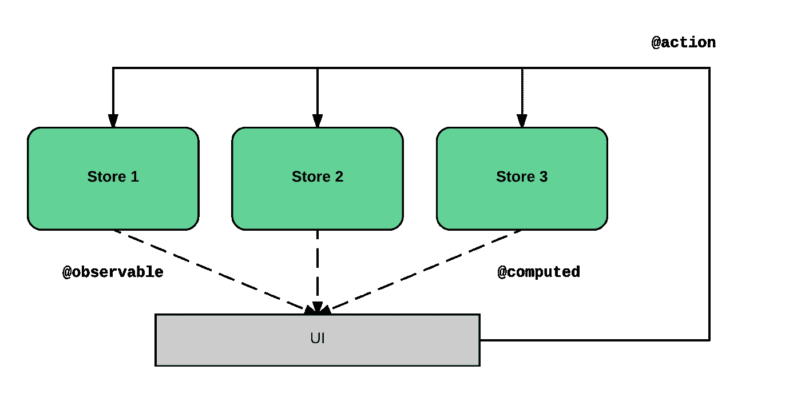
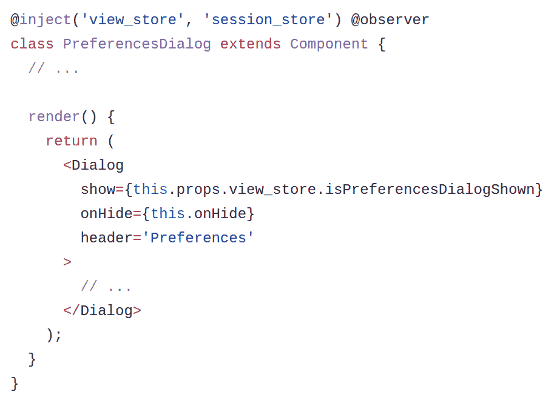
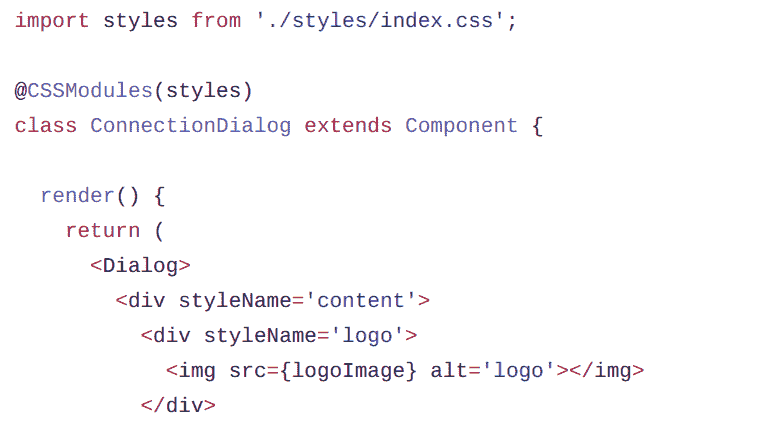
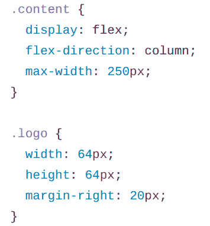
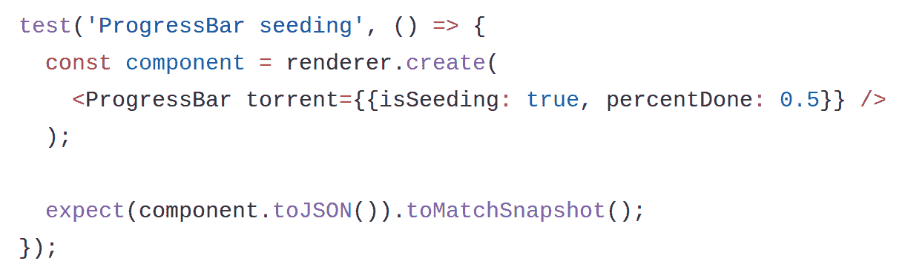
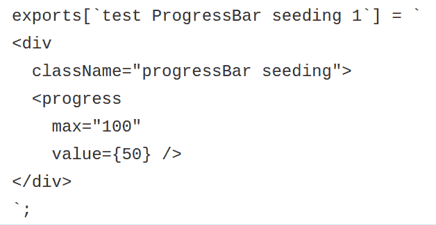
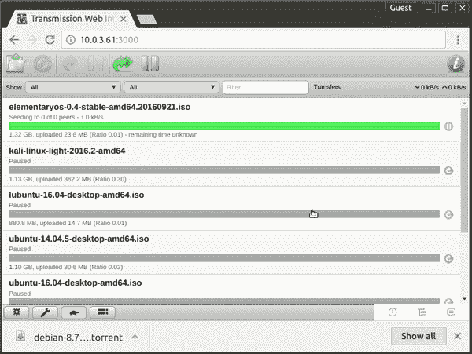

# 用 React 重写传输 UI

> 原文：<https://medium.com/hackernoon/rewriting-transmission-ui-with-react-8f76c44c1c54>

我记得大约两个月前，我和 Eduardo Lanchares 谈论下一个 webapp 的最佳堆栈。有时候你在工作，你被当前的框架设置和[工具](https://hackernoon.com/tagged/tools)所困扰，这些很难改变或重构。这迫使你总是以同样的心态工作，不允许你测试解决问题的新方法。

遵循我们学习新东西以使我们的生活更轻松的愿望，我们想尝试新的[技术](https://hackernoon.com/tagged/technology)来构建一个附带项目，该项目具有更好地满足应用程序需求的全新堆栈。

在同一周，我的一个朋友谈到了 Transmission 的 web 客户端中影响他的一个 bug。这个 [bug](https://trac.transmissionbt.com/ticket/5857) 正在影响更多的人，因为我们在 2 年前的追踪器中发现了一个公开的 bug 报告。我们决定检查源代码并尝试修复它，因为我们认为这是小菜一碟。但是几个小时后，我们发现这并不像我们预期的那么容易，在某个时候我们放弃了。

考虑到所有这些事情，我们有了一个完美的场景和借口开始玩一个新的副业项目。我们决定从头开始构建一个新的界面，以理解新的模式、新的方法，并发现*终极界面*的下一个挑战。

# 我们的实验堆栈

回顾当前 Transmission web 客户端中的所有功能，我们选择的堆栈是 React 用于用户界面，Mobx 用于状态管理，CSS 模块用于所有与应用程序风格相关的内容，新的构建过程由 Webpack 管理。

另一方面，考虑到上面的内容，我们决定使用一些最佳实践来保证这个项目的长期质量。其中一些是像一套严格的 Eslint 规则、单元测试、UI 测试和国际化。

通过这一决定，我们希望实现更可靠的接口、更好的性能、安全性和正确性。总之，维护这个 web 应用程序的更好的方法。

在接下来的部分中，我们将讨论开发原始传输源代码的方式和我们的方法之间的差异。好奇的话可以查一下[原码](https://github.com/transmission/transmission/tree/master/web)和[我们码](https://github.com/fcsonline/react-transmission)。

# 成分

就应用程序模块化而言，最初的客户端是用一组加入到单个静态 HTML 文件中的*视图*实现的。jQuery 代码修改了这些视图以保持更新。虽然这种方法像预期的那样工作，但它的缺点是会生成多个 DOM 更新，这会影响 UI 性能。此外，在这个文件中使用硬编码的字符串使得支持 I18n 和动态内容生成变得困难(例如当显示可用的[速度限制](https://github.com/transmission/transmission/blob/master/web/index.html#L380)时)

我们的新应用程序将每个组件存储在一个独立的文件夹中，其中包含所有相关的内容。像样式、测试或子组件这样的东西是共存的。这让我们可以管理所有的应用程序组件，了解它们之间的所有依赖关系，并尽可能实现最佳的解耦。

# 状态管理

在用 jQuery 实现的传统 web 应用程序中，在意识到一些元素已经过时后，您需要手动更新所有的 UI。这些变化通常来自一些用户交互或服务器更新，所以应用程序状态的概念几乎不存在。

使用 React 和 Mobx 管理的新堆栈，我们遵循*单向数据流*约定，这使得推断应用程序状态变得更加容易。所有这些状态都在名为 stores 的 Mobx 容器中进行管理。这是理解其工作原理的一个很好的图表:

Mobx 使用以下主要概念来建模您的应用程序状态:

*   `observable`属性:基本跟踪属性
*   `computed`属性:从可观察的事物中导出的属性
*   `actions`:更新状态的方法
*   `reactions`:每次状态变化要执行的副作用

例如，在下面的例子中，当我们点击 preferences 按钮时，我们发送一个更新`isPreferencesDialogShown` observable 属性的动作。这种变化会导致观察者组件的更新。在这种情况下,`PreferenceDialog`对这种变化做出反应，并重新呈现自身，从而在 UI 中显示对话框。

# 式样

很长一段时间以来，我们一直通过元素中的类属性引用的 CSS 类列表来设计 HTML 组件的样式。在过去的 5 年中，新的工具已经出现，以改善我们的生活，如 SASS，LESS 或 CSS 模块。

如果你习惯于编写大量的组件，你可能会犯一个常见的错误:为不同的组件重用样式类。但是当这些组件的风格开始不同时会发生什么呢？你有麻烦了。

如前所述，在我们的堆栈中，我们决定使用 CSS 模块来设计所有组件的样式。我们认为这是实现模块化和可重用类集的最佳方法。每个组件所需的所有类都在一起。就可维护性而言，这确实很好，因为对组件进行解耦很简单。CSS 模块让你玩组合，这样你就可以从两个世界获得最好的特性。

正如你在下面的例子中看到的，我们使用了两个 CSS 模块引用，分别叫做`content`和`logo`。这些名称用于引用样式表文件中的类。

反应过来看`ConnectionDialog/index.js`:

样式文件`ConnectionDialog/styles/index.css:`

# 试验

最初的应用程序根本没有测试，所以我们很容易在这方面进行改进。

在新的应用程序中，我们不仅要测试业务逻辑，还要测试 UI。为此，我们选择了 [Jest](https://facebook.github.io/jest/) 框架和*快照*测试技术。这样我们就能确保每个组件都能呈现出预期的效果。这很重要，因为大多数组件都包含几个路径，我们需要确保每个路径都被覆盖。

将这组新的测试集成到一些 CI 中，我们可以对应用程序的未来更改更有信心。

正如我们在这个例子中看到的，我们用模拟的种子数据渲染进度条组件。

然后使用快照技术，我们可以确保渲染结果与之前的快照相比是我们所期望的。以这种方式测试组件是一个像记录 JSX 代码一样简单的过程。

# 额外功能

回顾原始传输 web 界面中的所有可用功能，我们发现了桌面通知等不完善的功能。我们想恢复它们，因为我们认为这是一个非常好的功能。

此外，一个额外的功能，新的界面包括拖放文件支持种子文件。这增强了快速添加 torrent 文件的常见用例，如下例所示:

# 结论

我们启动这个项目是为了尝试新技术，以便能够理解如果您选择某个特定的堆栈，一个更大的项目将会面临的所有挑战。在某个时候，我们看到了实现包含在原始界面中的新特性是多么容易。所以我们决定向前推进，并设定一个个人目标:实现所有的目标。今天，我们可以说我们已经实现了 95%的功能。

我们的最后一个目标是将这个项目提交给社区进行评估。我们决定尽可能尊重原始界面，主要有两个原因:

*   我们不想在 UI 设计中引起争论。所以我们决定遵循当前的设计，我们只是想提出一个新的代码架构。
*   我们不想在考虑将这些代码包含在主传输库中的情况下影响最终用户。

最后，即使这个项目消失了，不管出于什么原因，我们还是很开心，因为在它的开发过程中，我们学到了很多东西，度过了一段非常愉快的时光。:D

你可以在这里查看源代码:

 [## FCS online/反应式传输

### React-Transmission-React Transmission 是正在进行的 Transmission web 接口的再实现。

github.com](https://github.com/fcsonline/react-transmission) 

*如果你喜欢这篇文章，请点击下面的* ❤️ *按钮，关注这篇文章，这样你就不会错过。*

> [黑客中午](http://bit.ly/Hackernoon)是黑客如何开始他们的下午。我们是 [@AMI](http://bit.ly/atAMIatAMI) 家庭的一员。我们现在[接受投稿](http://bit.ly/hackernoonsubmission)并乐意[讨论广告&赞助](mailto:partners@amipublications.com)机会。
> 
> 如果你喜欢这个故事，我们推荐你阅读我们的[最新科技故事](http://bit.ly/hackernoonlatestt)和[趋势科技故事](https://hackernoon.com/trending)。直到下一次，不要把世界的现实想当然！

