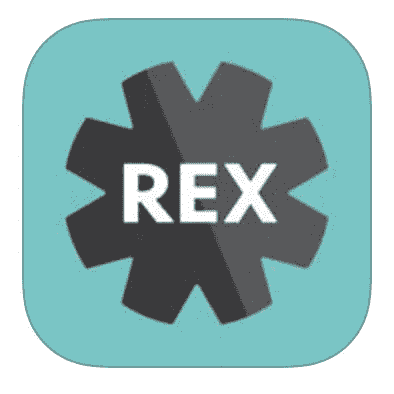
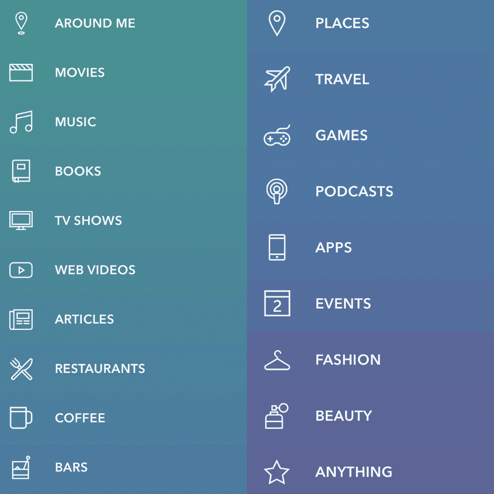

# REX——我们期待已久的推荐应用

> 原文：<https://medium.com/hackernoon/rex-the-recommendation-app-we-have-been-waiting-for-e3640975d3fd>

你有没有去过一个很棒的餐厅，读过一本很棒的书，或者喝了一杯最好的咖啡却不知道如何与大家分享你的想法？我们大多数人会求助于推特或脸书来分享我们的伟大发现。但是，如果有一个专门为此开发的应用程序呢？

我一直在寻找这样的应用程序，因为我总是想与家人和朋友分享我的伟大发现或发现。幸运的是，多亏了 REX，我再也不用去搜索这样的应用了。

REX 让用户能够推荐他们能想到的任何东西(电影、[书籍](https://hackernoon.com/tagged/books)、餐馆、电视节目、咖啡、文章、酒吧等)。这不是典型的“签到”或审核应用程序。这是严格地分享任何你想与你的朋友分享的建议。

当你下载应用程序时，它会要求你输入邀请码。(我用谷歌搜索了一下，很容易就找到了。)一旦你进入，你将创建一个个人资料。这非常类似于 Twitters 设置，他们建议人们跟随。从那时起，你将开始推荐。我将以我的个人资料为例。

我认为这个应用程序设置得非常干净，使用起来非常简单。你所要做的就是点击“+”，它会向你显示不同类型的类别。类别将会打开，供您搜索。我得到的最后一个推荐是《饥饿游戏》三部曲。我能够在一次推荐中找到所有三本书。我主要用它来看电影，但是我发现每当我尝试新的东西时，我想推荐更多。

我买这个应用已经一个多星期了，我已经把它放在了我的第一个应用页面上。我发现自己想要更多地使用它，所以我知道它会持续很长一段时间。我有一些朋友现在也在用它。用户可以看到你朋友推荐的活动提要。这是发现更多信息的好方法。

我可以继续谈论这个应用程序，但我认为你应该自己尝试一下，看看你是否会像我一样爱上它。

这里下载 app[http://www . rex . is](http://www.rex.is)

> [黑客中午](http://bit.ly/Hackernoon)是黑客如何开始他们的下午。我们是 [@AMI](http://bit.ly/atAMIatAMI) 家庭的一员。我们现在[接受投稿](http://bit.ly/hackernoonsubmission)并乐意[讨论广告&赞助](mailto:partners@amipublications.com)机会。
> 
> 如果你喜欢这个故事，我们推荐你阅读我们的[最新科技故事](http://bit.ly/hackernoonlatestt)和[趋势科技故事](https://hackernoon.com/trending)。直到下一次，不要把世界的现实想当然！

