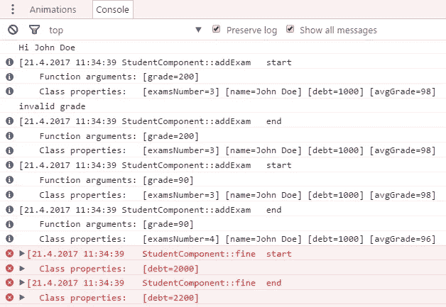
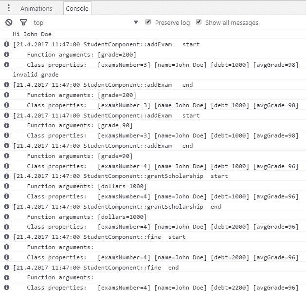

# 丰富的 Typescript Logger Decorators 便于编码

> 原文：<https://medium.com/hackernoon/rich-typescript-logger-decorator-for-easy-coding-fc2ff73684c6>

***这篇*文章** ***原本出现在***[***dormoshe . io***](https://dormoshe.io/articles/rich-typescript-logger-decorators-for-easy-coding-5)

你在为你的函数写日志上浪费了多少时间？有多少次你改变了你的函数名，却忘了在日志消息中改变名字？有多少次你发现自己后悔没有添加一个日志来知道函数是否被调用？

**不再有**遗憾，**不再有**忘记，**不再有**浪费时间——只需使用神奇的打字稿功能——装饰者。

在本文中，我们将回顾 rich logger decorators 和它们的酷选项。在不久的将来，我将发表另一篇文章来解释如何构建这样的装饰器。

# TL；速度三角形定位法(dead reckoning)

你可以在我的 GitHub [资源库](https://github.com/dormd/rich-logger-decorator)中找到装饰器，并通过 [npm](https://www.npmjs.com/package/rich-logger-decorator) 使用它们。如果有进一步的改进，请提出拉取请求。

## 装置

`npm i rich-logger-decorator`

## 基本用法

在这个例子中，我们将只使用`ClassLogger`装饰器来记录所有的类方法。

Basic example

控制台看起来像这样:

Basic example output

## 混合装饰和选择

在这个例子中，我们使用带有默认选项的`ClassLogger` 和`DiableMethodLogger` 装饰器和带有定制选项的`MethodLogger`装饰器。

Mixed example

控制台看起来像这样:

Mixed example output

# @Logger 装饰者

伐木工是主要的装饰者。如果我们想精确一点，这是一个装饰工厂，因为这个函数正在获取一个参数并返回一个函数，但它不是主题。Logger decorator 需要位于您想要记录的函数之上。日志消息将在功能开始之前和功能结束之后打印。这个装饰器可以获得定义流行为的选项，并最终影响日志消息。

当选项不提供时，装饰器使用 defaultFunctionLoggerOptions 对象。这些选项由 FunctionLoggerOptions 接口定义。

## FunctionLoggerOptions

这是 Logger decorator 选项参数的接口。

Function logger options interface

如您所见，该接口包含一些属性。

*   **withArgs** —该属性可以是布尔值或字符串数组。当值为 ***false*** 时，参数及其值将不会成为日志消息的一部分。当值为 ***真*** 时，所有的自变量及其值都将成为日志消息的一部分。当值是字符串 的 ***数组时，数组中包含的参数名称将成为日志消息的一部分。***
*   **withTime** —当值为真时，时间将成为日志消息的一部分。
*   **withClassProperties** —当值为 ***true*** 且函数是类的方法时，类属性及其值将成为日志消息的一部分。该选项也可以是类的属性名 的 ***数组(行为与`*withArgs*`相似，只是针对类属性)。***
*   **log function**—替代传统`console.info`的功能。这个函数将在原始函数开始和结束时用日志消息来调用。
*   **formatAndLogFunction** —获取装饰器流的结果字符串并记录定制消息的函数。此函数获取时间、类名(如果存在)、函数名、开始/结束日志、参数及其值的字符串数组以及类属性及其值的字符串数组。

所有选项都是可选的。

## DefaultFunctionLoggerOptions

defaultFunctionLoggerOptions 是一个具有 LoggerOptions 默认值的对象。默认值为:

*   **withArgs** —真
*   **withTime** —真
*   **with class properties**—false
*   **log function**—console . info 函数
*   **formatAndLogFunction**—无默认值。当值不存在时，默认行为发生。

# @ClassLogger decorator

由类使用的**类记录器**。当您将装饰器放在类定义的顶部时，类中的所有方法都会被自动记录。这是如此方便，把装饰和观看神奇的事情发生。

作为 **Logger** decorator，decorator 可以获得定义流行为并最终影响日志消息的选项。
当选项不提供时，装饰工使用的`defaultClassLoggerOptions`。选项由`ClassLoggerOptions`界面定义。

## ClassLoggerOptions

这是**类记录器**装饰选项参数的接口。

Class logger options interface

如您所见，该接口包含一些属性。

*   **method options**—修饰类的方法的选项。与 Logger 函数装饰器的选项相同。
*   **logged method names**—正在记录的方法名称的数组。当该选项未定义时，将记录所有的类方法。

所有选项都是可选的。

## DefaultClassLoggerOptions

`defaultClassLoggerOptions`是一个对象，默认值为`ClassLoggerOptions`。默认值为:

*   **方法选项**—与函数装饰器的`defaultLoggerOptions`相同。
*   **logged method names**—未定义(因此所有的类方法都将被记录)

# 附加装饰者

为了更方便的使用，我们将看到两个装饰者，让我们的生活更容易。

## @DisableLogger 装饰者

当你使用 **ClassLogger** decorator(没有方法数组选项)时，所有的类方法都会被记录。为了禁用被记录的特定方法，您可以将**disable logger**decorator 放在方法定义之前。与方法数组选项相比，这是防止记录器行为的一个更清晰的方法，因为第二个选项限制我们在数组中写入方法名。

## @LoggerWithoutArgs decorator

这个 decorator 是 Logger decorator 的语法糖，其*的 Args* 选项为 false。也就是说，参数及其值不会成为日志消息的一部分。如果将提供其他选项，装饰者将使用它们，除了带有 Args 的*选项。*

# 结论

装饰器可以通过 NPM[**rich-logger-decorator**](https://www.npmjs.com/package/rich-logger-decorator)包使用。从现在开始，日志功能比以往任何时候都更容易使用。你所需要的就是使用 rich-logger-decorator，就这样。您可以用选项配置装饰器，只需编码…

文章的下一部分可以在这里找到[。](/@6107923b20dc/4a7e776b22a6)

***你可以关注我的***[***dormo she . io***](https://www.dormoshe.io)***或者***[***Twitter***](https://twitter.com/DorMoshe)***阅读更多关于 Angular、JavaScript 和 web 开发的内容。***