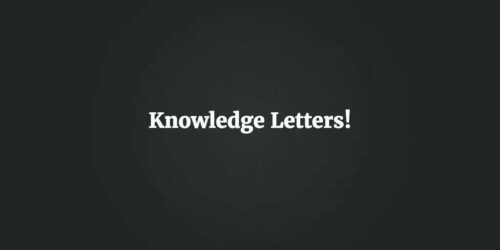
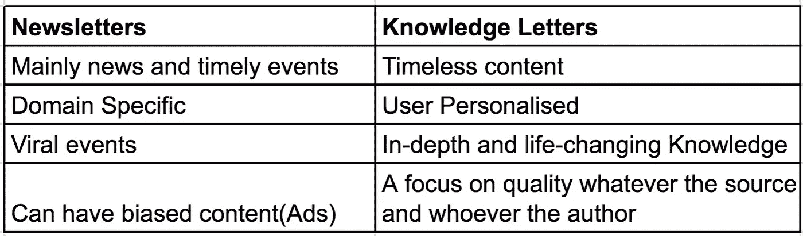

# RIP 简讯和欢迎知识信！

> 原文：<https://medium.com/hackernoon/rip-newsletters-and-welcome-knowledge-letters-9ccda9c4ab4d>

你每天收到多少简讯？5 个，10 个还是更多？

ewsletters 是大约 15 年前的一项发明，直到两年前它们才显著地消失。他们开始再次崛起，许多出版物和媒体资源开始努力通过电子邮件建立读者群，并为用户策划个性化内容。虽然这给读者带来了一些好处，但保持消息灵通确实意味着你必须失去理智，在新闻来源、社交媒体和电子邮件之间周旋，投入如此多的时间，并在日益增长的 [Clickbait](https://www.farnamstreetblog.com/2017/01/schopenhauer-dangers-clickbate/) 文化中获得一点点投资回报。

在 [**知识官**](http://knowledgeofficer.com) ，无论是之前还是现在，我们都看到了时事通讯的炒作，我们相信未来是不一样的！知识不同于新闻，前者对于过上成功的生活更重要，尤其是在创业公司的生态系统中，那里每天都有技术更新和商业挑战。

这并不意味着跟踪新闻和了解你周围发生的事情不重要；我们只是认为，有一个更大的发明的空间，以吸引全球的关注，时事通讯正在得到，并减少努力和负担的用户谁想要保持消息灵通和知识渊博。欢迎[知识信](http://knowledgeofficer.com)和时事通讯！

**Newsletters Vs. Knowledge Letters**

我们[推出了](https://hackernoon.com/the-knowledge-officer-is-now-live-908422a4175f#.zhcvpdy5g) KO，让它成为初创公司员工的主要知识来源，无论他们是工程师、创始人、设计师、营销人员、产品经理，还是初创公司[中的任何角色](https://hackernoon.com/tagged/startup)。现在我们很高兴地宣布 KO 的核心组件之一:**知识字母**！

*知识信* **是根据用户的选择每天、每两周或每周发送给他们的电子邮件。**

## **知识信函目前有两个主要部分**:

**1-知识咬文嚼字:**

由[知识官](http://knowledgeofficer.com)编辑团队精心策划的一口大小的知识，包括创业课程、顶级企业家访谈、商业概念等。这些内容适合任何在创业公司工作的人，无论他的背景如何。

**2-知识文摘:**

基于您的活动和兴趣的高度个性化的知识列表。我们不断努力改进我们的建议，为您提供最相关的知识，支持您的日常工作。

> ***我们相信，你今天学到的一些东西可能会帮助你在不久的将来改变你的职业生涯，这些东西是改变人类的东西，这些信息非常宝贵，不容分享。***

如果你今天已经收到了一大堆时事通讯，并且浏览了一遍以获取信息，但是现在想尝试一些新的东西来获取知识，我们鼓励你尝试我们的知识信。

[**现在就报名**](http://knowledgeofficer.com) 领取你的第一封知识信！如果你喜欢我们的产品，请在[产品搜索](https://www.producthunt.com/posts/knowledge-officer/)上给我们你的爱。

> [黑客中午](http://bit.ly/Hackernoon)是黑客如何开始他们的下午。我们是 T21 家庭的一员。我们现在[接受投稿](http://bit.ly/hackernoonsubmission)并乐意[讨论广告&赞助](mailto:partners@amipublications.com)机会。
> 
> 如果你喜欢这个故事，我们推荐你阅读我们的[最新科技故事](http://bit.ly/hackernoonlatestt)和[趋势科技故事](https://hackernoon.com/trending)。直到下一次，不要把世界的现实想当然！

