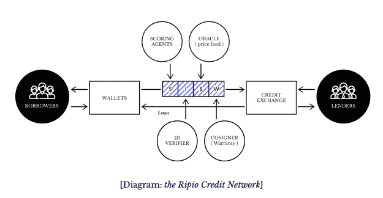

# Ripio Token 投资报告揭示了可行性

> 原文：<https://medium.com/hackernoon/ripio-token-investment-report-sheds-light-on-viability-a6784a6a74be>

**概述**

Ripio 信用网络(RCN)是基于智能合同和区块链技术的协议，它建立在 Ripio 在其运营国家阿根廷提供的当前服务 Ripio 信用服务的基础上。该协议旨在实现点对点(P2P)贷款人和借款人之间的全球连接，而不管货币如何。RCN 将寻求降低传统银行贷款成本和费用，同时为双方提供卓越的信贷体验。

RCN 在其网络协议中的主要区别点是“老派”信用担保人，即联署人。通过包括贷款担保人(联署人)，RCN 试图通过接管违约者的贷款付款，同时在贷款来源国寻求解决方案，来最大限度地降低贷款人的信用风险。

**商业模式和战略**

RCN 寻求将 P2P 互联网借贷经济与区块链去中心化的无摩擦优势结合起来，为有银行账户和无银行账户的人群提供更好的信贷体验。例如，P2P 贷款生态系统的兴起使投资者能够更好地获得贷款投资，同时为借款人提供更高效、更快速、更便宜的贷款。然而，在某些情况下，如果贷款违约或拖欠，贷款人的追索权有限；特别是如果借款人和贷款人位于世界的不同地区，适用不同的信贷法律。

除了技术，RCN 向客户提供的价值主张是贷款担保，**，即理论上的无风险利率收益。**因此，如果贷款人发放的贷款出现违约或拖欠，共同签署人(担保人)将承担责任，使贷款人免受损失(本金和/或利息支付无损失)。RCN 的信用分析补救方法应足以在早期启动网络，直到更多的参与者加入全球。

*RCN Whitepaper

**量化模型评级***

Pugilist 的专有机器学习模型根据早期投资回报标准生成生存能力的概率。然而，鉴于这些投资的早期性质，该模型应被视为方向准确，而不是水晶球。

拳手的生存概率是 52.28%RCN**将**成为一个可行的 ICO。

**结论**

RCN 有一个坚实的团队，顾问和利基市场，这应该有利于执行他们的产品路线图。但是，管理团队应考虑我们的披露建议，以提高网络内的透明度和信任度；尤其是在这些早期的自举时期。最终，RCN 的成功将依赖于区块链世界和拉丁美洲 P2P 贷款的增长、良好的网络激励以及审慎的信贷和违约管理。Pugilist 认为 RCN 很有可能成为一个可行的网络，尽管在短期内需要克服几个障碍。

**拳手的投资评级***

*see full report appendix for rating methodology

**下载完整报道** [**这里**](https://pugilistvc.com/wp-content/uploads/2017/11/Ripio_analysis_v1.pdf) **。**

— —

[**Pugilist Ventures**](http://pugilistvc.com)是一家研究和投资公司，在 FinTech 和区块链的交叉点上运营。我们为区块链爱好者和个人投资者民主化研究。

如果你从这篇文章中得到了一盎司的数字黄金，请鼓掌。请在此发送您的意见或请求[，并在此](mailto:chris@pugilistvc.com)随意阅读我们之前的研究[。](https://pugilistvc.com/blog/)

—
**免责声明:**无论是本文作者，还是 Pugilist Ventures，都不提供投资、财务或法律建议。本网站不能代替专业建议和独立的事实验证。本网站提供的内容仅供参考，不应被解释为任何投资机会的任何类型的投资邀约。