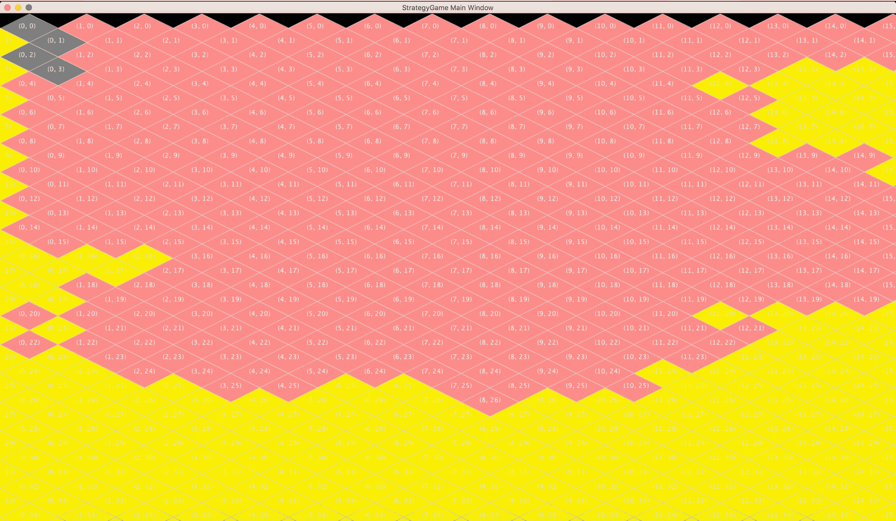

# ripvanwinkle . js—5 年后回归 JavaScript

> 原文：<https://medium.com/hackernoon/ripvanwinkle-js-returning-to-javascript-after-5-years-1dc17c57a518>


The Two Faces of JavaScript, five years apart. Photos by [Pingz Man](https://www.flickr.com/photos/pingzman/) and [panli54](https://www.flickr.com/photos/53911972@N03/) used Creative Commons.

如果真的有一种爱恨交织的模式，那就是程序员和 JavaScript。JavaScript 是网络语言，也许是我们现代社会中最强大的创新和变革力量。只需几行 JavaScript，工程师们就能推动市场，改变生活，并构建[未来](https://hackernoon.com/tagged/future)。但是这种语言也一直是当代黑客最讨厌的[编程](https://hackernoon.com/tagged/programming)环境之一，充满了陷阱、陷阱和笨拙的行为。

可以这么写

```
javascript == Good && javascript == Bad;
```

但是接下来我们会有一个关于等式运算符的争论。这就是 JavaScript 的生活。

或者至少，在我看来，曾经是。早在 2011 年 JavaScript 流行之前，我就厌倦了它。在此期间，我基本上忽略了整个生态系统——包括 Node——同时愉快地使用 Python 3 及其优秀的统计库进行编程。

在过去的一年里，发表了许多关于 JavaScript 生态系统的伟大总结，包括非常关键的[2016 年学习 JavaScript 的感受](https://hackernoon.com/how-it-feels-to-learn-javascript-in-2016-d3a717dd577f#.8qko6mp0u)。在阅读这些文章时，我意识到我所知道的关于 JavaScript 及其平台的一切都已经完全过时了。ES2015？箭头函数？运输工人？巴贝尔？反应？

这就像人们在用外语交谈——事实也的确如此，因为伴随我成长的 JavaScript 已经死了，被更好的东西取代了(尽管仍然有些古怪)。

2017 年的今天，我从未像今天这样对 JavaScript 感到兴奋。虽然我理解许多工程师感到的疲劳(如果我也曾通过前端库像[日本通过总理](http://www.nippon.com/en/in-depth/a02302/)这样折腾，我也会这样)，但在我看来，今天的 JavaScript 从未处于构建未来最佳产品的更有利地位。这是我离开社区的故事，现在我比以往任何时候都想成为社区的一部分。

# JavaScript:黑暗时代

我从小学起就开始编程，最早是在 20 世纪 90 年代中期用 HyperTalk 和 HyperCard 编写基本脚本，后来转向 TI 图形计算器，在那里我在五年级制作了我的第一个井字游戏 AI(应该使用深度学习来保持领先于流行词曲线，但唉)。在高中，我大部分时间都在用 Java 编程，试图构建一个真正笨拙的文明克隆体，但从未真正取得任何进展(创造性地称为 StrategyGame)。



Not a good artist, but not a bad fractal.

当我 2007 年开始在斯坦福上学的时候，JavaScript 还处于非常早期的阶段。很难相信，但是今天我们认为理所当然的 JavaScript 几乎都没有稳定的版本。AJAX 刚刚被谷歌通过 Gmail 和地图推广开来，jQuery 也在一年前刚刚发布。不仅如此，像 Ember 和 Angular 这样的流行框架还需要几年的时间，Node.js 的整个生态系统在 Ryan Dahl 的脑海中仍然只是一闪而过，道格拉斯·克洛克福特甚至还没有出版他传奇的 *JavaScript: The Good Parts* 。

在学校的第一年，我正在开发一个用 Ruby on Rails 编写的应用程序(它本身还处于最初的发布周期！)来打造一个药物发现的社交平台。正是在这里，我了解到使用新工具进行 web 开发是多么令人疲惫不堪。Rails 会工作，直到它不工作，没有人能解释为什么。我们的 Mercurial 仍然是一个早期产品，有它自己的缺陷。当然，JavaScript 本身绝对是一个疯狂黑客的动物园，他们试图把所有东西粘在一起工作。

在接下来的三年里，我断断续续地使用 JS，并随着一些新的前端框架的发布，对它们进行了试验。但是到 2011 年我的学位结束时，我真的已经完成了互联网编程。我在 Python 世界里花了越来越多的时间，尤其是在统计方面，与 web 开发总是变成的笨拙相比，Python 只是编程的一种乐趣。

所以我休息了一下。五年了。

# 快进到五年后

去年，有许多关于 Javascript 生态系统及其变化的精彩评论。很明显，一些新的东西正在脚下，所以我决定花一些时间来重新学习堆栈，让自己回到前沿。

我从 John Resig 最新更新的*JavaScript 忍者*的秘密开始，它涵盖了 ES2015 承诺的许多变化(双关语！)来自 Python 世界，添加类似 lambda 的构造(称为箭头函数、生成器、迭代器和类)完全改变了 JavaScript 代码的质量。虽然 JS 可能不完全是“Pythonic 化的”，但它确实拉近了代码可读性的距离。此外，承诺的增加大大减少了回调地狱，这是我多年前从未真正跟上节点潮流的一个原因。

现在，这些变化开始变得有争议。ES2015 的引入意味着突然之间，开发人员不得不使用 transpilers 来确保这种新代码可以在旧的 JavaScript 运行时中使用，通常是通过一个名为 Babel 的库。这个需求确实有点痛苦，但是我发现设置和理解正在发生的事情是相当容易的。此外，[对新标准的支持进行得非常好](https://kangax.github.io/compat-table/es6/)(除了 Android 以外的所有东西)，特别是考虑到[我最近在 Python 2 到 3 过渡方面的经验](http://www.python3statement.org)。我们肯定离过去的 IE 时代有很长的路要走。

除了语言的进步，现代 JavaScript 最令人兴奋的方面可能是智能新前端框架的创建，最著名的是 React 和 Vue.js。当与 Redux 或 Flux 等状态容器混合时，与过去简单地一起编写脚本相比，它允许开发人员使用*某种*程度的组织逻辑编写更复杂的用户体验。这些工具相当成熟，尽管它们并不完美，而且它们的理念肯定需要一些时间来适应。

(老实说，在我的第一个沙盒应用程序中，我甚至很难开始使用，但最终，随着我了解我的程序需求，这些应用程序的结构变得更加清晰。我的建议是忽略 *create_react_app* 库，完全从零开始构建你的第一个应用。这非常有帮助，尽管可能要花一个周末的大部分时间才能把所有的部分整合起来。)

最后，有一些编译器和构建工具，比如 Webpack，可以帮助将所有这些放在一起。Webpack 是那些设置起来很烦人的工具之一(说真的，“包括电池”绝对不是一个好的描述)，但一旦你摆弄完脚本，添加正确的插件并获得正确的结果，重新构建整个应用程序是如此快速和无痛，几乎是不可思议的。

简而言之，当谈到 JS 生态系统的成熟时，刚刚发生了翻天覆地的变化。当然，有很多工具，但是在 web 开发中也会出现很多问题。很高兴看到社区构建了以模块化方式解决这些问题的最佳工具，以及为开发人员将它们协调在一起的合作。

# 不仅仅是 JavaScript

我很清楚 JavaScript 社区想要成功，但这并不是让 web 开发大放异彩的原因。最终，我们的目标是构建以无缝方式为最终用户工作的产品。我们还需要一些工具，让我们能够用有限的人力做很多事情——现在的工程师很贵！

在无缝方面，我们已经看到了 Electron 的发展，它允许将 JavaScript 应用程序翻译到桌面，以及为移动设备提供本地反应。这些库并不总是很棒(例如，在我玩一些沙盒应用程序的经验中，电子的内存需求是疯狂的)，但它们对想要更本地体验的用户有很大帮助。

但是真正令人兴奋的是今天支持我们项目的第三方库的数量。仅举一个例子，与 2007 年做同样的工作相比，通过 Stripe 接受支付简直易如反掌。十年前，支付可能是某个人的全职工作，而现在它可能只是几行 JavaScript 代码。当您混合了许多一致的基于 REST 的 API 服务时，认知开销比以前好得多。

还有一些关键的文化变化改善了社区。测试覆盖率并不是在一些大型项目之外被积极讨论的东西，但是现在我惊喜地发现，甚至一些小的库也开始在他们的代码库中构建测试了。文档，十年前 web 开发的大敌，其实挺好的。不仅开发人员更好地记录了他们的工作，而且大量的 StackOverflow 问题和博客帖子意味着一个问题几乎总能在短时间内得到解决。

# JavaScript:最好的时代？

很明显，JavaScript 在过去的五年里取得了巨大的进步。感谢社区中所有为此付出时间的人——谢谢！

当然，同样清楚的是，并非一切都是美好的。NPM 和哪怕是一个基本的 JavaScript 应用程序所需的依赖项的数量都是非常可怕的。前端框架的变革将会继续，我敢打赌下一个最好的东西将会在五年内取代 React。这些是真实的抱怨，值得关注，尽管我不同意停止网络发展的想法。

JavaScript 生态系统中令人眼花缭乱的变化确实令人疲惫不堪，但这也是它最大的优势。事情一直在变好——相当稳定——而且速度很快。

所以，对于那些想走开的人，我的建议很简单:不要。也许休息几个月(绝对不是五年！)围着榆树飞镖，或者一边喝着 Java 一边去玩蟒蛇。但是不要指责我们已经看到的变化:它们可能不都是线性的改进，但是它们共同创造了我所见过的构建伟大产品的最佳环境之一。现在，对不起，我有一个新的前端库要做。

[](http://bit.ly/HackernoonFB)[](https://goo.gl/k7XYbx)[](https://goo.gl/4ofytp)

> [黑客中午](http://bit.ly/Hackernoon)是黑客如何开始他们的下午。我们是 [@AMI](http://bit.ly/atAMIatAMI) 家庭的一员。我们现在[接受投稿](http://bit.ly/hackernoonsubmission)，并乐意[讨论广告&赞助](mailto:partners@amipublications.com)机会。
> 
> 如果你喜欢这个故事，我们推荐你阅读我们的[最新科技故事](http://bit.ly/hackernoonlatestt)和[趋势科技故事](https://hackernoon.com/trending)。直到下一次，不要把世界的现实想当然！

