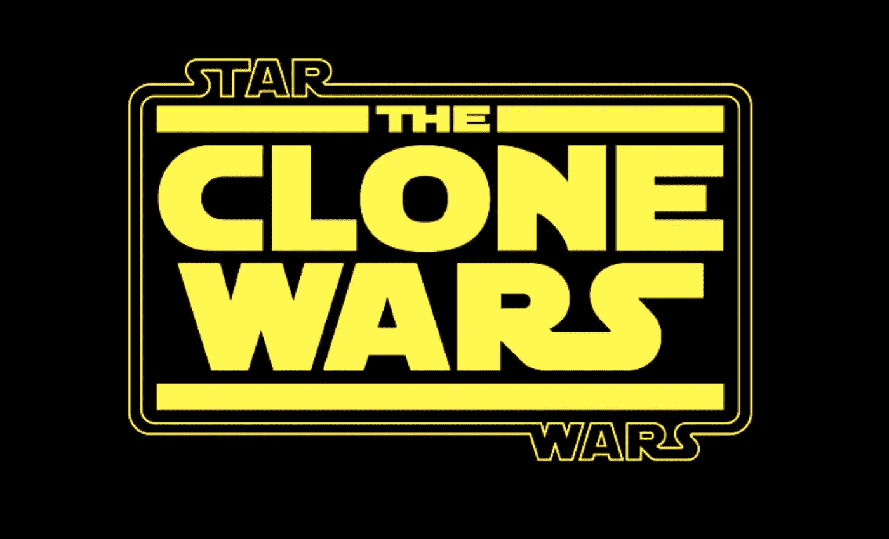
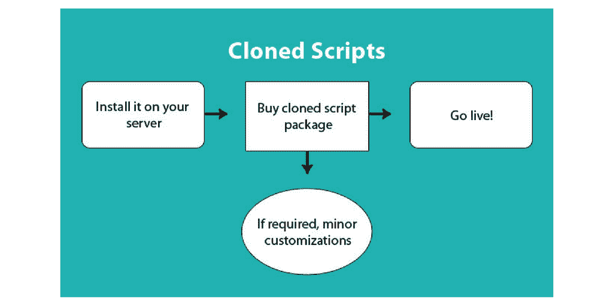
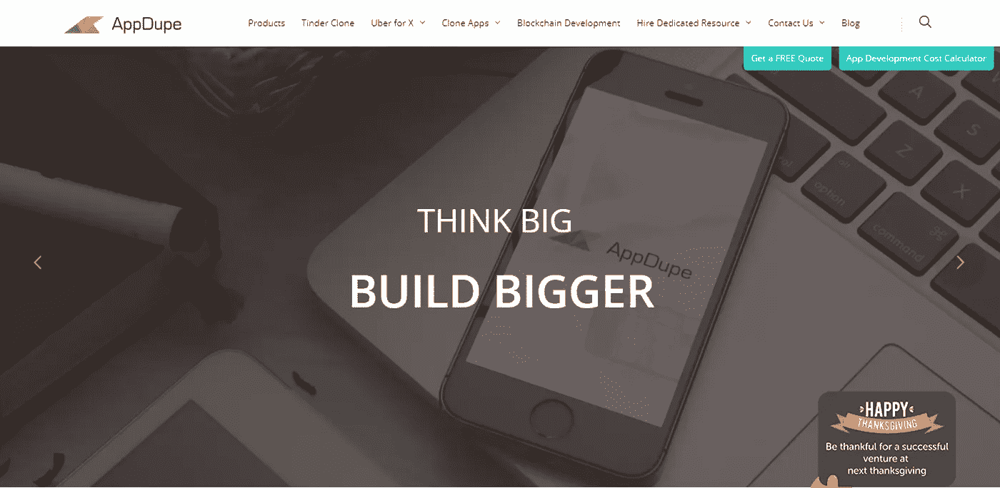
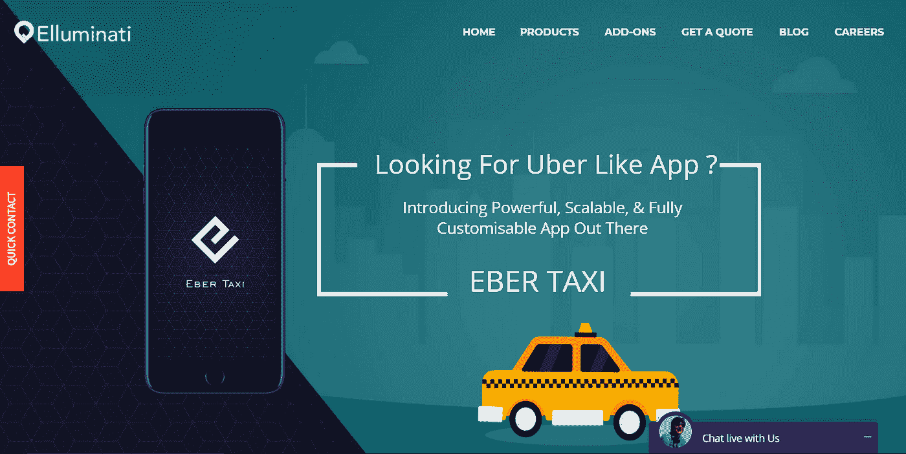

# 克隆应用的崛起

> 原文：<https://medium.com/hackernoon/rise-of-cloned-apps-4a5058210cef>

Image Source: Google

有了一个商业想法，并且已经做了很好的背景调查？

关于品牌/产品规划**战略**的讨论太多了？

修正了产品/服务确定的**KPI**？

在运行多重分析和**反馈调查**后收集了所有数据？

好吧，现在可能是你设计一个应用程序的时候了，一个导航非常简单的网站，一个可以转化网站巨大流量的登陆页面。

事情是这样进行的，从**构思**， **UX/CX 设计**，产品开发，**用户测试**，到**将网站上的每一个用户转化为顾客**。这个过程看起来很简单，但是实际的恶化开始于这个过程的第二步。

> 我什么意思？

当我们的设计团队最终决定冻结一个应用的框架/结构时，事实上的问题就出现了。这个问题一直延伸到过程的开发部分。其中设计的框架(在大多数情况下从零开始)试图被转换成一个**实际的交互式应用模型。**

> [**克隆 app 开发者**](https://www.appdupe.com/uber-for-x-clone-script/) 来拯救了！

为了节省你的质量时间和摆脱累人的 ***自定义开发脚本*** 彻底。

克隆应用程序开发者的主要用途是，他们帮助**初创企业**、**企业家**，甚至是老牌品牌构建**超个性化应用程序**。由于用户采用按需服务的突然波动，每个品牌都愿意创造更少或更多的互动产品，以及高度个性化的产品，条件是每个目标群体的**需求**。

## 克隆脚本易于定制

Image Source: Unsplash

有了**克隆脚本**，应用程序开发人员拥有了极大的权力，可以根据客户的需求在各个方面定制应用程序模型。此外，拥有**应用程序的公司声称**可以要求特定的需求，这在很大程度上符合他们的用户/客户群。

只要这些需求是由他们的潜在或现有用户提出的。[一系列复杂的插件](https://www.appdupe.com/uber-for-taxi/)帮助品牌利用他们克隆的应用，如**地理围栏**，聊天窗口整合，病毒式营销插件，**钱包系统**，视频通话，等等。

模板化或克隆的脚本确实有更快的周转，不像从零开始开发的应用程序/定制开发的脚本。也让公司和企业家启动他们的超级独特的应用程序，开始轻松赚钱。大多数时候，数字营销完全由专门的数字营销机构负责。

尤其是对于刚刚起步的品牌来说，更难雇佣一批全新的数字营销人员。也许，处于隐形模式的公司和早期创业公司并没有建议或甚至考虑更高的员工收购数量。

看看这个由[**Codeuridea.com**](http://codeuridea.com/)开发的克隆应用程序的可视化表示

Image Source: [**Codeuridea.com**](http://codeuridea.com/)

## 重视金钱和时间

Image Source: Unsplash

购买一个克隆的应用程序脚本不仅能帮助品牌在很短的时间内上线，还能让进一步的流程变得负担得起。一些克隆的应用程序开发人员提供服务器应用程序源代码，与软件包紧密捆绑在一起。它基本上负责**业务**的所有**技术方面**。在这种情况下，质量是毋庸置疑的，因为克隆的应用程序开发人员依赖于最近在市场上流行的应用程序。

从**心理学角度解读**，每一次病毒式营销活动或产品本身都有着与众不同的特别之处。这就是为什么它们很受消费者欢迎的原因。否则，企业别无选择，只能遭受巨大损失，或者进入休眠模式，多年无所作为，然后逐渐消失。

克隆应用开发者的数量，确切地说是那些每次客户接触时都被期望提供杀手级服务的人，在全球范围内只有少数。我推荐给新兴企业家和初创公司试用的一些克隆应用开发者是:

## Appdupe

Image Source: Appdupe team

## 【AppDupe 提供什么，

“在 AppDupe，我们知道我们的客户是企业家，保持他们的成功将使我们更加强大。所以，我们向你保证，终身免费更新。是的，我们知道苹果和谷歌不断推出新版本的移动操作系统，我们克隆的其他公司也不断更新他们的功能和 UX 以保持最新。我们会帮你处理好的，让你做你最擅长的事情，赢！”

## 埃尔卢米纳蒂

## Elluminati 所提供的，

“我们在 Android 应用程序开发、iPhone 应用程序开发、web 开发、移动 UI 设计方面拥有业经验证的专业知识。作为一家领先的印度移动应用程序开发公司，我们为执行定制移动应用程序开发服务提供了完整的规划。在过去的几年里，我们的应用程序开发人员将他们的专业知识扩展到了广泛的按需高级应用程序开发平台。”

## 克里菲

## 克里菲所提供的，

“Krify 是一家跨国技术创新公司，专注于开发世界级的移动应用和网络应用。我们开发了许多世界级的移动应用，尤其是在 iPhone、Android 和可穿戴平台上。Krify 将服务扩展到数字营销、质量测试、内容、公关、搜索引擎优化等领域。”

## 如果你使用过任何其他的克隆应用开发者，请在评论中添加他们😃