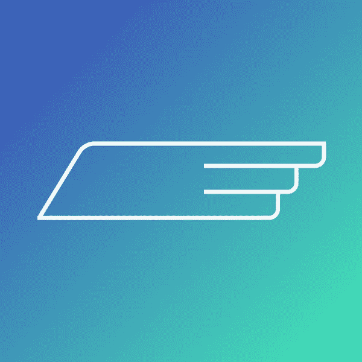
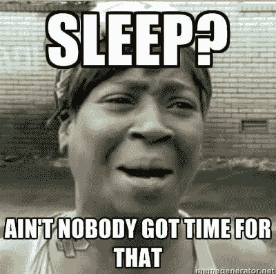
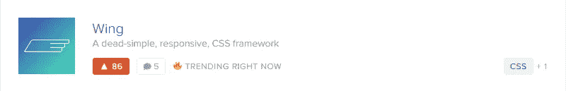
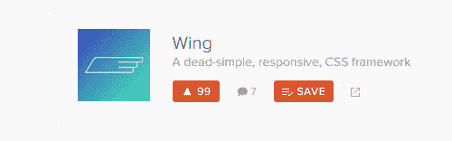
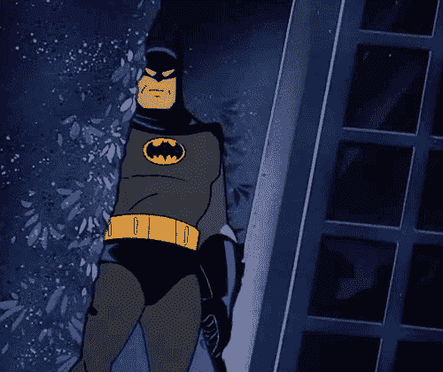
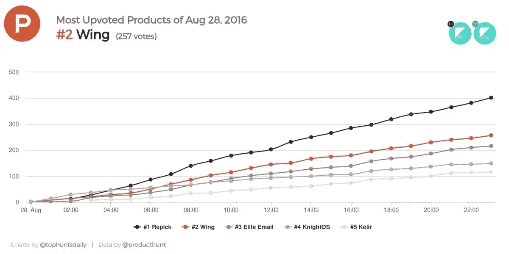

# 在产品搜寻中脱颖而出

> 原文：<https://medium.com/hackernoon/rising-to-the-top-on-product-hunt-f6e80d52b2fd>

## 另一个产品搜寻成功案例

有一天，我想做一个项目。为了帮助实现它，我决定使用 CSS 框架，但是发现框架要么

a)没有提供现代设计
b)我不得不学习它们
c)文件太大

我想在*发布了所有的*CSS 框架，并且有**一大堆**框架之后，会有一个符合我需求的。但是没有。

那时候我开始做 Wing，一个 CSS 框架。今天我以为它终于成熟到可以[推出](https://hackernoon.com/tagged/launch)了。

前一天，我花了大约一个小时制作了完美的标语、logo，还拍了一些截图。

Wing — A dead simple, responsive CSS framework

我已经被邀请加入[产品搜索](https://hackernoon.com/tagged/product-hunt)社区，所以我可以提交产品。于是我熬到半夜，把它交了上去。

*这是第一款产品*

我超级兴奋，但是睡着了。

第二天早上，我醒来，立即检查我的电脑。我无言以对。

[Wing 上了首页](http://producthunt.com/tech/wing-3)，排在第二位，有 70 张赞成票，在 Github 上有 226 颗星[。](https://github.com/KingPixil/wing)我的分析呈爆炸式增长。我的推特也是如此。有人把它添加到了黑客新闻中。

某天早上。

一小时后我重新加载了页面，Wing 有 86 个 upvotes。

这让我震惊。

说真的，我以为我的框架会迷失在 CSS 框架的深渊中。

但是一小时后，我有了 91 张赞成票。

这是相当疯狂的重装和看到这种情况发生。

然后，就到了 99。太疯狂了，再多一张票，Wing 就会有 100 张赞成票。

看着它发生。

Goes from 99, to 109

太棒了。产品搜索甚至给了我这个认可的信号。

Batman approves

人们开始评论，所有的都是正面的。

他们告诉我需要修复的错误、需要改进的地方以及他们喜欢的东西。这真的很有帮助，与其他在线社区不同，Product Hunt 的社区是最受欢迎的。

翅膀越来越高。

很快，它获得了 200 张赞成票，然后继续前进。到了下午 6 点，很明显 Wing 会保持在第二的位置，但是我很高兴。

*真开心。*

然后电子邮件开始滚滚而来。

来自世界各地的人们开始给我发电子邮件。

*   祝贺我的发射
*   想为 Wing 做贡献
*   说他们受到了我作品的启发

人们被我的作品所鼓舞，这感觉很好，真的很好。

@ TopHuntsDaily 在推特上这样写道:

他们制作了一张 Wing 在产品搜索上的支持率的可爱图表:

Wing is orange

这就是我的产品搜索发布会。

点击查看产品搜索[。
查看一下](https://producthunt.com/tech/wing-3) [Github 库。](https://github.com/KingPixil/wing)T5 在推特上关注我[。](https://twitter.com/KingPixil)

## 要联系我，请访问我的网站。

## 给这篇文章一个推荐，分享给你的朋友:)

> [黑客中午](http://bit.ly/Hackernoon)是黑客如何开始他们的下午。我们是阿妹家庭的一员。我们现在[接受投稿](http://bit.ly/hackernoonsubmission)并乐意[讨论广告&赞助](mailto:partners@amipublications.com)机会。
> 
> 如果你喜欢这个故事，我们推荐你阅读我们的[最新科技故事](http://bit.ly/hackernoonlatestt)和[趋势科技故事](https://hackernoon.com/trending)。直到下一次，不要把世界的现实想当然！

