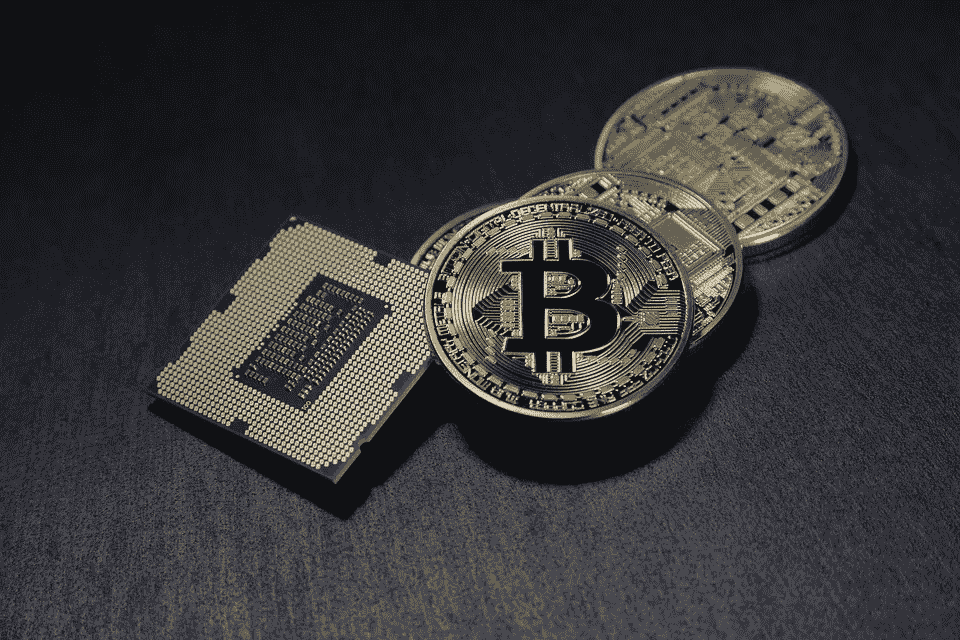

# 首次发行硬币的上升趋势

> 原文：<https://medium.com/hackernoon/rising-trend-of-initial-coin-offerings-49a4267be0c9>

根据红树林资本的一份报告，204 只 ico 的回报率约为 1，320%。

与此同时，投资银行和对冲基金对数字货币表现出越来越大的兴趣，有超过 55 家专门从事加密的对冲基金。在深入探究为什么投资者对加密货币表现出更大的兴趣之前，让我们先来看看 ICO 是什么。

**什么是 ICO？**

与传统金融体系不同，ICO 或初始硬币发行是一种另类和非常规的众筹方式。它使许多成功的公司和项目获得了启动业务的资金。全球各地的新企业和初创公司通过发行数字硬币获得了数百万美元的资金。数字货币的崛起趋势让人们既担忧又兴奋。

在 ICO 中，投资者购买的硬币是用于尚未开发的企业和市场。通过购买这些硬币，他们打赌一个公司或创业最终会成功，因此，硬币会升值。

一般来说，传统的风险投资系统需要大约六个月或一年的时间来筹集资金，但当涉及到 ico 时，情况就不同了。在这种象征性的众筹中，你会有一大群热情的支持者，他们希望看到你成功。他们不仅为你竞选，而且也是你的早期采用者。

**ICO 增长趋势**

自 2017 年初以来，创业公司已经筹集了超过 20 亿美元的资金。考虑到几年前没有多少人知道它，这是一笔巨大的资金。企业通过这种融资模式赚钱的速度比以往更快。

今年 4 月，Gnosis(以太坊的预测市场)在短短十分钟内成功筹集了 1200 万美元。今年 6 月，Mozilla 的创始人通过在不到 30 秒的时间内为他的新网络浏览器初创公司“Brave”出售*基本注意力令牌*筹集了 3500 万美元。

ico 已经成为游戏的名字，因为他们已经离开了风险资本市场，并且是最大的资金来源。对于那些追求应用区块链技术的公司来说，这是一个很好的选择。

**监管机构的担忧**

尽管 ico 的趋势越来越多，但监管机构已经表现出严重的担忧。他们警告投资者，这是一项高风险投资。

虽然，一些硬币的价值已经大幅增加，但非常高的波动性不容忽视。一些人还认为这是一场“投机热潮”，但这并没有阻止投资银行和对冲基金对加密货币和 ico 表现出兴趣。

**机构投资者对 ico 兴趣增加背后的原因**

在过去一年左右的时间里，数字货币市场获得了巨额利润。最初，机构投资者对这一切都很好奇，但他们开始逐渐掌握它，变得不那么担心，对这种另类投资更感兴趣。这是一种连锁反应，始于风险资本家兴趣的上升，现在包括共同基金、投资银行和对冲基金在内的机构投资者也在效仿。他们表现出越来越大的兴趣，并努力评估和抓住加密货币市场的机会。

他们对这种新的非常规货币更感兴趣的原因是，与市场平均水平相比，它承诺了更高的回报。根据一家金融科技分析公司的数据，至少有 55 只加密货币对冲基金，Fortress 的前经理 Mike Novogratz 最近宣布了一项计划，将 5 亿美元用于一只新的数字货币对冲基金。区块链资本也宣布融资 1.5 亿美元；该基金的一部分将用于加密货币。

**高盛的批准**

高盛正计划设立一个[比特币](https://hackernoon.com/tagged/bitcoin)交易柜台，因为他们认为机构投资者对加密货币比以往任何时候都更感兴趣。该公司称之为*‘一个重要的里程碑’*。他们认为，投资者需要一个场外经纪平台，在这里他们可以随心所欲地出售或购买加密货币。高盛认为它可以承担这一角色，但会有其他问题，包括市场基础设施和监管机构的严重关切。

然而，如果 ICOs 受到监管，它将改变企业融资的方式，也将影响风险资本市场。

让我们在推特上讨论这个问题