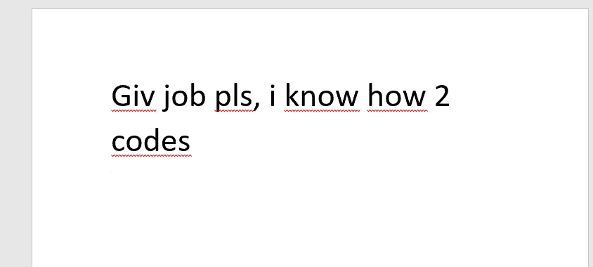
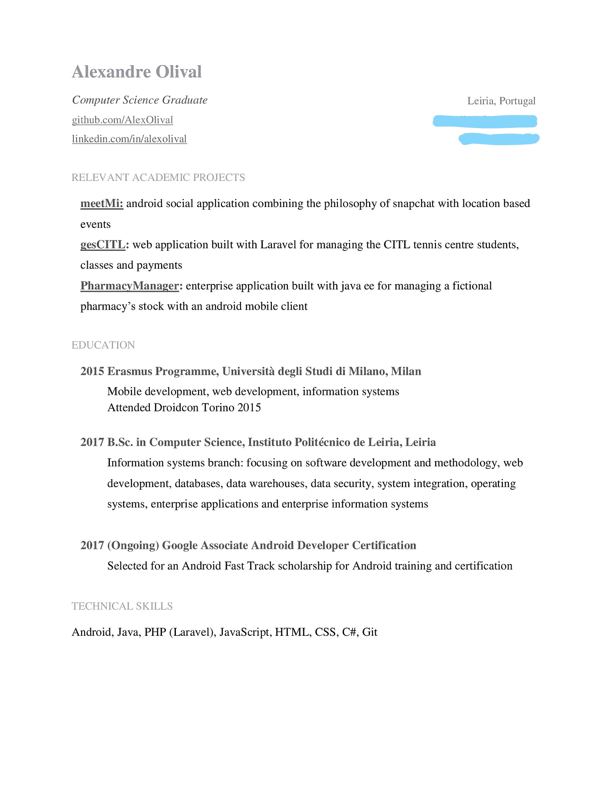

# 精通之路:CVs 还是反对 Europass(面向开发者)

> 原文：<https://medium.com/hackernoon/road-to-mastery-cvs-or-advocating-against-europass-for-developers-edd00e22e930>

Accurate depiction of a Curriculum Vitae in a perfect, painless world

你现在一定后悔错过了你们学校每学期组织的下午 4 点的简历研讨会，是吗？你真可耻！…嗯，其实没什么大不了的。当然，假设你是一个潜在的[开发者](https://hackernoon.com/tagged/developer)，你可以放心，在那些研讨会上很少有人说对你有任何价值的东西。

如果你不是计算机科学的毕业生或学生，那就走开。这不是给你看的。如果你是，请务必阅读我在[的第一篇文章](/p/road-to-mastery-a-junior-developers-story-db1b65d0954d)，我在那里建立了这个系列并阐述了它的目的。完成了吗？那我们继续吧！

# 我的第一门课程

这可能会让许多人感到惊讶。但是“在海滩酒吧工作了 3 个月”和“#3 最大的热线迈阿密国家飘带”*可能*在*开发*的工作中不占多大比重。

在你举起你的干草叉之前，请明白**是的**，我相信任何种类的经验都适用于任何领域。不可否认，任何涉及人际交往和最低限度责任的事情都是非常有价值的，尤其是如果你还年轻的话。

但并非所有人都是如此。也不一定非要这样。对于我们大多数人来说，一旦走出校园，一切又回到了起点。你的课程中几乎没有任何与编程无关的东西会给你带来优势。

你的简历应该简明扼要，重点突出，并根据你的确切需求量身定制:开发部门的一份工作。没有任何以前的工作经验？**没问题。在你攻读学位的大部分课程中，你都有大量含咖啡因的、最后一分钟的、匆忙的、为了生命而坚持的编程经验。这就是问题的关键:这是你正在准备的，也是作为一个大三学生对你的期望。**

因此，任何与编程无关的东西都是杂乱的。说到杂乱……

# 克拉特帕斯

没有什么比那个邪恶的无神的地狱之子……欧洲通行证更让我尖叫的了。

The descending star scale is actually a metaphor for your lost dreams and ambitions.

再说一遍，让我们弄清楚:我们在这里谈论的是开发者。如果你不是，那就想尽一切办法去买一张欧洲通票。

否则，想想看:你真的需要填写那个恶魔般的黄色和蓝色模板要求你填写的所有内容吗？驾照？嗯……如果我们谈论的是不为人知但迅速崛起的新[道路编码趋势](http://thewirecutter.com/wp-content/uploads/2016/06/affordable-laptop-mounts-car-5208-630.jpg)，这的确是有道理的。

我看到很多同龄人填的甚至是他们小学习得的“技能”。是的…甚至是我。我也一无所知。不过，我现在更清楚了。

The look you risk getting from your interviewer when presented with The Europass.

# 那你该怎么办？

“但是亚历克斯”——我听到你说——“欧洲通行证确实给了你一个很好的样板和体面的指导方针，以避免你在冒险制作自己的简历时写得不够多这一更常见的陷阱！”

你这个聪明的小家伙你❤
我们开发人员确实喜欢框架，不是吗？“我真的不喜欢写作，但还是需要做点什么”之类的花哨术语。

嗯，就像你遇到的每一个 bug 或错误一样，我们中的一些人已经经历过这种挣扎，并好心地把电梯送下来。我不能给你开发者通行证。然而，我可以给你一些知识和专业技能，这些知识和专业技能不仅要为一份开发工作交出简历，还要真正阅读和评估他人的简历。

问问你自己:如果我在面试一个软件开发职位的人，你会在候选人身上寻找什么？提示:不是他三年级的蜡笔熟练程度。

下面是上述专家给出的答案。

我强烈推荐你阅读那篇文章。它深入到了那些有更多经验的人在换工作或根据简历申请工作时所经历的同样的挣扎。也是这篇文章的灵感来源。

然而，我们没有经验，你们中的许多人甚至还不是开发人员。你来看这一切不仅仅是为了链接到一个大帖子。所有这些都应该源于我自己经历。这也是这个系列的重点，所以…

# 我是如何写简历的

我之前没有任何开发方面的相关工作经验，当看到一张白纸时，我正经历着和你们大多数人一样的挣扎。后来偶然发现了那篇文章。最终你会得到一个 [**非常酷的模板**](https://docs.google.com/document/d/1-dozESPE5ND2w6BTxHhuQb2s4DAdwAV6yI7v7V0mSsk/edit) 用于开发者课程。

现在，显然我不会用我失败的自由职业尝试和我在 freelancer.com 给几个印度计算机系学生做的四个 Java 家庭作业来填满它，每个作业 15 美元

我把我的**强项**填了进去。具体来说，我把“经验”相关信息留给了**我喜欢**做的事情和**我想要**做的事情。如果你看到模板，它应该是一个简单的页面，简洁而引人注目。保持你觉得突出的与你在课程中最喜欢的东西相关的简短有力的内容！找到这些优点将是另一篇文章的重点。但是现在，为了更好的衡量，这里是我的结果:

它包含了我提到的你应该努力在简历中包含的所有东西，就像我链接你的那篇文章一样。当我开始分发这些资料时，你能说出我真正想使用的技术吗？

# 结论

你在网上读到的大多数与发展世界中的简历(以及几乎所有东西)有关的东西可能会让你觉得对即将到来的事情准备不足。但我怎么强调这一点都不为过- ***大部分都不是为新人准备的*** 。课程肯定是其中一个话题。

你是一名刚毕业的大学生。

你没有被期望通过你的开源项目解决世界饥饿问题，并且在 GitHub 上有一个知识库来证明这一点。尽管说实话，这将是一个很好的工资谈判加分。

大学是为了让你做好准备，帮助你发现自我，找到自己喜欢的东西。课程意味着展示你是谁。明白我的意思吗？你肯定有太多东西要写了。现在好好想想你想要什么，填写模板，做好准备迎接来自每个人力资源和他们朋友的 LinkedIn 收件箱垃圾邮件。

避开欧洲通票。

> [黑客中午](http://bit.ly/Hackernoon)是黑客如何开始他们的下午。我们是这个大家庭的一员。我们现在[正在接受投稿](http://bit.ly/hackernoonsubmission)，并乐意[讨论广告&赞助](mailto:partners@amipublications.com)机会。
> 
> 如果你喜欢这个故事，我们推荐你阅读我们的[最新科技故事](http://bit.ly/hackernoonlatestt)和[趋势科技故事](https://hackernoon.com/trending)。直到下一次，不要把世界的现实想当然！

