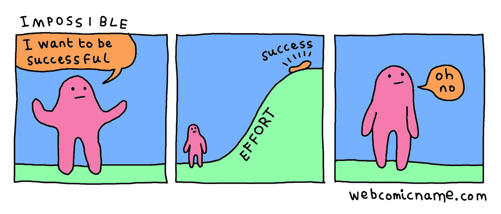
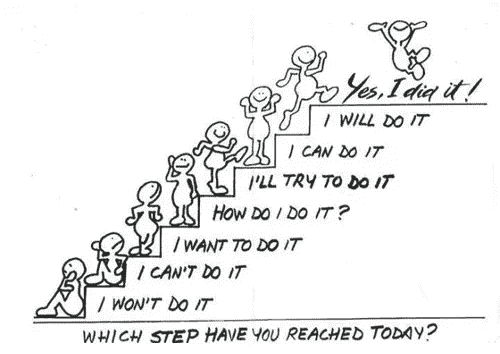
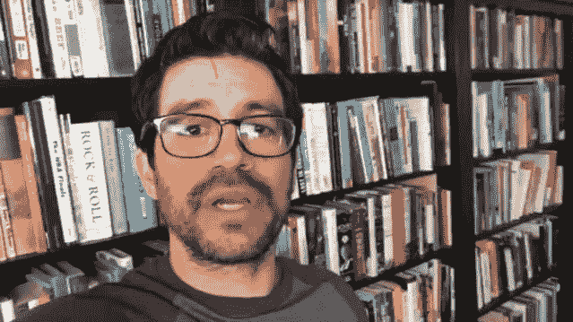
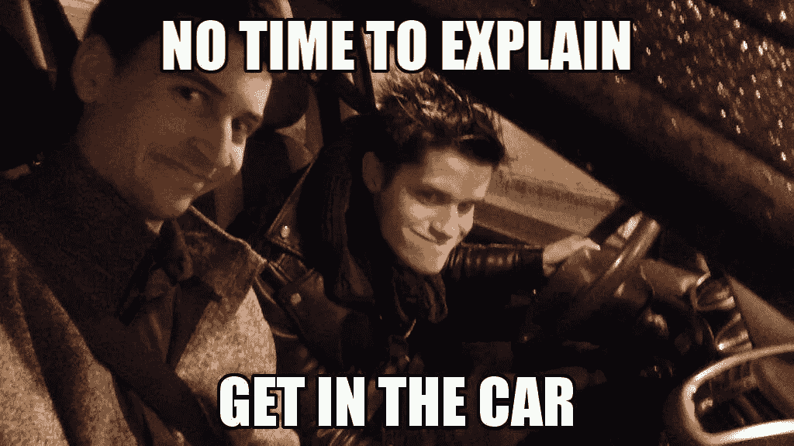

# 通往精通之路:在路上的半年

> 原文：<https://medium.com/hackernoon/road-to-mastery-half-a-year-on-the-road-2bec022a1255>

Slippery. Foggy. Bumpyyy …should have found a better picture probably.

我是谁？自从我上次发帖以来，已经有一段时间了。虽然我很想用*最初的*理由来证明我的“中断”，即“我会写一篇关于被雇佣 6 个月的帖子，所以我会等到那时”，但*真正的*理由是几周的假期。也已经 7 个月了。但是谁在数呢？

这将与我通常的格式略有不同。与我的其他帖子不同，这篇帖子将是我迄今为止所经历的个人反映，也是对我这个只有六个多月经验的开发人员来说真正意味着什么。

但首先，一些背景。

# 我站在哪里&我来自哪里

我于 2017 年 2 月毕业，经过一些(不可否认的是不多)的寻找，在第二年 3 月找到了工作。我之前提到过我正在寻找一个 Android 开发者的职位，但是我不介意用 Laravel 进行网络开发。

所以我被里斯本的一家专门从事数字营销和网络开发的公司雇佣。当谈到从哪里开始时，我相信我为一个初级开发人员做了一个最好的选择。但是经过深思熟虑，我决定选择/寻找一家公司以及这一选择的重要性将是另一篇文章的主题。

目前，我可以有把握地说，我很高兴受雇于葡萄牙最好的科技公司之一。

# 开始是什么样的

鉴于以上我所写的一切，并且由于我自己的好奇心和热情以及我的朋友和导师，我比大多数人更了解这个行业是如何运作的，人们会认为我的职业生涯有了一个最好的开端，对吗？

号码

不得不离开我生活和学习了 17 年的城市并不是特别困难。我以前甚至在国外生活过。但不幸的是，就在我的生活中发生了一些重大的个人变化。这本身不会是一个大问题。但科技行业的新工作并不是特别没有压力，也不容易适应。

话虽如此，但没过多久我就适应了，并真正开始在 provebial 道路上迈出自信的第一步。

# 四骑士

oh yes. webcomicname.com tells it like it is

我非常幸运地融入了一个拥有才华横溢的开发人员的团队，特别是一位团队领导/导师——不像我的其他开发人员朋友告诉我的恐怖故事中的那些人——*实际上*遵循“做得好，做得对”[的哲学，许多人认为这是我们当今行业中痛苦地缺乏的](https://www.youtube.com/watch?v=ecIWPzGEbFc)。然而，如果一切都归结于你周围的每个人有多好，我现在会很轻松。

如果像我一样，你渴望成长并超越通常的“高级开发人员”水平，并真正成为能够传播知识的人…你最好从一开始就抑制这些想法。因为你将进入一个自我怀疑的世界，尤其是当你真的不知道你需要多长时间才能达到基本的*得体*的时候。或者至少我是这么告诉自己的。

不管怎样，在经历了巨大的压力和糟糕的睡眠，以及偶尔爆发的幸福感和成就感之后，我已经确定了四个品质，我认为这四个品质最能描述你作为一个大三学生应该努力的目标。

我称他们为“四骑士”。这是我迄今为止最黑暗的帖子，有四个这样的品质，几乎没有任何不像其他的幽默妙语，所以为什么不呢？

# 🏇信心

Yes, it does look like something your aunt would share on Facebook. So?

哦天啊。

作为一个“外向内向”的人，当我真正焦虑或严重自我怀疑时，我周围的人很容易忽视我。具体来说，就是我在对付[这个混蛋的时候](https://en.wikipedia.org/wiki/Impostor_syndrome)。

我记得我犯的第一个大错误。我开发的应用程序必须根据两组用户通过表单输入的促销代码来区分他们。基于用户所在的组，他将被授予一个奖励。根据用户所属的组，有两个奖励组。听起来很简单，对吗？

那个项目上线几天后，我的团队领导把我叫到一边，告诉我哪里出了问题。我引入了一个 bug，不管用户属于哪个组，他总是被认为是来自一个组的礼物，而另一个组则完全没有被触动。幸运的是，这个问题很早就被发现了，并且很容易解决。快乐的日子！…我感觉糟透了。几乎处于陷入抑郁和严重职业怀疑的边缘。如果我连这样一个简单的应用程序都搞不定，*我到底在开发中做了什么？*

事实证明，这不会是我第一次也绝对不会是最后一次把事情搞得这么糟。正如我的朋友当时告诉我的那样，有一次我和他谈起这件事(之后他像个疯子一样大笑起来):

> 亚历克斯，你有两个月的经验。你真的没想到会出什么乱子吗？

虽然我发现我不可能高估自己的能力和信心，但我有充分的理由相信这通常发生在初级开发人员身上。但显然，相反的情况更多。最重要的是不要削弱你完成任务的能力。

**记住，你是被比你更有经验的人交给任务的。这包括知道你能做什么或不能做什么，以及什么时候给你更大的压力。你能行的。相信你自己。**

# 🏇毅力

I specifically chose a photo at dusk so you can’t tell how long he’s been running. Let’s assume a lot.

这正好落在前面的骑士之后。这是我在经历了上述失败后(我认为是这样的)对自己的巨大打击后，真正让我坚持下去的原因。

是运动吗？不。也许是一种希望？一点也不。我都用完了🏇自信，你不识字吗？

让我挺过来的是纯粹的**勇气**。**解决**。一种责任感和纪律性，尽管我当时并不喜欢，但我确实是在我希望*在的地方，是*需要*在的地方，是*必须要*在的地方。我坚信这是比任何一种动机更能让你走在前面的东西。*

**以前有人做过。你也会的。总是先难后易。一直都是这样，也将永远如此。继续用力。**

# 🏇求知欲

I shouldn’t have to explain this. [NAWLIDGE](https://youtu.be/zZKp_jFxQJc?t=7s)!

[我之前提到过](https://hackernoon.com/road-to-mastery-nurturing-your-passion-6a273d172158)学习和培养对你的职业的热情的重要性，尤其是在软件工程领域。

我没有预料到的是，一个人有时会在这份工作中受到精神压力和打击(尤其是在最初的几个月)。所有这些*能够并且将会*让你更难有心智能力去观看一个教程或者阅读一篇文章。这最终会平息，但在那之前…你能做什么？

任何一家好的科技公司都会给你时间和预算来磨练和提升你的技能。或者给你每月或每年的津贴，邀请演讲者给你演讲，或者给你访问学习网站的独家内容。在接下来的文章中，我将再次讨论一个好的工作环境对你的第一份技术工作的重要性。

除此之外，如果 (这是一个巨大的假设，否则每一个有 5 年经验的开发人员都会是一个倡导者)你保持热情的火焰被点燃，并且是开放的，愿意关注和学习，那么*工作*本身而不是被包含在学术环境中的行为将是对你知识的最大提升 ***。向同龄人学习。给自己找个导师。作为一个大三学生，你被期望提出问题，成为一块脱水的潜力海绵……无论你从中获得什么。***

不要让自己停滞不前。记住，你处在一个不断进步和多变的领域。仅仅让自己保持更新是不够的。培养这种激情，不断学习，并不断努力。

# 🏇快乐

When I’m not developing and when this guy’s not [producing,](https://www.facebook.com/SciPhyber/) [sleeping](https://www.facebook.com/withinspacesofficial/) or [designing](https://www.behance.net/sciphyber) we’re out causing mayhem.

我相信[这个家伙](https://www.youtube.com/user/jsonmez)已经在他的一个视频中尽可能好地涵盖了这一点，在视频中，他回复了一封来自一个初级开发人员的电子邮件，我和他有很多共同之处，特别是:焦虑、自我怀疑和感觉像个骗子。重要的是不要让你的工作压倒你。最后，我们的工作并不容易，尤其是在[开始的时候](https://hackernoon.com/tagged/beggining)。然而，这也是非常值得的，而且(我认为)你自己选择你想做的事情。

虽然本质上不是一项技能，但感觉良好并在你自己和你的工作与现实生活之间找到平衡是很重要的。你活着不是为了工作。你工作是为了生存。希望你能成为少数真正热爱自己工作的人之一。

> 选择一份自己热爱的工作，这辈子就一天都不用工作了。

这将使你成为一个更快乐的人，进而使你成为一个更快乐、更好的同事和开发人员。这肯定花了我一段时间来了解，主要是因为我在介绍中谈到的原因。但是，不要把自己封闭在自我怀疑的外壳里，能够敞开心扉和朋友们交谈，会有很大的不同。

在我原来居住的城市的当地学生酒吧里，一些简单的东西，比如一片披萨，或者我个人最喜欢的一大杯啤酒，才是生活最终的意义所在。不要忽视自己。

# 结论

老实说，我并不想把这写成一个警示故事。就像我说的，这是我个人的反思，也是对我第一份工作过去几个月的讲述。但这也有望成为对未来的提醒，这取决于你是什么类型的人。事实是，我甚至还没有开始掌握我提到的那四个骑士。

那么，我提建议是不是一个伪君子？也许是\_(ツ)_/，但正如我最近和一个持有相同观点的人讨论的那样:有时我们已经有了自己的答案，只是我们更善于识别自己对他人的疑问。

随着时间的推移，我得到了更具挑战性和更大的项目，我对它的兴奋总是伴随着潜在的自我怀疑，这种怀疑从未真正离开过。也许永远也不会。在我交谈过的一些更有经验的开发人员中肯定没有。没关系。我们都经历过。

我为这次中断道歉——尽管这真的是计划好的。我已经取笑过我的下一篇文章可能是关于什么的。我也想过在不久的将来开始加入一些更技术性的爵士乐。但是主要的想法将总是保持在开发人员和我个人旅程的“人”的方面。我将留给你一句我最喜欢的名言，出自伟大的杰弗里之道:

> 我们都在一起——只是处于不同的阶段。