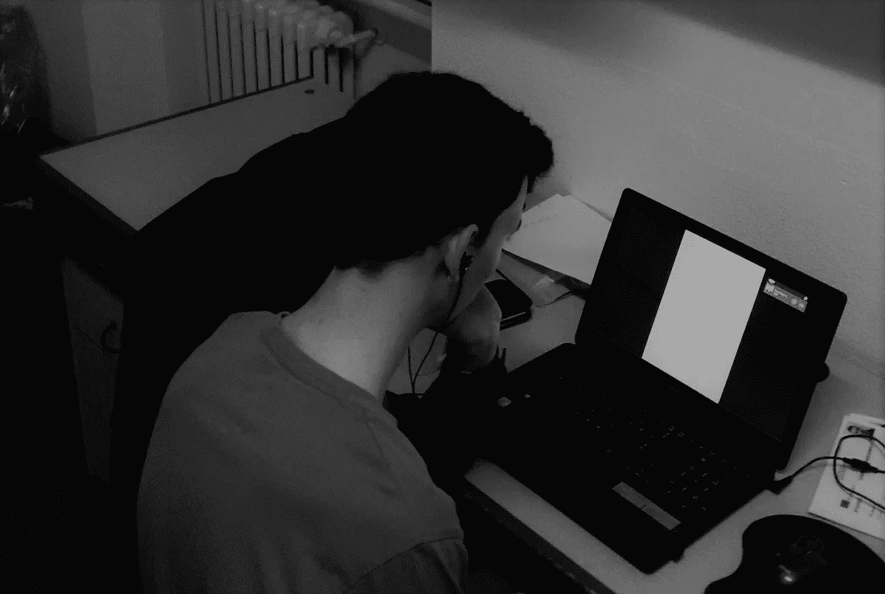
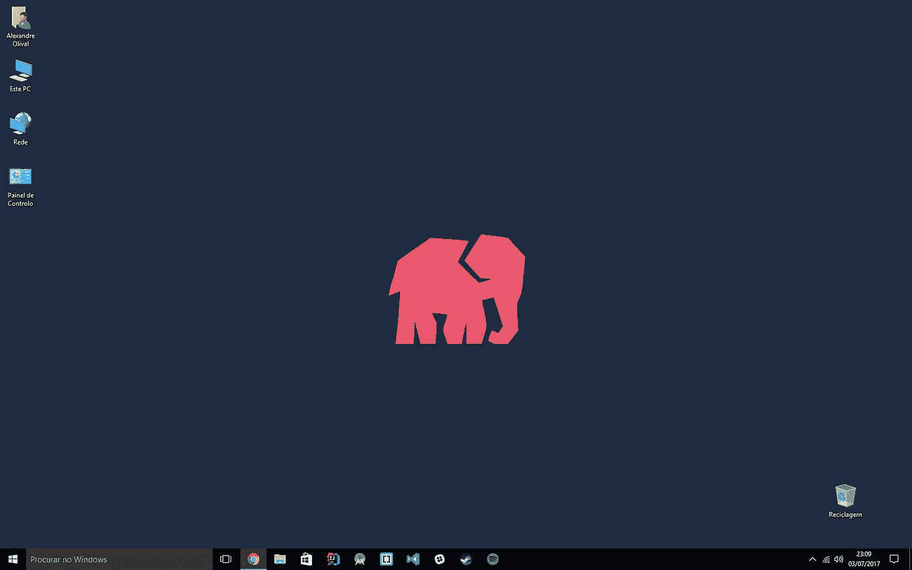

# 精通之路:培养你的激情

> 原文：<https://medium.com/hackernoon/road-to-mastery-nurturing-your-passion-6a273d172158>

Back in 2015, Italy, when I still thought one could do a degree course via Skype. Also, definitely not staged.

我假设我们都在同一页上:你已经读了我的上一篇文章，你找到了你想要的，你确定了你想要追求的职业。你甚至开始修改你选择的技术。你感觉到找到你的甜蜜点和 y- **神圣肮脏的键盘，** **的炒作和满足，我差点忘了这是[在此插入游戏标题]的+25%经验周！！！！啊，见鬼去吧。明天我会读一些我喜欢的东西。或者等这周结束了。然后，我将启动我的 IDE，开始我自己的附带项目，并进行更多的修改。说真的！保证！**

# “懒惰”的问题

就我个人而言，我不认为懒惰(健康的小剂量)是一个问题。具体来说，我不认为它是我在介绍中模仿的那种情况的罪魁祸首。我没有无缘无故地选择电子游戏作为例子。只是跳到你已经喜欢并乐在其中的事情上要容易得多。到了这个地步*即使你不再喜欢它*，它仍然肯定比经历一个缓慢且有时令人昏昏欲睡的过程**更有诱惑力，这个过程就是喜欢并全身心地投入到你的目标中，在你刚刚发现喜欢的技术中变得优秀。**

是的，游戏就是为了让人上瘾而设计的。但是把它作为一个广泛的例子。大多数人似乎忘记的是，我们最终喜欢并爱上的许多东西，如果不是大多数的话，都源于一个过程。想一个你喜欢讨论的系列丛书。一部电视或电影系列片，你喜欢和你的同伴讨论其中的情节。

你的兴趣没有增长到那个深度是偶然的。这些事情最初激发了你对娱乐(游戏、电影、连续剧)、运动(足球、篮球)、知识(书籍、维基百科，而你本该睡觉的时候)的广泛兴趣。就广泛的兴趣而言，可以肯定的是，计算机和/或编程都包括在内。所以，为什么不多走一步，有意识地培养你对该领域更具体的事情的热情呢？喜欢你选择的新语言或新技术！“足球队”到你的“足球”兴趣，如果你愿意。

# 为什么这么难呢？

因为我给你举的每一个例子基本上都是从你出生开始就深深地扎根在你心里的。那是作弊。你从来没有有意识地努力去喜欢娱乐，或者玩或者吃糖果。随后，你要选择你最喜欢核心快乐的哪一部分。几乎就像第二天性。如果你现在对你想要的东西也能有同样的态度，那不是很好吗？你感兴趣的深度达到了这样的程度:你可以轻松地花几个小时谈论 Java 和软件架构，就像你可以花一整个下午争论《天际》中的谢尔格拉是否真的是《湮没》中的角色一样？

请记住，到目前为止，这是非常固执己见的(确实像这个系列应该是)。这只是我对为什么我一直缺乏变得更好和追求自己喜欢的东西的真正动力的解释。很大程度上归结于纪律。但我也发展了这种思维框架——用它我成功地“黑”了我的大脑，以激发我对自己喜欢的东西的兴趣，并让*花时间在其他兴趣上，基本上是从我的行为中窃取。以下是我是如何做到的，浓缩为四个步骤。*

# #1 -开始关注不同的系列

例如，在网上和 YouTube 上有很多关于软件开发的精彩内容。我说的不是录制得很差的屏幕截图，那是一段 12 kbps 的蹩脚英语配音，被你通常在麦克风视频中听到的鼻音所削弱。

This is probably where those videos are made too.

这些都是制作精良，甚至很有魅力的视频，看起来是一种享受。让从深夜网飞到深夜“看我克隆推特”的整个转换变得更加容易和愉快！试试 iOS 版的[这个](https://www.youtube.com/channel/UCuP2vJ6kRutQBfRmdcI92mA)。或者也许是 Java 的[这个](https://www.youtube.com/playlist?list=PLE7E8B7F4856C9B19)。谁会忘记[这个](https://laracasts.com/) -网络上最好的资源之一。

# #2 -在你的卧室电影海报上添加一些科技元素

Check out my PHP swag.

换壁纸！买一件 t 恤。给自己买一个[可爱的吉祥物](https://www.elephpant.com/)而不是[橡皮鸭](https://en.wikipedia.org/wiki/Rubber_duck_debugging)。获得一个 Java cup 标志杯。本质上，我开始把我的技术当成一个体育迷。哦，说到这里:

# #3 -发展粉丝群体(在合理范围内)

说到理智，我的意思是不完全是我提到的体育迷。

Two gentlemen have a civil discussion about which of their respective teams is more likely to score in future games.

拥有一个健康的“粉丝主义”是一个很好的激励工具。但是不要脱离现实。

在我得到我的第一份也是目前的网页开发工作之前，我对 Android 非常感兴趣。拉勒维尔一直是我的第二选择，在我被雇佣后，我觉得我必须做出一些改变。

然而，我很快发现 PHP 的世界并不友好。

框架倡导者和他们自己的创造者之间有很多争论。对经验不足的开发人员有很多不良情绪。可怕的实践和真正不符合任何[提议的标准的真正*真正*糟糕的代码出现了可怕甚至病态的病毒式传播，大多数社区都遵循这些标准](http://www.php-fig.org/psr/)，甚至这些标准也是一些非常丑陋的火焰战争的借口。请注意，我没有在这里命名任何东西，因为我觉得这是不必要的，对问题没有任何帮助。

幸运的是，有很多好的[倡议](http://www.phptherightway.com)来颠覆这个问题。PHP 7 已经发布。它比前一个版本快得多，给这门语言带来了一个复兴的新时代和新鲜空气。我使用的框架 Laravel 处于推动最新和最棒的 web 技术和标准的最前沿，并带动了 PHP 社区的其他成员！ **PHP！！PHP！！PHP！！**🎉🎉🎉

了解是什么让你的技术擅长做什么。了解它的优势和最佳实践。了解它的领导者、倡导者、精英开发者和老师。这引出了我的最后一点:

# #4 -偶像

Bob Martin, aka “Uncle Bob”. This guy is the bomb. [Watch his videos](https://www.youtube.com/results?search_query=uncle+bob&page=&utm_source=opensearch). Do it!

你选择的每一项技术都有自己的英雄。这些都是受人尊敬、崇拜的人物——理所当然如此。这些人对他们提倡或使用的东西有着深刻而非凡的理解。

我们在谈论软件架构的鲍伯·马丁。材料设计的 Roman Nurik。你可以称之为我们的克里斯蒂亚诺·罗纳多。这些人是你应该追随的，因为他们会激励你。你应该关注谁的谈话，你应该窃取谁的代码，你应该吸收谁的观点。

对我来说，那就是泰勒·奥特威尔、菲尔·斯特金、杰弗里·韦和其他一些我最终会找到的人。这些人往往彼此“关系网”很好。

在 Twitter 上跟踪他们，阅读他们的帖子，听他们的播客，并试图获得他们的签名。但最重要的是**向他们学习**，**渴望**达到他们的水平。

# 结论

这一切都归结于培养对你的手艺的兴趣和爱好，就像你对其他东西的兴趣和爱好一样。对你们这些懒人来说，好消息是:就像我们喜欢并拖延的其他事情一样，喜欢这些事情并对其产生兴趣只会变得更容易。这是一个非常强大的滚雪球效应，最终会给你力量，让你在你的行业里变得更专业。

现在我要去看更多关于龙生龙最有可能如何覆盖肖的视频理论。喜欢游戏又懂绝杀的话真的是不用费脑子。

## 后手稿

当我第一次开始这个系列的时候，我从来没有想象过我会得到这么多的浏览和反馈。不仅仅是从我的母校认识我的人那里，还有一些年轻的开发人员或学生，他们向我提供了宝贵的反馈。更不用说被[杂志](https://medium.com/u/4a8a924edf41?source=post_page-----6a273d172158--------------------------------)邀请在那里发表我的故事了。非常感谢你。我想整个正反馈的事情并不是一个模糊的概念。敬请关注更多内容！

> [黑客中午](http://bit.ly/Hackernoon)是黑客如何开始他们的下午。我们是 [@AMI](http://bit.ly/atAMIatAMI) 家庭的一员。我们现在[接受投稿](http://bit.ly/hackernoonsubmission)并乐意[讨论广告&赞助](mailto:partners@amipublications.com)机会。
> 
> 如果你喜欢这个故事，我们推荐你阅读我们的[最新科技故事](http://bit.ly/hackernoonlatestt)和[趋势科技故事](https://hackernoon.com/trending)。直到下一次，不要把世界的现实想当然！

