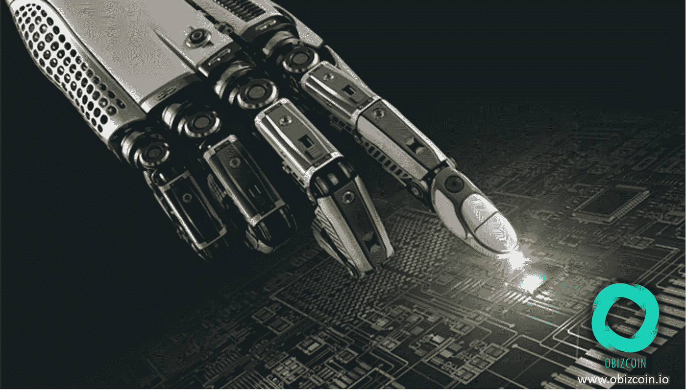
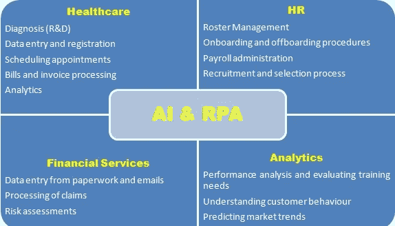

# 机器人过程自动化和人工智能

> 原文：<https://medium.com/hackernoon/robotic-process-automation-artificial-intelligence-b136e9a2f91c>

人类的努力一直是通过提高生产力、效率和有效性来使生活更容易、更快捷、更方便，以实现解决我们的问题和满足我们的需求或目标的更广泛目标。在过去的两个世纪里，这种努力以指数级的速度达到了新的高峰。以汽车为例。直到十九世纪初，我们的祖先还严重依赖动物拉的马车进行陆上运输。当基于发动机的车辆的早期形式开始出现并变得越来越流行时，这些条件经历了戏剧性的变化。为什么这些变得如此流行？因为这些基于发动机的车辆速度更快，可以携带更多的负载，行驶更长的距离，其控制更容易和可预测。在汽车和火车首次出现在这个世界上的两百年后，我们今天在这里，准备进入自动驾驶汽车时代。

自动化并不是一个新现象。我们人类总是倾向于让机器做越来越多的事情，特别是那些机器能做得比我们更好的事情。这就是推动自动化的原因。我们可以在上面引用的例子中看到这一点。在本文中，我们将讨论[机器人过程自动化](https://www.obizcoin.io/)和人工智能的发展和日益增长的优势。

**机器人流程自动化(RPA)**

到 20 世纪的第一个四分之一，工作流自动化已经开始在各种工业和制造单位中找到它的位置。工作流自动化是指用数字化和自动化解决方案取代、减少或简化手动和基于纸张的流程。它对制造单位的生产率、效率和有效性产生了重大影响，其应用最终扩展到其他业务流程，在接下来的几十年里，这些业务流程将越来越依赖于计算机。

到 20 世纪的秋天，企业开始面临传统遗留系统与不断发展的软件工具和应用程序之间不兼容的问题。这导致了使用屏幕抓取软件来弥合新旧之间的差距。然而，它仍然受到许多现有的和不断发展的限制。

RPA 的发展也源于人工智能。虽然人工智能(AI)的想法已经存在了 60 多年，但只是在最近十年左右的时间里，它才开始获得很多关注和动力。人工智能的想法是赋予机器和计算机系统展示类似人类的智能和判断能力，最终实现自动化。

随着所有这些发展对当代自动化技术的范围和规模做出贡献的累积效应，我们今天所拥有的是软件机器人，它们能够通过在各种基于计算机的商业信息和通信系统上工作，在执行各种常规和重复的操作活动中模仿人类行为。通过使用软件机器人实现业务流程自动化是[机器人](https://hackernoon.com/tagged/robotics)流程自动化(RPA)的核心理念。使用 RPA 的各种行业和业务流程包括银行、保险、客户服务、数据输入、通信管理、报告管理等。

*要了解更多关于机器人流程自动化的信息，请点击此处——什么是机器人流程自动化(RPA)？*

**人工智能**

机器智能的概念可以追溯到神话。从那以后，这个人类想象中的虚构物在不同的时代以这样或那样的形式一次又一次地出现。

然而，在 1950 年，艾伦·图灵率先发现机器是否可以表现出类似人类或相当的智能。阿兰·麦席森·图灵是英国科学家、数学家、密码分析师和计算机科学的先驱，也因二战期间破解“谜码”的壮举而闻名。

“人工智能”一词是由约翰·麦卡锡博士在 1956 年的达特茅斯会议上首次提出的。自那以来，人工智能领域一些最重要的引入和发展包括自然语言处理、机器人、神经网络、逻辑和符号推理、专家系统、算法的使用、蛮力计算、智能代理、数据挖掘、搜索引擎、语音识别、机器学习、深度学习、认知、大数据和人工一般智能。我们花了五六十年才到达这里。然而，在过去 10 年左右的时间里，人工智能再次开始在当今商业和技术紧密交织的世界中引起轰动。

*输入源:(1)、(2)、(3)、(4)*

***商业案例:机器人流程自动化和人工智能***

RPA 和 AI 之间的根本区别在于，前者只是一种软件工具或软件程序，用于自动化某一类别的例行和重复性操作活动，否则这些活动将由企业中的员工执行，而 AI 是一个更广泛的概念，用于设计和开发自动化(系统方法)、自学的机器和软件程序，最重要的是，具有处理来自不同来源的不同性质的输入和输出的能力。RPA 和 AI 可以彼此独立存在。但是，AI 可以应用在 RPA 上。这两者结合在一起，可以为商业企业的自动化形成一个强大的工具。下图描述了[机器人流程自动化](https://www.obizcoin.io/) (RPA)和人工智能在不同业务流程和垂直领域的一些高级应用。

***图 RPA 和 AI 的少量应用***

随着人工智能以指数速度发展，并得到谷歌、脸书、亚马逊、特斯拉等大公司以及 ADDO-AI(农业)、ELSA(语言学)、Scry(预测引擎)和 Sig Tuple(医疗保健)等不太知名但潜力巨大的实体在人工智能应用领域的研发活动的支持，不难理解人工智能正在通过让机器越来越智能来重新定义我们如何利用机器。

*输入源:(5)*

*免责声明:上述内容/出版物仅用于提供总体概述，不得用作任何业务或专业判断的依据。*

***输入来源***

*(1)*[*https://en . Wikipedia . org/wiki/Timeline _ of _ artificial _ intelligence*](https://en.wikipedia.org/wiki/Timeline_of_artificial_intelligence)
*(2)*[*https://en . Wikipedia . org/wiki/History _ of _ artificial _ intelligence*](https://en.wikipedia.org/wiki/History_of_artificial_intelligence) **(3)*[【https://en.wikipedia.org/wiki/Alan_Turing](https://en.wikipedia.org/wiki/Alan_Turing)*