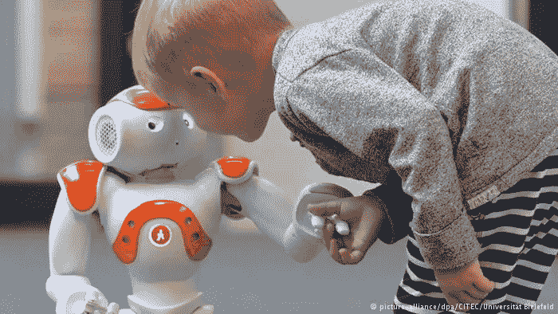
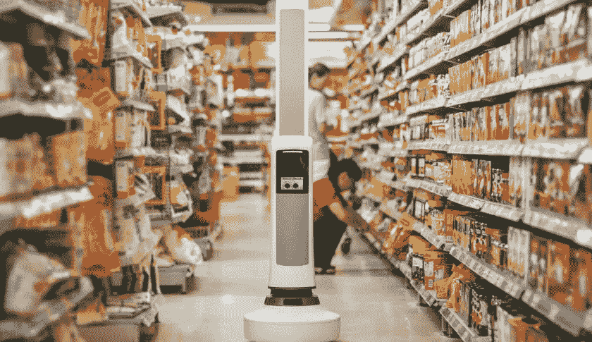

# 机器人现在在做什么？

> 原文：<https://medium.com/hackernoon/robots-are-doing-what-now-ee79bd3273a5>

***火起来服务员，开机老师……机器人工作日到了。在世界各地，机器人扮演的角色比你想象的要多，尤其是在德国和中国。***

也许这是对四面楚歌的教师的最后侮辱:[机器人](https://hackernoon.com/tagged/robots)正在抢走他们的工作。服务员和厨师也是一样，机器人也在做他们的工作。三十年前发生在装配线工人身上的事情现在正在蔓延。机器人正在接管。嗯…

# 甜点菜单上有什么？召唤机器人，我们会找到答案的

在中国，机器人现在也在烹饪拉面并上菜。在一个几十年前还存在严重人口爆炸问题的国家，他们把工作交给机器人似乎很奇怪，但嘿，这是中国。他们自我报告的失业率刚刚超过 4%，如果这是真的，那就相当惊人了。但是专家怀疑这个数字的真实性，估计超过 10%。然而，中国表示其企业很难找到工人。我们可能永远也不会知道真正的真相。

不管怎么说，中国有很多穷人可能会喜欢做一些拉面来赚钱。然而，中国有机器人厨师和服务员。比方说，这也不仅仅发生在一家富有的科技集团总部的自助餐厅里。是全中国中等城市的餐馆。

一位餐馆老板在他的莫利机器人公司安装了 7 个机器人，已经报告了节约成本的好处。他用它们来切面条，招呼顾客，服务顾客。它们每台的价格约为 7400 美元，相当于一台人工服务器一整年的收入。它们可以使用三到五年，当然，除了可能无法每天晚上充满电(需要六个小时)之外，不会给你带来任何麻烦。

# 机器人正在帮助解决德国的难民危机

众所周知，德语很难掌握。因此，想象一下试图吸收所有叙利亚难民儿童的公立学校所面临的困境。多亏了比勒菲尔德大学的研究人员，一个叫做 Nao 的可编程机器人将很快介入帮助。Nao 将教难民儿童德语的基础知识，为他们进入学校做准备，并有朝一日在他们的新国家找到工作。

Nao 对 4 岁和 5 岁的孩子特别有效，它使用平板电脑来帮助它与孩子互动并教授语言。平板电脑上的插图支持 Nao 的《当下的教训》。德国人有望在 2017 年上半年看到 Nao 投入使用。

# 机器人，把手术刀递过来

2015 年以医学上的第一个结束:世界上第一个在机器人帮助下进行的人造血管重建发生在(其他地方)中国。该患者患有胰腺癌，需要在不引起大出血的情况下更换血管。机器人做了手术，但由一名人类医生控制。然而，机器人决定在哪里做切口，为病人留下更小的疤痕。事实上，这种手术通常需要打开整个腹部……多亏了机器人，没有必要了。只要几个针眼大小的洞就完成了。

# 美国柯尔百货公司这次不想被落下

当传统零售商被电子商务的流行搞得措手不及时，他们花了十年时间才赶上并与之竞争。当下一个新零售趋势到来时，许多人不想再次落后。这就是他们投入大量资金进行研究的原因。美国柯尔百货公司就是一个例子:他们正在研究无人驾驶汽车、机器人和无人机，以服务于未来的购物。

他们派工程师在硅谷安营扎寨，显然是为了吸收一切他们能吸收的东西，并把它们带回美国柯尔百货公司。他们还在三年内花费了 10 亿美元，并预计在未来几年内再花费 10 亿美元。他们投资什么？像生物识别和人工智能…不是你通常的东西。它意义深远，不会立即产生影响，但他们希望它能确保他们在未来到来时做好准备。

他们设想机器人在零售店工作，因此人类员工可以专注于销售的更高层次，如客户服务、创造性解决问题和创新。

他们用的是在德国用过的 NAO 机器人……只是这次 NAO 是在向顾客介绍新产品。他们计划让 Nao 分发样品饮料(机器人自己做的)。接下来，他们希望看到机器人进货和盘点库存，以及检查顾客。

# 中国也想在机器人领域引领世界

中国希望成为世界机器人总部，他们正在努力实现这一目标。工业和技术部副部长已经对他的办公室的使命做出了大胆的声明:使国家机器人化，成为世界上机器人和智能设备的主要生产商。其他中国官员预测，到 2020 年，他们将有超过 40 万台机器人投入使用。他们已经赢得了主办世界机器人大会的荣誉。从实验室快速走向现实，中国科学家正在兑现这些承诺。美国柯尔百货公司正在尽自己的努力跟上，现在让我们看看世界其他国家会做出什么。

更多信息请访问我的博客

我最近的帖子:

*   [切断线缆 2.0:无线电话革命](http://outofoffice.today/2016/01/11/cutting-the-cord-2-0-the-wifi-phone-revolution/)
*   【2016 年，企业主现在有一种新的网络犯罪需要担心
*   [雅虎的玛丽莎·梅耶尔看到计划被否决，生下双胞胎](http://outofoffice.today/2015/12/18/yahoos-marissa-mayer-sees-plan-rejected-gives-birth-to-twins/)
*   [电子书，纸质还是两者都不是？](http://outofoffice.today/2015/12/08/e-book-print-or-neither/)
*   [Qwerty、Dragon 和 Football:为什么我们仍然没有使用密码管理器](http://outofoffice.today/2015/12/03/qwerty-dragon-and-football-why-we-are-still-not-using-password-managers/)
*   [这是埃隆·马斯克拯救世界远离肮脏能源的最新方法](http://outofoffice.today/2015/11/24/here-is-elon-musks-newest-way-of-saving-the-world-from-dirty-energy/)

> [黑客中午](http://bit.ly/Hackernoon)是黑客如何开始他们的下午。我们是阿妹家庭的一员。我们现在[接受投稿](http://bit.ly/hackernoonsubmission)并乐意[讨论广告&赞助](mailto:partners@amipublications.com)的机会。
> 
> 如果你喜欢这个故事，我们推荐你阅读我们的[最新科技故事](http://bit.ly/hackernoonlatestt)和[趋势科技故事](https://hackernoon.com/trending)。直到下一次，不要把世界的现实想当然！

