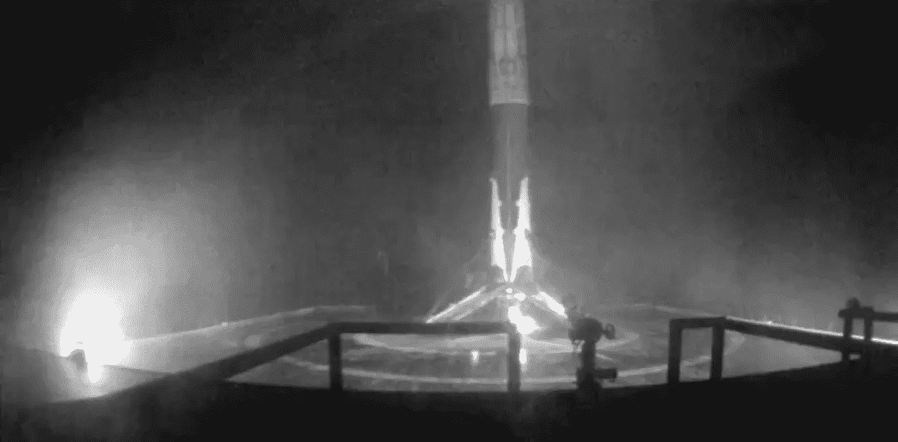
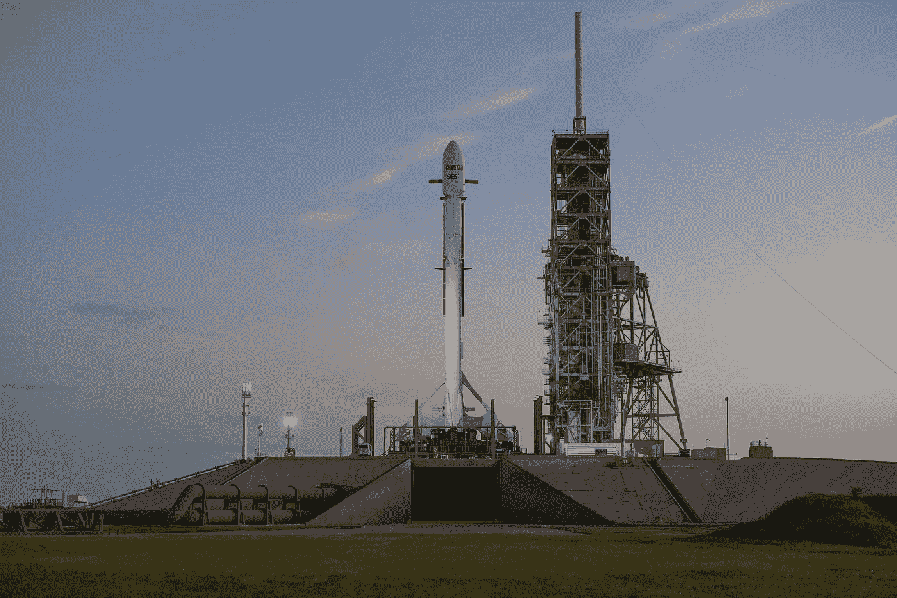
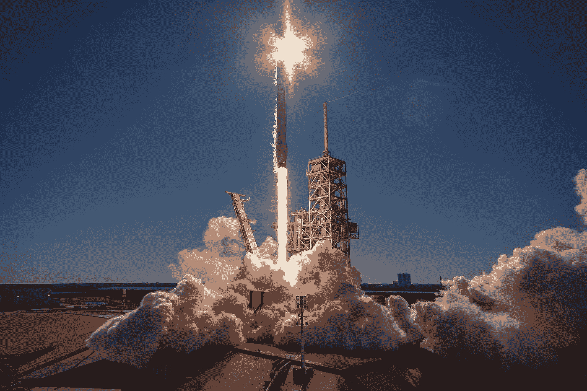
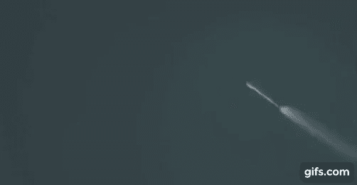
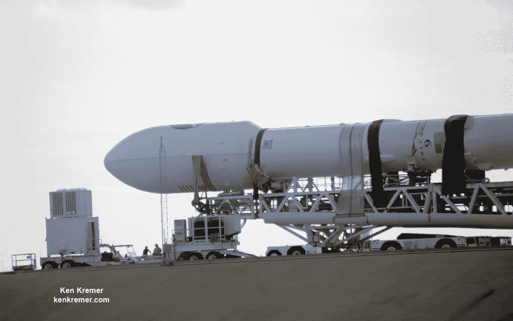
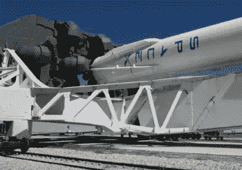
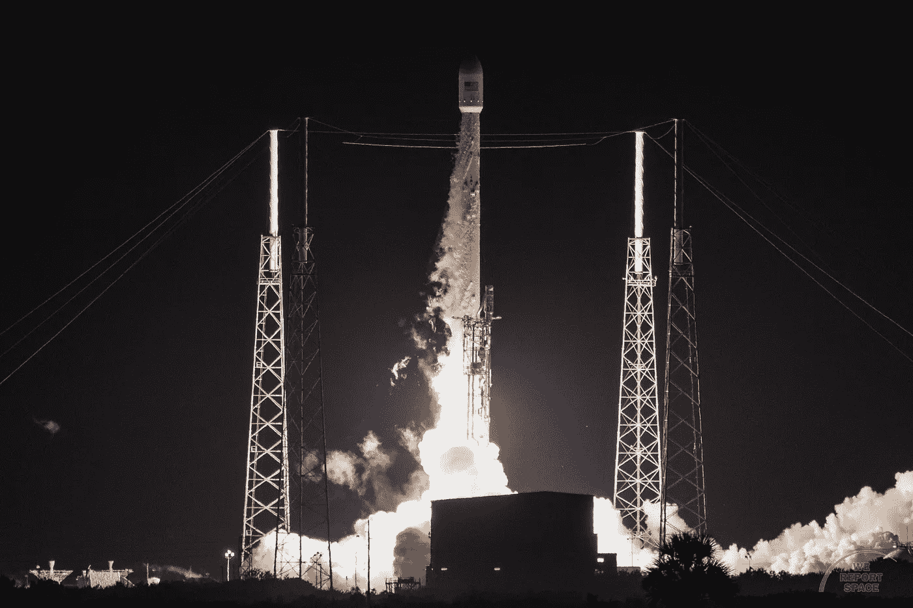
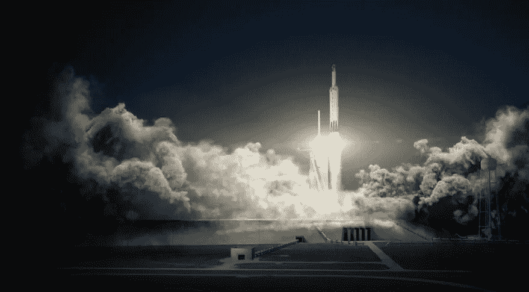

# 与 SpaceX 一起飞速前进

> 原文：<https://medium.com/hackernoon/rocketing-ahead-with-spacex-3872f86bfdf8>

在经历了相对平静的夏末之后，SpaceX 在 2017 年 10 月再次启动了节奏——以三次成功的任务结束了这个月。cadence 在这一年表现出色，许多人对该公司的能力和耐用性感到震惊，直到最近，该公司还被认为是航空航天业的弱者。

10 月 9 日，SpaceX 在加利福尼亚州的范登堡 AFB 发射了铱星 3 号。这次发射将第三组 10 颗卫星送入目标轨道。铱星下一个星座是一个最先进的卫星星座，围绕地球的低地球轨道运行，提供包括空中和海上跟踪以及物联网和卫星电话通信在内的服务。它将由 72 颗独立卫星(其中 6 颗是在轨备用卫星)组成，每次发射 10 颗。继 10 月初的发射后，猎鹰 9 号助推器返回地球，并成功降落在太平洋上的“只需阅读说明”。

[编辑:根据这份 2017 年 1 月[的新闻稿](http://investor.iridium.com/releasedetail.cfm?ReleaseID=1009711)，铱星公司向其星座增加了 3 颗卫星，使其在轨备用卫星数达到 9 颗，卫星总数达到 75 颗。]

Iridium-3 Booster Stage on the “Just Read the Instructions” after landing (SpaceX)

两天后，10 月 11 日，SpaceX 从美国宇航局位于佛罗里达州的肯尼迪航天中心的 39A 发射中心将 EchoStar 105/SES-11 卫星发射到地球静止转移轨道(GTO)。这次发射利用了一个经过飞行验证的助推器，该助推器曾在 2017 年早些时候将 SpaceX 的第 10 个国际空间站补给龙胶囊送往国际空间站。EchoStar 105/SES-11 是一颗双重任务卫星，由美国的 EchoStar 和卢森堡的 SES 运营。它向北美大陆提供电视和其他通信能力。在将第二级和有效载荷送入太空后，助推器再次返回地球，降落在大西洋的“我当然还爱你”上。

The Falcon 9 carrying the EchoStar 105/SES-11 satellite prior to launching (SpaceX)

10 月结束时，SpaceX 于 10 月 30 日在佛罗里达州美国宇航局肯尼迪航天中心的 39A 发射中心发射了 Koreasat-5A 卫星。Koreasat-5A 取代了老化的 Koreasat-5 卫星，将在亚洲和中东部分地区提供电视、宽带和其他通信服务。它还将覆盖波斯湾、印度洋、南中国海和东中国海，这是韩国舰队中这颗卫星独有的功能。在将第二级和有效载荷送入太空后，助推器在穿过地球大气层的高能返回后，降落在大西洋的“我当然还爱你”上。这标志着今年的第 16 次成功发射，是该公司之前年度发射记录的两倍。

Falcon 9 lifting the Koreasat-5A satellite into orbit (SpaceX)

事实上，从许多方面来看，2017 年对 SpaceX 来说都是辉煌的一年，也可以说是航天未来的一年。以下是 2017 年发生的显著里程碑:

*   1 月 14 日—铱星 1 号卫星。2016 年 9 月 1 日 AMOS-6 测试异常后返回飞行。经过 4 个月的停工以调查猎鹰 9 号在静态火力测试准备期间的损失，这次从范登堡起飞的飞行标志着铱星下一步部署的开始，并导致在太平洋上自动支援无人机船上的首次成功着陆尝试“只需阅读指令”。这个助推器将在六月再次飞行。
*   2 月 19 日— CRS-10 国际空间站补给任务。这是 LC-39A 发射综合体的首次私人使用，它曾被用于将人类送上月球和发射航天飞机。这个助推器将返回 LZ-1 着陆，并在 10 月再次飞行。
*   3 月 30 日—SES-10 通信卫星成为第一颗通过飞行验证助推器发射进入轨道的卫星。该助推器最初用于为 CRS-8 将龙货运胶囊发送到国际空间站，并且是第一个降落在无人驾驶飞船上的助推器。在将第二级和有效载荷送入轨道后，该助推器再次返回地球并成功着陆。这也是 SpaceX 首次在同一个月内发射两个有效载荷，距离上次发射 EchoStar 和这次在同一个发射台上发射仅 2 周。
*   5 月 1 日— SpaceX 发射了他们的第一个国家侦察局有效载荷(NROL_76)。公众第一次看到了助推器分离并从地面返回着陆区 1 的镜头。由于有效载荷的秘密性质，网络直播的观众无法观看第二级燃烧或展开。

NROL-76 Booster Separation as seen from the ground

*   6 月 3 日——CRS-11 国际空间站补给任务。这次任务标志着轨道级商业航天器的首次重复使用。此次任务的压力容器之前在 2014 年 9 月的 CRS-4 任务中飞行过。至少重复使用货运龙飞船的压力容器部分的能力允许更多的注意力花在乘务龙计划上。
*   6 月 23 日—保加利亚卫星 1 号。这次任务是经过飞行验证的助推器的第二次点火。该助推器曾在一月份用于发射铱星-1 号卫星。在成功将第二级送入轨道后，该助推器返回地球，成为第一个在两个 droneships 上着陆的助推器。
*   6 月 25 日—铱-2。铱星 NEXT 星座的第二组 10 颗卫星也是 6 月份的第三次发射，也是在同一个周末的第二次发射(来自全国各地)。尽管非常具有挑战性的天气和海洋条件要求在发射前重新定位 JRTI 号，但这个助推器还是安全着陆了。
*   7 月 6 日——国际通信卫星组织卫星。重量为 6 761 公斤(14900 磅)，这是 SpaceX 有史以来最重的 GTO 任务。猎鹰 9 号以消耗模式(没有腿或网格鳍)发射，以便将有效载荷运送到至少 31 230 公里(19405 英里)的非常具有挑战性的高度。猎鹰 9 号超过了这个最小值，并将有效载荷送入了比预期更好的轨道。
*   8 月 24 日—福尔摩沙 5 号卫星。在打破他们最重发射记录后不久，SpaceX 发射了 F9 有史以来最轻的有效载荷。福尔摩沙 5 号是一种传统发射，原本打算由一种更小的猎鹰变体搭载。
*   9 月 7 日——美国空军 OTV 5 号宇宙飞船。在他们今年的第二次机密任务中，SpaceX 有史以来第一次为美国空军的 OTV 5 号任务发射了波音制造的 X-37 航天器。这次任务还首次在运输竖立发射装置(TEL)上安装了一个新的整流罩/有效载荷支持附件，大概是为了保护相当笨重和精密的 X-37 航天器。与以前的 NROL 任务一样，第二阶段操作和有效载荷交付的镜头没有向公众公开。

OTV-5 mission rolling out to the launch pad featuring new payload support brace (Ken Kramer)

*   10 月 9 日和 11 日——铱星 3 号和回声星 105/SES-11 号卫星。这些发射标志着 2017 年的第二次双头发射，仅两天后，铱星 3 号从加利福尼亚州范登堡发射，回声星 105/SES-11 号从佛罗里达州美国宇航局肯尼迪航天中心的 39A 发射中心发射。此外，如前所述，SES-11 助推器已经在今年早些时候为 CRS-10 进行了飞行。
*   10 月 30 日— KoreaSat-5a 卫星。这次发射标志着 2017 年的第 16 次成功发射，是 SpaceX 之前年度发射纪录的两倍。这也是今年猎鹰 9 号第一级的第 13 次着陆(今年有 3 次飞行是消耗模式)。

人们有理由认为，在经历了如此多事的一年之后，随着假期的迅速临近，SpaceX 可能准备退出几个月，直到新年。然而，到 2017 年底，它们仍将保持强劲势头。

接下来他们的发射清单是相当神秘的祖玛发射。虽然可以假设 SpaceX 很好地了解了这次发射好几个月，但公众只是最近才在联邦通信委员会获得发射许可证时才知道这次发射。即使这样，客户也有一段时间不为人所知。

最终，有效载荷的提供者是诺斯罗普·格鲁曼公司，这是一个政府有效载荷。发射定于美国东部时间 11 月 15 日晚上 8 点，从 LC-39A 发射。鉴于有效载荷的秘密性质，有理由预计第二级摄像机也不会公开。

Falcon Heavy hold downs visible on the TEL with F9 booster (nasaspaceflight.com)

祖马将是 LC-39A 今年的最后一次发射，之后将立即关闭，进行一些最后的修改，以支持新的猎鹰重型火箭。最初，预计一旦 SLC-40 重新上线，LC-39A 复合体将不得不离线约 60 天来完成修改。然而，SpaceX 一直在尽一切努力消除这种停机时间。最近的照片显示，FH 的大部分压制已经到位。最后的修改包括电话上的焊接工作和额外的管道和线路。

12 月，SpaceX 将返回 SLC-40，执行 CRS-13 国际空间站补给任务。一旦该发射台投入运行，预计大多数单核心任务将从那里发射，但乘员任务除外。但是，如果时间安排发生冲突，LC-39A TEL 将能够支持任何单核发射。

JCSAT-16 launching from SLC-40 in August 2016\. This was the last launch from the pad before the testing anomaly ( Michael Seeley for We Report Space)

在 11 月下旬的某个时候，SpaceX 希望在 LC-39A 发射台提高 FH，进行初始装配测试。在适应性测试之后，SpaceX 将对该飞行器的首次发射进行湿式彩排。这次演习将涉及激活所有的发射系统和给车辆加油，并选择继续进行静态点火测试——在测试中，发动机被启动并达到最大推力，然后在不释放火箭的情况下关闭。

这些测试对发射的成功至关重要，因为 FH 的大部分都是新的领域。猎鹰重型在许多方面是三个猎鹰 9 号火箭捆绑在一起(虽然，中心核心有许多结构上的增强)。然而，火箭系统的燃料供应、通信和操作作为一个单一的单元，以前从未被执行过。事实上，没有一家美国公司同时启动过 27 个火箭发动机。目前，LC-39A 发射台是唯一可以组装和测试 FH 的地方，这使得 SLC-40 在进行 FH 发射前必须重新上线。

随着对 FH 系统复杂性的理解，SpaceX 已经预算了足够的时间来进行至少两次湿式彩排，以便进行任何必要的修正。目标是在今年发射猎鹰重型火箭，目前最早的发射日期是 12 月 29 日。如果一切都比预期的好，它有可能“向左拉”到更早的日期，但许多人预测它将滑入 1 月初。

Artists conceptual image of Falcon Heavy launch (SpaceX)

不管发射日期如何，人们对一次伟大的首航充满期待。猎鹰重型火箭的清单上有 3-4 个额外的任务，这将是地球上最强大的作战火箭的成功与否取决于很多因素。有什么比观看 2 个(助推器)陆地着陆和 1 个(助推器)海上着陆更好的方式来预示充满载人飞行、多次猎鹰重型发射和预计 30 次总发射的新的一年呢？

克里斯·罗杰斯是 SpaceX 的狂热爱好者，也是私有化太空飞行的狂热爱好者。他的目标是撰写文章，让外行人和刚刚开始关注新航天产业的人能够接触到与航天相关的新闻和事件。

你想了解更多吗？以下是 SpaceX 信息的一些重要资源:

*   [SpaceX 官网](http://www.spacex.com)
*   [SpaceX 推特](https://twitter.com/spacex) / [埃隆马斯克推特](https://twitter.com/elonmusk)
*   [SpaceX Instagram](https://www.instagram.com/spacex/)
*   [非官方的脸书 SpaceX 爱好者团体](http://www.facebook.com/groups/spacexgroup/)
*   [风扇运转的 SpaceX 子轨道](https://www.reddit.com/r/spacex/)
*   [NASASpaceFlight.com SpaceX 论坛](https://forum.nasaspaceflight.com/index.php?board=45.0)