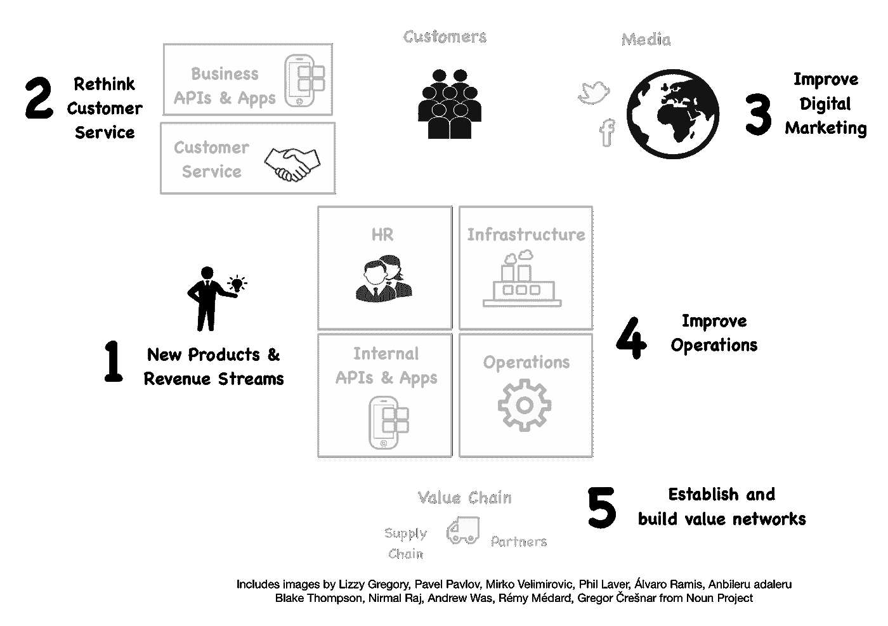

# 分析在数字业务中的作用

> 原文：<https://medium.com/hackernoon/role-of-analytics-in-a-digital-business-e4762b20272f>

当有人告诉我他想做分析时，我说这很容易。我可以在五分钟内解释清楚。然而，如果有人说他想用分析来改变一个组织，我的反应是“你还有多长时间？”。

这并不容易。让我们剖析一下如何做到这一点。

# 数字商业

有一个新的流行词:数字业务。那是什么？

这个想法源于一些成功重新思考世界的企业。

1.  优步在没有汽车和雇佣司机的情况下建立了一家出租车公司
2.  Airbnb 在不拥有房间或酒店的情况下建立了酒店服务。
3.  媒体和零售业(如亚马逊、易贝)已经被数字化改造。

我们称这样的业务为“数字业务”。他们利用数字技术从根本上重新思考做生意的方式。成为这样一家企业的路径被称为“数字化转型”。(我不知道为什么是数字化转型，而不是更受关注的数字化业务)。

以下是三个很好的参考。和其他秃鹰一样，它们对“数字化转型”的理解也略有不同。与此同时，有足够的人口普查使它变得有用。

 [## 下一期:经济时事通讯-奥赖利媒体

### 我们都听说过这样的故事，有人虔诚地跟随他们的 GPS 离开一座不再存在的桥。请记住…

post.oreilly.com](http://post.oreilly.com/form/oreilly/viewhtml/9z1z8k52id7i53r7kes1fq0bh1hcg6stk0e0adgtvt8)  [## 如何驾驭数字化转型

### 一个组织本质上是其物质、财务、人力、智力和关系资本的总和…

hbr.org](https://hbr.org/2016/06/how-to-navigate-a-digital-transformation)  [## 构建数字商务技术平台

### 企业需要哪些技术构件来支持数字业务？该报告详细介绍了首席信息官如何…

www.gartner.com](https://www.gartner.com/doc/3340817/building-digital-business-technology-platform) 

# 为什么？

我们为什么需要这个？新技术让我们开心，让我们联系在一起。然而，并不是所有人都觉得有趣。2102 年《麻省理工技术评论》的标题是“你答应给我火星殖民地，但我们得到的是脸书”。许多人认为，尽管娱乐，新技术未能带领我们取得根本性的进步。

 [## 巴兹·奥德林宇航员阿波罗 11 号，双子座 12 号“麻省理工学院技术评论:探索的必要性

### 麻省理工科技评论作者:巴兹·奥德林随着阿波罗 11 号登陆月球迈出了我们的第一小步…

buzzaldrin.com](https://buzzaldrin.com/mit-technology-review-the-imperative-to-explore/) 

像互联网这样的技术无处不在。然而，批评者认为，这些技术未能从根本上改变我们的生活。他们也没有像工业革命时期那样提高效率。

希望围绕数字的重新定义可以带来那些缺失的效率，让我们跨越到未来。不用说，如果任何组织能够做到这一点，他们将把竞争对手远远甩在身后。因此，这不是一个很好的选择。任何希望在 10-20 年内生存下来的组织都必须这样做。

像优步这样的公司，如果运作得当，可以改变我们的生活方式。例如，优步为我们提供了一个没有汽车也能生存的未来，减少了交通流量，降低了成本。

# 数字业务中的分析

三类数字技术可以在这一转变中发挥作用:分析和人工智能，社交移动和物联网，众包。这篇文章探讨了分析(和人工智能)的作用。

下图展示了数字业务的组成部分。这绝不是唯一的代表。然而，下面的图片捕捉到了在数字业务下讨论的大多数想法。此外，它还列出了分析可以在企业中发挥重要作用的五个领域。

接下来的部分将详细探讨每一个。

# 改善运营

关键思想是收集关于组织的数据，并使用它们来改善运营。这是最广泛讨论的分析的好处。没有明说的假设是，该组织有许多虚构和低效率。我相信你们大多数人都会同意这是真的。

有许多用例属于这一类。以下是一些例子。

1.  预测性维护—生产线、设备、车队、站点
2.  优化、调度和响应问题。确保合适的人扮演合适的角色，并且他可以获得他需要的一切。
3.  欺诈检测和防范
4.  人力资源分析:寻找最佳候选人，筛选候选人，绩效评估分析和主动干预，流失预测
5.  安全和监控

优化的关键是知道测量什么。我们使用术语 KPI(关键性能指标)来描述这些度量。KPI 是一个简单的指标，代表了情况的一个重要方面。

煤矿中的金丝雀就是 KPI 的一个很好的例子。几年前，一名矿工把金丝雀和其他小鸟带到煤矿里。这些鸟对氧气含量非常敏感。如果氧气含量低，他们会被击倒。然后人类有一个提前警告冲出矿井。

以下是 KPI 的其他示例。

1.  一个国家的国内生产总值和预期寿命
2.  零售店每平方英尺的收入，组织中每个员工的收入
3.  营销中的客户终身价值(CLV)和客户获取成本(CAC)。

然而，鉴于 KPI 只能看到一部分情况。因此，狭隘地关注 KPI 会导致产出不理想。为了解决这个问题，安迪·格罗夫(英特尔)在他的书[“高吞吐量管理”](https://www.amazon.com/dp/B015VACHOK/ref=dp-kindle-redirect?_encoding=UTF8&btkr=1)中提出 KPI 应该成对使用。第一个 KPI 应衡量产出(如处理的索赔计数)，第二个 KPI 应衡量质量(如发生的错误)。两个 KPI 一起提供了组织的整体视图。

大多数领域都有定义良好的 KPI。定义新的 KPI 是一项艰巨的工作。在优化之前，您必须定义 KPI。然后，您需要衡量它们，或者找到一种近似 KPI 的方法。你需要衡量的不是容易衡量的，而是有用的。

> 事实不会因为被忽视而不复存在。—阿尔多斯·赫胥黎

当你找到了正确的 KPI，剩下的就相对容易了。我们可以使用 KPI 来发现问题，提出并应用解决方案，并使用 KPI 来发现它们的有效性。我们可以持续应用该流程来改善运营。

# 接近你的顾客

分析可以优化组织与客户的互动，并创造新的动力。这可能以多种形式发生。

1.  分析客户-产品交互可以改善产品的功能和用户体验。(例如，给咖啡机添加定时器)。
2.  定期向客户发送包含关键使用模式和见解的电子邮件。它还将为交叉销售和追加销售提供机会。
3.  与产品相关的应用程序提供了与客户沟通的渠道。例如，客户可以使用该应用报告任何问题，提供反馈，并安排约会。同时，你可以用这个应用程序让他随时了解信息，推送优惠和广告。
4.  通过社交媒体联系客户，关注他，了解他的喜好、厌恶和情绪。这些见解可以用来做出产品决策。例如，如果客户在你的产品中使用其他产品，也许你需要与另一家公司合作或者创造一个有竞争力的产品。此外，同样的数据可以用来跟踪情绪，了解品牌的兴衰。
5.  在其他客户遇到问题之前发现问题并主动解决问题，并主动向其他客户推送更新。
6.  定期与客户保持联系会让你开展有效的营销活动。例如，我们可以在客户密度高的地区举办活动。这创造了网络效应，带来了更多的销售。例如，当您向医院捐款或赞助学校活动时，我们可以邀请一些客户。
7.  创建用户组，让顾客互相交流，互相学习。你会发现网络效应促使它们被更多人采用。梅赛德斯-奔驰俱乐部就是这种想法的一个例子。然而，在社交媒体的世界里，这些俱乐部可以比以前更便宜地运营。

# 改善营销和销售

营销是侦察兵，销售是猎人。客户通常从网站的访问者开始。营销通过多种方式带来新访客。

1.  创建潜在客户感兴趣的内容，并在网站上发布
2.  参与潜在客户创造活动，如研讨会、赞助活动、外部出版物等。
3.  数字广告
4.  电视、短信和平面媒体广告

然后，营销通过时事通讯和其他活动识别、跟踪和培养访问者。销售人员在做好准备时参与销售。随着销售线索在营销和销售渠道中流动，分析可以识别和跟踪它们。

以下是分析可以做的一些事情。

1.  通过根据销售线索的有效性对其进行排序，优化销售线索培育所花费的时间(例如，使用历史数据的机器学习模型)。
2.  跟踪、分析和了解发布内容的有效性，了解流量来源和流量的影响
3.  开展高效的数字媒体活动
4.  使用从客户互动中收集的数据绘制客户旅程，使我们能够了解客户并引导他们完成旅程。这包括推荐最佳材料(例如，来自同一领域的其他客户，做类似事情的其他人)，并帮助他们尽快完成销售过程。此外，透视客户档案，让他们与正确的客户建立信任。
5.  了解客户的实际位置，并利用这一点来优化一对一的互动。
6.  跟踪与产品相关的主题，并制作利用这些主题的内容

# 创造新的收入来源和产品

在这个话题下，你能做的事情没有限制。以下是一些口味。

**智能产品**

有些产品需要人来调整，很难把它们做好。机器学习可以带走负担。例如

*   一个能自动决定烹饪时间和调节温度的烤箱
*   决定洗涤周期并优化用水的洗衣机
*   针对能源账单和舒适度进行优化的智能产品(例如 Google Next)

**新体验**

*   Bose 耳机，让您在嘈杂的环境中通话
*   合适的小配件——合适的钻头、鞋子等
*   Camara 使用多个小型相机，并使用机器学习来组合图像，以产生高质量的照片
*   让您远程控制或检查产品状态(我是否关闭了烤箱、加热器、熨斗？)
*   提供新的输入方法(例如，拍照代替打字或通过语音告知)

**解决一个问题**

*   保存有里面物品清单的冰箱
*   追踪您忘记的东西(钥匙、钱包)
*   监控(例如，最后一次移动某物是什么时候)
*   配药器提醒你吃药
*   测量含量(如糖摄入量)的杯子
*   可追踪钱包、背包
*   用于分析、推理和诊断的数字双胞胎—[http://www . BBC . com/autos/story/2017 02 14-喷气发动机是如何制造的](http://www.bbc.com/autos/story/20170214-how-jet-engines-are-made)

# 创建价值网络

当你经营一家企业时，你创建了一个由许多不同的人和实体组成的网络。很有可能这个网络可以发挥更大的作用，成为你的优势。这个连接客户、组织、供应链和分销链的网络被称为价值网络。

例如，沃尔玛向供应商提供关于其产品的详细分析，让他们改进产品。这种分析为与沃尔玛合作的供应商带来了增值优势。同样的想法也可以用于许多企业，在这些企业中，你不仅可以使用智能，还可以将智能传递给其他方。

一个公司价值网络可能会提供一个创造和销售新产品的绝佳机会。一个很好的例子是 Nespresso 案例研究，雀巢公司利用他们的分销链销售浓缩咖啡机，以及他们如何设法通过咖啡盒捍卫收入流。

此外，可能还有其他产品与您的产品一起销售。例如，许多婴儿用品(尿布和湿巾)或者比萨饼皮和奶酪放在一起。理解它们可能会给你带来一些机会。

1.  你可以通过创造新产品来竞争，并利用你的分销渠道来销售
2.  与其他产品的供应商达成协议，或者分享你带给他们的销售收入，或者分担营销成本。
3.  与供应商谈判，给你的客户一个更好的交易。

最后，通过价值链收集的信息可能是有用的。例如，分销链可以提供关于用户的人口统计数据或他们的接受情况。

# 结论

做分析很容易。然而，使用分析很难改变组织，也很难真正改变世界。数字商业的概念使这个问题成为焦点。

这篇文章试图全面地看待组织，并讨论如何使用分析来重新思考如何做生意。Post 有意不讨论如何做(技术上)，而是试图用一些用例来涵盖做什么。

希望这有用。如果你有任何想法或想到新的用例，我喜欢通过评论听到它们。

> [黑客中午](http://bit.ly/Hackernoon)是黑客如何开始他们的下午。我们是 [@AMI](http://bit.ly/atAMIatAMI) 家庭的一员。我们现在[接受投稿](http://bit.ly/hackernoonsubmission)并乐意[讨论广告&赞助](mailto:partners@amipublications.com)机会。
> 
> 要了解更多信息，[请阅读我们的“关于”页面](https://goo.gl/4ofytp)，[在脸书上点赞/给我们发消息](http://bit.ly/HackernoonFB)，或者简单地说， [tweet/DM @HackerNoon。](https://goo.gl/k7XYbx)
> 
> 如果你喜欢这个故事，我们推荐你阅读我们的[最新科技故事](http://bit.ly/hackernoonlatestt)和[趋势科技故事](https://hackernoon.com/trending)。直到下一次，不要把世界的现实想当然！