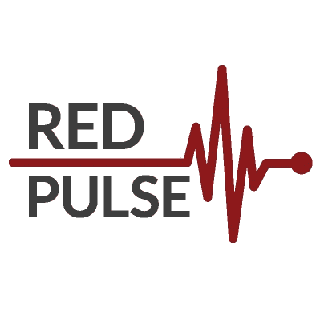

# 红色脉冲 ICO 的过山车

> 原文：<https://medium.com/hackernoon/roller-coaster-of-red-pulse-ico-e20137c0d97e>

最令人期待并被称为近地天体平台上第一个 ICO 的红色脉冲 ICO 计划于美国东部时间 10 月 8 日 0900 时启动。仅在一小时后的 6 分钟内，它就达到了 1500 万美元的硬上限。

## 大肆宣传

红色脉动被吹捧为第一个基于所谓的“中国以太坊”的 ICO。然而，随着中国禁止 ico 和比特币交易所，给相信并准备投资 Red pulse 的投资者带来了太多困惑。

正如所料，红脉冲团队已经发出通信，表示他们需要推迟 ICO，直到所有的规定都得到满足。这是一个充满希望的决定，因为它有助于向客户和投资者保证他们对合规的承诺，并避免以后政府不必要的阻碍。

## **验证& KYC**

优秀的 ico 有一个有趣的地方，那就是他们非常重视 KYC。如前所述，为了遵守所有规则，Red Pulse 限制了来自美国、新加坡和 Mainland China 的投资者(因为新的 ICO 禁令已经实施)。他们进行了严格的 KYC，只批准那些提供了护照或身份证等适当居住证明的候选人。

> 对什么是加密货币，什么是区块链技术感到困惑？前往我们由人工智能驱动的教育聊天机器人【https://m.me/confusedcoin 

 [## 人工智能信使聊天机器人

### 回答您关于加密货币的基本问题

m.me/confusedcoin](https://m.me/confusedcoin) 

## T — 1 个月

一旦核实工作全部完成，法律得到遵守，他们宣布新的 ICO 日期为 2017 年 10 月 8 日。所有的指示都计划在一小时前发出。Redpulse 团队的 Sombat 和 Jonathan 一直活跃在 Slack 频道。还让 [crypto cointrading](https://medium.com/u/47304d15045b?source=post_page-----e20137c0d97e--------------------------------) 担任他们在 Slack 频道的社区经理——他一直保持着这个速度，并回答了投资者提出的大部分问题。

## T — 1 周

RPX 团队提出了一个新的转折，称投资者需要一个新的 NEO_GUI_RPX 来参与代币销售，因为所有现有的 NEO 钱包都不支持代币销售。这反过来是一个痛苦的过程，从 github 下载软件，下载 chain.acc 文件(这加速了同步)并更新你的。net 框架。(记得禁用所有防火墙并以管理员身份运行)——等等，作为一个不知道以上所有意思的普通投资者——肯定会害怕。即使你对计算机和如何使用它们略有所知，你也会对如此多的安全放松感到困惑和偏执。忘了说，这个只在 windows 机器上有效！Mac 和 Linux 用户需要安装虚拟机并完成它。

## t-2 小时

RPX 团队发出了一份通知，让所有 mac 用户松了一口气，通知说:[锡安城](https://medium.com/u/f0cacbf7f71d?source=post_page-----e20137c0d97e--------------------------------)发布了一个令人惊讶的公告，将更新 NEON wallet，以兼容 NEO 平台上的代币销售。那是一个非常幸福的时刻！至少对我来说是这样的(即使是在花了一天一夜的时间安装 windows wallet，导入 NEON wallet，同步它并无限量地重建索引之后)。我们应该感谢[锡安城](https://medium.com/u/f0cacbf7f71d?source=post_page-----e20137c0d97e--------------------------------)的努力，他们的解决方案简单而有效，不需要太多的配置，“就能工作”。

## 25 分钟后

我们需要一个脚本哈希来参与代币销售。Red Pulse 团队决定在出售前 25 分钟发送这个脚本散列，并向所有列入白名单的投资者发送了一封邮件。这里的另一个变化是，他们没有直接包括 hash 有一个链接，点击后会要求您接受协议、名字、姓氏、地址、城市、州、国家，然后提交。

首先，大约有 5000-10000 人同时打开网站。RPX 团队应该扩展网站，以满足至少 50K 个请求，因为他们知道有多少人会打开网站(从 slack/telegram 频道的会员账户)——网站崩溃。Cloudfare 开始抛出 504 错误。即使刷新几分钟后，提交按钮也不起作用，因为它在后台再次显示 504 错误。

## 10 分钟后

Slack channel 公告—新邮件将包含直接脚本哈希。当我们读到这条消息时，只有 9 分钟了，恐慌加剧了。点击网站上的刷新现在移到了电子邮件客户端——随着时间的流逝，急切地等待脚本散列。slack channel 上的 Sombat 非常擅长直播他们那边发生的事情——沟通非常清晰，他会及时向投资者适当地更新他们将收到的内容。他还提到脚本哈希将看起来像这样**0x ECC * * * * * * * * * * * * * 1d F9-这有助于避免一些随机用户的网络钓鱼。虽然没有多少人知道代币销售在 NEO 平台上如何工作，以及脚本哈希在其中扮演什么角色。**

## T-1 分钟

在美国东部时间上午 8:59 分，我们收到了包含脚本哈希的邮件——就是这样。一个人必须复制它，进入你的硬安装的 windows RPX GUI 或 Mac 上的 NEON wallet，粘贴到提到的空间，输入低于 27 的 NEO 金额(第一个小时每个帐户的硬上限)，然后“提交出售”。

在第一个小时结束时，几乎 70%的目标已经实现。在第二个小时的晚些时候，它对投资高达 50，000 美元的人开放，这与 Red Pulse 网站上显示的区块编号 vesus 倒计时计时器有所混淆。Twitterati 提到，与触发第二轮接受的实际块号相比，它快了大约 18 秒——因为这个原因，很少有人提前几秒钟发送 NEO 就无法获得令牌(并被锁定几周)。将在未来几天/几周内退款)。然而，好景不长。第二个小时不到 6 分钟就达到了硬上限(贡献上限更高)，销售结束。

## 意见

需要感谢红色脉冲团队，以及近地天体团队，帮助他们在近地天体平台上推出第一个 ICO。[锡安城](https://medium.com/u/f0cacbf7f71d?source=post_page-----e20137c0d97e--------------------------------)得到了 RPX 团队的赞赏，他们说他们夜以继日地工作，让霓虹灯钱包支持代币销售。

感谢你的努力——但是网站的可扩展性问题，安装 RPX 图形用户界面和处理同步问题的复杂过程等，以及在销售前要求签署的协议和在销售前 1 分钟发送的脚本散列是一些可以正确完成以避免大量混乱的事情。

> 如果您正在寻找其他即将推出的 ico 的详细分析以及关于加密货币和区块链技术的一般信息，请查看 confusedcoin.com

 [## 困惑的硬币——加密货币初学者指南

Confusedcoin 解释了关于比特币、以太坊和其他加密货币的技术和投资细节。参观 www.confusedcoin.com](http://confusedcoin.com) 

## 用于 ICO 发射的近地天体平台

没有以太坊那么差。以太坊网上，一些初期 ico 上线的时候就被堵塞了。在 NEO 上，只花了几秒钟就回复说“提交成功”。几分钟后，它出现在象征性余额上

> 如果你参加过这次过山车之旅，请在评论中告诉我们你的经历。如果你喜欢这篇文章👏如果你有这样的经历，展示你的💕通过分享。