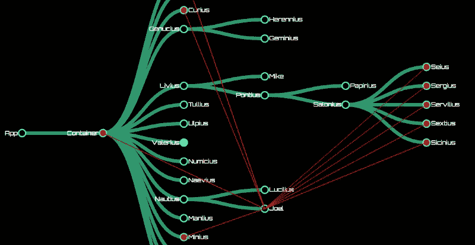
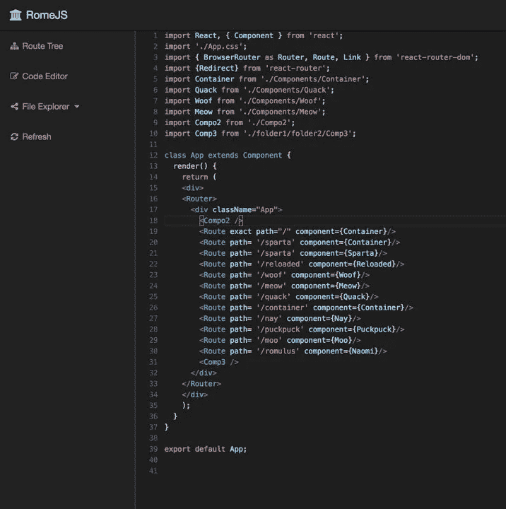
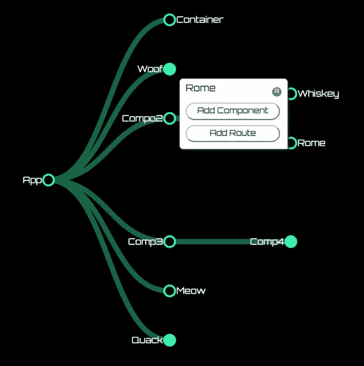

# RomeJS 刚上线，感觉就像圣诞节一样！

> 原文：<https://medium.com/hackernoon/romejs-just-launched-and-it-feels-like-christmas-37dc7beac82f>

你的时间紧迫。是你对世界(或者你的老板)。你有一个任务，必须完成，以拯救你的亲人从严峻的命运。挑战？一个*千个* React 应用。你是做什么的？现在，在你控制台记录“妈咪，救命”之前—

*想象同样的事情，但所有这些功能都在你身边。*

Looks like RomeJS would be the action sequel we’d actually want to watch.

现在更容易理解了，不是吗？

你(没有)问这一切怎么可能？

我们都听说过[React](https://hackernoon.com/tagged/react)——它速度快，效率高，它的单向数据流让你感觉像是在奥阿湖的河流中洗澡。哦，是的，单向绑定的确令人耳目一新——至少对客户来说是这样。

为了追求客户的快乐，开发人员牺牲了直觉、便利和效率——所有这些都给开发人员的工作流程带来了负担。我们的产品效率高，速度快。但是，从发展的角度来看，为什么我们不能一样呢？

Actual depiction of coding in React. Yes, that’s your component rendering.

输入 [RomeJS](https://hackernoon.com/tagged/romejs) 。

一个可视化的集成开发环境，使得开发端和我们为客户端所做的工作一样直观、流畅和高效。

那么，你可能会问，我们该怎么做呢？首先，我们必须把开发人员看作人，剩下的就简单了。RomeJS 使用递归解析算法生成代码的抽象语法树表示(或 AST ),然后对树的节点进行整形以检索适当的数据，或注入适当的代码——取决于特性。

Pictured: React Router Route & Link Attributes Activated on the RomeJS Component Hierarchy Tree.

在我们解析了这个 AST 之后，我们提取了所有必要的元素，包括链接、路由和组件。此外，因为 D3 是一个类似 jQuery 的库，所以我们想出了一个在 React 的虚拟 DOM 上选择节点的策略。而且，因为 JSX 不是官方认可的语法，我们更新了解析器库，使其与 React 兼容。谁不喜欢自己的解析更新呢？如果有三件事是确定的，那就是死亡，税收和人类喜欢他们的解析器更新！

The File Editor

在一个视图中，您将编辑您的代码，在另一个视图中，您将通过组件层次结构完全想象您的应用程序的结构。抽象的日子已经一去不复返了——这是你可以实际看到的东西。

在一个漂亮的 D3 发光环境中保持完美的组件层次结构的同时，还有什么比点击一下就添加一个组件更容易的呢？除了你小时候在那个温柔温暖的夏日里最快乐的时刻，大概什么都没有了。

Add a Route, Link or Component with just a click.

请继续关注我们的 state store 特性，并发布每个组件的统计数据！但是，即使是现在，你已经拥有了你内心渴望的一切(如果你内心渴望 SEO 优化、调试器和其他合理的东西)！哇！

撇开喜剧不谈，RomeJS 背后的团队的唯一目标是让开发者的生活更轻松。这是一个开源的免费工具，由社区提供。

我们刚刚推出，希望在这里看到你们所有漂亮的面孔！

真诚地

RomeJS 团队

 [## RomulusAndRemus/romejs-app

### romejs-app -电子版 romejs。

github.com](https://github.com/RomulusAndRemus/romejs-app)  [## 罗梅杰

### 举例来说，把一切都摆在你面前。反应路由器 v4 属性，等等。

romejs.com](http://romejs.com/) 

> [黑客中午](http://bit.ly/Hackernoon)是黑客如何开始他们的下午。我们是 [@AMI](http://bit.ly/atAMIatAMI) 家庭的一员。我们现在[接受投稿](http://bit.ly/hackernoonsubmission)，并乐意[讨论广告&赞助](mailto:partners@amipublications.com)机会。
> 
> 如果你喜欢这个故事，我们推荐你阅读我们的[最新科技故事](http://bit.ly/hackernoonlatestt)和[趋势科技故事](https://hackernoon.com/trending)。直到下一次，不要把世界的现实想当然！

