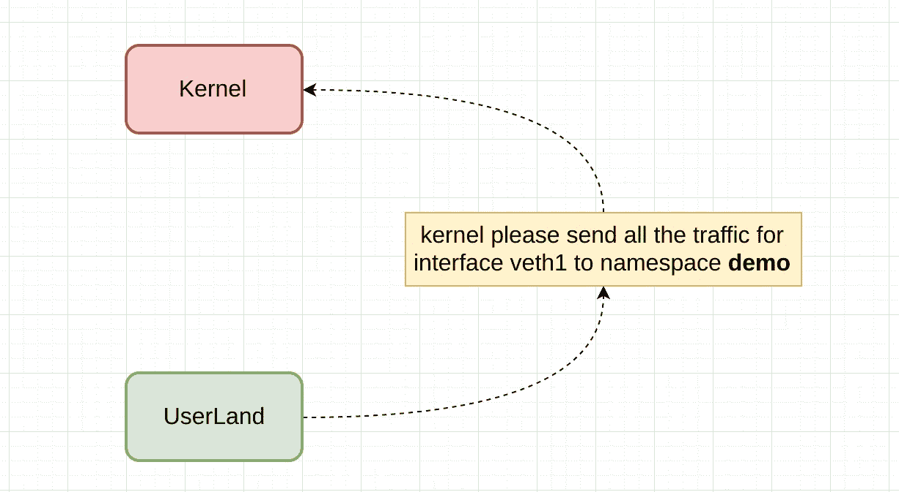
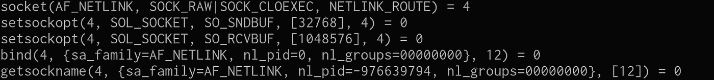
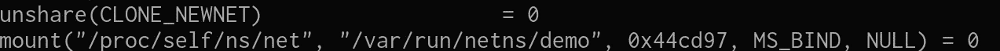
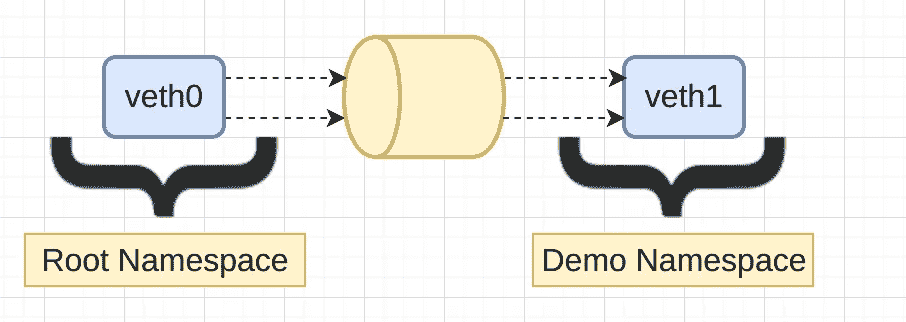
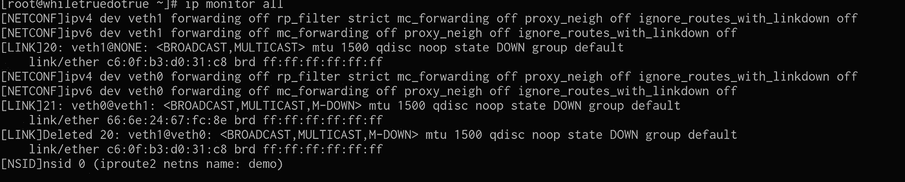
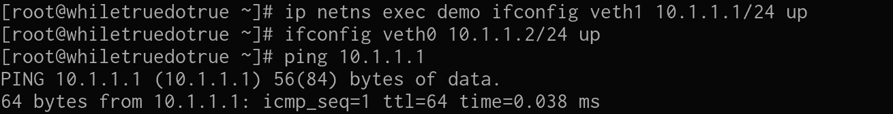

# 路由到名称空间

> 原文：<https://medium.com/hackernoon/routing-to-namespaces-8e1eaffaac7f>

我很想知道一个缓冲区(skb)是如何“路由”到一个特定的名称空间或进程的。



就这么简单，我想知道 userland 告诉内核将数据发送到特定名称空间/接口的机制。

所以我发现内核在 2.4 版本中有一个特定的接口专门用于这种用途。 **AF_NETLINK** ，你可能对 AF_UNIX 或 AF_INET 很熟悉，因为它是建立在 bsd sockets 架构之上的，所以它使用了 **bind() listen() accept()** 等方法。

开始吧，首先我将跟踪创建网络名称空间的 userland 命令( **ip route2** ):

```
strace ip netns add demo -e trace=network
```

这会创建一个网络名称空间，并将**从父节点中取消共享()**，结果片段如下:



因此，您可以看到正在发生一些事情，出于某种原因，ip route 创建了一个特定类型的套接字( **NETLINK** )，并且正在向**内核**发送一些数据(配置数据，例如路由)。

之后**取消共享**发生:(注意 **CLONE_NEWNET** )



到目前为止，理论上我们有了一个新的网络名称空间，我们可以检查:

```
ip netns show
```


看起来不错，现在我们需要创建一个对等体或 veth，并将其中一个添加到名称空间，您可能以前见过**veth**，它们是虚拟以太网设备，大多数情况下是成对的，这就像一种帧转发设备，例如，您在 **veth0** 中插入的任何帧都会到达 **veth1** 。



让我们创建一对 Veths，并将其中一个添加到 **demo** 名称空间中

```
ip link add veth0 type veth peer name veth1
```

现在将 **veth1** 连接到 **demo**

```
ip link set veth1 netns demo
```

太好了，这些接口都没有 ip 地址，所以什么都不能有效地工作，但是我们怎样才能“tcpdump”NETLINK 流量，这可能吗？

理论上，我们应该看到从 ip 路由到内核的 AF_NETLINK 消息，说“**嘿，所有进入 veth1 的流量也应该进入这个名称空间”**

据我所知，tcpdump 不能做到这一点，但 ip 路由有一个监控功能，这是我们得到的结果:

```
ip monitor all
```



我认为，对我来说似乎很清楚的部分是在**“IP 链接集 veth1 netns 演示”**之后发生的事情


netlink(**net/netlink/af _ netlink . c**)的实现完全知道用户名称空间。

现在剩下的问题是，内核知道一个给定的流量必须被“路由”到一个特定的名称空间(或网络堆栈的一个特定副本)，它如何从那里工作？啊我还不知道，但是我会设法找到它。

郑重声明:

[](http://bit.ly/HackernoonFB)[](https://goo.gl/k7XYbx)[](https://goo.gl/4ofytp)

> [黑客中午](http://bit.ly/Hackernoon)是黑客如何开始他们的下午。我们是 [@AMI](http://bit.ly/atAMIatAMI) 家庭的一员。我们现在[接受投稿](http://bit.ly/hackernoonsubmission)，并乐意[讨论广告&赞助](mailto:partners@amipublications.com)机会。
> 
> 如果你喜欢这个故事，我们推荐你阅读我们的[最新科技故事](http://bit.ly/hackernoonlatestt)和[趋势科技故事](https://hackernoon.com/trending)。直到下一次，不要把世界的现实想当然！

