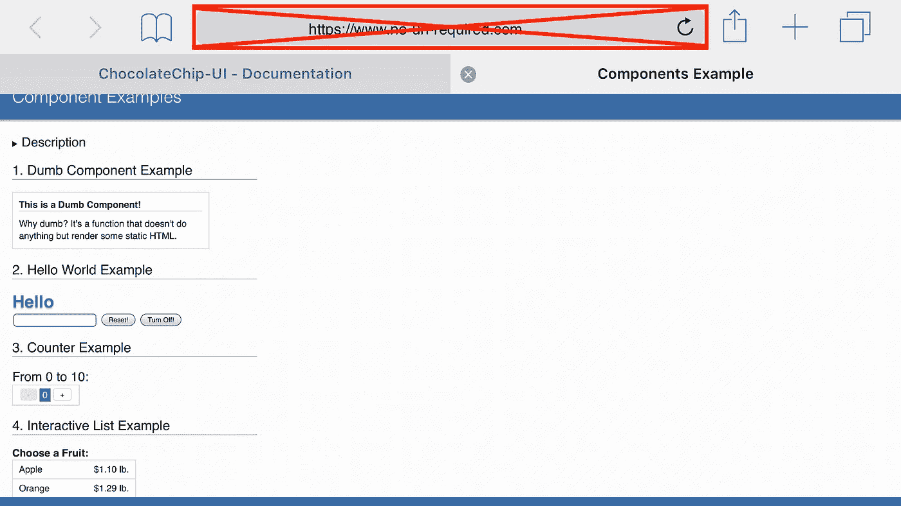
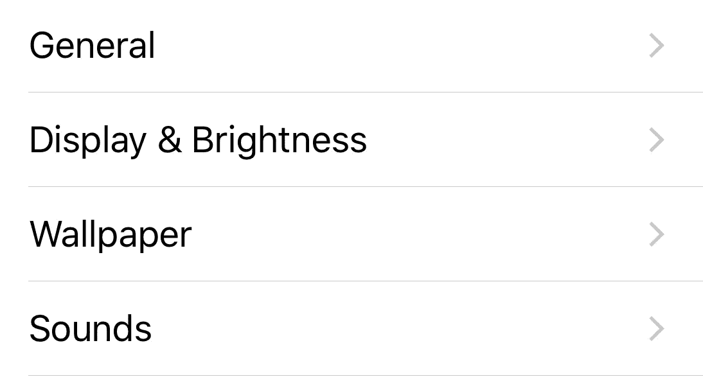

# ChocolateChip-UI 中不带 URL 的路由

> 原文：<https://medium.com/hackernoon/routing-without-urls-in-chocolatechip-ui-7079a12fab7e>



当读者读到这个标题时，我能听到他们的抱怨和挠头。为什么你想要没有 url 的路由？目的是什么？这到底是怎么回事？我们在这里讨论的是在使用 [ChocolateChip-UI](https://chocolatechip-ui.github.io) 构建的应用中使用导航时路由是如何工作的。这是一个为 Android 和 iOS 创建混合移动应用的框架。因此，用户永远不会接触到 Webview 的 chrome。他们只与应用程序的结构和内容进行交互。用户看不到浏览器及其 url 栏。

# 基础知识

要理解为什么我们提出了没有 URL 的路由，你首先要理解 ChocolateChip-UI 移动应用程序是如何构造的。一个 ChocolateChip-UI 应用程序基于屏幕的概念。当你看任何设备时，你会发现应用程序位于屏幕的较大区域，从状态栏下方到屏幕的左、右和底部。ChocolateChip-UI 使用一个特殊的标签来表示这个查看区域:`ui-screen`。`ui-screen`由于反应灵敏，可自动扩展以填满所有可用空间。在下面的 Codepen 示例中，我们有一个蓝色背景的`ui-screen`,所以你可以看到它是如何扩展以填充所有可用空间的:

`ui-screen`只是其他结构的容器。最常见的两种是`nav`和`section`。你也可以在屏幕底部添加一个`footer`作为工具栏。`nav`是使用`h1`放置屏幕标题的地方。您还可以放置某种类型的按钮来实现用户交互。标签是那个屏幕的内容所在。下面是一个带有`nav`和`section`的 Codepen 示例:

# 处理屏幕状态

因为一个`ui-screen`填满了整个屏幕，所以其他屏幕需要放在屏幕之外。ChocolateChip-UI 通过使用一组三个类来处理这个问题:

1.  `previous`
2.  `current`
3.  `next`

当一个`ui-screen`有一个`previous`类时，它将被转换为-100%的 transition-x 值，这将使它离开屏幕向左移动。具有类`current`的`ui-screen`将以 0 的过渡值进行变换，这将其定位到视图中。类别为`next`的`ui-screen`将以 100%的过渡值进行变换，这将使其位于屏幕右侧。如果你需要支持从右到左的语言，比如阿拉伯语、波斯语、乌尔都语或希伯来语，你可以将`dir='rtl'`放在`html`标签上。这样做会导致定位翻转到相反的方向。这使得导航动画对那些语言来说感觉很合适。

在下面的 Codepen 示例中，我们创建了两个`ui-screens`，一个包含一个类`current`，另一个包含一个类`next`。通过点击按钮，我们改变类来触发导航体验。注意`ui-screens`是如何自动滑入和滑出的。

使用这种类的切换给了我们从一个屏幕导航到另一个屏幕的体验。我们不需要知道链接或网址。我们只需切换这些类，就可以获得物理导航到某个目的地的效果。虽然很酷，但这很乏味。你真的不希望每次需要导航的时候都要编写代码来切换类。为了避免这种情况，ChocolateChip-UI 提供了一个导航系统。

# 航行

移动操作系统可以通过多种方式让用户导航到应用程序的不同屏幕。最常见的方式是导航列表。正如我们已经看到的，ChocolateChip-UI 希望你的应用程序由在视图内外活动的`ui-screens`组成。为了更容易实现这一点，ChocolateChip-UI 有一个简单的机制来显示您想要转换到哪个`ui-screen`。首先，您需要创建一个列表。然后使用一个特殊的属性:`data-goto`来指示每个列表项指向哪个`ui-screen`。它的值将是您想去的`ui-screen`的 id。为了表示列表项是可导航的，在`aside`标签中添加一个显示指示器:

```
<li data-goto='detail-page'>
  <h3>Item</h3>
  <aside>
    <disclosure></disclosure>
  </aside>
</li>
```

这会给你一个这样的列表



# 将用户界面导航导入您的应用

为了让这个导航列表工作，您需要将导航小部件添加到您的项目中。您可以通过将它导入到项目的`app.js`文件中来实现。顺便说一下，如果你不知道如何开始一个新的 ChocolateChip-UI 项目，请阅读[文档](https://chocolatechip-ui.github.io/v5/install.html)了解如何安装和创建项目。

要导入`ui-navigation`，请将以下内容添加到您的`app.js`文件的顶部:

```
import {UINavigation} from './src/widgets/ui-navigation
```

导入后，当您在浏览器中构建和加载应用程序时，您会发现点击带有属性`data-goto='detail-page'`的列表项会将您转换到 id 为`detail-page`的`ui-screen`。当然，你需要确保你的应用程序有这样一个`ui-screen`，否则你会过渡到一个空白屏幕。

# 怎么回去

如果您导航到某个屏幕，您可能希望返回到上一个屏幕。点击浏览器的后退按钮不起作用，因为这是通过由类触发的动画来完成的。ChocolateChip-UI 提供了一种简单的方式来启用后退导航。在目的地屏幕的`nav`标签中，放置一个带有类别`back`的按钮。当用户导航到该屏幕时，点击后退按钮将自动将用户导航回前一屏幕。后退按钮只是一个带有`back`类的按钮。它应该是`nav`标签中的第一项，在`h1`之前:

```
<nav>
  <button class='back'>Back</button>
  <h1>Some Details</h1>
</nav>
```

下面的 Codepen 示例展示了所有这些工作:

如果您仔细观察这支笔，您会注意到没有 JavaScript 来实现导航。启用导航的标记约定意味着您不必编写任何 JavaScript 就能实现这一点。相反，在加载时，ChocolateChip-UI 监听器监听属性为`data-goto`的列表项和类别为`back`的`ui-screen` `nav`标签中的按钮。这使得向前和向后导航能够正常工作。

# 跟踪导航

从上面的例子可以清楚地看出，向前导航非常容易管理。用户点击列表项目。ChocolateChip-UI 抓取`data-goto`值，知道去哪个屏幕。它通过更改其类将当前屏幕导航到视图之外，并通过更改其类将目标导航到视图中。但是当用户点击后退按钮时，它如何知道回到哪里呢？ChocolateChip-UI 使用了一个特殊的数组:`$.ChuiRoutes`。当应用程序第一次加载时，ChocolateChip-UI 将当前`ui-screen`的 id 推送到这个数组中。然后，当用户点击带有`data-goto`属性的列表项时，ChocolateChip-UI 会将该 id 推送给`$.ChuiRoutes`。您可以通过打开浏览器的控制台并检查`$.ChuiRoutes`的值来随时检查您的路线。那么，后退键呢？当你点击它时，ChocolateChip-UI 弹出`$.ChuiRoutes`数组并获得最后一个数组项。然后切换弹出项的类和数组中最后一项的类。这为您提供了向后导航。后退按钮不需要知道`$.ChuiRoutes`当前值以外的任何信息。

以下 Codepen 示例阐释了这种向前和向后导航:

使用导航目标中列表项和后退按钮上的`data-goto`属性这一简单技术，您可以创建向下钻取几个级别的导航。以下 Codepen 示例说明了这一点:

# 多目的地导航

通常，当您点击导航列表的列表项目时，您会想要查看该项目的更多详细信息。使用简单的声明性技术最终需要大量的`ui-screens`。下面的 Codepen 示例说明了这个问题。你拥有的物品越多，你需要的`ui-screens`就越多:

这样效率不高。最好是所有列表项只有一个目的地，并动态呈现内容。要启用这种方法，您需要使用路由参数进行路由。

# 遇见路由器

ChocolateChip-UI 有路由器。要使用它，您需要将其导入到您的`app.js`文件中:

```
import {UINavigation} from './src/widgets/ui-navigation'
import {Router} form './src/widgets/ui-router'
```

Router 是一个类，所以要使用它，需要创建一个实例。初始化需要两个值:一个路由和一个在路由发生时执行的回调。但是没有用于导航的 URL，那么这是如何工作的呢？当用户点击带有`data-goto`的列表项时，它会发布这个`ui-screen` id。使用路由器，您可以创建监听该路由的路由。当用户点击发布路由时，将执行回调。以下是您设置路由的方式:

```
import {UINavigation} from './src/widgets/ui-navigation'
import {Router} form './src/widgets/ui-router'app(() => {
  const router = new Router() 
  router.addRoute({
    route: 'detail',
    callback: (param) => {
      // Handle the route 
    }
  })
})
```

上面的路线假设用户将点击一个列表项，其`data-goto`值为`detail`，这将是一个`ui-screen`的 id。路由回调期望接收一个参数(param ),我们可以用它来知道哪个项目被点击了。那么，我们如何获得路线的参数呢？这需要将一条额外的信息传递给列表项`data-goto`属性。通常情况下，`data-goto`属性的值就是要转到的`ui-screen`的 id。但是我们可以告诉 ChocolateChip-UI 用这个 id 传递更多的信息。为此，我们向 id 添加一个`:`，后面跟着我们要传递的值。

这需要我们暂时转移话题。假设我们有一个人员列表:

```
const people = [
  {
    firstName:'Joe',
    lastName:'Bodoni'
  }, 
  {
    firstName:'Ellen',
    lastName:'Vanderbilt'
  },
  {
    firstName:'Sam',
    lastName:'Anderson'
  }
]
```

如果我们想把这些数据打印成一个列表，没问题。然而，如果我们希望能够识别每个人，他们需要一些独特的标识符。这可能是 id、uuid、guid 或密钥。选择一个并给每个对象一个:

```
const people = [
  {
    id: 101,
    firstName:'Joe',
    lastName:'Bodoni'
  }, 
  {
    id: 102,
    firstName:'Ellen',
    lastName:'Vanderbilt'
  },
  {
    id: 103,
    firstName:'Sam',
    lastName:'Anderson'
  }
]
```

使用上面的数据，我们可以这样定义我们的列表组件，每个列表项的`data-goto`属性获得每个对象的惟一 id:

```
const list = new Component({
  element: '#peopleList', 
  // Add route parameter using object id:
  render: (person) => html`
    <li data-goto='detail:${person.id}'>
      <h3>${person.firstName} ${person.lastName}</h3>
      <aside>
        <disclosure></disclosure>
      </aside>
    </li>`
})
```

上述组件将创建具有以下导航属性的列表项:

1.  `data-goto='detail:101'`
2.  `data-goto='detail:102'`
3.  `data-goto='detail:103'`

当用户点击其中一个列表项时，`:`后的值将作为路线参数发送。通过检查 route 参数，我们可以确定用户点击了哪个列表项，并过滤数据以显示适当的内容。下面是一个假设的用例:

```
import {UINavigation} from './src/widgets/ui-navigation'
import {Router} form './src/widgets/ui-router'app(() => {
  const router = new Router() 
  router.addRoute({
    route: 'detail',
    callback: (param) => {
      // Handle the route 
      const person = people.filter(person => person.id == id)
      // Render the destination screen list with this data:
      chosenPersonList.render(person)   
    }
  })
})
```

下面是一个 Codepen 示例，说明了动态列表创建和路由是如何工作的:

要了解更多关于导航和路线的信息，请查阅[文档](https://chocolatechip-ui.github.io/v5/docs/widgets/navigation.html)和[教程](https://chocolatechip-ui.github.io/v5/docs/tutorials/tutorials-routing.html)。

# 看，妈，没有网址！

通过使用`data-goto`属性来处理导航，这将激活 ChocolateChip-UI 的内部 pubsub 系统来发布哪个`ui-screen`是目的地，并传递一个路线参数。这意味着没有必要弄乱浏览器的网址。现在你可能会反对说，没有办法捕捉一个 url 发送给某人。但我想不出有哪一次我在使用原生应用程序时，能够在其中找到一个网址。嗯，除非是直接暴露地址栏。只有少数原生应用程序在显示诸如迷因或实际网页等内容时会实际暴露浏览器 url。但是，为什么要费心为此构建一个本地应用程序呢？更有意义的是为那些类型的用例构建一个 PWA(渐进式 web 应用)。