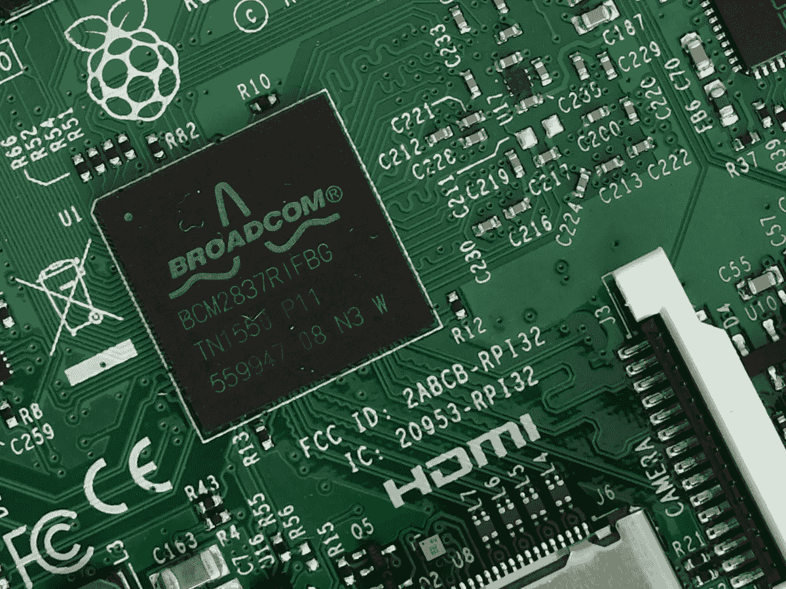

# RPi3 MicroSD 备份和传输，简单的方法(麦克 OSX 埃尔卡皮坦)

> 原文：<https://medium.com/hackernoon/rpi3-microsd-backup-and-transfer-the-easy-way-mac-osx-el-capitan-b72766c0b799>

The Raspberry Pi3 Board

在 web 和软件开发中，我们经常忘记的一个细节是我们对所用操作系统的依赖程度，无论是 MacOS、Windows 还是 Linux。当那个操作系统实际上运行我们的小而强大的网络服务器时，备份和随时可用的理由是十倍的。因此，没有进一步的麻烦，这是备份你的整个 MicroSD 和转移到另一个简单的方法…