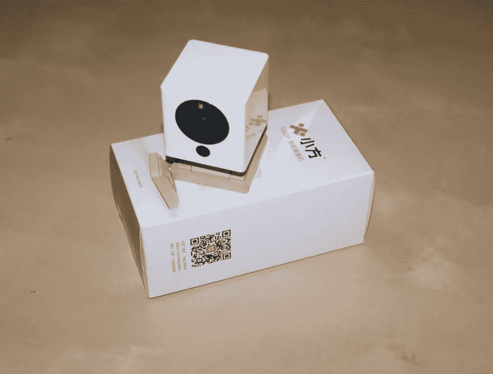
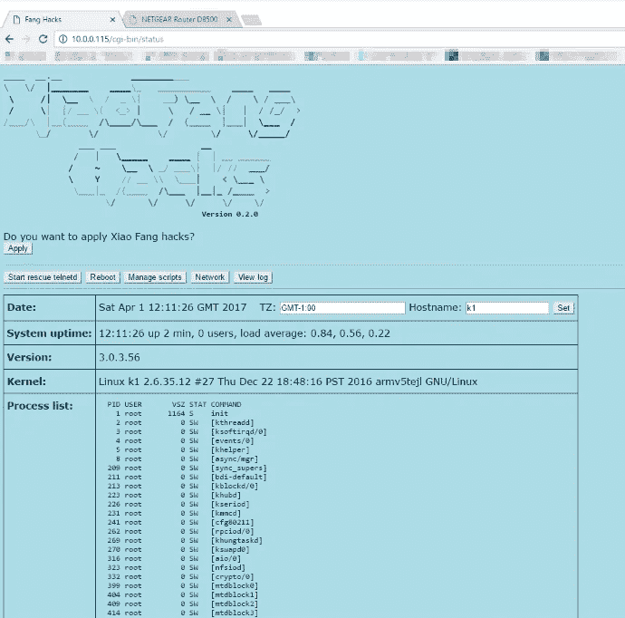
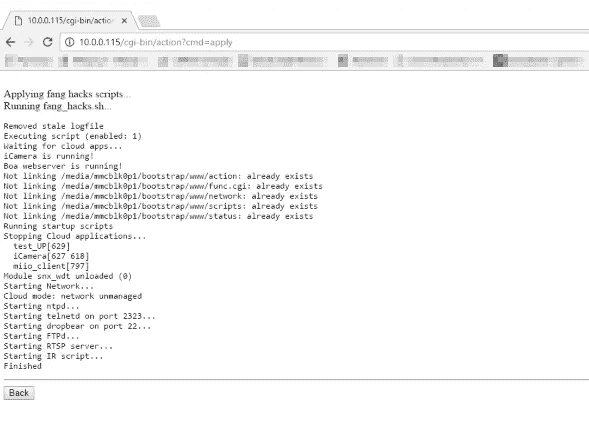
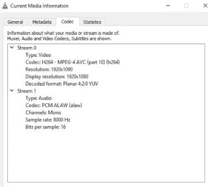

# RTSP 黑了一个 15 美元的小米无线网络摄像头

> 原文：<https://medium.com/hackernoon/rtsp-hack-for-a-15-xiaomi-wifi-ip-camera-453690396691>

对于[小米](https://hackernoon.com/tagged/xia)来说，避免山寨指责是很难的，它被称为中国的[苹果](https://hackernoon.com/tagged/apple)也不是没有道理的。一个例子是其用于家庭自动化的物联网相机，[小米小芳 WiFi 相机](https://bit.ly/2Pe2oBU) 1080p 最初由 iSmart 以 99 美元的价格出售，现在以低得多的价格出售，但有一个主要缺点，即与小米家庭系统相关联，并仅限于一些市场



XiaoFang Camera

遗憾的是，该产品在中国以外不支持，因此只能从中国版小米应用程序控制。

但由于一些黑客的工作，他们已经成功地将这款物联网相机变成了支持标准 RTSP 协议的非物联网通用 WiFi 相机。

此外，黑客允许停止连接到小米基础设施的服务，因此你可以确信视频或任何其他数据不会被发送到中国的云。

当心，有一款更新版本的小米小方相机，名字叫做[小米大方](https://www.gearbest.com/ip-cameras/pp_693217.html?lkid=11893441)。这个有点大，增加了一个电机功能来远程控制相机的角度。它在小米云中没有国别限制。然而，仍然没有黑客可以用作 RTSP 相机，尽管有人在移植 Dafang-Hacks，telnet/ssh shell 也在工作。

15 美元的相机小方可以在允许从中国市场收购产品的网上商店买到，比如[DX.com](https://bit.ly/2Pe2oBU)。



应用[方黑客](https://github.com/samtap/fang-hacks)非常简单，只需要将项目文件复制到 micro SD 卡上，插入相机即可。之后，从 web 用户界面执行脚本，从云中释放相机。

方黑客

[](https://github.com/samtap/fang-hacks) [## 萨姆塔/方-哈克斯

### Fang-hacks WiFi 摄像头改装集锦

github.com](https://github.com/samtap/fang-hacks) 

安装:

```
- Proceed to the release page to download the latest SD-Card Image archive
- Unzip the SD-Card Image file 
- Use a tool such as Win32 Disk Imager to perform a raw copy of the fanghacks_vx.x.x.img to a micro-SD card.
- Power up the XiaoFang 
- Insert the micro-SD card. If you hear "ting-ting" shortly after, you can proceed to:[http://device-ip/cgi-bin/status](http://device-ip/cgi-bin/status)- Finally, click on "Apply" button to apply the hacks.Again, proceed at your own risks!
```



Running fang-hacks

我把它更新到目前可用的最新固件后应用到我的相机上，现在有了一个使用 RTSP 的工作 VLC:

rtsp:// *设备 IP*/单播


1080p H264



VLC Playback

从这里你可以使用任何开源的 DVR 产品(ZoneMinder，Shinobi，iSpy，…)。一个聪明的办法是从一个电源库给这个相机供电，把它变成一个便携式远程间谍相机，你可以从你的安卓智能手机上使用 VXG RTSP 播放器、 [RTSP 相机浏览器](https://play.google.com/store/apps/details?id=com.gst_sdk_tutorials.rtspviewersf&hl=en)或[安卓 VLC](https://www.videolan.org/vlc/download-android.html) 观看。


2018 年夏季*更新:目前小方相机已经停产，大部分商店都已售罄。推荐阅读关于小米大方继承者 IP 相机也可以*[*root 和被黑*](https://hackernoon.com/hacking-a-25-iot-camera-to-do-more-than-its-worth-41a8d4dc805c) *。*