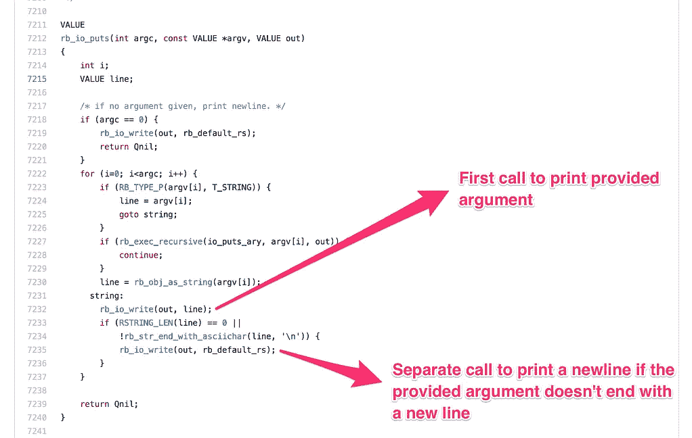
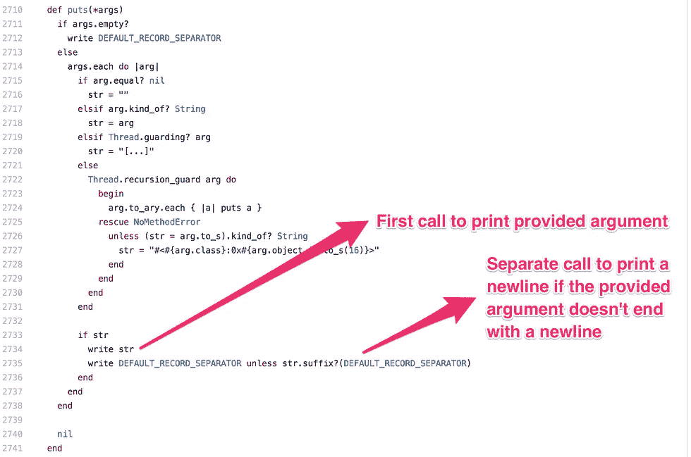
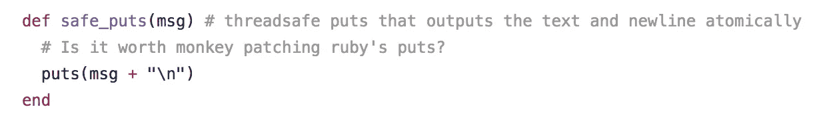

# Ruby 的 puts 不是原子的

> 原文：<https://medium.com/hackernoon/rubys-puts-is-not-atomic-889c57fc9a28>

当通过并行化操作来改进构建脚本时，我意识到 Ruby 的`puts`不是原子的。

Effects of the race condition in action

看起来`puts`调用了底层的`write`函数两次——一次是实际打印给它的变量，另一次是打印换行符。如上所述，这导致了`puts`中的竞争情况。

我通过查看 [Rubinius](https://github.com/rubinius/rubinius/blob/a57071c650a8ad336ba0bde997879a744d2c9f69/core/io.rb#L2710-L2741) 和 [MRI](https://github.com/ruby/ruby/blob/trunk/io.c#L7184-L7240) 中`puts`的源代码确认了这一点。

Annotated source code for puts in MRI, Rubinius

在 MRI 中有一个未解决的问题，通过使用`writev`而不是`write`—[https://bugs.ruby-lang.org/issues/9420](https://bugs.ruby-lang.org/issues/9420)来解决这个问题

我通过在代码中创建一个`safe_puts`函数来解决这个问题，它看起来像这样:

By supplying ‘\n’ explicitly at the end, the whole string gets printed at once

根据[这篇 StackOverflow 帖子](http://stackoverflow.com/questions/3029816/how-do-i-get-a-thread-safe-print-in-python-2-6)，这似乎也是 Python 的一个问题。

> [黑客中午](http://bit.ly/Hackernoon)是黑客如何开始他们的下午。我们是 AMI 家庭的一员。我们现在[接受投稿](http://bit.ly/hackernoonsubmission)并乐意[讨论广告&赞助](mailto:partners@amipublications.com)机会。
> 
> 如果你喜欢这个故事，我们推荐你阅读我们的[最新科技故事](http://bit.ly/hackernoonlatestt)和[趋势科技故事](https://hackernoon.com/trending)。直到下一次，不要把世界的现实想当然！

