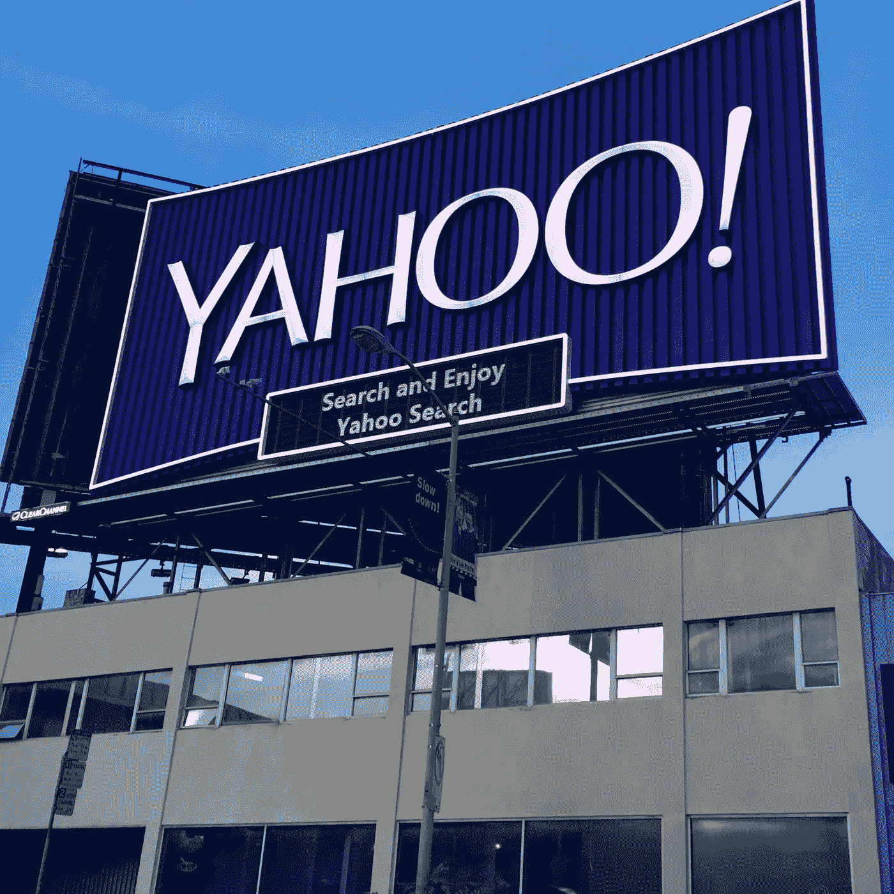

# 谣言:雅虎！剥离和文件 S-1 的雅虎！标志，它唯一的有形资产

> 原文：<https://medium.com/hackernoon/rumor-yahoo-to-spin-off-and-file-s-1-for-the-yahoo-sign-its-sole-tangible-asset-3b7c95882f2b>

> [黑客中午](http://bit.ly/Hackernoon)是黑客[如何开始他们的下午](https://hackernoon.com/tagged/start)的。我们是 [@AMI](http://bit.ly/atAMIatAMI) 家庭的一员。我们现在[接受投稿](http://bit.ly/hackernoonsubmission)并乐意[讨论广告&赞助](mailto:partners@amipublications.com)机会。
> 
> 如果你喜欢这个故事，我们推荐[阅读](https://hackernoon.com/tagged/reading)我们的[最新科技故事](http://bit.ly/hackernoonlatestt)和[趋势科技故事](https://hackernoon.com/trending)。直到下一次，不要把世界的现实想当然！

