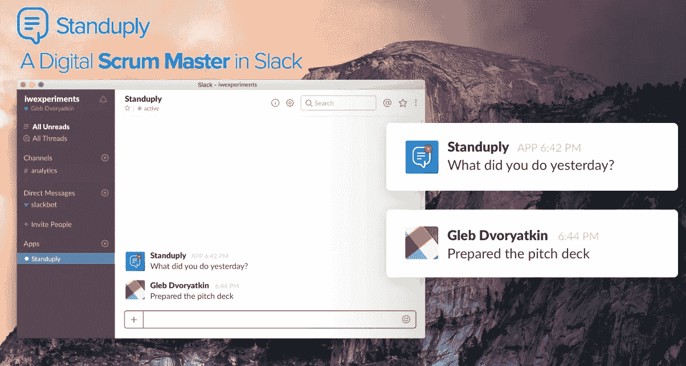
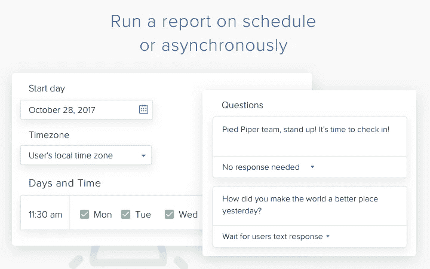
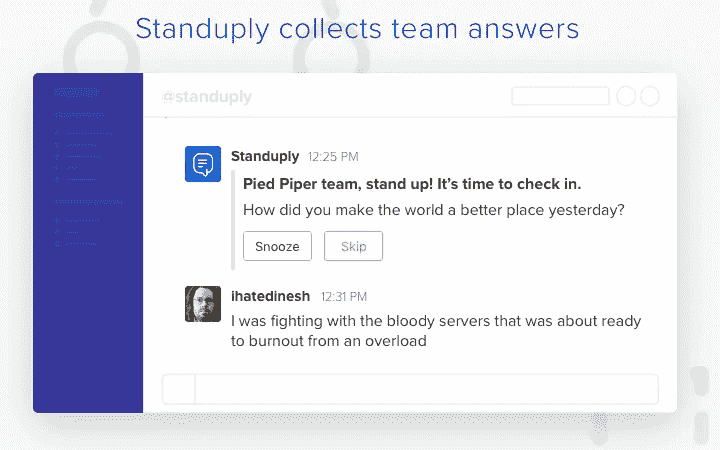
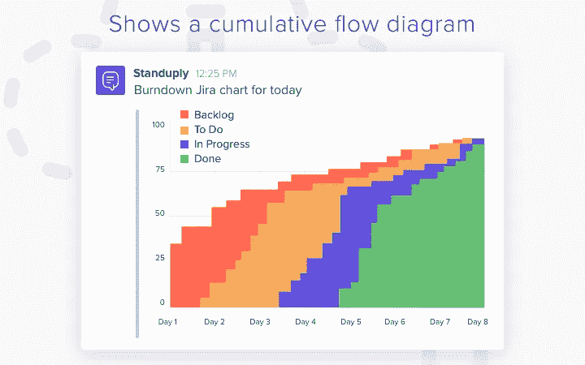
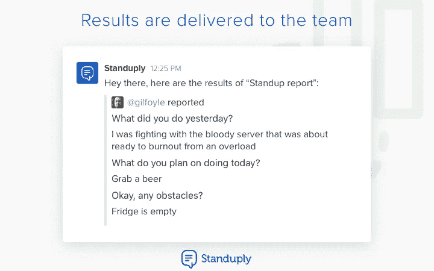

# 运行异步站立会议，并在空闲时跟踪团队表现

> 原文：<https://medium.com/hackernoon/run-asynchronous-stand-up-meetings-and-track-team-performance-in-slack-b5b6b3d9fd9c>

[**Standuply**](https://standuply.com/) 是一个机器人，它通过在 Slack 中采访你的团队成员来运行 [standup](https://hackernoon.com/tagged/standup) 会议，并向 Slack、Trello 和 email 提供答案。

[**凯文·威廉·大卫**](https://medium.com/u/8ea7bd91b1a4?source=post_page-----b5b6b3d9fd9c--------------------------------) 采访了 [**亚历克斯·基斯捷涅夫**](https://medium.com/u/1af5aab62d66?source=post_page-----b5b6b3d9fd9c--------------------------------) ，首席执行官 [**站起来**](https://siftery.com/standuply) 了解更多。

## 嗨，亚历克斯，那么什么是站立？

Standuply 是一个自动运行异步站立会议的 Slack bot。它从[**【JIRA】**](https://siftery.com/atlassian-jira)构建敏捷图表，并与第三方[工具](https://hackernoon.com/tagged/tools)集成，以用更多数据来丰富 standups。

基于 JIRA 的数据，Standuply 提出了改进的建议。这是我们适应每个敏捷团队流程的基本人工智能任务。

## 请多告诉我一些你想解决的问题？

我们正在解决在远程团队中进行站立会议和其他敏捷实践的问题。为了留住人才，更多的团队变得偏远。然而，它也带来了负面影响。

由于时区差异，团队的重叠时间较少。人不见面。信息流更少。流程分崩离析。

## Standuply 与市场上已有的产品有何不同？

Standuply 是唯一一个与第三方集成和机器学习的 Slack 机器人。最大竞争对手: [**Geekbot.io**](https://siftery.com/geekbot) ，[**StandupJack.com**](https://siftery.com/standup-jack)， [**Howdy.ai**](https://siftery.com/howdy) 。

那些制作网络应用的人不知道首先成为一个机器人有多重要。敏捷团队使用 Slack 进行状态更新、数据报告和通知。聊天机器人自动完成这项工作，并与团队使用的工具集成。

## 谁使用 Standuply？你能告诉我们一些关于使用 Standuply 的不同客户群的信息吗？

Slack 上的创业公司和产品公司使用 Standuply。偏远的显示最感兴趣。通常是项目/产品经理和一个 5-10 人的开发团队。他们用它来做日常站立。

来自 10 亿美元公司的 150 多个团队使用 Standuply(包括 [**、IBM**](https://siftery.com/company/ibm) 、 [**Adobe**](https://siftery.com/company/adobe) 、 [**微软**](https://siftery.com/company/microsoft) 、 [**Salesforce** 、](https://siftery.com/company/salesforce) [**Expedia**](https://siftery.com/company/expedia-1) 、 [**SAP**](https://siftery.com/company/sap) 、 [**沃尔玛**](https://siftery.com/company/walmart) )。

对于许多团队来说，Slack 就是他们的虚拟办公室。他们需要更多的闲置数据。这样的团队也使用 Standuply 来整合 Slack。就像 JIRA 看敏捷图表 [**或者谷歌分析**](https://siftery.com/google-analytics) 追踪网站访客一样。

## 您的客户如何使用 Standuply？你能分享一些不同的使用案例吗？

除此之外，同处一地的敏捷团队也使用 Standuply。他们建立并遵循选定的流程。这可能是在身体站立、运行回顾会议和团队情绪检查之前的准备。

## Standuply 有没有你没有想到或预料到的独特用例？

有些人用 Standuply 作为他们的日常日志，以跟上他们的想法和要做的事情。

## 有什么早期的“成长秘诀”或策略促成了你现在的成功吗？

是的，我们收集了 1000 个 Slack 社区的名单(见[bit.ly/1000slack](http://bit.ly/1000slack))并且它像野火一样传播开来。内容营销对我们来说非常有效。

## 在早期构建产品时，最大的挑战是什么？你是如何解决的？

让人们为你的产品买单并不容易。我们必须对顾客进行细分，以找到那些愿意付钱的人。因此，我们想出了免费和付费的计划。

我们做了几次测试，为不同的用户群提供不同的计划。我们发现最好的提议是让产品对较小的团队免费。

## 你加入的最有趣的整合是什么？有什么对你特别有影响的吗？

来自 JIRA 的 Burndown 图表是唯一的用例。你可以在 JIRA 拥有它，但为了得到松弛，我们必须得到所有的数据点，并在飞行中建立它。没人会这么做。

## 在我们结束之前，你运营公司所依赖的顶级产品是什么&你如何使用它们？

[Slack](https://medium.com/u/26d90a99f605?source=post_page-----b5b6b3d9fd9c--------------------------------) ，当然我们用它来进行所有的团队沟通。其余的是[对讲机](https://medium.com/u/7ca8972daf76?source=post_page-----b5b6b3d9fd9c--------------------------------)用于与客户沟通。它简单而平稳。[伽椰子](https://medium.com/u/2e4dfb4db300?source=post_page-----b5b6b3d9fd9c--------------------------------)的客户支持——Zendesk**的一切都以更便宜的价格提供。 [**Google Apps**](https://siftery.com/g-suite-formerly-google-apps-for-work) 适用于 [Google](https://hackernoon.com/tagged/google) 文档和电子邮件——完美运行。发送电子邮件——开箱即用。[cloud flare](https://medium.com/u/a00e599743a7?source=post_page-----b5b6b3d9fd9c--------------------------------)——管理 DNS 记录。**

***原载于*[*siftery.com*](https://siftery.com/stories/run-asynchronous-stand-up-meetings-and-track-team-performance-in-slack)*。***