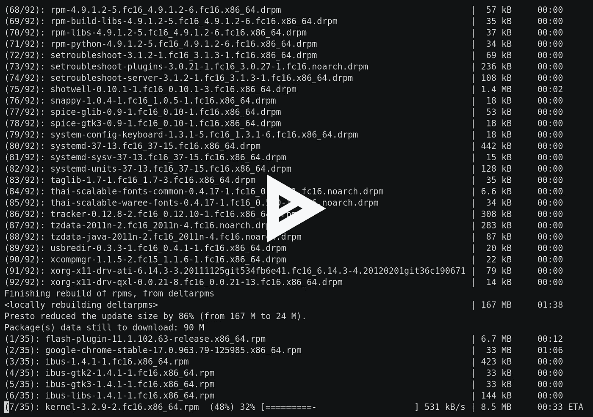
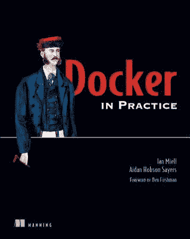

# 在 OpenShift 上运行自己的 AWS APIs

> 原文：<https://medium.com/hackernoon/run-your-own-aws-apis-on-openshift-d0acb876d5b6>

# TL；博士；医生

本文向您展示了如何使用 [OpenShift](https://www.openshift.com/) 来设置和测试使用 [localstack](https://github.com/localstack/localstack) 的[AWS](https://hackernoon.com/tagged/aws)API。

使用 [ShutIt](https://ianmiell.github.io/shutit/) 运行该程序的示例代码可从[这里](https://github.com/ianmiell/shutit-scripts/blob/master/minishift/minishift_localstack.py)获得。

这是这个过程的简要介绍:



# 介绍

在本演练中，您将使用 [minishift](https://github.com/minishift/minishift) 设置一个 [OpenShift](https://www.openshift.com/) 系统，然后在其上的 pod 中运行 localstack。

[OpenShift](https://www.openshift.com/) 是 RedHat 赞助的围绕 [Kubernetes](https://kubernetes.io/) 的包装器，它提供了更适合 Kubernetes 企业生产部署的额外功能。来自 [OpenShift](https://hackernoon.com/tagged/openshift) 的许多特性已经游向上游，集成到 Kubernetes 中(例如基于角色的访问控制)。

OpenShift 的开源版本叫做 [Origin](https://www.openshift.org/) 。

# 本地堆栈

Localstack 是一个项目，旨在为您提供尽可能完整的 AWS APIs 集，以便在不产生任何成本的情况下进行开发。这对于在针对 AWS“真正”运行代码之前测试或尝试代码非常有用，并且可能会浪费时间和金钱。

Localstack 在本地机器上运行以下核心云 API:

*   **API 网关**位于 [http://localhost:4567](http://localhost:4567/)
*   **Kinesis**at[http://localhost:4568](http://localhost:4568/)
*   **DynamoDB** 位于 [http://localhost:4569](http://localhost:4569/)
*   **DynamoDB 流**位于 [http://localhost:4570](http://localhost:4570/)
*   **弹性搜索**在 [http://localhost:4571](http://localhost:4571/)
*   **S3** 在 [http://localhost:4572](http://localhost:4572/)
*   **消防软管**在 [http://localhost:4573](http://localhost:4573/)
*   **λ**at[http://localhost:4574](http://localhost:4574/)
*   **SNS** 在 [http://localhost:4575](http://localhost:4575/)
*   **SQS** 在 [http://localhost:4576](http://localhost:4576/)
*   **红移**在 [http://localhost:4577](http://localhost:4577/)
*   **ES(弹性搜索服务)**在 [http://localhost:4578](http://localhost:4578/)
*   **SES**at[http://localhost:4579](http://localhost:4579/)
*   **Route53** 位于 [http://localhost:4580](http://localhost:4580/)
*   **云形成**在 [http://localhost:4581](http://localhost:4581/)
*   **CloudWatch** 在 [http://localhost:4582](http://localhost:4582/)

目前它支持在 Docker 容器中运行，或者在机器上本地运行。

它建立在 [moto](https://github.com/spulec/moto) 之上，moto 是一个反过来建立在 [boto](https://aws.amazon.com/sdk-for-python/) 之上的嘲讽框架，boto 是一个 python AWS SDK。

**在 OpenShift 集群中运行可以让您运行很多这样的 AWS API 环境。**然后，您可以为每组服务创建不同的端点，并将它们相互隔离。此外，您可以更少地担心资源使用情况，因为集群调度程序会处理这些问题。

然而，**它不是开箱即用的，所以这将指导您完成使它工作所需的操作**。

# 开始微移？

如果您手头没有 OpenShift 集群，那么您可以运行 minishift，这将为您提供一个运行 OpenShift 的独立 VM。

此处记录了[安装 minishift。您需要先安装它，并成功运行“minishift start”。](https://docs.openshift.org/latest/minishift/getting-started/installing.html)

一旦您启动了 minishift，您将需要**设置您的 shell，以便您能够与 OpenShift 服务器**通信。

```
$ eval $(minishift oc-env)
```

# 更改默认的安全上下文约束

安全上下文约束(scc)是一个 OpenShift 概念，允许对 Docker 容器的功能进行更细粒度的控制。

它们控制 seLinux 上下文，可以从正在运行的容器中删除功能，可以确定 pod 可以作为哪个用户运行，等等。

为了让它运行，您将更改默认的“受限”scc，但是您可以创建一个单独的 scc 并将其应用到一个特定的项目。要更改“受限”scc，您需要**成为集群管理员**:

```
$ oc login -u system:admin
```

然后，您需要使用以下命令编辑受限 scc:

```
$ oc edit scc restricted
```

你会看到受限的定义

**此时，你需要做两件事:**

*   **允许容器以任何用户身份运行(在本例中为“root”)**
*   **防止 scc 将您的能力限制为 setuid 和 setgid**

## 1)允许 RunAsAny

默认情况下，localstack 容器以 root 用户身份运行。

出于安全考虑，OpenShift 默认不允许容器以 root 身份运行。相反，它在一个很大的范围内随机选择一个 UID，并以此运行。

为了简化问题，并允许 localstack 容器以 root 用户身份运行，**更改行**:

```
runAsUser: 
 type: MustRunAsRange
```

阅读:

```
runAsUser: 
 type: RunAsAny
```

这允许容器以任何用户的身份运行。

## 2)允许 SETUID 和 SETGID 功能

当 localstack 启动时，它需要成为另一个用户来启动 elasticache。elasticache 服务不会作为根用户启动。

为了解决这个问题，localstack su 向容器中的 localstack 用户发出启动命令。

因为“受限”scc 明确禁止更改您的用户或组 id 的操作，所以您需要取消这些限制。**通过删除以下行来执行此操作:**

```
- SETUID 
 - SETGID
```

一旦完成这两个步骤，**保存文件**。

# 记下主持人

如果你跑步:

```
$ minishift console --machine-readable | grep HOST | sed 's/^HOST=\(.*\)/\1/'
```

您将获得可以从您的机器访问 minishift 实例的主机。记下这一点，因为你以后需要替换它。

# 展开分离舱

部署 localstack 就像运行以下命令一样简单:

```
$ oc new-app localstack/localstack --name="localstack"
```

这将获取 localstack/localstack 映像，并围绕它创建一个 OpenShift 应用程序，设置内部服务(基于 other 文件中公开的端口)，在 pod 中运行容器，以及各种其他管理任务。

# 创建路线

如果您想从外部访问服务，您需要创建 OpenShift 路由，它创建一个外部地址来访问 OpenShift 网络中的服务。

例如，要为 sqs 服务创建路由，请创建如下文件:

```
apiVersion: v1 
items: 
- apiVersion: v1 
  kind: Route 
  metadata: 
    annotations: 
      openshift.io/host.generated: "true" 
    name: sqs 
    selfLink: /oapi/v1/namespaces/test/routes/sqs 
  spec: 
    host: sqs-test.HOST.nip.io 
    port: 
      targetPort: 4576-tcp 
    to: 
      kind: Service 
      name: localstack 
      weight: 100 
    wildcardPolicy: None 
  status: 
    ingress: 
    - conditions: 
      - lastTransitionTime: 2017-07-28T17:49:18Z 
        status: "True" 
        type: Admitted 
      host: sqs-test.HOST.nip.io 
      routerName: router 
      wildcardPolicy: None 
kind: List 
metadata: {} 
resourceVersion: "" 
selfLink: ""
```

然后使用以下内容创建路线:

```
$ oc create -f
```

有关服务及其端口的列表，请参见上文。

**如果您的 OpenShift 集群**上运行着多个 localstacks，您可能希望在主机名前面加上实例的唯一名称，例如

```
host: localstackenv1-sqs-test.HOST.nip.io
```

# 。看看你的工作

运行“oc get all”查看您在 OpenShift 项目中创建了什么:

```
$ oc get all
NAME DOCKER REPO TAGS UPDATED
is/localstack 172.30.1.1:5000/myproject/localstack latest 15 hours agoNAME REVISION DESIRED CURRENT TRIGGERED BY
dc/localstack 1 1 1 config,image(localstack:latest)NAME DESIRED CURRENT READY AGE
rc/localstack-1 1 1 1 15hNAME HOST/PORT PATH SERVICES PORT TERMINATION WILDCARD
routes/apigateway apigateway-test.192.168.64.2.nip.io localstack 4567-tcp None
routes/cloudformation cloudformation-test.192.168.64.2.nip.io localstack 4581-tcp None
routes/cloudwatch cloudwatch-test.192.168.64.2.nip.io localstack 4582-tcp None
routes/dynamodb dynamodb-test.192.168.64.2.nip.io localstack 4569-tcp None
routes/dynamodbstreams dynamodbstreams-test.192.168.64.2.nip.io localstack 4570-tcp None
routes/es es-test.192.168.64.2.nip.io localstack 4578-tcp None
routes/firehose firehose-test.192.168.64.2.nip.io localstack 4573-tcp None
routes/kinesis kinesis-test.192.168.64.2.nip.io localstack 4568-tcp None
routes/lambda lambda-test.192.168.64.2.nip.io localstack 4574-tcp None
routes/redshift redshift-test.192.168.64.2.nip.io localstack 4577-tcp None
routes/route53 route53-test.192.168.64.2.nip.io localstack 4580-tcp None
routes/s3 s3-test.192.168.64.2.nip.io localstack 4572-tcp None
routes/ses ses-test.192.168.64.2.nip.io localstack 4579-tcp None
routes/sns sns-test.192.168.64.2.nip.io localstack 4575-tcp None
routes/sqs sqs-test.192.168.64.2.nip.io localstack 4576-tcp None
routes/web web-test.192.168.64.2.nip.io localstack 8080-tcp NoneNAME CLUSTER-IP EXTERNAL-IP PORT(S) AGE
svc/localstack 172.30.187.65  4567/TCP,4568/TCP,4569/TCP,4570/TCP,4571/TCP,4572/TCP,4573/TCP,4574/TCP,4575/TCP,4576/TCP,4577/TCP,4578/TCP,4579/TCP,4580/TCP,4581/TCP,4582/TCP,8080/TCP 15hNAME READY STATUS RESTARTS AGE
po/localstack-1-hnvpw 1/1 Running 0 15h
```

创建的每条路由现在都可以作为 AWS 服务访问，以测试您的代码。

# 获取服务

现在可以从您的主机点击服务，就像这样:

```
$ aws --endpoint-url=http://kinesis-test.192.168.64.2.nip.io kinesis list-streams
{
 "StreamNames": []
}
```

例如，要创建运动流:

```
$ aws --endpoint-url=http://kinesis-test.192.168.64.2.nip.io kinesis create-stream --stream-name teststream --shard-count 2
$ aws --endpoint-url=http://kinesis-test.192.168.64.2.nip.io kinesis list-streams
{
 "StreamNames": [
 "teststream"
 ]
}
```

# 这是我的书的摘录

这是第二版 [Docker in Practice](https://www.manning.com/books/docker-in-practice-second-edition?a_aid=zwischenzugs&a_bid=550032fc) 的一个进展中的工作

[***代码:39miell***](https://www.manning.com/books/docker-in-practice-second-edition?a_aid=zwischenzugs&a_bid=550032fc) 享受 39 折优惠

