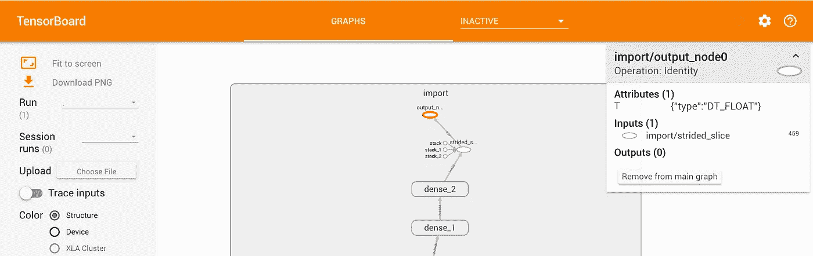

# 在 iOS 和 Android 上运行 TensorFlow 模型

> 原文：<https://medium.com/hackernoon/running-a-tensorflow-model-on-ios-and-android-ce89446c8143>

## 缩小模型大小并减少进行推理计算所需的计算资源

如果你对在手机上运行机器学习模型感兴趣，这里有一个快速指南，告诉你如何做到这一点，以及在这个过程中你会面临的一些挑战。

谷歌的 Inception 模型相当庞大(按照移动标准)，它大约是 90 MB。该模型如此庞大的一个原因是，它将权重存储为 32 位浮点型。这在训练阶段是非常必要的，可以对重量进行许多微小的改变。但是在训练完成后，切换到 8 位定点不会对精度产生巨大影响。

这就是量化的用武之地，我们量化我们的模型来缩小它的大小，并减少进行推理计算所需的计算资源。将计算转移到 8 位将帮助您更快地运行模型，并使用更少的功率。

The retrained model running on iPhone

在 [Lester 的帖子](/@lesterlitchfield/real-time-image-recognition-onboard-ios-475746fbaaaa)中，他写了他如何重新训练谷歌的 Inception V3 模型，以便我们可以根据 [Trade Me](https://www.trademe.co.nz/) 列表图像对图像进行分类。在这篇文章中，我将讲述我是如何在 iOS 和 Android 手机上运行 Lester 直接训练的模型的。

好了，现在我有了重新训练过的盗梦空间模型，我做的第一件事就是用 TensorBoard 检查这个模型，感受一下它有多复杂！并找出输入和输出层的名称。我通过运行以下命令做到了这一点

```
python tensorflow/python/tools/import_pb_to_tensorboard.py --model_dir **tmp/tensorflow_inception_graph.pb** --log_dir **tmp/**tensorboard --logdir=**tmp/**
```

然后去 [http://mac.local:6006](http://mac.local:6006) 你可以查看模型层



output layer


input layer

之后，剥离模型就像运行下面的命令一样简单

```
bazel-bin/tensorflow/tools/graph_transforms/transform_graph \
 —-inputs=”**input_1**" —-in_graph=**tmp/tensorflow_inception_graph.pb** \
 —-outputs=”**output_node0**" —-out_graph=**tmp/quantized_graph.pb** \
 —-transforms=’add_default_attributes strip_unused_nodes(type=float, shape=”1,**299**,**299**,**3**") remove_nodes(op=Identity, op=CheckNumerics) fold_constants(ignore_errors=true) fold_batch_norms fold_old_batch_norms quantize_weights strip_unused_nodes sort_by_execution_order’
```

现在我们已经有了量化的图形，要在 iOS 上运行它，我们可以替换[https://github . com/tensor flow/tensor flow/tree/master/tensor flow/examples/iOS/camera/data](https://github.com/tensorflow/tensorflow/tree/master/tensorflow/examples/ios/camera/data)中的图形。不要忘记添加标签文本文件。

您需要做的最后一个更改是更改[https://github . com/tensor flow/tensor flow/blob/master/tensor flow/examples/IOs/camera/camera/cameraexampleviewcontroller . mm # L38](https://github.com/tensorflow/tensorflow/blob/master/tensorflow/examples/ios/camera/CameraExampleViewController.mm#L38)中的字段，以匹配您的模型期望的输入。

在我们的案例中是这样的

```
const int wanted_input_width = 299;const int wanted_input_height = 299;const int wanted_input_channels = 3;const float input_mean = 0.0f;const float input_std = 255.0f;const std::string input_layer_name = "input_1";const std::string output_layer_name = "output_node0";
```

**在 Android 上运行**也很相似，在那里添加你的量化图和标签[https://github . com/tensor flow/tensor flow/tree/master/tensor flow/examples/Android/assets](https://github.com/tensorflow/tensorflow/tree/master/tensorflow/examples/android/assets)。并更新[https://github . com/tensor flow/tensor flow/blob/master/tensor flow/examples/Android/src/org/tensor flow/demo/classifier activity . Java # L61](https://github.com/tensorflow/tensorflow/blob/master/tensorflow/examples/android/src/org/tensorflow/demo/ClassifierActivity.java#L61)中的行，以匹配您的输入所期望的内容。

在接下来的一篇文章中，我将介绍如何将上一步的量化图嵌入到现有的 iOS 和 Android 应用中。

你有兴趣进一步了解这款[https://leanpub.com/ml-mobile](https://leanpub.com/ml-mobile)吗