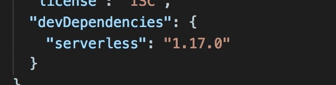
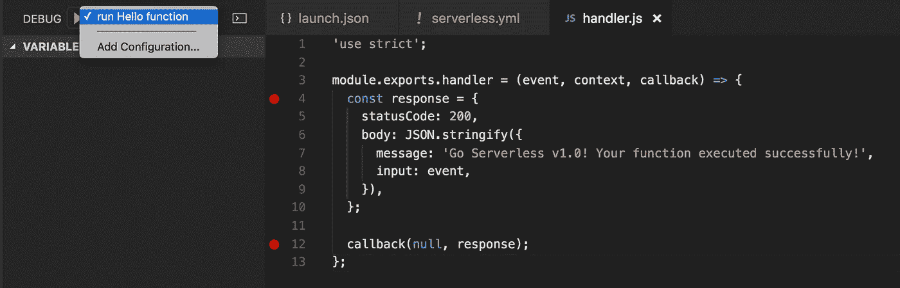
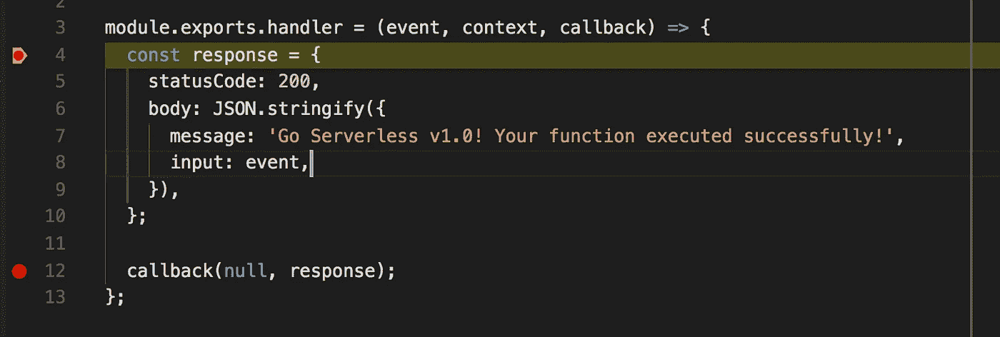

# 使用无服务器框架和 VS 代码在本地运行和调试 AWS Lambda 函数

> 原文：<https://medium.com/hackernoon/running-and-debugging-aws-lambda-functions-locally-with-the-serverless-framework-and-vs-code-a254e2011010>

## 开发人员对 AWS Lambda 的抱怨之一是无法在本地运行和调试功能。至少对于 Node.js 来说，无服务器框架和 VS 代码提供了一个很好的解决方案。

无服务器框架的一个经常未被充分利用的特性是[调用本地](https://serverless.com/framework/docs/providers/aws/cli-reference/invoke-local/)命令，它通过模拟 AWS Lambda 环境在本地运行您的代码。当然，这不是一个完美的模拟，只适用于 Node.js 和 Python，但对于大多数本地开发需求来说已经足够好了。

 [## 无服务器框架命令- AWS Lambda -调用本地

### 使用无服务器框架在本地模拟 AWS Lambda 函数的调用

serverless.com](https://serverless.com/framework/docs/providers/aws/cli-reference/invoke-local/) 

使用 VS 代码，您可以[调试 Node.js](https://code.visualstudio.com/docs/nodejs/nodejs-debugging) 应用程序，包括启动外部程序的选项。

 [## 使用 VS 代码调试 Node.js 应用程序

### Visual Studio 代码编辑器包括 Node.js 调试支持。设置断点、单步执行、检查变量等等。

code.visualstudio.com](https://code.visualstudio.com/docs/nodejs/nodejs-debugging) 

将两者放在一起，你就有能力在本地运行和调试你的 Lambda 函数。

## 步骤 1:安装无服务器框架作为开发依赖

一般来说，将[无服务器](https://serverless.com/)框架作为开发依赖项安装在项目中是个好主意，因为:

1.  它允许其他开发人员(和 CI 服务器)使用无服务器框架进行部署，而不必自己安装
2.  当您安装的无服务器框架版本与项目中的`serverless.yml`文件所使用的版本不兼容时，它可以防止出现不兼容问题
3.  因为无服务器版本 1.16.0 [开发依赖项被从部署包中排除](https://serverless.com/blog/serverless-v1.16.0/)，所以它不会增加您的部署规模

## 步骤 2:添加调试配置

Invoke the “sls invoke local” CLI command against the “hello” function with an empty object {} as input. It’s also possible to invoke the function with a JSON file, see doc: [http://bit.ly/2w1HrQh](http://bit.ly/2w1HrQh)

## 第三步:享受！

好了，好了，简单了:-)

有几点需要注意:

*   如果您的函数依赖于环境变量，那么您可以在第 2 步的`launch.json`配置文件中设置这些变量
*   如果您的函数需要访问其他 aws 资源，那么您还需要为 aws-sdk 设置相关的环境变量(例如`AWS_PROFILE`，以便在正确的 AWS 帐户中访问这些资源
*   这种方法不适用于递归函数(好吧，递归将发生在已部署的 Lambda 函数上，所以您无法调试它)

嗨，我的名字是**崔琰**。我是一个 [**AWS 无服务器英雄**](https://aws.amazon.com/developer/community/heroes/yan-cui/) 和 [**量产无服务器**](https://bit.ly/production-ready-serverless) 的作者。我已经在 AWS 中运行了近 10 年的大规模生产工作负载，我是一名架构师或首席工程师，涉足从银行、电子商务、体育流媒体到移动游戏等多个行业。我目前是一名专注于 AWS 和无服务器的独立顾问。

你可以通过[邮箱](mailto:theburningmonk.com)、 [Twitter](https://twitter.com/theburningmonk) 和 [LinkedIn](https://www.linkedin.com/in/theburningmonk/) 联系我。

查看我的新课程，[**AWS 步骤功能完整指南**](https://theburningmonk.thinkific.com/courses/complete-guide-to-aws-step-functions) 。

在本课程中，我们将介绍有效使用 AWS Step Functions 服务所需了解的一切。包括基本概念、HTTP 和事件触发器、活动、设计模式和最佳实践。

在这里拿到你的副本。

来了解 AWS Lambda: CI/CD 的操作性**最佳实践**，本地测试&调试功能、日志记录、监控、分布式跟踪、canary 部署、配置管理、认证&授权、VPC、安全性、错误处理等等。

还可以用代码 **ytcui** 获得**票面价格 6 折**。

点击此处获取您的副本。