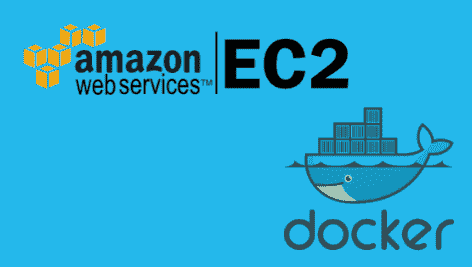
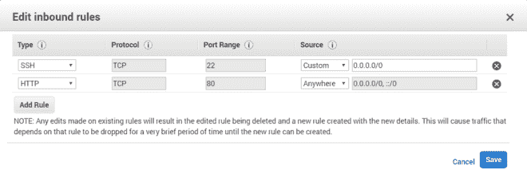
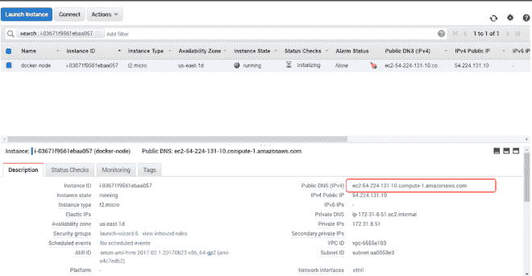
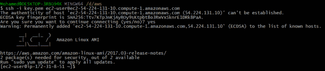
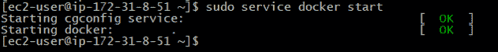
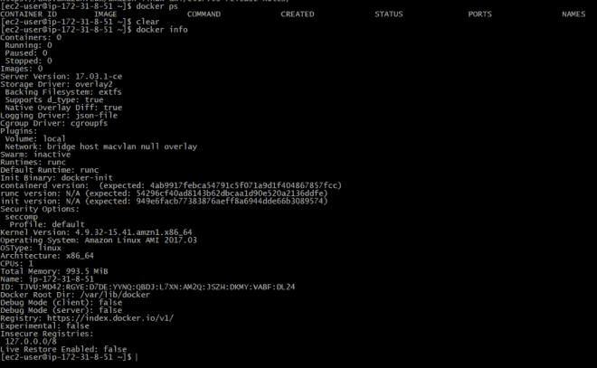
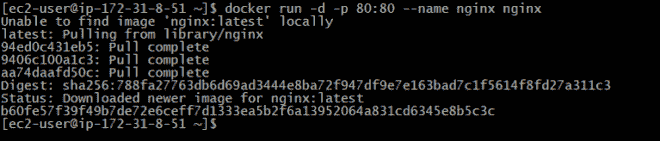
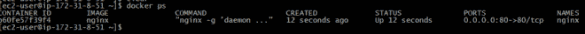
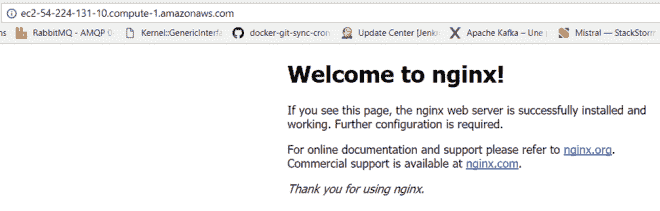

# 在 AWS EC2 上运行 Docker

> 原文：<https://medium.com/hackernoon/running-docker-on-aws-ec2-83a14b780c56>

在这个快速教程中，我将向你展示如何在 **AWS EC2** 实例上安装 **Docker** 并运行你的第一个 **Docker 容器**。

**1 —设置 EC2 实例**

我已经做过一个关于如何创建一个 **EC2** 实例的[教程](http://www.labouardy.com/deploying-go-app-to-aws-ec2/)，所以我不再重复。有几个方面你会想与教程不同:

*   我们选择“**亚马逊 Linux AMI 2017.03.1 (HVM)，SSH 卷类型**”作为 **AMI** 。确切的版本可能会随着时间的推移而改变。
*   我们将**安全组**配置如下。该设置允许从任何地方访问端口 **80** ( **HTTP** )，也允许访问 **SSH** 。

继续启动实例，这需要几分钟时间:

**2 —安装对接器**

一旦您的实例准备好使用，使用**公共 DNS** 和**公共密钥**通过 **SSH** 连接到服务器:

连接后，通过键入以下命令，使用 **yum** 配置管理器安装 **Docker** :

> sudo yum 更新-y
> 
> sudo yum install -y docker

接下来，启动 docker 服务:

为了在没有**根**权限( **sudo** )的情况下使用 docker 命令，我们需要将 **ec2-user** 添加到 **docker 组**:

> sudo usermod-aG docker ec2-用户

要验证 docker 是否正确安装，只需键入:

正如你所看到的，docker 的最新版本已经安装好了( **v17.03.1-ce** )

恭喜你！现在您已经有了一个安装了 **Docker** 的 **EC2** 实例。

**3 —部署 Docker 容器**

是时候运行您的第一个容器了

。我们将使用以下命令创建一个 **nginx** 容器:

如果我们运行 list 命令" **docker ps** ，我们可以看到一个 **nginx 容器**已经从 **nginx 官方镜像**中创建出来了。

最后，您在浏览器中访问您的实例**公共 DNS 名称**，您应该看到如下所示:

