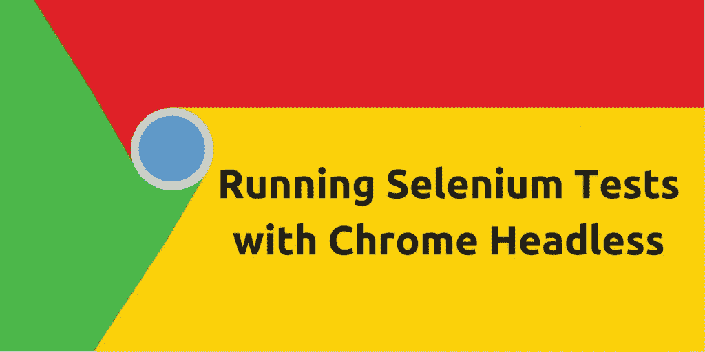

# 使用 Chrome Headless 运行硒测试

> 原文：<https://medium.com/hackernoon/running-selenium-tests-with-chrome-headless-5edd624efb92>

# 介绍

在 [Google](https://hackernoon.com/tagged/google) [Chrome](https://hackernoon.com/tagged/chrome) 59 之前，无头执行必须由第三方无头浏览器完成，比如 [PhantomJS](http://phantomjs.org/) 、[slimmer js](https://slimerjs.org/)、 [TrifleJS](http://triflejs.org/) 、[梦魇](http://www.nightmarejs.org/)和 HTMLUnit。

“问题”是这些无头浏览器模拟了一些引擎，但没有模拟 V8 (Chrome 引擎)。

PhantomJS | QtWebKit
slimer js | Gecko(Firefox)
TrifleJS | Trident(Internet Explorer)
梦魇|电子

当我们谈到测试时，各个细分市场的大多数用户都使用谷歌浏览器，因此有必要模拟真实的引擎。

# 用 Java 怎么做

由于谷歌 Chrome 在 59 版中没有发货(正如你在这里看到的)我们可以在执行之前告诉 ChromeDriver 选项。

在下面的代码中，我通过*chrome options*:*headless*和 *window-size* 添加了两个选项。

*无头*选项会告诉谷歌 Chrome 在无头模式下执行。

*窗口大小*是控制响应的一种方式(如果你不设置窗口大小，你的站点可能会显示为移动站点)。

你可以在这里看到通知 ChromeOptions 的另一种方式
[https://sites . Google . com/a/chromium . org/chrome driver/capabilities](https://sites.google.com/a/chromium.org/chromedriver/capabilities)