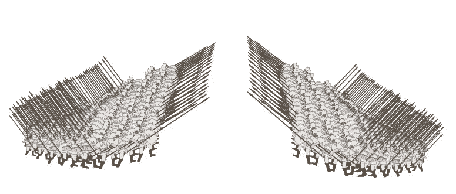

# 运行运行时挑战

> 原文：<https://medium.com/hackernoon/running-the-run-time-gauntlet-b106003fa0ef>

“挑战”就是被迫在两排手持长矛的士兵之间奔跑，这些士兵可以攻击你。

作为一名开发人员，你每天都面临挑战。

可能有点夸张，每次你编写一个调用来访问操作系统、外部应用程序或服务的功能时，一个新的*挥舞着长枪的士兵就会出现在你的战书上。*

如果这个电话是打给一个系统，而这个系统的稳定性和稳定的接口已经被证实，那么你的战甲上的士兵基本上已经被解除了武装。但是，当这个电话是一个新的系统，或一个定期调整，定义不清或理解不良的界面应用程序，他们的士兵变得武装起来，你的手套变得危险。

> *这就是运行时抽象的致命代价。*

曾几何时，当我们直接告诉硬件做什么时，没有操作系统来允许访问更高级的功能。在这个简单的时代，我们的战网完全没有士兵(当然也没有长矛！).我们有一条清晰的道路。

然后，出于需要，我们引入了第一个运行时抽象；操作系统，一个独立的“应用程序”,充当硬件和软件资源的看门人。在这一点上，我们没有直接指示硬件，而是让操作系统看门人代表我们做一些事情。就在这时，我们的挑战变成了…挑战。随着时间的推移，随着看门人及其接口变得更加可靠，其士兵被解除武装。它们现在相对无害。

今天，用没有运行时环境的语言(如 C)来表达他们的程序需求的开发人员可以在一个完全解除武装的挑战下漫步。也就是说，直到他们需要向更高级别的语言公开他们的代码的时候。

引用一位开发人员的话:

> “我最近写的几乎所有系统代码都是我最终想要向高级语言展示的东西。[……]在你的系统语言中有大量丰富的概念和语义只会碍事，因为你必须找到如何在两者之间进行映射。”

但是这种映射(通过语言绑定、FFI 或 ABI 等。)通常会在 OS 的*添加*中引入运行时依赖，这只意味着一件事；*兵多矛多*。(更不用说在两种语言之间进行映射所需的不必要的“粘合代码”了，这些代码对满足应用程序需求没有任何功能贡献！)

那么更“复杂”的语言呢，那些有大量运行时间的语言呢？*还有更多的士兵。他们是否准备好了取决于语言维护得如何，以及它的运行时环境有多稳定。例如，垃圾收集当然有自己的一组士兵(通常是武装的)。*

框架呢？同样的事情。"别戳我们，我们会戳你的！"

和微服务架构？同样的事情，但现在你有被“友军”射杀的危险！

以几天前发生在 Reddit 上的一个名为*“一切都应该是微服务”*的帖子为例:

> Dev 1:“我们刚刚在团队中进行了讨论，我们决定，我们需要“add-one”微服务，它将获得一个数字，并返回增加 1 的数字。现代分布式 web 应用程序中关注点的良好分离:)”
> 
> 戴夫 2:“这是个很棒的主意。最后，有人花了一些时间考虑本地计算的**巨大的**开销，而不是简单地创建一个 http 请求，等待答案，处理答案并解析值。这种微服务将比在本地增加 1 个更高效。”

(上述交流令人担忧的部分是，一些 redditors 不太清楚这些评论是真是假。)

我们似乎越来越抽象到运行时领域。

但是，如果我们不把抽象推到运行时，而是把它们拉回到“设计”时，会怎么样呢？

> 这正是世界编译器所要实现的。

它允许开发者只需要*一个*运行时依赖就可以贡献和创建非常复杂的应用程序；操作系统本身。

为了加入这个世界编译器并在其中竞争，开发人员构建了一个代理，一个自主的软件程序，它捕获并映射( *n* +1)级需求到 *n* 级需求，将这些需求交给网络中一组全新的代理，这些代理将执行它们自己的编译时映射。

每当一个新的构建开始时，全球编译器中成千上万的代理聚集在一起 ***共同编程、编译并返回*** 一个应用，就像一个跨越所有抽象层的大型分散编译器，从特定应用需求的收集一直到操作码的生成。

有了这样的系统，现在将垃圾收集从运行时中抽出来并将其设计成应用程序本身的一部分变得更加实际。

我们被束缚在一个行业中，在这个行业中，单一的编译器、支离破碎的语言和运行时抽象被用来实现自动化的最终目标。*出于必要*(并以*运行期*性能为代价)，我们不得不将的大量开销右 ***推入*** *运行期*。

但是我们已经把它弄反了！

我们应该将开销推到*编译时*，并且*利用它为我们带来优势*。

与其在运行时“交谈”来执行自动化的*服务*，不如让我们在编译时“交谈”来 ***产生自动化的产品*** 。

让我们创造一个新的行业，在这个行业中，语言、编译器、工具和范例都是*分散但兼容的*，每一个利基市场都向竞争开放。

让我们和挑战说再见吧。

在这里让世界编译器兜一圈[。在此](https://marketplace.codevalley.com/pilot)请求邀请成为其中一员[。](https://marketplace.codevalley.com/signup)

要了解更多关于代码谷的信息，请访问[https://codevalley.com](https://codevalley.com)，或在[推特](http://twitter.com/codevalley42)上关注该项目。

> [黑客中午](http://bit.ly/Hackernoon)是黑客如何开始他们的下午。我们是 AMI 家庭的一员。我们现在[接受投稿](http://bit.ly/hackernoonsubmission)并乐意[讨论广告&赞助](mailto:partners@amipublications.com)机会。
> 
> 如果你喜欢这个故事，我们推荐你阅读我们的[最新科技故事](http://bit.ly/hackernoonlatestt)和[趋势科技故事](https://hackernoon.com/trending)。直到下一次，不要把世界的现实想当然！

