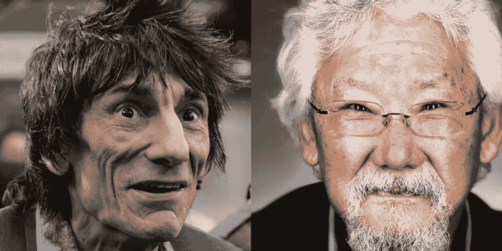

# 与罗尼·伍德和大卫·铃木一起奔跑

> 原文：<https://medium.com/hackernoon/running-with-ronnie-wood-and-david-suzuki-d36e871a567b>

## 我经常跑步。我喜欢吗？不完全是。

好吧，通常情况下，我会的。但事实是:和许多我讨论过这个问题的人一样，我害怕头 10 分钟。就在最初的高峰过后，当你的音乐神奇地响起，你的臀部开始燃烧，你的呼吸加深——你即将到来的*出汗节*就在眼前。*情况开始好转。*

# 作为这台新加了油的机器，你承担了这个世界。

有趣的是，跑步是一种完全自然的行为。我们已经奇迹般地找到了如何在我们的生活中设计它。

# [**我们生来就是为了奔跑。**](https://www.ted.com/talks/christopher_mcdougall_are_we_born_to_run?language=en)

不相信我？问问克里斯托弗·麦克杜格尔就知道了..

事实上，我们中的一些人已经完全忘记了如何跑步——因为那些该死的干扰。虚拟现实[、狂欢流媒体](https://hackernoon.com/the-real-world-is-virtual-23f210ed7df9#.q2pn5ulh3)、职业电视迷的诱惑占据了一部分——而其他的嬉皮士活动如 *acroyoga* 、 *soulcycle* 和 *pound* 占据了剩余的部分。

# 古怪的东西。

比骑自行车慢，希望比走路快一点——跑步者的速度是与众不同的。随着时间的推移，跑步者的世界变得与众不同。面孔和位置都有点随机。

就拿我在公园见到罗尼·伍德的时候来说吧。你在哪里都能认出那个杯子。

或者那次我在海滩附近轻快地经过大卫·铃木。

伍德(摇滚音乐家、歌手、歌曲作者、艺术家和电台名人)，用他的身体去感动人。大卫·铃木(学者、遗传学家、科学广播员和环保活动家)用他的头脑来激励人们。鉴于他们各自的恶名远播于世界各地，我抓住了这一遥远的相似之处。我就是这样理解慢跑时发生的随机性的。忘记你真的在跑步也是乐趣的一部分。

# 是的，跑步最精彩的部分很可能是结束。

下一次慢跑时，你会看到谁？你会发现什么？在那些时刻，你改变了方向，你会在哪里结束？

寻找一个跑步组合？在 [Rinse FM](http://rinse.fm/player/) 尝试任何 Yasmin(周日下午 3-5 点直播)。这里有一个特别好的..

> 阅读更多关于跑步的内容..

 [## 大麻和跑步|效果|社会结构

### 传统上,“跑步者亢奋”被认为是由于内啡肽——一种神经化学物质，可以很好地…

socialfabric.com](http://socialfabric.com/2012/06/marijuana-running/)  [## 精神健康|企业家精神|社会福利

### 把那些有运动天赋的人和那些有超凡商业头脑的人相提并论并不是什么大的飞跃…

socialfabric.com](http://socialfabric.com/2011/03/mental-fitness/) 

> 如果你喜欢这个，请点击下面的绿色小心脏。

> [黑客中午](http://bit.ly/Hackernoon)是黑客如何开始他们的下午。我们是 [@AMI](http://bit.ly/atAMIatAMI) 家庭的一员。我们现在[接受投稿](http://bit.ly/hackernoonsubmission)并乐意[讨论广告&赞助](mailto:partners@amipublications.com)机会。
> 
> 如果你喜欢这个故事，我们推荐你阅读我们的[最新科技故事](http://bit.ly/hackernoonlatestt)和[趋势科技故事](https://hackernoon.com/trending)。直到下一次，不要把世界的现实想当然！

