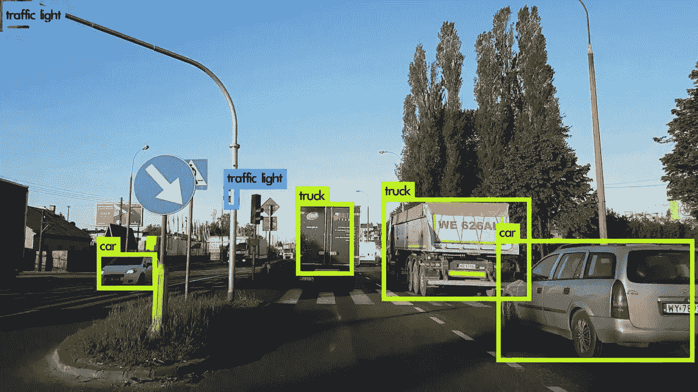
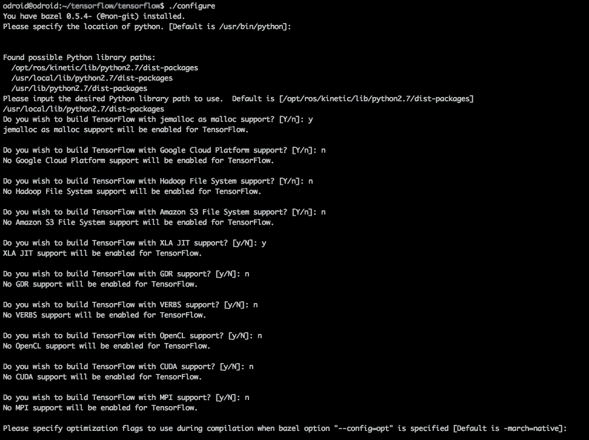
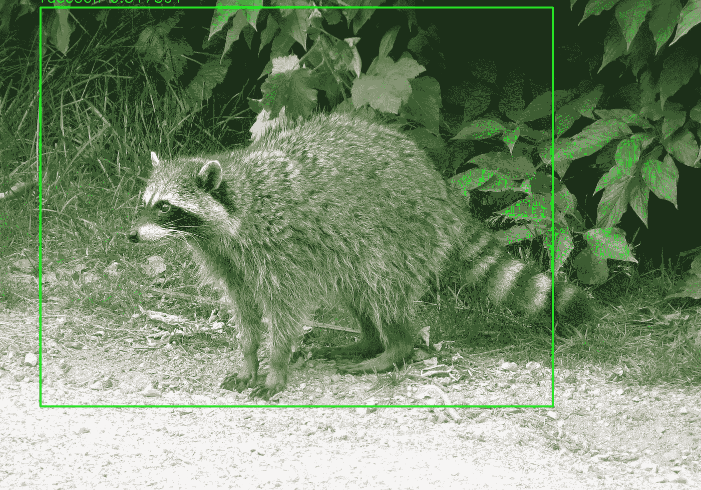

# 在 ODROID 上运行 YOLO:yo droid

> 原文：<https://medium.com/hackernoon/running-yolo-on-odroid-yolodroid-5a89481ec141>



[YOLO](https://pjreddie.com/darknet/yolo/) 是一个神经[网络](https://hackernoon.com/tagged/network)模型，能够非常快速地从图像中识别日常物体。还有在移动设备上运行良好的 [TinyYOLO](http://machinethink.net/blog/object-detection-with-yolo/) 。本指南告诉你如何在你的 [ODROID XU4](http://www.hardkernel.com/main/products/prdt_info.php) 上安装并运行 TinyYOLO。要继续操作，请登录到您的 ODROID，并运行以下命令:

# 步骤 1:安装 TensorFlow

## 更新您的系统

首先，我们确保一切都是最新的。

```
sudo apt-get update
sudo apt-get upgrade -y
sudo apt-get dist-upgrade -y
sudo reboot
```

## 买些交换品

Bazel 不会在 ODROID XU4 上没有这个。插入一个空白的 8GB USB 驱动器，该驱动器将被擦除，然后运行:

```
sudo blkid
```

检查设备名称，通常是/dev/sda1，并使用该名称运行:

```
sudo mkswap /dev/sda1
sudo swapon /dev/sda1
sudo swapon
```

## 安装需求

我们将需要真正的 Oracle [Java](https://hackernoon.com/tagged/java) ，而不是 OpenJDK。我尝试了 OpenJDK，用它构建了 Bazel，但是它不能 SHA-1 哈希下载，所以没用。因此，我们安装:

```
sudo apt-get install pkg-config zip g++ zlib1g-dev unzip
sudo apt-get install gcc-4.8 g++-4.8
sudo update-alternatives --install /usr/bin/gcc gcc /usr/bin/gcc-4.8 100
sudo update-alternatives --install /usr/bin/g++ g++ /usr/bin/g++-4.8 100
sudo apt-get install python-pip python-numpy swig python-dev
sudo pip install wheelsudo add-apt-repository ppa:webupd8team/java
sudo apt-get update
sudo apt-get install oracle-java8-installer
sudo apt-get install oracle-java8-set-default
java -version
```

## 安装 Bazel 构建系统

谷歌使用 Bazel 构建东西。TensorFlow 来自谷歌。因此，我们需要先建造巴泽尔。这需要大约半个小时。去吃午饭吧。

```
wget [https://github.com/bazelbuild/bazel/releases/download/0.5.4/bazel-0.5.4-dist.zip](https://github.com/bazelbuild/bazel/releases/download/0.5.4/bazel-0.5.4-dist.zip)
unzip -d bazel bazel-0.5.4-dist.zip
cd bazel
sudo ./compile.sh
```

现在，Java 将用完这里的堆。因此，我们需要:

```
sudo vi scripts/bootstrap/compile.sh
```

找到带有“run”的那一行，添加一些内存标志，将其改为:

```
***run “${JAVAC}” -J-Xms256m -J-Xmx384m -classpath “${classpath}” -sourcepath “${sourcepath}” \***
```

我们重新编译。

```
sudo ./compile.shsudo cp output/bazel /usr/local/bin/bazel
```

## 获取张量流

现在我们实际上可以下载和配置 TensorFlow 了。

```
git clone --recurse-submodules [https://github.com/tensorflow/tensorflow.git](https://github.com/tensorflow/tensorflow.git)
cd tensorflow
```

我无法安装最新版本的 TensorFlow，它有 BoringSSL C99 编译问题，所以检查版本 1.4.0，并配置:

```
git checkout tags/v1.4.0
./configure
```

对大多数事情说不，包括 OpenCL:



## 构建张量流

然后，我们建造。如果你认为 Bazel 花了很长时间来构建，那么你以前没有构建过软件。抓紧你的帽子。我们要在这里兜一圈了。

```
bazel build -c opt --copt="-mfpu=neon-vfpv4" --copt="-funsafe-math-optimizations" --copt="-ftree-vectorize" --copt="-fomit-frame-pointer" --local_resources 8192,8.0,1.0 --verbose_failures tensorflow/tools/pip_package:build_pip_package
```

正在构建…

1，900 / 4，909 个文件…错误。

Oop，氖不起作用。好吧，我们把它关掉。但是，我们以后会想修复它。

```
bazel build -c opt --copt="-funsafe-math-optimizations" --copt="-ftree-vectorize" --copt="-fomit-frame-pointer" --local_resources 8192,8.0,1.0 --verbose_failures tensorflow/tools/pip_package:build_pip_package
```

3，700 / 4，622 个文件…错误。

```
*In file included from tensorflow/compiler/****xla****/service/llvm_ir/llvm_util.cc:30:0:
./tensorflow/core/lib/core/casts.h: In instantiation of 'Dest tensorflow::bit_cast(const Source&) [with Dest = long long int; Source = void (*)(const char*, long long int)]':
tensorflow/compiler/xla/service/llvm_ir/llvm_util.cc:400:67:   required from here
./tensorflow/core/lib/core/casts.h:91:3: error: static assertion failed: Sizes do not match*
```

好吧，XLA 正在制造麻烦。这是新的，不需要。让我们现在放弃它，重新配置和重建没有它。

2，345 / 3，683 个文件…

3，112 / 3，683 个文件…

3，682 / 3，683 文件…

建成了！

```
***Target //tensorflow/tools/pip_package:build_pip_package up-to-date:
 bazel-bin/tensorflow/tools/pip_package/build_pip_package***
```

快！安装它！

```
bazel-bin/tensorflow/tools/pip_package/build_pip_package /tmp/tensorflow_pkgsudo pip2 install /tmp/tensorflow_pkg/tensorflow-1.4.0-cp27-cp27mu-linux_armv7l.whl --upgrade --ignore-installed
```

请在此处查看问题的脚注。

是真的吗？

```
python2
>>> import tensorflow
>>> print(tensorflow.__version__)
1.4.0
```

感觉真好。到 YOLOing。

# 第二步:YOLO。

我确信现在已经有一些 YOLO 的实现了。让我们选择一个。这家伙似乎知道自己在说什么。让我们试试他的东西。

```
# Get code
git clone [https://github.com/experiencor/basic-yolo-keras.git](https://github.com/experiencor/basic-yolo-keras.git)
cd basic-yolo-keras# Get weights from [https://1drv.ms/f/s!ApLdDEW3ut5fec2OzK4S4RpT-SU](https://1drv.ms/f/s!ApLdDEW3ut5fec2OzK4S4RpT-SU) 
# Or Raccoon: [https://1drv.ms/f/s!ApLdDEW3ut5feoZAEUwmSMYdPlY](https://1drv.ms/f/s!ApLdDEW3ut5feoZAEUwmSMYdPlY)
wget *<authurl>/*tiny_yolo_features.h5
wget *<authurl>/*tiny_yolo_raccoon.h5 # Edit config
vi config.json         # Change model to "Tiny Yolo"# Download a raccoon
wget [https://upload.wikimedia.org/wikipedia/commons/b/be/Racoon_in_Vancouver.jpg](https://upload.wikimedia.org/wikipedia/commons/b/be/Racoon_in_Vancouver.jpg)# Run
python2 predict.py -c config.json -i Racoon_in_Vancouver.jpg -w tiny_yolo_raccoon.h5
```

失踪的伊玛目。好的，看起来我们需要一些东西。

```
sudo pip2 install imgaug
sudo pip2 install keras
sudo pip2 install h5py
```

H5py 和 scipy 需要一点时间来安装。好吧，我们再试一次。它能在这张浣熊的图像中找到浣熊吗？


Where is it?

```
python2 predict.py -c config.json -i Racoon_in_Vancouver.jpg -w tiny_yolo_raccoon.h5
```

是啊！这是一只被发现的浣熊！



I see you. You can’t hide. From the ODROID.

__________________________________________________________________

## 脚注。

一开始我跑的时候:

```
sudo pip install /tmp/tensorflow_pkg/tensorflow-1.4.0-cp27-cp27mu-linux_armv7l.whl --upgrade --ignore-installed
```

它使用 python 3 运行，但未能安装，所以在谷歌搜索并了解了 pip 文件名规则后，我找到了它，并使用了 pip2。

然后，最好玩的一期是我第一次运行 *import tensorflow* 的时候。我收到一条有趣的信息:

```
>>> import tensorflow
Traceback (most recent call last):
 File “<stdin>”, line 1, in <module>
 File “tensorflow/__init__.py”, line 24, in <module>
 from tensorflow.python import *
 File “tensorflow/python/__init__.py”, line 49, in <module>
 from tensorflow.python import pywrap_tensorflow
 File “tensorflow/python/pywrap_tensorflow.py”, line 25, in <module>
 from tensorflow.python.platform import self_check
ImportError: No module named platform
```

哦不！它以某种方式坏掉了。所以我在谷歌上搜索了这个问题，它似乎是关于地区的:

[](https://github.com/tensorflow/tensorflow/issues/36) [## 没有名为 tensorflow.python.platform 的模块问题#36 tensorflow/tensorflow

github.com](https://github.com/tensorflow/tensorflow/issues/36) 

所以我先设置了一个区域设置(也看到了 T2 需要大写美国之后)，然后重建，它仍然给我同样的问题。嗯。我明天会看一看它。

```
export LC_ALL=en_**US**.UTF-8
export LANG=en_us.UTF-8
```

第二天，有了新的谷歌搜索能力，发现实际上…只是我只是在构建目录中运行它！它有一个名为 tensorflow 的目录，python 在其中查找内容。因此，只需将目录更改为另一个即可解决问题。如此简单。太失败了。

[](https://github.com/tensorflow/tensorflow/issues/13526) [## 在 Python 中导入 TF 会产生“无法导入名称‘build _ info’”问题#13526 tensorflow

github.com](https://github.com/tensorflow/tensorflow/issues/13526)